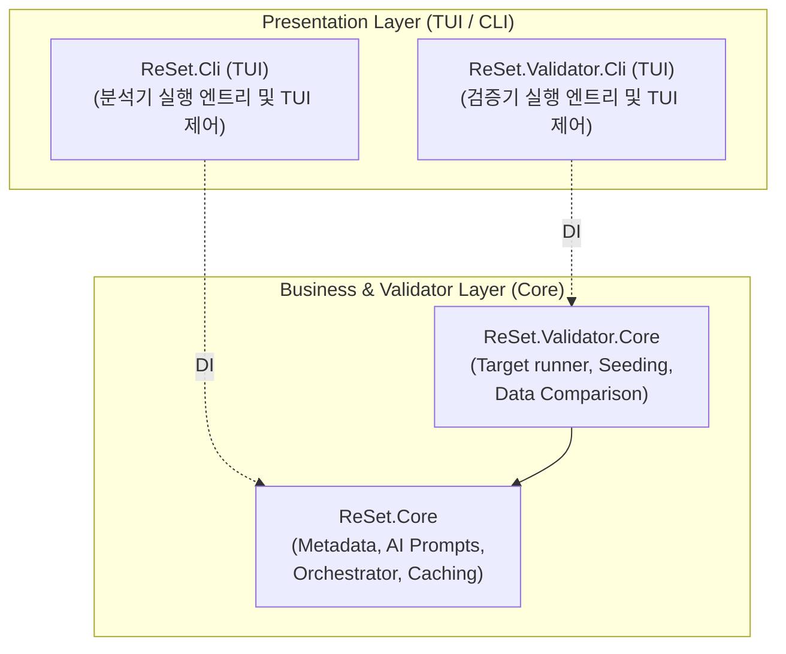
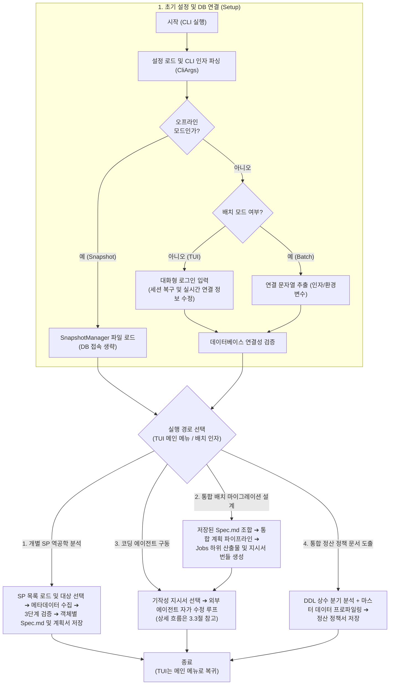
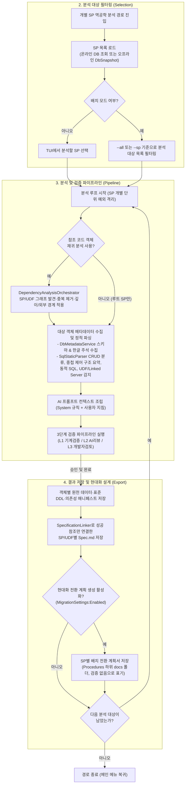
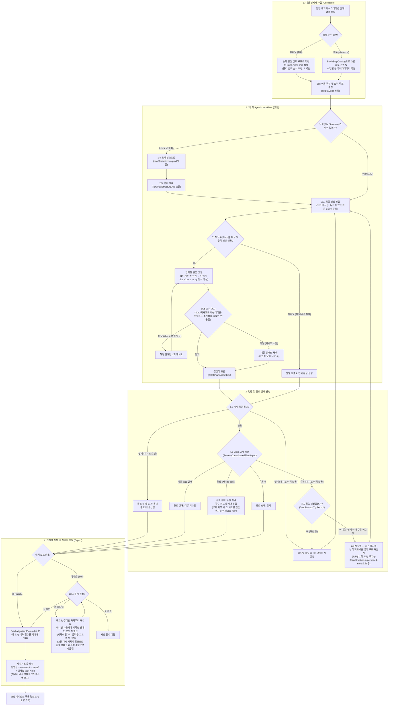
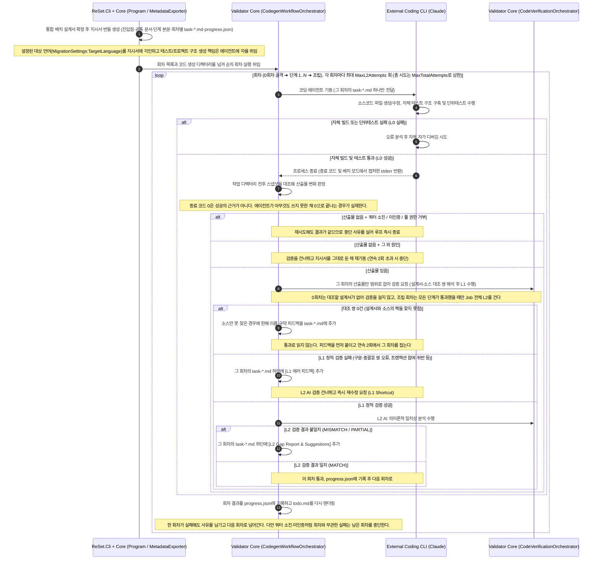
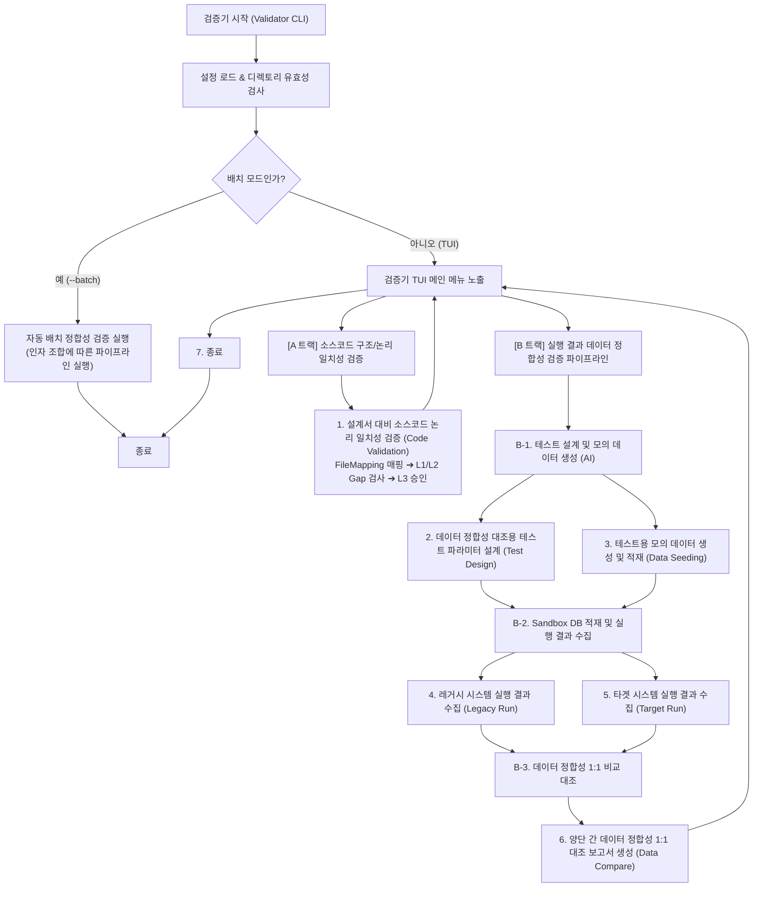
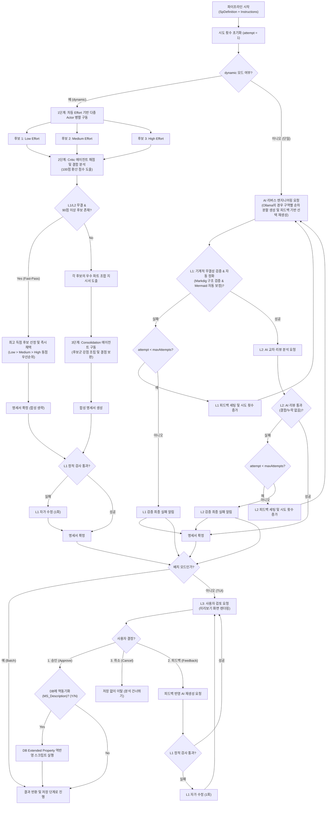
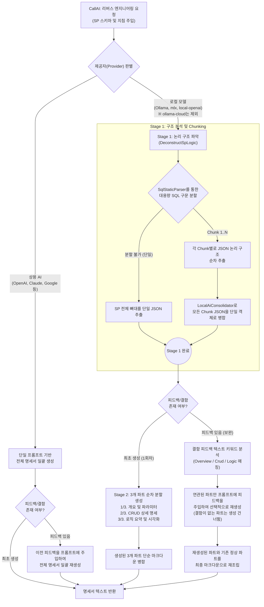
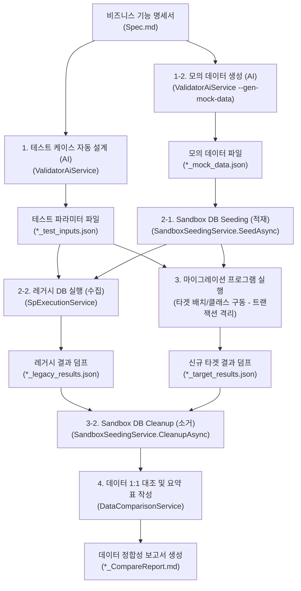

# ReSet (REverse engineering SETtlement) 시스템 아키텍처 정의서 (System Architecture Definition)

본 문서는 SQL Server Stored Procedure(SP)를 자율적으로 분석하고 신규 시스템으로의 전환 계획서를 도출하는 **ReSet (REverse engineering SETtlement) 에이전트** 프로그램의 모듈 설계, 구성 요소 간의 데이터 흐름, 핵심 알고리즘 및 검증 파이프라인의 구조적 아키텍처를 정의합니다.

---

## 1. 개요 (Overview)

### 1.1. 시스템의 목적
본 프로그램은 레거시 DB 비즈니스 로직(Stored Procedure)을 현대적인 애플리케이션 아키텍처(C#, Java Spring Batch 등)로 마이그레이션하기 위해, SP의 비즈니스 로직과 의존성을 자율적으로 분석하고 기능 명세서(`Spec.md`) 및 배치 전환 계획서(`BatchMigrationPlan.md`)를 자동 생성·검증하는 CLI/TUI 도구입니다.

### 1.2. 핵심 설계 사상
* **관심사 분리 (SoC)**: 사용자 인터페이스 레이어(Cli)와 핵심 도메인 비즈니스 레이어(Core), 코드 검증 레이어(Validator)를 명확히 분리하여 설계의 격리성을 극대화합니다.
* **3단계 점진적 신뢰성 보장**: 생성된 명세서의 무결성을 기계적 검증(L1), AI 교차 검토(L2), 인간 승인(L3)의 3단계 파이프라인을 거치며 검증합니다.
* **무인 자동화와 인간 피드백의 유기적 결합**: 대화형 모드(TUI)를 통해 개발자의 피드백을 실시간 수집하고, CI/CD 환경을 위한 무인 배치 실행 모드를 동시에 완벽하게 지원합니다.

---

## 2. 시스템 구성 및 컴포넌트 아키텍처 (System Components)

### 2.1. 컴포넌트 레이어링 및 관계
본 프로그램은 프레젠테이션 레이어(Cli)와 비즈니스 서비스 레이어(Core/Validator)로 구성되어 있습니다.



### 2.2. 핵심 모듈 및 클래스 목록

| 프로젝트 (레이어) | 주요 모듈 (클래스/인터페이스) | 아키텍처적 역할 및 기능 |
| :--- | :--- | :--- |
| **ReSet.Cli**<br/>(TUI/CLI 레이어) | [Program](../src/ReSet.Cli/Program.cs) | CLI 진입점, DI 구성, 대화형(TUI) 및 배치 실행 모드 제어, Multi-SP 순차 선택 큐 흐름 오케스트레이션. |
| | [ConsoleUserInteraction](../src/ReSet.Cli/ConsoleUserInteraction.cs) | Spectre.Console 기반 TUI 렌더링, L3 인간 개입형 검토 UI 제공, Warnings 경고 패널 렌더링, DB 동기화 동의(`ConfirmMetadataSyncAsync`) 제어. 진행 태스크 완료/실패 시에도 원래 설명을 보관해 안정적으로 화면을 유지합니다. |
| | [SessionManager](../src/ReSet.Cli/SessionManager.cs) | 로컬 세션 파일(`.session.json`)을 활용한 직전 로그인 정보 관리 및 서버·DB명 즉시 수정 기능 제공. |
| | [CliArgs](../src/ReSet.Cli/CliArgs.cs) | CLI 아규먼트 파싱 결과(`--conn`, `--sp`, `--all`, `--job-name` 등)를 담는 데이터 모델. |
| | [ValidationUiProxy](../src/ReSet.Cli/ValidationUiProxy.cs) | 검증기(Validator)의 L1/L2/L3 요약 보고서를 Spectre.Console을 활용하여 렌더링하는 TUI 브릿지 구현체. |
| | [BatchStepCatalog](../src/ReSet.Cli/BatchStepCatalog.cs) | 통합 배치 설계의 스텝 후보 명세서를 선별하고 각 스텝의 분석 메타데이터를 복원하며, 복원 실패를 누락·파싱 실패로 나누어 호출부가 사유를 그대로 알릴 수 있게 합니다. `ExtractProcedureIdentifier`는 상대 경로에서 `Procedures` 세그먼트 바로 다음의 객체 식별자(`dbo.UP_X` 형태)를 뽑습니다 — 마지막 세그먼트는 항상 `Spec.md`이므로 그걸 쓰면 안 됩니다. |
| | [SpecHeaderReader](../src/ReSet.Cli/SpecHeaderReader.cs) | 저장된 `Spec.md` 상단의 YAML 헤더에서 검증 종료 상태와 Critic 점수를 되읽어, 캐시로 복원된 명세서도 신규 분석과 동일하게 보고되도록 합니다. |
| **ReSet.Core**<br/>(핵심 비즈니스 레이어) | [DbSnapshot](../src/ReSet.Core/Models/DbSnapshot.cs) | 로컬 환경에서 DB 연결 없이 오프라인 메타데이터 캐싱을 지원하기 위한 직렬화 구조 스냅샷 모델. |
| | [CodeObjectKey](../src/ReSet.Core/Models/CodeObjectKey.cs), [CodeObjectAnalysisModels](../src/ReSet.Core/Models/CodeObjectAnalysisModels.cs) | DB·스키마·이름·유형으로 SP/UDF를 식별하고, 재귀 분석 그래프의 노드 상태·간선·객체별 분석 결과를 보존합니다. |
| | [SpDefinition](../src/ReSet.Core/Models/SpDefinition.cs) | 분석된 SP/UDF의 메타데이터(원본 DDL, 의존성, 경고, 정적 분석 결과, AST 기반 논리 분해 결과 등)를 한데 묶어 담는 루트 데이터 클래스. `StaticAnalysis`(`SpStaticAnalysisResult`)의 `AstInsertMappings`/`AstUpdateMappings`를 거쳐 INSERT/UPDATE 문의 AST 매핑에 닿습니다. |
| | [VerificationOutcome](../src/ReSet.Core/Models/VerificationOutcome.cs) | 검증 파이프라인이 어디서 끝났는지를 네 가지 값(리뷰 미수행·L1 미통과·품질 미달·통과)으로 구분하는 열거형. 기본값이 `ReviewNotRun`이라 상태를 설정하지 않은 경로는 통과가 아닌 쪽으로 기웁니다. |
| | [SpAnalysisOutcome](../src/ReSet.Core/Models/SpAnalysisOutcome.cs), [ConsolidatedPipelineResult](../src/ReSet.Core/Models/ConsolidatedPipelineResult.cs) | 1단계 개별 SP 분석과 통합 계획 수립의 결과 계약. 명세서·검증 종료 상태·분석 범위·캐시 출처·아티팩트 저장 결과를 한 레코드에 담아 호출부가 보고 내용을 추측하지 않게 합니다. |
| | [DbMetadataService](../src/ReSet.Core/Services/DbMetadataService.cs) | SQL Server 메타데이터 수집, DFS 기반 재귀적 의존성 탐색, 확장 속성(`MS_Description`) 주석, Identity/DefaultValue 및 인덱스 정보 수집, DDL 추출. 추가로 수집 완료된 스키마 메타데이터를 바인딩하여 2차 정밀 정적 분석 재구동 오케스트레이션 수행. |
| | [OfflineDbMetadataService](../src/ReSet.Core/Services/OfflineDbMetadataService.cs) | 오프라인 모드 시 활성화되는 메타데이터 서비스. 로드된 JSON `DbSnapshot`에 기반해 SQL Server 연결 없이 스키마 정보를 반환합니다. |
| | [SnapshotManager](../src/ReSet.Core/Services/SnapshotManager.cs) | 온라인 모드에서 `DbMetadataService`가 수집한 데이터를 `DbSnapshot` JSON 파일로 추출(`ExportSnapshotAsync`)하거나, 오프라인 시 파일을 읽어들여(`ImportSnapshotAsync`) 제공하는 관리 서비스. |
| | [SqlStaticParser](../src/ReSet.Core/Services/SqlStaticParser.cs) | Microsoft.SqlServer.TransactSql.ScriptDom 기반 정적 구문 파서. 프로시저 파라미터 및 선언 변수 수집, 테이블 CRUD 분류, 중첩 제어문 들여쓰기 요약, sp_executesql/EXEC 동적 SQL 감지, UDF 및 Linked Server 감지 수행. 접두사 없는 컬럼에 대한 로컬 스코프 정밀 분석 및 주입된 실제 스키마 메타데이터 기반 1:1 대조 리졸버 연동 및 대용량 SQL 논리 구문 분할(Chunking) 지원. |
| | [AiService](../src/ReSet.Core/Services/AiService.cs) | LLM 프롬프트 조립(설명 누락 컬럼 역추론, AST 기반 INSERT 빈칸 채우기 템플릿 자동 주입 포함), AST 기반 실제 사용 컬럼 위주 스키마 필터링 포맷팅, 구역별 분할 프롬프트 및 체크리스트 빌드, 통합 배치 수립 시 Brainstorming 및 PlanStructure 설계 분할 요청 처리, 주입받은 `IAiClient`를 통한 AI API 호출 및 JSON 파싱. |
| | [IAiService](../src/ReSet.Core/Services/IAiService.cs) | `GenerateSpecSectionAsync` 등 AI 호출 공통 기능의 계약 정의 인터페이스. |
| | [IAiClient](../src/ReSet.Core/Services/IAiClient.cs) | AI 모델 간의 공통 텍스트 통신 및 추론(Thinking) 데이터 취합 결과를 다루는 추상 인터페이스. `volatileUserSuffix` 인자로 요청마다 달라지는 지시를 공통 컨텍스트와 분리해 받습니다. |
| | [AiRetryPolicy](../src/ReSet.Core/Services/AiRetryPolicy.cs), [AiCallRetry](../src/ReSet.Core/Services/AiCallRetry.cs) | AI 호출의 일시적 실패를 다시 시도하는 공용 인프라.<br/>`AiRetryPolicy`는 예외에 실린 유형(HTTP 상태 코드, `CliFailureKind`, 취소 토큰)만 보고 일시·치명·취소를 가르는 순수 함수로, 메시지 산문은 보지 않습니다. `AiCallRetry`는 그 판정에 따라 짧은 무작위 지연을 두고 다시 부르며, 예산을 소진하면 `AiCallFailedException`으로 감쌉니다 — 이 예외는 `OperationCanceledException`을 상속하지 않아 취소 필터에 걸려 "사용자 취소"로 둔갑하지 않습니다. |
| | [PromptCacheBreakpointPolicy](../src/ReSet.Core/Services/PromptCacheBreakpointPolicy.cs) | 프롬프트 캐시 중단점을 찍을지 판정하는 클래스.<br/>안정 접두사의 해시를 기억해 두 번째 전송부터 `cache_control`을 찍습니다. 캐시 쓰기가 1.25배라 첫 전송에 찍으면 1회차로 끝나는 잡에서 손해가 확정됩니다. |
| | [PromptComposition](../src/ReSet.Core/Services/PromptComposition.cs) | 가변 접미사를 사용자 프롬프트에 합치는 규칙을 단독 소유하는 정적 클래스.<br/>메시지 분리가 불가능한 경로(Chat Completions·Google·Ollama·CLI)가 공유해, 제공자마다 구분자가 갈라지는 것을 막습니다. |
| | [Clients (OpenAi, Claude, Google, Ollama, Zai)](../src/ReSet.Core/Services/Clients/) | OpenAI, Anthropic, Google, Ollama(로컬/클라우드), Z.ai 등 공급자별 네이티브 규격 채팅 HttpClient 통신 모듈. OpenAiClient는 gpt-5 Responses API의 복수 reasoning summary를 누적 보존하며, OllamaClient는 /api/chat 통신 및 모델별 다양한 추론 토큰(`<think>`, `<|end of thought|>` 등) 분리 파싱을 지원합니다. |
| | [ClaudeCliClient](../src/ReSet.Core/Services/Clients/Cli/ClaudeCliClient.cs), [CodexCliClient](../src/ReSet.Core/Services/Clients/Cli/CodexCliClient.cs), [AntigravityCliClient](../src/ReSet.Core/Services/Clients/Cli/AntigravityCliClient.cs) | HTTP API 대신 로컬에 로그인된 코딩 에이전트 CLI를 기동해 `IAiClient` 계약을 구현합니다. Claude/Codex는 구독 계정으로 헤드리스 분석에 사용합니다. Antigravity 클라이언트도 같은 계약에 배선돼 있지만 도구 권한을 끌 수 없어 분석 역할은 지원하지 않으며, 별도 `CodegenSettings:Engines:agy`만 대화형 코딩 브릿지로 사용합니다. 세 클라이언트 모두 `ApiKey` 없이 CLI 로그인을 사용하고 temperature는 경고 후 무시합니다. Antigravity는 프롬프트를 명령행으로 전달하므로 기동 전에 플랫폼별 명령행 길이 한계를 검사합니다. |
| | [CliProcessRunner](../src/ReSet.Core/Services/Clients/Cli/CliProcessRunner.cs), [CliWorkspace](../src/ReSet.Core/Services/Clients/Cli/CliWorkspace.cs) | CLI 클라이언트 공용 인프라. CliProcessRunner는 CLI 프로세스를 헤드리스로 기동해 표준 입출력 전달, 타임아웃, 취소를 처리하고, CliWorkspace는 호출마다 빈 임시 디렉터리를 만들어 CLI가 리포지토리 자체의 CLAUDE.md/AGENTS.md를 컨텍스트로 흡수하지 않도록 격리합니다. |
| | [CliEffort](../src/ReSet.Core/Services/Clients/Cli/CliEffort.cs), [CliPrompt](../src/ReSet.Core/Services/Clients/Cli/CliPrompt.cs), [CliFailureClassifier](../src/ReSet.Core/Services/Clients/Cli/CliFailureClassifier.cs), [CliInvocationException](../src/ReSet.Core/Services/Clients/Cli/CliInvocationException.cs), [CliUsage](../src/ReSet.Core/Services/Clients/Cli/CliUsage.cs) | CLI 클라이언트 공용 헬퍼. CliEffort는 ReSet의 effort 값을 각 CLI가 받는 단계로 매핑(codex/agy는 low/medium/high만 지원해 xhigh를 high로 낮추고 로그를 남김)하며, CliPrompt는 시스템/사용자 프롬프트를 결합하고, CliFailureClassifier는 CLI 실패를 미인증·쿼터 소진·타임아웃·알 수 없음으로 분류해 원본 CLI 출력과 함께 `CliInvocationException`을 던지며(분류 결과를 `Kind`로 보존해 재시도 판정이 안내 문구를 되파싱하지 않게 합니다), CliUsage는 제공자마다 이름이 다른 토큰 집계를 한 형태로 담아 로그 한 줄로 남깁니다(보고하지 않는 항목은 0이 아닌 미보고). |
| | [CliProviderBatchGuard](../src/ReSet.Core/Services/Clients/Cli/CliProviderBatchGuard.cs) | Actor/Critic/Consolidator 중 CLI 제공자가 지정된 ReSet.Cli·ReSet.Validator.Cli 배치 실행을 DB 연결 전에 판정합니다. Claude/Codex가 헤드리스 호출을 지원해도 권한 프롬프트 정지나 쿼터 소진은 장시간 작업 전체를 소실시킬 수 있어 기본 차단합니다. `AllowCliProviderInBatch`가 켜지면 `claude-cli`·`codex-cli`는 경고 후 통과시키지만, 도구 권한을 끌 수 없는 `agy-cli`는 항상 차단합니다. 차단 판정(`FindBlockedRole`)과 실제 CLI 사용 판정(`FindCliRole`)을 분리해 허용된 실행에도 위험 경고를 남길 수 있게 합니다. |
| | [MechanicalValidator](../src/ReSet.Core/Services/MechanicalValidator.cs) | Markdig AST 기반 마크다운 필수 구조 분석, Anti-Shortcut(생략어) 기계 검증, mermaid-cli 연동을 통한 다이어그램 문법 실시간 컴파일 검증, Mermaid 다이어그램 코드 자동 교정 및 표준화 정화기(`CleanseMermaidCode`) 탑재. Mermaid CLI 검증 실패 또는 시간 초과 발생 시 기존 정규식 기반 폴백 기계 린터로 자동 우회 전환. 통합 배치 단계 섹션 하나가 구현 지시서로서의 최소 요건(SQL/의사코드 블록, 대상 테이블, 원본 오류코드)을 갖췄는지 검사하는 `ValidateBatchStep`도 이 클래스가 제공하며, AI 호출이 없어 비용이 0입니다. 이 메서드는 스키마 카탈로그를 3번째 인자로 받아, 계획서가 실재하지 않는 테이블을 대상으로 지목했는지도 함께 봅니다(실측: 어느 단계가 카탈로그 55종에 없는 `dbo.TSettleSummary`로 파티션을 교체하라고 지시). 판정은 `Errors`에 담아 그 섹션만 재생성시키며 `PlanDefects`에 넣지 않습니다 — 그쪽은 "재생성해도 사라지지 않는 결함"이라 단계가 건너뛰어집니다. 후보 식별자는 백틱·코드 펜스 안에서만 뽑고, 한정자가 카탈로그에서 도출한 스키마·DB 집합이나 `batch` 계열에 속할 때만 검사합니다 — 이 조건이 없으면 테이블 별칭(`a.YMD`)과 의사코드의 멤버 접근(`context.RunId`)까지 미지 테이블로 잡혀 모든 단계가 재생성됩니다. 목차가 선언한 `LegacyProcedures`도 알려진 이름으로 칩니다 — 출신 프로시저를 "그 규칙을 이관한다"고 언급하는 것은 정상 서술인데, 카탈로그는 테이블만 담아 그 이름이 유령으로 몰렸습니다(실측 POQSettleProc10: 하한 미달 12단계 중 9단계가 이 오탐 하나였고, 단계마다 재생성 1회씩을 함께 태웠습니다). 반대로 목차의 `TargetTables`·`SchemaTables`는 신뢰하지 않습니다 — 카탈로그가 아는 이름은 이미 들어가 있고 batch 계열은 후보 단계에서 걸러지므로, 남는 선언은 계획서가 규약 밖에 새 객체를 만들겠다는 뜻입니다. 예전에는 카탈로그 수집이 놓친 대상 테이블을 구제하려고 무조건 받아들였는데 그 관대함이 정확히 반대로 작동했습니다(실측 POQSettleProc11: 목차가 배치 제어 객체를 `dbo.BatchExecution`으로 선언하자 본문의 같은 참조가 "목차가 그렇게 말했다"는 이유로 통과했고, 회차 0이 만드는 `batch.BatchExecution`과 물리적으로 갈라져 재시작이 깨졌습니다). 배치 전용 객체가 `batch`·`batch_shadow` 밖 스키마에 놓인 경우는 `CheckNonCanonicalBatchSchema`가 전용 진단으로 따로 잡습니다 — "실재하지 않는 테이블"이 아니라 "스키마 이름이 갈라졌다"가 그 결함의 이름이고, 그 말이 재생성 피드백에 실려야 고쳐집니다. 카탈로그가 비면 미지 테이블 검사만 건너뛰고 스키마 검사는 그대로 실행합니다 — 그 두 이름만 쓴다는 것은 카탈로그와 무관한 이 도구의 규약입니다. 축약·생략 표기 검사는 문서와 단계 양쪽에서 돕니다. 단계에서 먼저 걸러야 그 단계만 재생성되기 때문입니다 — 문서 레벨에서 잡히면 골격과 모든 단계가 통째로 다시 만들어지고, 그 지적은 단계 프롬프트에 전달되지도 않습니다(실측 POQSettleProc14: 축약어 `'위와 동일'` 한 줄이 3회 재시도 예산 중 2회를 소진해 L2 채점이 한 번뿐이었고, Critic이 지적한 결함이 고쳐질 자리가 없었습니다). 원본이 거르는 조건 컬럼이 본문에서 사라졌는지도 봅니다(`CheckMissingConditionColumns`). 원본이 쓰는 중첩 `ROUND` 계산이 본문에서 사라졌는지도 봅니다. 누락만 보고 과잉은 보지 않습니다 — 계획서가 원본에 없는 계산을 더하는 것은 중간 집계를 두는 등 정당할 수 있습니다. UDF 조건은 본문이 그 UDF를 호출하면 면제하고, 호출도 하지 않고 조건도 없을 때만 결함으로 듭니다 — 그 갈래가 없으면 UDF 조건이 검사에서 통째로 빠져 검출력이 0이 됩니다. |
| | [SchemaPromptColumnSelector](../src/ReSet.Core/Services/SchemaPromptColumnSelector.cs) | 프롬프트에 실릴 스키마 컬럼을 결정하는 단일 권위.<br/>`AiService`의 렌더러와 L1의 대조 기준이 같은 함수를 부르게 해, 어느 한쪽에서 판정을 복제했을 때 두 권위가 가장자리에서 어긋나는 것을 막습니다. 프롬프트에서 누락된 참조 컬럼 키를 찾아내는 `DetectOrphanedColumnKeys`도 제공합니다. 별칭 한정 참조(`X.PRODUCTNAME`)는 베이스 이름도 함께 넣고, AST·PK/FK·인덱스 어디에도 없이 주석에만 등장하는 컬럼도 DDL 주석 토큰에서 보강합니다 — 과소 포함은 모델이 실재하는 컬럼을 "스키마에 없다"고 잘못 기록하게 만드는 결함이라 과다 포함보다 훨씬 위험합니다. |
| | [SpecExpectations](../src/ReSet.Core/Services/SpecExpectations.cs) | `SpDefinition`에서 L1 대조 기준(UPDATE 컬럼 매핑, 프롬프트 스키마 컬럼, 컬럼 없는 의존 테이블, 입력 결함)을 뽑아내는 레코드.<br/>입력 측 결함은 `Errors`가 아니라 경고로 분리합니다 — 재생성으로 고칠 수 없는 것을 오류로 만들면 무한 재시도가 됩니다. |
| | [BatchStepPlan](../src/ReSet.Core/Services/BatchStepPlan.cs), [BatchStepPlanParser](../src/ReSet.Core/Services/BatchStepPlan.cs) | 목차(`raw/PlanStructure.md`)의 ` ```json ` 블록에서 통합 배치 단계 목록(`Steps[]`, 최대 40개)을 읽어 `BatchStepPlan` 레코드(Code, Name, LegacyProcedures, TargetTables, ErrorCodes, Chunkable, SchemaTables)로 반환하는 파서. 이 상한은 목차 생성 프롬프트에도 명시되어 모델이 그 예산에 맞춰 단계 세분도를 정합니다. 목차 헤딩 레벨이 산출물마다 달라 헤딩 파싱으로는 단계 목록을 얻을 수 없어 만들어졌으며, 파싱 실패는 예외가 아니라 null이라 호출부가 단일 호출 경로로 조용히 폴백합니다. 어느 블록을 쓸지는 `TryLocateStepsBlock` 하나가 정해 보강기도 같은 블록을 보며, 블록 파싱 중 발생한 예외는 `JsonException`이 아니어도 모두 흡수해 null로 돌립니다. |
| | [SpecReturnCodeExtractor](../src/ReSet.Core/Services/SpecReturnCodeExtractor.cs) | 명세서 본문의 `@po_intRetVal` 대입에서 원본 반환 오류코드를 뽑는다 |
| | [DmlScopeExtractor](../src/ReSet.Core/Services/DmlScopeExtractor.cs) | 원본 DDL의 DML 문장마다 "무엇이 대상 범위를 정하는가"를 AST로 확정한다. 최상위 WHERE의 술어 컬럼·기준일 파라미터 적용 여부·조인 키·GROUP BY 키를 담는 `DmlScopeFact`와, 대상 행을 가르는 리터럴 집합을 담는 `SetPredicateFact`를 낸다. 후자는 `IN`/`NOT IN`에 더해 우변이 리터럴인 `=`·`<>`, `ISNULL(...)`처럼 감싼 좌변, 파생 테이블 내부 술어까지 담고 `Scope`로 최상위와 파생 테이블을 가른다 — 감사에서 나온 대상 행 집합 결함 4건이 전부 이 재료가 없어 L1이 대조할 것조차 없던 자리였다. 우변이 파라미터·컬럼인 비교는 담지 않는다: 옮겨 적을 리터럴이 없고, 담으면 표가 기준일 비교와 조인 키로 뒤덮인다. GROUP BY는 UPDATE·DELETE의 최상위 절로 문법상 불가능해 그 두 연산은 "—"로 표시하고, INSERT는 UNION 갈래마다 키가 다르면 과소 포착(빈 목록)을 택해 거짓 합집합을 피한다. 같은 문장 번호 체계로 사용자 함수 호출의 위치·인자도 `ReferencedFunctionCallFact`에 수집해 기계 확정 참조 표의 재료로 제공한다 |
| | [ObjectDeclarationExtractor](../src/ReSet.Core/Services/ObjectDeclarationExtractor.cs) | 함수 선언부(`CREATE FUNCTION`·`ALTER FUNCTION`·`CREATE OR ALTER FUNCTION`)의 `WITH` 옵션(`SCHEMABINDING` 등)을 AST로 확정한다. 빈 목록이 곧 "스키마 바인딩 아님"이라는 사실이므로 표에는 `(없음)`으로 실린다. 프로시저에는 이 옵션이 문법에 없어 표 자체를 싣지 않는다 |
| | [DerivedTableColumnExtractor](../src/ReSet.Core/Services/DerivedTableColumnExtractor.cs) | 파생 테이블(`FROM (SELECT ...) X`)이 어떤 식으로 각 컬럼을 만드는지 뽑는다. 계획서가 `X.Amt` 같은 별칭 참조에서 멈추면 금액을 정하는 실제 식이 산출물에서 사라지므로, 정의를 표로 강제해 L1이 대조한다 |
| | [SourceCommentExtractor](../src/ReSet.Core/Services/SourceCommentExtractor.cs) | 명세서가 옮겨야 할 원본 주석을 세 부류(헤더 블록·구획 라벨·인라인 근거)로 나눠 라인 번호와 함께 뽑는다. 시행일자와 정책 전환 이력처럼 코드만 봐서는 복원할 수 없는 판단 근거가 이관에서 소실되는 것을 막는다 |
| | [SessionOptionsExtractor](../src/ReSet.Core/Services/SessionOptionsExtractor.cs) | `SET NOCOUNT`·`XACT_ABORT`·격리 수준 같은 세션 옵션을 ScriptDom AST로 읽는다. 정규식으로 읽던 것을 AST로 옮긴 이유는 주석과 문자열 안의 같은 토큰을 옵션 선언으로 오인했기 때문이다 |
| | [RoundingSemanticsExtractor](../src/ReSet.Core/Services/RoundingSemanticsExtractor.cs) | 원본 DDL의 3인자 `ROUND` 호출과 줄 번호를 AST로 수집하고, 세 번째 인자가 `0`이면 반올림·그 외에는 절사라는 공통 의미 문장을 프롬프트와 L1 검증에 함께 제공합니다. |
| | [DatabasePlacementExtractor](../src/ReSet.Core/Services/DatabasePlacementExtractor.cs) | 참조 객체가 이 객체와 같은 DB에 있는지를 확정 문장으로 번역한다. 3부 식별자 참조·연결 서버 참조가 `SpStaticAnalysisResult`에서 0건이면 "크로스 DB 참조가 아니다"가 그 자체로 확정값이지 모델이 다시 판단할 미확정 사항이 아니다 — 파서가 실패한 경우(`IsParsedSuccessfully == false`)에는 "못 본 것"과 "없는 것"을 가르지 못하므로 표를 아예 내지 않는다 |
| | [AggregateAssignmentExtractor](../src/ReSet.Core/Services/AggregateAssignmentExtractor.cs) | `SELECT @v = AGG(...)` 대입의 무결과 동작을 GROUP BY 유무로 가른다. GROUP BY가 없으면 집계 SELECT는 무결과여도 항상 한 행을 반환해 대입이 일어난다(COUNT는 0, 그 외는 NULL — DECLARE 초기값이 있어도 덮인다). GROUP BY가 있으면 무결과 시 그룹 자체가 0개라 SELECT가 0행을 반환하므로 대입이 일어나지 않고 변수가 이전 값을 유지한다 — 정반대 방향이라 두 경우 모두 별도 문장으로 확정한다 |
| | [RowCountBoundaryExtractor](../src/ReSet.Core/Services/RowCountBoundaryExtractor.cs) | 직전 형제 문장이 `IF`인 자리에서 `@@ROWCOUNT`를 읽는 문장을 뽑는다. SQL Server 2022 실행으로 확인한 사실은 하나뿐이다 — 앞 `IF`의 분기가 건너뛰어지면 `@@ROWCOUNT`가 0으로 리셋되고, 분기가 실행되어 그 안 마지막 문장이 행에 영향을 주면 리셋되지 않고 그 문장의 행 수가 남는다. 분기 실행 여부는 런타임 성질이라 정적 분석으로 알 수 없으므로 이 추출기는 두 경우를 모두 참으로 서술할 뿐 어느 쪽이라고 단정하지 않는다 |
| | [CursorLifecycleExtractor](../src/ReSet.Core/Services/CursorLifecycleExtractor.cs) | 커서 수명 주기에서 렉시컬로 확정할 수 있는 두 가지를 뽑는다 — 첫 `OPEN`과 첫 `CLOSE` 사이에 `RETURN`이 있으면 그 경로로 나갈 때 `CLOSE`/`DEALLOCATE`에 도달하지 못한다는 사실, 그리고 `DECLARE CURSOR`에 `LOCAL`도 `GLOBAL`도 없으면 커서 범위가 **데이터베이스**의 `default_to_local_cursor` 설정에 달려 있다는 사실(서버 설정이 아니다)이다. `GLOBAL`이 명시되면 범위는 그 설정과 무관하게 전역으로 확정되므로, 이 경우 새 문장을 지어내는 대신 침묵한다(Fix Round 1, I1). `CLOSE`가 없거나 `OPEN`보다 앞서는 등 순서가 어긋나면 관측 자체를 하지 않는다 — 과소 포착이 거짓 행보다 낫다 |
| | [ExpressionTypePathExtractor](../src/ReSet.Core/Services/ExpressionTypePathExtractor.cs) | `CAST(<산술식> AS INT)`의 반올림/절사 방향을 실행으로 확정한 다섯 계열(money/smallmoney, decimal/numeric, int 계열, float/real, 소수점 리터럴)만으로 판정한다. money만 있으면 0에서 먼 쪽으로 반올림하고, numeric/decimal이 하나라도 섞이면 0 방향으로 절사된다 — 같은 값(10050 × 1.50%)이 150과 151로 갈리는 것을 실행으로 확인했다. 컬럼·변수·파라미터·리터럴 중 잎 타입을 **하나라도 모르면**(다섯 계열 밖 타입, `ExecutionSemanticsFacts.BuildColumnTypeMap`의 "(모호)" 표시, 이 추출기가 다루지 않는 식 모양 등) 그 CAST 행은 침묵한다 — 기계 확정 표에 추측이 섞이면 표 전체의 신뢰가 무너지므로 실패 방향은 항상 생략이다 |
| | [ExecutionSemanticsFacts](../src/ReSet.Core/Services/ExecutionSemanticsFacts.cs) | 위 다섯 추출기(DB 배치·집계 대입·`@@ROWCOUNT`·커서 수명·식 타입 경로)의 결과를 「실행 의미」 표(``### 실행 의미 (기계 확정 — 수정 금지)``) 한 벌로 모은다. 종류 칸 하나로 다섯을 묶어, 표 하나가 늘 때마다 반복되는 헤딩 상수·렌더 조건·L1 검사·프롬프트 배선·테스트의 비용을 한 번만 치르게 한다. `AiService.BuildMachineFactBlockLines`가 프롬프트 다섯 갈래(SP 전체·함수·CrudAnalysis·LogicAndVisualization·OverviewAndParameters) 전부에 싣고 `SpecExpectations`를 거쳐 `MechanicalValidator`(L1)가 행 단위로 대조한다 |
| | [CaseBranchExtractor](../src/ReSet.Core/Services/CaseBranchExtractor.cs) | `CASE` 식의 분기를 순서대로 조건·결과 원문 그대로 전수 추출해 별도 표(``### CASE 분기 (기계 확정 — 수정 금지)``)로 싣는다. 실행 의미 표와 나누는 이유는 자릿수 차이다 — 한 함수에서 `WHEN`이 24개 나는 실측이 있어, 한 표에 섞으면 다른 종류가 묻힌다. `SimpleCase`의 조건 칸(`{input} = {whenValue}`)만 두 원문 조각을 이어 붙인 재구성이고 나머지는 전부 원문 그대로다 — 요약이 UIF_SettleYMD에서 🟠 3건을 낸 원인이었기 때문이다 |
| | [MachineConfirmedTables](../src/ReSet.Core/Services/MachineConfirmedTables.cs) | `(기계 확정 — 수정 금지)` 표 여덟 벌의 목록과 Critic 심판 범위(`DdlTranscription`/`ExecutionSemantics`/`Mixed`)를 담는 단일 출처다. SP·함수 두 Critic 시스템 프롬프트의 면제 블록을 이 카탈로그에서 조립해 문구가 갈라지지 않게 한다. 목록 순서가 곧 프롬프트에 실리는 순서이므로(접두사 캐시가 바이트 일치로 걸린다) 리플렉션으로 모으지 않고 손으로 적고, 대신 `ReSet.Core.Services`의 헤딩 상수를 훑는 리플렉션 검사가 미등록 표를 막는다 |
| | [BatchControlContract](../src/ReSet.Core/Services/BatchControlContract.cs) | 배치 실행 제어 테이블 네 종(`BatchRun`·`BatchStepJournal`·`BatchCheckpoint`·`BatchValidationIssue`)의 컬럼·상태 어휘·행 출처를 고정하는 정본. 배치 골격에는 레거시 원본이 없어 누군가 정하지 않으면 18개 단계가 같은 저널에 서로 다른 컬럼명을 쓴다. `ResolveRowCreators`가 실행 행을 만들 책임을 **그 테이블을 대상으로 선언한 첫 단계**에 지운다 — 위치("목록의 첫 단계")로 지목하면 첫 단계를 비변경 사전검증으로 두는 흔한 설계와 충돌해 아무도 행을 만들지 않는다 |
| | [StepInterfaceFacts](../src/ReSet.Core/Services/StepInterfaceFacts.cs) | 단계가 흡수한 레거시 SP의 원본 파라미터 목록을 모아 프롬프트 표로 준다. 계획서가 원본에 없는 입력 파라미터를 신설하면 호출 계약이 달라지므로 L1이 이 표로 대조한다 |
| | [SpecConditionColumnExtractor](../src/ReSet.Core/Services/SpecConditionColumnExtractor.cs) | 명세서에서 원본이 필터·분기에 쓰는 컬럼을 뽑되, **본체 조건과 UDF 내부 조건을 갈라** 담는다. 명세서가 둘을 같은 CRUD 분석 섹션에 나란히 적기 때문이다 — 구별하지 않으면 계획서가 UDF를 그대로 호출하는데도 그 안의 조건을 누락으로 보고한다(실측 검출 15건 중 14건이 이 오인이었다). 값이 아니라 이름만 뽑는다: 명세서의 `UseState IN (0)`과 계획서의 `UseState = 0`은 같은 조건인데, 값까지 대조하면 미검출의 27%가 이런 동등 표현으로 채워진다 |
| | [SpecRoundingShapeExtractor](../src/ReSet.Core/Services/SpecRoundingShapeExtractor.cs) | 명세서의 중첩 `ROUND` 계산에서 피연산자를 지우고 반올림 방식 플래그와 중첩 구조만 남긴 "모양"을 뽑는다. 계획서가 같은 계산을 자기 이름으로 부르기 때문이다 — 원본 `X.PGCOMM4SUM`이 `X.RawPgComm4Sum`이 되므로 이름까지 대조하면 정상 이행이 전부 걸리고, 반대로 플래그까지 지우면 올림과 버림이 같은 모양이 되어 금액 차이를 놓친다. 실측(POQSettleProc15)에서 이 정규화가 `UP_UTIL_SETTLE_INS`의 수식을 6종으로 가르고 계획서 S05가 그 6종을 정확히 재현했다 — 서로 다른 6종이 양쪽에서 같게 나온 것이라 정규화가 뭉개고 있지 않다는 근거이기도 하다. 반올림 방식이 플래그가 아니라 UDF 호출로 정해지는 수식은 대조하지 않는다: `IIF`와 UDF가 겹쳐 표현 차이만으로 모양이 어긋나 정상 이행을 결함으로 보고했다(실측 S08) |
| | [SpecTargetTableExtractor](../src/ReSet.Core/Services/SpecTargetTableExtractor.cs) | `SpDefinition`의 정적 분석에서 단계의 쓰기 대상과 읽기 원본을 뽑는 순수 함수. 같은 12개 SP를 두 제공자로 돌린 실측에서 목차의 `TargetTables`가 7개와 17개로 흔들린 반면, 이 추출기는 AST가 이미 확정한 값이라 결정적이다 |
| | [PlanStructureEnricher](../src/ReSet.Core/Services/PlanStructureEnricher.cs) | 목차의 `ErrorCodes`를 추출된 코드로, `TargetTables`·`SchemaTables`를 정적 분석의 쓰기·읽기 집합으로 채워 하한 검사와 회차 지시서 스코프에 대조 기준을 준다. 보강할 블록을 따로 고르지 않고 파서가 고른 그 블록만 갈아 끼운다 |
| | [BatchPlanAssembler](../src/ReSet.Core/Services/BatchPlanAssembler.cs) | 골격 문서의 공통 규약 소절을 추출(`ExtractSharedConventions`)하고, 단계별로 생성된 섹션을 모델의 자리표시자 위치가 아니라 단계 목록 순서대로 결정적으로 이어붙여(`Assemble`) 최종 계획서를 조립합니다. 펜스(```) 내부의 유사 헤더 줄을 헤더나 블록 경계로 오인하지 않도록 펜스 인지 탐색을 사용합니다. |
| | [VerificationPipelineOrchestrator](../src/ReSet.Core/Services/VerificationPipelineOrchestrator.cs) | 3단계 검증 파이프라인의 오케스트레이션을 담당. Ollama 구역별 순차 생성 및 피드백 기반 선택적 재생성, L1 자동 정화 마크다운 반영, 통합 배치 수립 시 3단계(Brainstorm ➔ Structure ➔ Finalize) Agentic Workflow 흐름 제어, L3 인간 개입 워크플로우 오케스트레이션. |
| | [DependencyAnalysisOrchestrator](../src/ReSet.Core/Services/DependencyAnalysisOrchestrator.cs) | 설정으로 활성화된 재귀 코드 객체 분석에서 하위 SP/UDF를 중복 없이 발견하고, 객체별 기존 검증 파이프라인 실행과 실패 격리를 조율합니다. |
| | [VerificationDocumentFormatter](../src/ReSet.Core/Services/VerificationDocumentFormatter.cs) | 산출물 상단의 YAML 헤더와 NOTE 메타데이터(작성일시·분석 AI 정보·검증 종료 상태)를 렌더링합니다. 진입점은 문서 종류가 아니라 보장 수준으로 나뉘어, 파이프라인을 통과한 명세서·통합 계획서와 파이프라인에 진입한 적 없는 단일 SP 계획서·정산 정책서를 구분하며, Critic 점수는 종료 상태가 통과 또는 품질 미달일 때만 싣습니다. 통합 계획서 경로는 종합 신뢰도 바로 아래에 `단계 검증: 검증됨/전체` 줄을 함께 실어, 점수(읽어 본 품질)와 커버리지(대조해 본 분량)를 나란히 둡니다. |
| | [VerificationBanner](../src/ReSet.Core/Services/VerificationBanner.cs) | L1 미통과, 품질 미달, 리뷰 미수행, 참조 미완, 단계 하한 미달, 단계 검증 불가, 목차 커버리지 누락, 분할 미실행, 오류코드 누락 상태를 문서 본문 앞의 경고 배너로 조립하는 단일 렌더러. `StepFloorViolations`·`UnverifiableSteps`·`UncoveredProcedures` 셋은 예외입니다 — 문서 자체는 `Passed`로 종료돼도, 첫째는 개별 단계가 재시도 후에도 기계적 하한을 못 채웠음을, 둘째는 내용이 멀쩡할 수 있으나 대조할 재료가 목차에 없어 검사가 돌지 못했음을, 셋째는 목차의 어느 단계도 특정 원본 프로시저를 다루겠다고 선언하지 않았음을 각각 조용히 알립니다. 세 사실은 다릅니다 — 부실한 단계는 최소한 존재는 알리고, 검증 불가는 부실 여부 자체가 미지이며, 커버되지 않은 프로시저는 최종 문서 어디에도 흔적이 없습니다. `CoverageUnverifiable`은 셋째의 짝으로, 모든 단계가 출신 표기를 비워 커버리지 대조 자체가 불가능했던 경우를 누락과 구분해 알립니다(§4.4.5). `GenerationFailedSteps`는 첫째의 짝으로, 재시도까지 모두 빈 응답이 돌아와 섹션 본문 자체가 없는 단계를 하한 미달과 구분합니다 — 저것은 "최소 요건을 못 채웠다"이고 이것은 "채울 본문이 없어 검사가 돌지도 못했다"라, 합치면 본문 없는 단계가 검증률에 검증됨으로 잡힙니다. `OmissionComments`는 계획서 자신이 코드 자리에 주석을 세워 둔 곳을 알리며, 그 자리의 결함 중 가장 가벼우므로 가장 먼저 붙여 문서 맨 아래에서 읽히게 합니다(배너는 앞에 붙이므로 부착 순서와 읽는 순서가 반대입니다). |
| | [CriticScoreGate](../src/ReSet.Core/Services/CriticScoreGate.cs) | Critic의 5축 점수를 기준 점수와 대조하는 단일 지점. 재시도를 결정하는 게이트, 재생성 범위 선택, 불합격 배너가 같은 판정과 같은 순서를 공유합니다 — 사본을 두면 "불합격인데 미달 항목 없음"이나 그 반대가 생기고, 실제로 통합 계획서 루프에는 이 비교 자체가 없어 낮은 점수와 "검증 상태: 통과"가 나란히 찍혔습니다. |
| | [OmissionCommentScanner](../src/ReSet.Core/Services/OmissionCommentScanner.cs) | 계획서의 코드 펜스 안에서 구현 대신 서 있는 주석(`-- 나머지 실제 컬럼도 … 모두 기술`)을 찾습니다. 지시서 규칙 7은 코딩 에이전트에게 그 형태를 금지하는데 계획서가 그것을 본보기로 보이면 에이전트가 그대로 복사합니다. 재생성을 걸지 않는 이유는 같은 펜스에 보존을 지시하는 주석(`… 를 모두 유지한다`)도 있어 기계가 둘을 완벽히 가르지 못하고, 차단하면 모델이 표현만 바꿔 우회하며 재시도만 소모하기 때문입니다. 패턴을 좁게 유지합니다 — 배너가 잦으면 사람이 읽지 않습니다. |
| | [OutputPathResolver](../src/ReSet.Core/Services/OutputPathResolver.cs), [SpecificationLinker](../src/ReSet.Core/Services/SpecificationLinker.cs) | 현재/외부 DB를 구분한 객체별 출력 경로를 계산하고, 성공한 직접 참조 객체에만 상대 명세서 링크를 생성합니다. |
| | [MetadataExporter](../src/ReSet.Core/Services/MetadataExporter.cs) | JSON 덤프, Raw 프롬프트 마크다운, 개별 DDL 및 테이블 스키마(`raw/ddl/*.md`) 내보내기. 재귀 분석에서는 객체별 표준 DDL·의존성 매니페스트를 내보내며, `Reference` 또는 `PortableBundle` 모드에 따라 참조 SP/UDF DDL 사본을 제어합니다. 통합 배치(Job) 분석 단계에서는 언어별 기반 계약 스텁(`AbstractSettleTasklet`, `SettleContracts` 등)을 내보내고, 지시서 번들 구성 자체는 `InstructionBundleWriter`에 위임합니다. 스텁 **본문**은 더 이상 이 클래스의 인라인 문자열이 아니라 `DataAccessPolicy`가 소유하며, 여기서는 언어별로 파일을 쓰는 I/O만 담당합니다 — 인라인 문자열이던 동안 그 계약 자산에는 테스트가 닿지 않았습니다. |
| | [DataAccessPolicy](../src/ReSet.Core/Services/DataAccessPolicy.cs) | SQL/ORM 데이터 액세스 경계 규칙 문구와 생성 프로젝트용 테스트·계약 스텁을 단독 소유하는 정적 클래스. `InstructionRules`는 진입점 지시서에, `VerificationCriteria`는 L2 Gap 판정 프롬프트 5번 항목에, `TaskletOrmComment`는 `AbstractSettleTasklet` 스텁 주석에 실립니다. `ArchitectureTestStub`·`RepositoryContractStub`은 대상 언어에 따라 NetArchTest(C#) 또는 ArchUnit(Java) 본문을 각각 별도 상수로 내보냅니다 — 한쪽을 치환해 다른 쪽을 만들면 컴파일되지 않기 때문입니다. `AbstractTaskletStub`·`SettleContextStub`·`StepLogicTestStub`·`AssemblyCompletenessTestStub`도 여기로 모였습니다. 스텁을 이 클래스 밖의 인라인 문자열로 되돌리지 마십시오 — `AgentContractStubTests`가 닿지 못하는 계약 자산이 되며, 실제로 그 상태였던 `AbstractSettleTasklet`만 유일하게 검사받지 못했습니다. ORM 경계 주석 치환은 두 언어가 서로 다른 자리표시자를 쓰므로 접근자 안에서 끝냅니다 — 호출부에 남기면 호출부가 늘 때마다 자리표시자가 그대로 나갈 위험이 생깁니다. |
| | [PlanBoundaryResolver](../src/ReSet.Core/Services/PlanBoundaryResolver.cs) | 확정된 계획서를 골격·단계·검증 조각으로 자르는 경계 결정기. 생성 단계의 조각은 **경계 앵커로만** 쓰고 본문은 언제나 최종 정제 문서에서 잘라냅니다(조각이 나온 뒤에도 정제·자가 교정·구제 채택으로 문서가 계속 바뀌기 때문). 앵커 → 단계 코드 → 단일 파일의 3단 폴백을 거치며, 단계 하나라도 경계를 못 찾으면 부분 분할을 남기지 않고 전체를 단일 파일로 되돌립니다. 두 분할이 모두 성공한 경로에서도 어느 조각에도 담기지 않은 구간(예: 검증 SQL 뒤 부록)은 전부 개요로 흡수해, 조각 나누기가 계획서의 어느 줄도 잃지 않게 합니다. |
| | [MarkdownSectionLocator](../src/ReSet.Core/Services/MarkdownSectionLocator.cs) | 코드 펜스 안의 헤딩을 오인하지 않는 마크다운 섹션 탐색기. 닫히지 않은 펜스에 대한 재스캔 폴백을 포함하며 `BatchPlanAssembler`와 경계 결정기가 공유합니다. |
| | [MarkdownTableCellCodec](../src/ReSet.Core/Services/MarkdownTableCellCodec.cs) | 마크다운 표 셀의 이스케이프와 복원을 렌더(`AiService`)와 대조(`MechanicalValidator`)가 공유하는 중립 헬퍼. 셀 안에 든 파이프 문자(비트 연산자 등)와 개행이 표를 어긋내지 않게 접고, 행을 나눌 때 이스케이프된 파이프를 칸 내용으로 되돌립니다. 왕복의 두 짝이 갈리면 검증기가 조립기에 의존하게 되므로 어느 쪽에도 속하지 않는 자리에 둡니다. |
| | [PlanLayout](../src/ReSet.Core/Models/PlanLayout.cs) | 계획서를 만든 조각(골격·단계별 섹션·단계 목록·하한 미달 사유)을 산출물 작성부까지 나르는 계약. `ConsolidatedPipelineResult`에 기본값 `null`로 실려, 단일 호출로 생성된 계획서도 그대로 흐릅니다. |
| | [VerificationCoverage](../src/ReSet.Core/Models/VerificationCoverage.cs) | 산출물이 실제로 받은 기계 검증의 양(단계 총수, 검증된 단계 수, 문서 전체 오류코드 누락, 목차 프로시저 커버리지 미확인). 점수와 나란히 놓이지만 다른 것을 잽니다 — 점수는 읽어 본 품질이고 이것은 대조해 본 분량이라, 실측 세 회차에서 둘이 정반대로 움직였습니다. `PlanLayout`의 형제로 `ConsolidatedPipelineResult`에 실려 문서 헤더와 지시서 §0 양쪽이 같은 값을 읽습니다. `StepsTotal`이 `null`이면 분할이 실행되지 않은 것이며 `0`과 다릅니다 — 분모가 없는 상태를 0으로 적으면 비율처럼 읽힙니다. |
| | [InstructionEntryPointComposer](../src/ReSet.Core/Services/InstructionEntryPointComposer.cs) | 진입점 지시서를 조립하는 순수 함수. 검증 배너 → 지침 → 읽기 계약 → 기술 스택 → 목차 순서가 분할 성공 여부와 **무관하게** 고정이라, 분할이 실패해도 지켜야 할 규칙이 문서 앞에 남습니다. `PlanVerificationSection`(§0)은 통과 판정이어도 분할 미실행·미검증 단계·원본 오류코드 누락·목차 프로시저 커버리지 미확인 네 사유 중 실제로 해당하는 것만 나열해 "모두 통과"가 검증 완전성을 함구하지 않게 합니다. 마지막 사유는 `CoverageUnverifiable`(대조 자체가 안 돎)과 `UncoveredProcedures`(대조는 돌았지만 일부 누락)를 한 플래그로 묶으므로, 문구는 "확인되지 않았다"처럼 두 원인 모두에서 참인 표현을 씁니다 — "나타나지 않았다"처럼 부재를 단정하면 대조가 안 돈 쪽에서 거짓이 됩니다. |
| | [TaskFileComposer](../src/ReSet.Core/Services/TaskFileComposer.cs) | 회차별 작업 지시서(`task-NN-<코드>.md`)를 조립하는 순수 함수. 한 회차가 읽어야 할 것만 가리키며, 스키마 의존성 목록은 `InstructionBundleWriter.DependenciesForStep`이 그 단계의 `SchemaTables`(쓰기 ∪ 읽기)로 미리 좁혀 넘긴 것을 그대로 받습니다. AI가 만든 단계 코드를 파일명에 그대로 쓰지 않도록 정화하는 책임도 함께 집니다. |
| | [InstructionBundleWriter](../src/ReSet.Core/Services/InstructionBundleWriter.cs) | 번들을 디스크에 배치하는 I/O 경계. `common/`·`steps/`·`verification/`과 `agent/` 직하의 회차 지시서를 쓰고, 이전 실행이 남긴 조각 파일을 표적 정리합니다. `agent/` 직하 파일은 건드리지 않습니다 — 진행 상태와 에이전트 산출물이 그곳에 살기 때문입니다. 계획서와 스키마 카탈로그를 둘 다 손에 쥔 유일한 지점이라, 인프라 객체 수집도 여기서 수행해 회차 0 지시서로 넘깁니다. |
| | [BatchInfraObjectCollector](../src/ReSet.Core/Services/BatchInfraObjectCollector.cs) | 조립된 계획서에서 계획서가 새로 만드는 `batch`·`batch_shadow` 스키마 객체를 수집합니다(실측 한 Job에서 67종이 참조되는데 만드는 회차가 없었습니다). 회차 0은 "단계 상세 문서를 읽지 마십시오"를 함께 받으므로 목록을 스스로 모을 방법이 없어, 실명을 지시서에 실어 줘야 지킬 수 있는 지시가 됩니다. 접두사 정의를 **단독 소유**하며 미지 테이블 검사의 제외 목록과 비표준 스키마 판정(`IsNonCanonicalBatchObject`)도 같은 정의를 씁니다 — 두 곳이 각자 판단하면 한쪽이 새 접두사를 놓쳤을 때 인프라 참조가 전부 오탐이 됩니다. 비표준 판정은 한정자가 `batch`로 끝나는지로 가릅니다 — 포함으로 넓히면 C# 타입의 멤버 접근이 걸립니다(실측: `BatchStepResult.LegacyRetVal`). 계획서가 이 이름을 지키도록 생성 시점에도 `[Batch Object Schema]` 규칙이 걸려 있어, 프롬프트와 검증기가 같은 규약을 양쪽에서 붙듭니다 — 실측 POQSettleProc10에서 계획서가 `batch`·`poqbatch`·`poqsettlebatch` 세 이름으로 갈라져, 수집기가 못 본 238건의 참조 객체를 회차 0이 만들지 않은 채 지시서가 나갔습니다. Shadow 이름의 `_RunId_`/`_Run_` 리터럴 변형은 한 항목으로 접되 접힌 원문을 `BundleResult.Warnings`로 함께 보고합니다 — 접기만 하고 숨기면 계획서가 이름 규칙을 어겼다는 사실이 사라집니다. 자리표시자를 `<RunId>`로 적은 이름도 같은 항목으로 모읍니다 — 객체명 정규식이 `<`에서 멈추던 동안은 접기 결과로 우리가 내보내는 표기를 정작 우리가 다시 읽지 못해 `batch_shadow.TSettleByTX_`라는 잘린 이름이 목록에 올랐습니다. 허용은 그 한 조각으로 좁힙니다 — `<`를 이름 문자에 통째로 넣으면 테이블 셀의 `<br/>`가 객체명에 붙어 들어옵니다. 런타임에 조립되는 이름(`N'batch_shadow.<Table>_' + <실행 식별자 식> + N'_<StepCode>'`)도 같은 자리표시자로 되돌려 담습니다 — 규약이 이름에 RunId를 요구하는 이상 조립은 위반이 아니라 필연인데, 이 형태를 못 읽던 동안은 접두부만 뽑혀 `batch_shadow.TSettleMst_`가 유령 항목으로 목록에 오르고 정작 쓰이는 이름은 빠졌습니다(실측 POQSettleProc11: 4단계). 사이의 식은 무엇이든 허용하되 세미콜론은 넘지 않습니다 — 문장 경계를 넘으면 앞 문장의 접두사와 뒤 문장의 무관한 리터럴이 짝지어져 없는 이름이 만들어집니다. |
| | [AgentProgressStore](../src/ReSet.Core/Services/AgentProgressStore.cs) | 회차 진행 상태(`progress.json`)를 도구가 소유하게 하는 저장소. `todo.md`는 이 상태에서 렌더링되는 파생 산출물이라, 에이전트가 자기 체크리스트를 채점하지 않습니다. 쓰기는 임시 파일 교체로 원자적이며, 읽지 못한 상태 파일은 지우지 않고 `.corrupt`로 보존합니다. |
| | [CodegenArtifactNaming](../src/ReSet.Core/Services/CodegenArtifactNaming.cs) | 조립 산출물의 이름 규약을 단독 소유. 검증기의 자동 탐색이 짝지을 수 있는 이름 목록과, 에이전트에게 주는 안내 문구를 같은 곳에서 만들어 둘이 어긋나지 않게 합니다. |
| | [LocalAiConsolidator](../src/ReSet.Core/Services/LocalAiConsolidator.cs) | 로컬 모델(Ollama 등)의 논리 구조 분석(Deconstruct) 단계에서 분할 추출된 개별 구조화 JSON 청크(Chunk)들을 취합해 단일 `DeconstructedSpLogic` 객체로 병합하는 통합기. |
| | [CacheManager](../src/ReSet.Core/Services/CacheManager.cs) | SHA-256 해시 기반 로컬 증분 분석 캐싱, 글로벌 색인(`.sp_cache_index.json`) 보존/조회 및 레거시 격리 캐시 자동 마이그레이션 관리. |
| | [ExternalCliCodingEngine](../src/ReSet.Core/Services/ExternalCliCodingEngine.cs) | CLI 기반 외부 코딩 에이전트(Claude Code, agy 등) 기동. 대화형은 부모 콘솔 스트림을 상속하고 무인 배치는 stdin을 닫고 stderr를 캡처하며, CancellationToken 기반 강제 프로세스 정리를 수행합니다. |
| | [ArgumentTemplateResolver](../src/ReSet.Core/Services/ArgumentTemplateResolver.cs) | 코딩 엔진 인자 템플릿의 `{instructions}`·`{jobDir}`·`{specRoot}` 자리표시자를 절대 경로로 단일 패스 치환. 따옴표는 템플릿이 소유하므로 공백이 든 경로도 인자 하나로 유지됩니다. `{specRoot}`가 따로 있는 이유는 원본 명세서가 Job 루트의 하위가 아니라 형제이기 때문입니다(4.11절). |
| | [ArtifactChangeDetector](../src/ReSet.Core/Services/ArtifactChangeDetector.cs) | 기동 전후 작업 디렉터리를 재귀 스냅샷해 산출물 변화 여부를 판정. `bin`·`obj` 등 빌드 부산물은 제외해 빌드만 돌린 실행이 성공으로 잡히지 않게 합니다. |
| | [CodegenRunResult](../src/ReSet.Core/Models/CodegenRunResult.cs) | 엔진 1회 기동의 결과(산출물 변화 여부, 종료 코드, 실패 분류, 진단 원문). 성공 여부를 단정하는 속성을 두지 않아 판단을 호출자에게 남깁니다. |
| | [SettlementPolicyService](../src/ReSet.Core/Services/SettlementPolicyService.cs) | DDL 상수 분석 및 DB 마스터 데이터 프로파일링을 결합한 통합 정산 정책 정의서 도출. 계약은 [ISettlementPolicyService](../src/ReSet.Core/Services/ISettlementPolicyService.cs)로 분리되어 있다. |
| | [DependencyInfo](../src/ReSet.Core/Models/DependencyInfo.cs) | 재귀적으로 수집된 DB 개체(테이블, 뷰, 다른 SP 등) 의존성을 표현하는 모델. |
| | [ColumnInfo](../src/ReSet.Core/Models/ColumnInfo.cs) | 컬럼명, 데이터타입, PK/FK 정보, 한글 설명, 설명 누락 유무(`IsDescriptionMissing`) 및 Identity/DefaultValue 정보를 수집하는 모델. |
| | [TableIndexInfo](../src/ReSet.Core/Models/TableIndexInfo.cs) | 테이블 인덱스 메타데이터(인덱스명, 타입, Unique, PK 여부, 구성 컬럼)를 관리하는 모델. |
| | [AiResult](../src/ReSet.Core/Models/AiResult.cs) | AI 응답 내용(Content) 및 추론 텍스트(ThinkingText), 요청된 시스템/사용자 프롬프트 콘텍스트를 모아 관리하는 데이터 모델. |
| | [IMultiProgressScope](../src/ReSet.Core/Services/IMultiProgressScope.cs) | 멀티태스크 진행률 상황 보고를 위한 추상 인터페이스. |
| | [NullProgressScope](../src/ReSet.Core/Services/NullProgressScope.cs) | 유닛 테스트 및 무인 모드 등에서 UI 미출력을 보장하고 NullReferenceException을 막는 방어적 널 객체 구현체. |
| **ReSet.Validator.Cli**<br/>(TUI/CLI 레이어) | [Program](../src/ReSet.Validator.Cli/Program.cs) | 검증기 CLI 진입점. 디렉토리 사전 유효성 확인, 솔루션 루트 스캔, Ctrl+C 취소 연동 및 무인 배치 검증 흐름 제어, 통합 Job 대화형 선택 메뉴 제공. |
| | [ConsoleUserInteraction](../src/ReSet.Validator.Cli/ConsoleUserInteraction.cs) | Spectre.Console 기반 TUI 렌더링. 탭(Tab) 자동완성 디렉토리 입력창(`ShowChoices(false)` 제어), Gap 분석 결과 패널 렌더링 및 분석기와 통일된 `ConsoleProgressScope` 스피너 UI 제공. |
| **ReSet.Validator.Core**<br/>(정합성 검증 레이어) | [CodegenWorkflowOrchestrator](../src/ReSet.Validator.Core/Services/CodegenWorkflowOrchestrator.cs) | 외부 코딩 에이전트(Actor)와 코드 검증기(Critic) 간의 자가 수정 워크플로우 루프를 전담하는 독립 오케스트레이터. |
| | [CodegenLoopPolicy](../src/ReSet.Validator.Core/Services/CodegenLoopPolicy.cs) | 기동 결과로 자가 수정 루프의 진행 여부를 판단하는 순수 함수(검증 진행 / 검증 생략 후 재시도 / 즉시 중단). 검증기에 의존하지 않아 프로세스 없이 조합을 전부 테스트할 수 있습니다. 검증 대조 쌍을 하나도 찾지 못했을 때 지시서에 붙일 피드백 문안(`BuildUnverifiedFeedback`)도 이곳이 만듭니다. |
| | [CodegenWorkflowResult](../src/ReSet.Validator.Core/Models/CodegenWorkflowResult.cs) | 자가 수정 워크플로우의 최종 결과. 재시도 불가 실패로 루프를 끊은 경우 중단 사유를 함께 전달합니다. |
| | [CodegenStage](../src/ReSet.Validator.Core/Models/CodegenStage.cs) | 코드 생성 회차 하나와 그 목록(`CodegenStagePlan`). 회차 목록은 번들이 **실제로 쓴** 작업 지시서에서만 도출됩니다 — 두 곳이 각자 회차를 세면 진행 상태가 존재하지 않는 회차를 가리키게 되기 때문입니다. |
| | [CodeVerificationOrchestrator](../src/ReSet.Validator.Core/Services/CodeVerificationOrchestrator.cs) | L1 정적 검사(매핑 경로가 디렉토리일 경우 하위 소스코드 전체 병합) -> L2 AI 논리 Gap 판정(Critic 역할 및 지정된 effort 적용) -> L3 개발자 승인을 조율하는 단방향 검증 오케스트레이터. |
| | [FileMappingService](../src/ReSet.Validator.Core/Services/FileMappingService.cs) | 마이그레이션된 소스 파일과 통합 작업 계획서(`BatchMigrationPlan.md`)를 스캔하여 1:1로 매핑하고 경로를 자동 보정하는 서비스. |
| | [ValidatorAiService](../src/ReSet.Validator.Core/Services/ValidatorAiService.cs) | AI에게 설계서와 소스코드를 전달하여 의미론적 일치성을 검사하고 GapReport 구조로 파싱하는 서비스, TDD용 단위 테스트 및 ArchUnit 아키텍처 검증 코드 자동 생성. |
| | [CSharpReflectionRunner](../src/ReSet.Validator.Core/Services/CSharpReflectionRunner.cs) | C# 프로젝트 DLL 동적 로딩 및 리플렉션 호출(Task/ValueTask 비동기 대기), DbTransaction 강제 롤백을 활용한 DB 격리 실행기. |
| | [JavaProcessRunner](../src/ReSet.Validator.Core/Services/JavaProcessRunner.cs) | Java JAR/클래스를 외부 프로세스로 기동하여 stdin/stdout JSON 통신을 수행하는 격리 실행기. |
| | [SpExecutionService](../src/ReSet.Validator.Core/Services/SpExecutionService.cs) | 테스트 케이스 파라미터를 활용해 Legacy DB에서 Stored Procedure를 실행하고 결과를 다중 ResultSet 구조 JSON으로 수집. |
| | [SandboxSeedingService](../src/ReSet.Validator.Core/Services/SandboxSeedingService.cs) | 모의 데이터를 샌드박스 DB에 자동 적재(Seed)하고 검증 완료 후 강제 제거(Cleanup)하는 라이프사이클 관리. |
| | [DataComparisonService](../src/ReSet.Validator.Core/Services/DataComparisonService.cs) | 레거시 vs 타겟 결과 JSON 데이터를 행 수, 컬럼 타입, 값 단위로 1:1 대조하여 비교 보고서 마크다운 생성. |
| | [IValidatorPlugin](../src/ReSet.Validator.Core/Abstractions/IValidatorPlugin.cs) | C#([CsValidatorPlugin](../src/ReSet.Validator.Core/Plugins/CsValidatorPlugin.cs)), Java([JavaValidatorPlugin](../src/ReSet.Validator.Core/Plugins/JavaValidatorPlugin.cs)) 등 언어별 L1 정적 구조 및 명칭 검증을 구현하는 플러그인 인터페이스. |
| | [IValidationUserInterface](../src/ReSet.Validator.Core/Abstractions/IValidationUserInterface.cs) | 검증기 TUI 사용자 인터랙션을 추상화한 인터페이스. |
| | [L1ValidationResult](../src/ReSet.Validator.Core/Abstractions/L1ValidationResult.cs) | L1 정적 구문 검증 결과를 담는 모델. |
| | [ValidationResult](../src/ReSet.Validator.Core/Models/ValidationResult.cs) | 검증 대상의 L1/L2/L3 전체 상태를 관리하는 데이터 모델. |
| | [RunnerDtos](../src/ReSet.Validator.Core/Models/RunnerDtos.cs) | 타겟 런타임 실행기의 입출력 및 실행 결과를 담는 DTO 모음. |
| | [ValidatorConfig](../src/ReSet.Validator.Core/Models/ValidatorConfig.cs) | 검증기 실행 설정을 바인딩하는 구성 모델. |
| **ReSet.Core.Tests**<br/>(테스트 레이어) | [SqlStaticParserTests](../tests/ReSet.Core.Tests/SqlStaticParserTests.cs) | T-SQL AST 정적 분석기의 테이블 CRUD 분류, 다단계 중첩 인덴트, sp_executesql/EXEC 동적 SQL, UDF/Linked Server 감지 기능을 종합 검증. |
| | [Clients (Claude, OpenAi, Ollama) Tests](../tests/ReSet.Core.Tests/) | AI 클라이언트별 페이로드 직렬화, API 전송 스펙 및 응답 널 가드(TryGetProperty) 무결성 검증. |
| | [CLI Clients (ClaudeCli, CodexCli, AntigravityCli) Tests](../tests/ReSet.Core.Tests/), [CliProcessRunnerTests](../tests/ReSet.Core.Tests/CliProcessRunnerTests.cs), [CliEffortTests](../tests/ReSet.Core.Tests/CliEffortTests.cs), [CliPromptTests](../tests/ReSet.Core.Tests/CliPromptTests.cs), [CliFailureClassifierTests](../tests/ReSet.Core.Tests/CliFailureClassifierTests.cs), [CliProviderBatchGuardTests](../tests/ReSet.Core.Tests/CliProviderBatchGuardTests.cs), [CliProviderSettingsTests](../tests/ReSet.Core.Tests/CliProviderSettingsTests.cs), [AiClientFactoryTests](../tests/ReSet.Core.Tests/AiClientFactoryTests.cs), [CliUsageTests](../tests/ReSet.Core.Tests/CliUsageTests.cs), [CliUsageLoggingTests](../tests/ReSet.Core.Tests/CliUsageLoggingTests.cs) | CLI 기반 AI 제공자의 인자 구성, 응답 파싱, 실패 분류, effort 클램프, 배치 모드 차단 판정, 설정 바인딩 및 팩토리 등록을 검증. CliUsage 계열은 집계 파싱과, 그 값이 실제로 로그까지 도달하는지를 스텁 CLI로 끝까지 확인합니다. |
| | [JavaProcessRunnerTests](../tests/ReSet.Core.Tests/JavaProcessRunnerTests.cs) | 자바 외부 프로세스 러너 구동 시 stdin/stdout JSON 스트림의 정상 전달 및 30초 타임아웃 제한 격리 검증. |
| | [SandboxSeedingServiceTests](../tests/ReSet.Core.Tests/SandboxSeedingServiceTests.cs) | 샌드박스 DB에 모의 테이블 데이터(Mock Data)의 적재(Seed) 및 테스트 직후 자동 소거(Clean-up) 사이클 검증. |
| | [CodeVerificationOrchestratorTests](../tests/ReSet.Core.Tests/CodeVerificationOrchestratorTests.cs) | L1(정적) -> L2(AI 논리 Gap검사) -> L3(사용자 승인) 흐름 제어 및 자가 수정 오케스트레이션 검증. |
| | [ValidatorAiServiceTests](../tests/ReSet.Core.Tests/ValidatorAiServiceTests.cs) | 검증기 AI 응답 파싱 무결성(마크다운 블록 정제) 및 L2 Gap 분석 검증. |
| | [DataComparisonServiceTests](../tests/ReSet.Core.Tests/DataComparisonServiceTests.cs) | 레거시/신규 JSON 결과값 1:1 대조 정합성 및 `JsonException` 핸들링 검증. |
| | [CancellationPolicyTests](../tests/ReSet.Core.Tests/CancellationPolicyTests.cs) | Roslyn 구문 트리로 `src/` 전체를 훑어 취소 예외를 삼킬 수 있는 `catch`를 찾아내는 아키텍처 게이트. 파일별 허용 개수를 [기준선 파일](../tests/ReSet.Core.Tests/cancellation-policy-baseline.txt)에 고정해, 새 위반이 생겼을 때뿐 아니라 고치고도 숫자를 내리지 않았을 때도 실패합니다. |
| | [DependencyAnalysisOrchestratorTests](../tests/ReSet.Core.Tests/DependencyAnalysisOrchestratorTests.cs) | 재귀 SP/UDF 그래프의 중복 제거와 실패 격리를 검증. |
| | [SpecificationLinkerTests](../tests/ReSet.Core.Tests/SpecificationLinkerTests.cs) | 성공한 참조 대상에는 상대 `Spec.md` 링크를, 실패한 대상에는 링크 대신 사유를 쓰는지, 참조 섹션이 파일 끝에서 중복 없이 교체되고 마크다운 특수문자를 이스케이프하는지, 링크 URL의 위험한 경로 문자를 퍼센트 인코딩하는지 검증. |
| | [OutputPathResolverTests](../tests/ReSet.Core.Tests/OutputPathResolverTests.cs) | 현재 DB와 외부 DB를 구분한 객체별 출력 경로(명세서·DDL·의존성 매니페스트) 계산을 검증. |
| | [StepErrorCodeRegressionTests](../tests/ReSet.Core.Tests/StepErrorCodeRegressionTests.cs) | 목차의 빈 `ErrorCodes` 배열 때문에 단계 하한 검사가 무실행이던 결함을 실측 축약 픽스처로 고정하는 회귀 테스트. |

---

## 3. 전체 실행 라이프사이클 및 데이터 흐름 (Visual Execution Flow)

### 3.1. 프로그램 거시 실행 흐름
ReSet 프로그램이 기동되어 설정을 파싱하고 DB에 연결한 뒤, 사용자가 고른 실행 경로에 따라 분기하는 거시적인(Macro) 흐름은 다음과 같습니다. 네 갈래 중 1번(개별 SP 역공학 분석)과 2번(통합 배치 마이그레이션 설계)의 상세 파이프라인을 아래에 접어 두었고, 3번(코딩 에이전트 구동)의 상세 시퀀스는 3.3절에, 4번(통합 정산 정책 문서 도출)의 메커니즘은 4.10절에 있습니다.



<details>
<summary><b>1번 경로 상세 — 개별 SP 역공학 분석 파이프라인 (클릭하여 펼치기)</b></summary>



</details>

<details>
<summary><b>2번 경로 상세 — 통합 배치 마이그레이션 설계 파이프라인 (클릭하여 펼치기)</b></summary>



</details>

### 3.2. 실행 모드 분기
* **대화형 TUI 모드**: 개발자가 직접 화면을 보며 분석할 SP를 원하는 순서대로 골라 담은 후 배치 전환 계획을 수립하고, AI 검증 결과와 피드백을 실시간 조율하며 승인 및 DB 동기화를 제어합니다.
* **무인 배치 모드 (CI/CD)**: `--job-name` 인자가 공급되면 사용자의 대화형 개입 단계를 생략하고 L1/L2 검증을 통과한 산출물을 자동 생성 및 병합하며, 외부 코딩 에이전트 기동까지 파이프라인을 무정지로 실행합니다. 단, Actor/Critic/Consolidator 중 하나라도 CLI 기반 AI 제공자(`claude-cli` | `codex-cli` | `agy-cli`)로 지정되어 있으면 `CliProviderBatchGuard`가 DB 연결 전에 실행을 즉시 중단시킵니다. `AiSettings:AllowCliProviderInBatch`(기본 `false`)를 켜면 `claude-cli`·`codex-cli`에 한해 차단을 열 수 있으며, 이때는 위험을 감수한 실행임을 알리는 경고를 남기고 진행합니다. `agy-cli`는 옵트인 대상이 아닙니다.

### 3.3. 외부 코딩 에이전트 자가 수정 및 TDD 검증 흐름 (Codegen Self-Correction Flow)
ReSet이 외부 코딩 에이전트를 가동하고 TDD 선제 검증(L0) 및 L1/L2 피드백 루프를 통해 코드를 고품질로 자가 교정하는 시퀀스 흐름은 다음과 같습니다.

<details>
<summary><b>시퀀스 다이어그램 (클릭하여 펼치기)</b></summary>



</details>

### 3.4. 정합성 검증기 거시 실행 흐름 (Validator Macro Flow)
마이그레이션된 소스코드와 레거시 DB Stored Procedure 간의 로직 일치성 및 결과 데이터 정합성을 검증하는 `ReSet.Validator` 프로그램의 거시 실행 흐름은 다음과 같습니다. 검증 과정은 단순 TUI 메뉴 분기 외에 선후행 파일의 의존성 관계에 의해 **구조 일치성 검증(A 트랙)** 및 **실행 데이터 정합성 검증(B 트랙)**으로 유기적으로 연결됩니다.

<details>
<summary><b>검증기 거시 흐름도 (클릭하여 펼치기)</b></summary>



</details>

---

## 4. 핵심 아키텍처 메커니즘 (Key Architectural Mechanisms)

### 4.1. DFS 기반 재귀적 의존성 수집 및 Soft Fail
* **하이브리드 재귀 탐색**: 타겟 SP가 참조하는 테이블, 뷰, 사용자 정의 함수(UDF), 하위 SP를 `sys.sql_expression_dependencies`를 활용해 깊이 우선 탐색(DFS) 방식으로 재귀 수집합니다. 정적 의존성 카탈로그 뷰에서 식별되지 않는 동적 SQL 구문(`EXEC`, `sp_executesql`)은 DDL 소스 Regex 2차 스캔을 적용해 참조 대상 테이블을 강제 병합 수집합니다.
* **순환 참조 방지**: 탐색 중인 객체의 전체 이름을 담는 `HashSet<string> (visited)`을 관리하여 중복 DB 쿼리 및 무한 루프를 방지합니다.
* **소프트 페일(Soft Fail)**: 특정 UDF의 스키마나 DDL 조회 시 권한 누락 등으로 발생한 비치명적 예외는 프로세스를 정지시키지 않고 `SpDefinition.Warnings` 리스트에 누적하여 스킵 처리합니다. 경고 내역은 TUI 경고 패널과 AI 프롬프트에 동시 전달되어 불완전한 메타데이터 기반 하에서도 차선의 명세서를 도출하도록 돕습니다.
* **테이블/뷰·코드 객체 판정 일원화 (`SqlObjectTypeClassifier`)**: 재귀 수집은 한때 sys 카탈로그 타입 문자열이 `"TABLE"`을 부분 문자열로 포함하는지로 테이블/뷰 여부를 판정했습니다. `SQL_TABLE_VALUED_FUNCTION`도 이 부분 문자열에 걸려 테이블로 오분류되었고, 그 결과 정산일을 계산하는 UDF의 DDL이 수집되지 않은 채 이를 호출하는 SP의 명세서가 그 로직을 블랙박스로 남기고 작성되는 사례가 있었습니다. 형제 경로인 직접 의존성 수집에는 이미 같은 판정에 가드가 있었지만 재귀 경로에는 없어, 같은 판정이 두 곳으로 갈라져 있었습니다. `SqlObjectTypeClassifier`가 `IsTableOrView`/`IsCodeObject`/`ResolveCodeObjectType` 판정을 한곳에 모아 두 경로가 다시 갈라지지 못하게 합니다. 이 판정이 호출부로 다시 새어 나가지 않도록 `TypeClassificationPolicyTests`가 Roslyn 구문 트리로 `src/` 전체를 훑어, SQL 타입 문자열에 대한 원시 `Contains("TABLE"/"VIEW"/"FUNCTION"/"PROCEDURE")` 판정이 한 곳도 남아 있지 않은지 검사합니다(`dep.Type?.Contains(...)` 같은 null 조건부 호출도 함께 잡습니다). 같은 결함이 사람의 grep으로 네 차례 발견됐고(최초 조사 → Task 5 리뷰 → 좌표자 확인 → 최종 브랜치 리뷰), 이 정책을 설계하는 도중 다섯 번째가 `MetadataExporter.cs`에서 또 나왔습니다. 매번 변수명이 달라(`rawDep.Type` → `dep.Type` → `objectType` → `d.Type` → `type`) 사람이 만든 grep 패턴이 그때 눈에 띈 표기만 잡았기 때문입니다.

### 4.1.1. 코드 객체 그래프 분석과 산출물 연결
* **객체 단위 경계**: `AnalysisSettings:AnalyzeReferencedCodeObjects`가 활성화되면 `DependencyAnalysisOrchestrator`가 루트 SP와 직접·간접 참조 SP/UDF를 그래프로 발견합니다. `CodeObjectKey`의 대소문자 비구분 식별을 사용해 공유 객체는 한 번만 분석하며, 여러 경로로 발견된 객체는 최소 깊이를 우선하고 순환 호출은 재실행하지 않습니다.
* **식별자 표기 정규화**: SQL Server 식별자는 대소문자를 구분하지 않으므로 호출부 표기가 카탈로그 등록명과 다를 수 있습니다. 메타데이터 서비스가 `sys.objects`(라이브) 또는 스냅샷(오프라인)의 실제 스키마·객체명을 `SpDefinition.ObjectKey`로 확정하고, 오케스트레이터는 탐색이 끝난 뒤 이 표기를 노드·간선·실행 순서에 일괄 적용합니다. 파이프라인 실행 전에 확정하므로 캐시 키와 산출물 경로가 호출한 SP마다 갈라지지 않습니다.
* **상태 격리와 링크**: 객체별 메타데이터 수집·검증 또는 `Spec.md` 저장 실패는 그 노드에만 남기고 다음 객체를 계속 처리합니다. 깊이 제한과 외부 DB 차단도 노드별 사유로 보존하며, `SpecificationLinker`는 실제 문서 저장에 성공한 직접 참조 객체에만 상대 링크를 추가합니다. 성공한 하위 객체도 루트와 동일한 YAML 신뢰도 헤더, NOTE 메타데이터, 최종 Critic 점수 및 `Thinking.md`를 보존합니다. 하위 파이프라인의 생성·검증 상태는 일반 TUI 진행 스코프에 위임되어 스피너와 경과시간으로 표시됩니다.
* **직접 메타데이터 경계**: 객체별 AI 분석에는 직접 참조 테이블의 스키마·설명·인덱스와 참조 SP/UDF DDL을 제공합니다. 외부 DB 테이블·뷰의 컬럼·인덱스 상세는 수집 대상에서 제외합니다. 오프라인 재귀 분석의 루트 DB는 세션 설정이 아니라 스냅샷의 DB 식별자를 사용합니다.
* **크로스 데이터베이스 분석 스위치**: `DatabaseSettings:AllowExternalDatabaseConnections`가 꺼져 있으면 다른 DB의 코드 객체를 `SkippedExternal`로 남기고, 켜져 있으면 동일 연결에서 3부 이름(`[DB].sys.*`) 조회로 유형과 DDL을 해석해 같은 재귀 분석·검증 대상에 포함합니다. `sys.sql_expression_dependencies`가 크로스 DB 참조의 `referenced_id`를 비워 두므로 미해석 유형은 대상 DB를 지정한 2차 조회로 확정합니다. 접근 실패는 `SkippedExternal`로 숨기지 않고 `Failed`로 노출하며, 링크드 서버 등 다른 인스턴스는 대상이 아닙니다.
* **경로 및 DDL 정책**: `OutputPathResolver`는 분석 루트 DB의 SP/UDF 산출물을 유형별 경로에, 그 외 DB의 객체는 `External/[Database]/`에 격리합니다. 기준이 되는 루트 DB는 `DependencyAnalysisRequest`를 통해 파이프라인 전 구간에 전파되어 산출물 경로와 캐시 키가 갈라지지 않도록 보장합니다. 메타데이터 정화 스크립트(`*_MetadataCleansing.sql`)는 소유 DB가 다르면 파일명에 DB를 접두하고 DB 역동기화 실행에서는 제외합니다. 식별자 구성 요소와 파일명은 percent encoding으로 구분자·금지 문자 충돌을 방지합니다. `Reference` 모드에서는 객체별 표준 DDL을 한 번만 저장하고 의존성 매니페스트가 경로를 가리키며, `PortableBundle` 모드에서만 참조 SP/UDF DDL 사본을 `raw/ddl/`에 추가합니다.

### 4.2. MS_Description 확장 속성 맵핑 및 AI 보완
* **한글 도메인 지식 맵핑 및 스키마 필터링**: 데이터베이스의 확장 속성인 `MS_Description`에 등록된 컬럼 주석과 테이블 설명을 상세 스키마 정보 테이블에 자동 맵핑하여 AI에 전달합니다. 추가적으로 컬럼의 Identity 여부, 기본값 정의(`DefaultValue`), 그리고 테이블 인덱스 메타데이터(인덱스명, 타입, Unique/PK 여부, 구성 컬럼)까지 함께 수집하여 전달함으로써 분석의 정확도를 높입니다. 특히, AST 분석에서 감지한 실제 참조 컬럼(`ReferencedColumnsPerTable`), PK/FK 컬럼, 인덱스 구성 컬럼만 상세 스키마 Markdown 테이블에 선별적으로 노출(KeepCols 필터링)하여 불필요한 스키마 주입에 따른 프롬프트 비대화를 차단합니다. 이 정보들은 코드 분석 시 단순 영문 약어(예: `STAT_CD`)의 업무상 의미(예: `상태코드`)를 직관적으로 해석하게 돕습니다.
* **설명 누락 컬럼 역추론**: 스키마 조회 시 한글 주석이 누락된 항목은 `IsDescriptionMissing`으로 마킹됩니다. AI는 SP/뷰/UDF 연산 문맥을 분석하여 컬럼의 용도를 유추하며, 명세서 본문에 `[AI 추론 보완: Schema.Table.Column - 유추된설명]` 포맷으로 강제 노출하도록 프롬프트 규칙에 바인딩됩니다.
* **코드-주석 불일치 감지**: 소스코드에 삽입된 자연어 주석과 실제 실행되는 쿼리 연산 로직 사이에 모순이 감지되는 경우, 실제 쿼리 코드를 진실의 원천으로 삼아 명세서를 작성하되, 개요 섹션 최상단에 `[🚨 주석 불일치 경고] {모순내용}` 경고 문구를 포함시키도록 설계되었습니다.
* **보완 스크립트 추출**: 분석 완료 시, 데이터 사전 오염 방지를 위해 추론 태그가 존재할 경우에만 제한적으로 `sp_addextendedproperty` 및 `sp_updateextendedproperty` 쿼리가 조립된 SQL 정화 스크립트 파일(`*_MetadataCleansing.sql`)을 디렉토리에 파일로 덤프합니다.

### 4.3. T-SQL AST 정적 분석 고도화 (ScriptDom) 및 버전별 파서 팩토리
* **T-SQL AST 구문 분석**: Microsoft 공식 TransactSql.ScriptDom 패키지를 이용해 SP DDL을 TSqlFragment AST로 파싱하고 `TSqlFragmentVisitor`를 상속받은 `SpStructureVisitor`를 기동하여 정적 메타데이터를 수집합니다.
* **ExplicitVisit 기반 컨텍스트 스택**: AST 순회 시 Statement 및 Specification 구체적 노드(SelectStatement/QuerySpecification, InsertStatement/InsertSpecification 등)를 `ExplicitVisit` 오버라이드로 인터셉트하고 `_statementContext` 스택에 Push/Pop하여, 순회 대상인 `NamedTableReference`가 실질적으로 어떤 CRUD 성격의 쿼리 대상인지를 1:1로 정확하게 맵핑해 분류 수집합니다.
* **테이블별 참조 컬럼 및 Alias 추적 (Pre-pass)**: T-SQL AST 순회 시 SELECT 리스트가 FROM 절보다 먼저 탐색되어 별칭(Alias)을 참조하지 못하는 전위 순회 한계(Order-Dependency)를 극복하기 위해, 메인 순회 전에 `TableAliasVisitor`를 기동하는 **선행 별칭 스캔(Pre-pass)** 방식을 취합니다. 또한, INSERT 문 내의 한정자 없는(Unqualified) 타겟 컬럼들을 올바른 물리 테이블로 바인딩하기 위해 `_currentInsertTarget`을 트래킹하여 `ReferencedColumnsPerTable` 정보의 정밀도를 극대화하고 프롬프트의 '진실의 원천(Source of Truth)'으로 제공합니다. 이 실제 참조 컬럼 목록은 의존 테이블 스키마 덤프 시 필터 조건으로도 활용됩니다.
* **실제 스키마 메타데이터 대조 리졸버 연동**: 2개 이상의 테이블이 JOIN 등으로 엮여 있고 컬럼 접두사(Table Qualifier)가 누락되어 모호한 상황에서, 주입받은 `tableColumnsMap` 정보를 바탕으로 로컬 스코프 내 해당 컬럼을 소유하고 있는 유일한 테이블을 exact 및 base-name 매칭을 통해 1:1 대조하여 실제 물리 소스 테이블로 복원합니다.
* **의존성 스키마 기반 2차 정밀 분석 (Re-analyze)**: DFS 의존성 수집이 완료된 시점에 수집된 모든 테이블/뷰의 실제 컬럼 정의들을 딕셔너리로 조립하여 `SqlStaticParser`를 2차로 메모리에서 즉시 재구동합니다. 1차 분석의 불완전성을 극복하고 CRUD 분석의 컬럼 매핑 정밀도를 극대화합니다.
* **UDF 및 Linked Server 원격 참조 수집**: `FunctionCall`에서 호출 타겟이 존재하는 스키마 수반 함수 호출(예: `dbo.fn_GetBonus`)을 UDF로 수집하고, `NamedTableReference`에서 `ServerIdentifier`가 존재하는 4파트 식별자 참조를 Linked Server로 수집하여 제어 흐름 요약에 경고를 인클루딩합니다.
* **호환성 레벨 파서 다변화**: 레거시 DB 연결 시 호환성 수준(`compatibility_level`)을 자동 조회해 `TSql100Parser` ~ `TSql160Parser`를 동적으로 매핑 생성하여, 구버전 T-SQL 구문 구동 시 발생하는 컴파일/파싱 차단 예외를 원천 차단합니다.
* **DML 대상 해석 (Target Resolution)**: `UpdateSpecification`/`DeleteSpecification`의 `Target`을 `InsertSpecification`과 동일한 패턴으로 선취해, 갱신·삭제 대상 테이블 하나만 `UpdateTables`/`DeleteTables`에 기록하고 FROM 절 조인 원본은 `SelectTables`로 분류합니다. 대상이 별칭인 경우(`UPDATE A SET ... FROM T A`) 전역 별칭 사전이 아니라 **그 문장 자신의 FROM 절**에서 해석합니다. 전역 사전은 마지막 등록이 이기므로 같은 별칭을 다른 문장이 다른 테이블에 쓰면 오해석됩니다. 대상을 해석할 수 없으면(테이블 변수 등) 해당 문장에 한해 문맥 내 전체 수집으로 폴백합니다.
* **UPDATE SET 절 추출 (`AstUpdateMappings`)**: INSERT의 타겟-소스 매핑과 대칭으로, `UpdateSpecification` 방문 시 대상 테이블 이름 하나만 기록하던 종전 동작에 더해 문장별 SET 절을 함께 수집합니다. 각 UPDATE 문장에서 타겟 컬럼과 원천 표현식을 1:1로 담되, `SET @v = ...` 같은 변수 대입은 컬럼이 아니므로 제외합니다. FROM 절이 있으면 원문 텍스트를 그대로 보존해 자기참조 갱신(`UPDATE A SET ... FROM T A`)의 문맥을 남기고, SET 우변이 같은 문장의 타겟 컬럼을 참조하면(`SET CLVT = CLVT * -1`) 그 컬럼 목록을 별도로 기록해 SQL의 동시평가 규약을 전달합니다. 이 판정은 문장 하나 안에서만 이루어져 다른 문장이 갱신하는 동명 컬럼과 섞이지 않습니다. 대상 테이블 해석에 실패한 문장은 매핑 자체를 만들지 않습니다 — 존재하지 않는 테이블에 컬럼을 붙이면 L1 검증이 있지도 않은 표를 요구해 무한 재시도로 이어지기 때문입니다. 이렇게 뽑힌 컬럼·원천 표현식은 명세서 프롬프트에서 이미 채워진 표가 되어 AI는 설명 칸만 채우고, `MechanicalValidator`의 L1 기계 검증이 명세서 본문과 대조합니다.
* **테이블 식별자 정규화 (`StaticAnalysisNormalizer`)**: 파서는 SQL에 적힌 표기를 그대로 보고하므로 같은 물리 테이블이 `TSettleMst`/`dbo.TSettleMst`/`SETTLE_POQ_DB.dbo.TSettleMst` 세 갈래로 나뉩니다(§4.1.1의 `CodeObjectKey` 대소문자 표기 확정과는 별개로, 이쪽은 표기 형태 자체를 하나로 합치는 문제입니다). 정의 조립 직후 canonical 3-part(`{Database}.{Schema}.{Name}`)로 통일하고 중복을 제거하여 `metadata.json`·스냅샷·프롬프트가 같은 이름을 쓰게 합니다. 병합은 3-part 전체 일치일 때만 수행합니다(`dbo.TPGProperty`와 `PaymentDB.dbo.TPGProperty`는 컬럼 구성이 같아도 다른 테이블입니다). 임시 테이블, 테이블 변수, 4파트 링크드 서버 이름, DB 컨텍스트가 없는 경우는 한정하지 않고 통과시킵니다.
* **분류기 밖에 남은 정확 일치 `switch` 테이블**: [DependencyAnalysisOrchestrator.TryParseCodeObjectType](../src/ReSet.Core/Services/DependencyAnalysisOrchestrator.cs)과 [MetadataExporter.NormalizeCodeObjectDdlFolder](../src/ReSet.Core/Services/MetadataExporter.cs)는 `SqlObjectTypeClassifier`가 훑지 못하는 정확 일치 `switch`/`switch` 식으로 타입 문자열을 Procedure/Function으로 매핑하며, 분류기와 가장자리에서 어긋납니다 — `"P"`/`"FN"`/`"TF"`를 두 테이블은 각각 Procedure 또는 Function으로 보지만, `SqlObjectTypeClassifier.ResolveCodeObjectType`은 `"FUNCTION"`/`"PROCEDURE"` 부분 문자열이 없다는 이유로 `Unresolved`로 봅니다. 오늘은 오작동하지 않습니다 — 실제로 관찰되는 `Type` 값은 전부 `type_desc`(예: `SQL_STORED_PROCEDURE`)에서 오므로 축약형 코드가 들어오지 않기 때문입니다. 그러나 이 두 테이블을 새로 만들거나 베끼지 마십시오. 세 곳(분류기, 두 switch 테이블)의 통합은 별도 후속 과제입니다.

### 4.4. 3단계 신뢰성 검증 파이프라인 (Verification Pipeline)
생성된 명세서의 무결성과 비즈니스 완성도를 보장하기 위해 L1, L2, L3 단계가 유기적으로 연결된 검증 아키텍처를 가동합니다.



* **단일 모드 명세서 생성 세부 흐름 (CallAI 단계)**: 상용 API(OpenAI, Claude 등)는 넓은 컨텍스트 윈도우를 활용해 전체 명세서를 한 번에 일괄 생성하는 반면, 로컬 Ollama 모델은 컨텍스트 한계와 인지 부하를 극복하기 위해 "논리 구조 추출(Deconstruct) ➔ 3개 구역 순차 분할 생성 ➔ 조립"의 파이프라인을 거치며, 피드백 보완 시에도 결함이 있는 파트만 선택적으로 재생성합니다.



#### 4.4.1. Level 1: 기계적 무결성 검증 (L1 Linter)
* **정적 헤더 검사**: Markdig AST 파서를 가동해 명세서 내 5대 필수 대분류 헤더(`## 개요`, `## 파라미터 목록`, `## CRUD 분석`, `## 로직 흐름 요약`, `## 비즈니스 흐름 시각화`)가 누락 없이 정확한 대소문자와 명칭으로 구성되었는지 점검합니다.
* **Mermaid 다이어그램 자동 정화 및 문법 검증**: 명세서 내 Mermaid 다이어그램 블록을 감지해 `PostProcessMarkdown`을 수행합니다. 화살표 라벨 따옴표 제거, 잘못된 화살표 기호 보정(비표준 화살표 조건절 및 누락된 화살표 복원), 노드 ID 특수문자/공백 제거 및 다이어그램 전체에 걸친 노드 ID의 공백/언더스코어 일괄 제거 정화, 특수문자 포함 라벨 큰따옴표 자동 래핑 등 문법 교정을 수행한 정화 마크다운을 반환합니다. 단, `subgraph` 키워드와 ID 사이의 공백은 보존하며, 연속 체이닝 화살표(`A --> B --> C`)가 라벨로 오인되지 않도록 안전하게 정화합니다. 이후 `mermaid-cli`로 백그라운드 컴파일을 수행합니다. 만약 컴파일 에러나 시간 초과(10초)가 발생하더라도 파이프라인을 중단시키지 않고, 기존의 정밀 정규식 기반 폴백 기계 린터(`ValidateMermaidFallback`)로 자동 전환하여 린트 검증 무결성을 최종 판단합니다. 단, T-SQL의 `@@ERROR`와 같이 자주 쓰이는 시스템 에러 변수 기입 건에 대해서는 Mermaid 문법 오류 린팅 감점에서 제외하는 예외 규칙을 탑재해 불필요한 보완 요청을 차단합니다.
  - **정화 마크다운 실반영**: 정화된 마크다운(`CleansedMarkdown`)은 검증 성공 여부와 상관없이 파이프라인 오케스트레이터를 통해 메모리 상의 원본 명세서/통합 계획서 텍스트에 실시간 반영되어 최종 파일로 안전하게 영속화됩니다.
* **정적 자가 보완**: 정적 검증 실패 시, 구체적인 구문 오류 내용과 수정 방향이 가이드된 `SuggestedPromptFix`를 조립해 AI 모델에게 즉각 자가 수정을 재요청합니다.

L1 기계 검증은 헤더·Mermaid 문법·UPDATE 컬럼 매핑에 더해 **스키마 주장 사실검증**을 한다.
명세서가 프롬프트에 실린 컬럼을 "존재하지 않음"으로 단정하면(`SchemaClaimFalse`), 또는 같은
물리 테이블을 서로 다른 표기로 나눠 적으면(`TableIdentitySplit`) 재생성을 요구한다.

대조 기준은 **DB 전체 컬럼이 아니라 프롬프트에 실제로 실린 컬럼**이다. 정당하게 필터에서
빠진 컬럼을 기준으로 삼으면 재생성으로 고칠 수 없는 L1 오류가 생겨 무한 재시도가 된다.
프롬프트가 참조 컬럼을 통째로 빠뜨린 경우는 별개의 결함으로 보고, L1 오류가 아니라
`spDef.Warnings`로 표면화한다 — 그것은 코드 버그이지 AI의 잘못이 아니다.

프롬프트에 어떤 컬럼이 실리는지는 `SchemaPromptColumnSelector`가 단독으로 결정한다.
`AiService`의 렌더러와 `SpecExpectations`가 같은 함수를 부른다. 이 판정을 어느 쪽에서든
복제하면 두 권위가 가장자리에서 어긋난다.

같은 불변식이 Anti-Shortcut 린트에도 적용된다. 금지 토큰 `etc.`를 부분 문자열로 찾던
검사는 컬럼명이 `Etc`로 끝나고 문장 끝에 올 때 생기는 `CLEtc.`를 축약어로 오인했다.
프롬프트가 만들어 넣은 자기참조 문장을 AI가 그대로 옮겨 적은 것이라 재생성으로 고칠
방법이 없었고, 실측에서 L1 재시도 3회를 모두 소진시켰다. 지금은 이 토큰만 앞 경계를
따지며, 검증 배너가 잔존 오류 메시지를 인용해 스스로를 오류로 만들지 않도록 인용문
줄은 검사 대상에서 제외한다. 금지 토큰 목록도 같은 이유로 한 곳에만 둔다
(`MechanicalValidator.ForbiddenShortcuts`) — 문서 검사와 단계 검사가 나눠 가지면 한쪽만
새 축약어를 알게 되고, 그 순간 단계에서 거르지 못한 것이 문서 레벨로 올라가 전체
재생성을 부른다.

#### 4.4.2. Level 2: AI 교차 리뷰 (L2 Actor-Critic)
* **동적 모드 분기**: `ActorEffort` 설정값에 따라 검증 및 생성 경로가 이원화됩니다.
  * **단일 모드**: 지정된 LLM 모델을 사용해 1차 명세서를 빌드한 후(Ollama 제공자일 경우 1회차 생성 및 자가 수정/피드백 루프에서 `GenerateSpecSectionAsync`를 통해 "OverviewAndParameters", "CrudAnalysis", "LogicAndVisualization" 3개 파트로 나누어 순차 분할 생성 및 피드백 키워드 기반 선택적 재생성 조립을 구동), 이종 Critic 에이전트에게 5대 평가 기준(비즈니스 로직 정합성, 데이터 모델 및 CRUD 완전성, 연동 인터페이스 구체성, 예외 및 트랜잭션/격리성 정책, 다이어그램 및 시각화 가독성)을 바탕으로 교차 리뷰를 수행하도록 요청합니다. 특히 통합 배치 전환 계획의 경우 비즈니스 필터 보존 여부, XACT_ABORT ON 기반 TRY...CATCH 예외 처리, 그리고 원본 에러 코드 맵핑 무결성에 대해 더욱 가혹하게 감점 처리합니다. 결함 발견 시 자가 수정 루프를 가동하며, 설정된 Critic 기준 점수(Threshold)를 감쇄 없이 일관되게 엄격히 적용합니다. 최대 시도 횟수를 모두 사용한 후에도 기준 점수 미달로 최종 실패하는 경우, 명세서 문서 최상단에 `[!CAUTION]` 경고 배너와 최종 Critic 점수/피드백 코멘트를 보관하여 후속 수동 수정을 유도하도록 처리합니다.
  * **기준 점수 게이트의 단일 출처**: 감쇄 임계치는 쓰지 않고 언제나 설정된 기준 점수를 강제하며, Critic이 스스로 신고한 `HasDefects`는 참고일 뿐 게이트는 코드가 잡습니다. 5축 중 하나라도 기준 미만이면 결함으로 확정하는 이 비교는 `CriticScoreGate` 한 곳에만 있습니다 — 같은 비교가 단일 객체 루프·재생성 범위 선택·불합격 배너 세 곳에 흩어져 있었고, 통합 계획서 루프에는 아예 없어서 낮은 점수와 "검증 상태: 통과"가 나란히 찍혔습니다.
  * **dynamic 모드 (병렬 협업)**: 다형성 및 앙상블 효과를 극대화하는 dynamic 아키텍처 경로입니다. (상세 협업 시퀀스는 상위 통합 검증 파이프라인 흐름도 참고)
    - **차등 Effort 병렬 생성 (1단계)**: 동일한 SP 정의에 대해 `low`, `medium`, `high` 추론 강도를 병렬 구동하여 서로 다른 장점을 가진 3종의 후보 명세서를 확보합니다.
    - **Critic 채점 및 Fast-Pass 판정 (2단계)**: Critic 에이전트가 각 후보에 대해 정량 채점(5대 기준 각 10점, 총 50점 만점)을 실시하고 100점 만점으로 정규화합니다. L1 검증을 통과하고 Critic 결함이 없으며 90점 이상인 후보가 있다면 **Fast-Pass로 최고 점수 후보를 즉시 채택**하고 합성을 생략합니다. (동점 시 저-Effort 우선순위)
    - **Consolidation 합성 (3단계)**: 완벽한 후보가 없을 시에만 구동됩니다. 영역별 최고 득점을 기록한 후보의 파트를 진실의 원천으로 조립하여 결점을 보완한 단일 통합 명세서를 합성합니다.
    - **최종 L2 Critic 검증 및 1회 보완 (최종)**: 합성 완료 후, 최종 합성 명세서에 대해 L2 Critic 재검토를 기동합니다. 만약 합성본에서 결함이 식별될 경우 **최대 1회 보완 합성** 과정을 통해 완성도를 최대로 끌어올리며, 최종 통과된 L2 Critic의 항목별 채점 점수를 명세서 마크다운 파일 상단에 보존합니다.

#### 4.4.3. Level 3: 개발자 최종 검토 및 동기화 (L3 Human-in-the-loop)
* **피드백 수동 반영**: TUI 화면에 명세서 미리보기가 렌더링되며 개발자가 '승인', '취소', '피드백 입력' 중 하나를 선택합니다. 피드백 입력 시 사용자의 상세 요구사항을 컨텍스트에 추가하여 명세서를 재생성하고, 재생성된 결과물에 대해 L1 정적 검사 및 AI 자가 수정 루프를 1회 더 구동해 안정성을 유지합니다.
* **구조 변경 피드백 (통합 배치 계획 전용)**: 통합 배치 계획서의 L3에서는 피드백 입력 직후 그 피드백이 문서 구조(목차)까지 바꾸는지를 한 번 더 확인하고, 그렇다면 본문만이 아니라 목차부터 다시 세운 뒤 재생성합니다. 다시 세울 목차가 없는 단일 SP 명세서 경로에서는 이 질문 자체를 띄우지 않아, 답해도 반영될 곳이 없는 확인을 사용자에게 던지지 않습니다. 사용자의 명시적 구조 변경 지시는 자동 재설계 예산(Job당 1회)의 제한을 받지 않습니다.
* **단계 지목 재생성 (통합 배치 계획 전용)**: 구조를 바꾸지 않는 피드백에 대해서는 그 피드백이 어느 단계에 관한 것인지 사용자에게 직접 고르게 하고, 지목된 단계만 다시 만듭니다. 골격(개요·흐름도·검증 SQL)과 손대지 않은 단계의 본문은 그대로 재사용하므로, 한 단계를 고치자고 나머지를 잃는 일이 없습니다. 아무것도 고르지 않으면 전 단계를 다시 만들고, 골격을 고르면 공통 규약이 바뀌므로 그것을 인용한 전 단계도 함께 다시 만듭니다. 대상을 모델이 피드백 산문에서 추론하게 하지 않는 이유는 정답을 아는 사람이 화면 앞에 있기 때문입니다.
* **DB 동기화 제어**: 최종 승인 단계에서 보완 SQL 스크립트(`*_MetadataCleansing.sql`)가 물리적으로 존재할 경우에 한하여 개발자에게 DB 역반영 동의 여부를 묻고, 동의할 경우 스크립트를 호출하여 대상 데이터베이스의 Extended Properties 속성 주석을 정화합니다.
* **추론 로그 보존**: 파이프라인 진행 과정에서 축적된 모든 AI 모델의 깊은 생각/추론 내용(Thinking log) 및 Critic/Consolidator 리뷰 추론 텍스트를 취합하여 `docs/Thinking.md` 파일로 자동 기록하여 보존합니다. 추론 본문이 비어 있어도 문서는 생성되며, 그 자리에는 사유(추론 미지원·비활성화 또는 CLI 제공자의 본문 미노출)가 대신 기록됩니다. 헤더와 본문의 조립은 `ThinkingLogDocument`가 단독 소유하므로, 통합 배치·순차 SP·재귀 하위 객체 세 경로의 산출물이 같은 형식을 갖습니다.

#### 4.4.4. 검증 종료 상태 모델 (Verification Outcome)
* **네 가지 종료 지점**: 파이프라인이 어디서 끝났는지를 `VerificationOutcome` 열거형이 구분합니다. `ReviewNotRun`(L2 리뷰 호출 자체가 실패), `L1Exhausted`(재시도를 소진하고도 기계 검증 미통과), `QualityRejected`(리뷰는 돌았으나 기준 점수 미달), `Passed`(전 단계 통과). 열거형의 0번 값이 `ReviewNotRun`이므로 상태를 설정하지 않은 경로는 통과가 아닌 쪽으로 기울어집니다.
* **표기의 단일 출처**: 상태의 한국어 표기는 `VerificationDocumentFormatter.StatusLabel` 한 곳에서만 만들어집니다. 명세서·통합 계획서의 YAML 헤더, L3 승인 화면, 캐시로 복원된 문서의 재보고, 외부 코딩 에이전트 지시서 번들의 `## ⚠️ 0. 이 계획서의 검증 상태` 블록이 모두 이 표기를 공유하므로, 문서마다 다른 말을 하는 상황이 생기지 않습니다.
* **점수 노출의 게이팅**: Critic 점수는 종료 상태가 `Passed` 또는 `QualityRejected`일 때만 문서에 실립니다. 1차 시도의 리뷰 결과가 메모리에 남아 있더라도 최종적으로 검증되지 않은 문서에는 점수를 싣지 않습니다. 파이프라인에 진입한 적 없는 문서(단일 SP 계획서, 정산 정책서)는 애초에 `ReviewResult`를 받지 않는 별도 진입점으로 렌더링되어, 호출부가 점수를 유출시킬 수단 자체가 없습니다.
* **캐시 경계**: 종료 상태 게이팅이 도입되기 전에 기록된 캐시 항목은 검증 상태를 담고 있지 않으므로 무효 처리하여 재분석합니다. 이후 항목은 상태를 함께 보존해, 캐시로 복원된 산출물도 신규 분석과 동일한 상태로 보고됩니다.

#### 4.4.5. 통합 배치 계획의 목차 재설계와 기록 계약
* **재설계 트리거와 상한**: 통합 배치 경로는 목차(`PlanStructure`)를 재시도 루프 밖에 고정하므로, 목차 자체가 원인인 결함(스텝 누락, 청킹 불가 스텝의 오배치)은 본문만 다시 써서는 고쳐지지 않습니다. 재시도가 최고점을 갱신하지 못한 정체 상태에서만 목차를 다시 세우며, Job당 1회로 제한합니다. L3에서 사용자가 직접 구조 변경을 요청하는 경로는 이 예산을 거치지 않습니다. 목차를 재설계하면 캐시해 둔 골격·단계 섹션·하한 위반 기록도 함께 지웁니다 — 남겨두면 새 목차에 없는 옛 단계 코드를 계속 실어 나릅니다. 같은 무효화(`ClearSplitGenerationCacheAfterRedraft`)는 골격 재시도가 실패해 단일 호출로 폴백할 때도 씁니다 — 위반 기록만 지우고 캐시된 섹션을 남기면, 그 회차와 무관한 나중 회차의 지목 재생성이 그 섹션을 재사용해 위반 기록 없는(=배너 없는) 하한 미달 본문을 조용히 되살릴 수 있습니다.
* **목차 기록의 계약**: `raw/PlanStructure.md`는 파이프라인이 종료하거나 문서를 사용자에게 건네는 모든 지점에서 **그 산출물을 실제로 만든 목차**를 담고 있어야 합니다. 따라서 목차를 만드는 일과 기록하는 일을 분리해, 재설계한 목차는 그 목차로 본문이 실제로 나온 것이 확정된 뒤에만 기록합니다. 재생성이 실패하거나 기록 자체가 실패하면 재설계는 통째로 폐기되고 이전 목차가 그대로 유효하며, 재설계 실패가 파이프라인을 중단시키지는 않습니다.
* **단계 목록과 분할 생성**: 목차는 산문과 함께 기계가 읽을 수 있는 단계 목록(`Steps[]`)을 같은 파일에 담습니다. 본문 생성은 이 목록을 단위로 나뉘어, 골격 1회와 단계마다 1회의 호출로 만들어진 뒤 결정적으로 조립됩니다. 단일 호출은 하나의 출력 예산 안에서 앞 단계가 예산을 선점하면 뒤쪽 단계가 구현 지시서로 쓸 수 없을 만큼 얇아지는데, 호출을 나누면 그 경쟁 자체가 사라집니다. 목록을 읽지 못하면 분할을 포기하고 단일 호출로 되돌아가므로 이 경로가 파이프라인을 막지는 않습니다. 다만 무해하지도 않습니다 — 상한(40단계) 초과는 목록을 통째로 버리는 실패 사유이고, 그 결과는 단계별 섹션이 하나도 없는 문서가 아무 오류 없이 `Passed`로 끝나는 것입니다(실측: 목차 73단계). 그래서 상한을 목차 생성 프롬프트에도 실어, 모델이 그 예산 안에서 단계 세분도를 정하게 합니다.
* **단계 본문의 동시 생성과 캐시 워밍**: 골격 이후의 단계별 호출은 `StepConcurrency`(기본 4)만큼 동시에 실행됩니다. 다만 첫 단계는 설정값과 무관하게 항상 단독으로 먼저 실행되어 프롬프트 접두사 캐시를 채운 뒤에야 나머지 단계가 동시에 시작됩니다 — 캐시는 요청이 완료돼야 채워지므로, 워밍 없이 여러 단계를 한 번에 쏘면 그 요청 전부가 캐시 미스가 됩니다. 아래 서술은 gpt-5 경로 기준입니다 — Claude는 [PromptCacheBreakpointPolicy](../src/ReSet.Core/Services/PromptCacheBreakpointPolicy.cs)가 두 번째 전송부터 공용 블록에 중단점을 찍으므로(§4.13), 첫 단계가 채우는 것은 시스템 블록뿐입니다. 모든 단계 호출이 끝나면(`Task.WhenAll`) 완료 순서와 무관하게 단일 스레드에서 목차 순서대로 결과를 이어붙이므로, 동시 실행은 벽시계 시간만 바꿀 뿐 산출물을 바꾸지 않습니다. 다만 워밍만으로는 캐시가 살지 않습니다. gpt-5.6 이후 모델은 캐시 접두사를 **cache breakpoint** 단위로 비교하고, breakpoint는 기본값이 **마지막 메시지**에 놓입니다 — 공통 컨텍스트 뒤에 단계 지시 한 줄을 이어 붙이면 그 지점의 접두사가 매번 달라져, 워밍이 채워 둔 캐시가 통째로 무효가 됩니다. 실측에서 단계 요청 113,142 토큰 중 `system` 크기인 2,062만 살아남았습니다(히트율 1.8%). 그래서 단계 지시와 재시도 피드백은 `volatileUserSuffix`로 분리해 별개 메시지로 보냅니다. 다만 **분리만으로는 캐시가 살지 않습니다** — 암묵적 breakpoint는 마지막 메시지 하나에만 놓여 공통 메시지 경계에는 아무것도 생기지 않기 때문이며, 분리만 적용한 회차의 실측치는 2,060으로 변화가 없었습니다. 그 경계를 explicit breakpoint로 직접 찍어야 비로소 앞부분이 캐시됩니다(최소 요청 검증에서 2회차부터 99.4% 히트). 즉 **메시지 분리와 explicit 지정 두 단계가 모두 필요**하며, 공통 두 메시지의 내용이 요청 간 바이트 단위로 같아야 이 구조가 성립합니다.
* **단계 하한과 국소 보수**: 각 단계 섹션은 생성 직후 SQL·의사코드 블록 1개 이상, 선언된 대상 테이블 전부, 원본 오류코드 전부를 기계적으로 검사받고, 미달이면 그 단계만 1회 다시 만듭니다. 이 재시도는 Actor-Critic의 문서 레벨 재시도 예산과 별개입니다. 재시도 후에도 미달이면 그 사실을 배너에 남기고 진행합니다 — 문서 전체를 다시 만들게 하면 같은 결함으로 비용만 커집니다. L2가 결함 단계를 구조화 신호로 지목하면 골격과 나머지 단계를 재사용한 채 지목된 단계만 다시 만듭니다.
* **구제 채택과의 정합**: 재설계 이후 회차가 더 낮은 점수를 내 구제 채택(`RetryRescue`)이 재설계 이전 시도를 최종 선택하면, 그 시도를 만든 목차를 현행으로 되돌리고 밀려나는 목차를 `raw/PlanStructure.superseded-n.md`로 남깁니다. 이 파일들은 어떤 목차가 시도되고 왜 채택되지 않았는지를 `raw/` 디렉터리만으로 재구성하기 위한 이력이므로, 재설계로 밀려난 목차와 구제 채택으로 되돌려진 목차를 모두 담습니다.
* **목차 커버리지 검사**: 분할 계약 전체가 목차의 단계 목록에 기댑니다. 목차가 12개 원본 프로시저에 3개 단계만 냈다면, 분할은 3개의 통통하고 하한을 통과하는 섹션을 만들고 문서는 `Passed`로 끝나지만 나머지 9개는 최종 문서 어디에도 없습니다 — 하한 미달 단계보다 더 나쁜, 아무 신호 없는 누락입니다. 파이프라인은 재시도 루프가 끝난 뒤 채택된 목차의 각 단계 `LegacyProcedures`가 원본 명세서(`specs` 인자, 회차마다 덧붙는 `Feedback_Log.txt` 같은 작업 사본 항목은 제외) 전부를 커버하는지 대조하고, 빠진 프로시저를 배너로 알리며 경고 로그를 남깁니다. 비교는 스키마·DB 접두사를 뗀 "맨 이름"(대소문자 무시) 기준이며, 접두사 제거 규칙은 `MechanicalValidator.BareObjectName`을 그대로 재사용합니다. 하한 위반과 마찬가지로 `VerificationOutcome`을 바꾸지 않고 목차 재설계도 유발하지 않습니다 — 재설계 예산은 점수 정체를 위해 남겨두고, 이 검사는 가시성만 확보합니다. 이 값은 재시도 루프의 실시간 상태가 아니라 **채택이 확정된 뒤의 목차**(`currentPlanStructure`)에서 매번 새로 계산합니다 — 목차와 원본 `specs`에만 좌우되고 어느 회차가 무엇을 생성했는지와는 무관하므로, `stepFloorViolations`가 쓰는 회차별 스냅샷이 따로 필요하지 않습니다. 목차가 유효한 단계 목록을 못 냈으면(`BatchStepPlanParser.TryParse`가 `null`) 이 검사는 그냥 건너뜁니다 — 분할 자체가 개선이지 필수 단계가 아니라는 계약을 그대로 물려받은 의도된 동작입니다. 예전에는 목차가 망가진 바로 그 순간이 커버리지가 가장 의심스러운 순간인데도 이 검사가 침묵해 문서에 아무 흔적이 남지 않았습니다(실측 POQSettleProc7: 33개 단계 전부와 원본 오류코드 20개가 빠진 문서가 배너 하나 없이 92점으로 통과). 지금은 이 경로에서 `VerificationBanner.SplitGenerationSkipped`가 "분할이 무산되어 커버리지 검사와 단계 하한 검사가 둘 다 실행되지 않았다"는 사실 자체를 배너로 남겨, 그 사각지대를 닫습니다.
  단계 목록은 나왔는데 **모든 단계가 `LegacyProcedures`를 비운** 경우는 이 사각지대와 다르게 다룹니다. 대조 집합이 비면 검사는 필연적으로 명세서 전부를 "커버되지 않음"으로 내놓는데, 그것은 계산 결과가 아니라 재료가 없다는 사실의 부작용입니다. 실측(POQSettleProc6)에서 33단계가 전부 표기를 비운 채 나와 12개 프로시저가 모두 누락으로 보고됐지만, 본문은 12개를 전부 다루고 있었습니다. 그래서 이 경우에는 누락 배너 대신 `VerificationBanner.CoverageUnverifiable`이 "대조를 실행할 수 없었다"를 말하고 프로시저명은 싣지 않습니다 — 이름을 나열하면 그 자체가 누락 목록으로 읽히기 때문입니다. 일부 단계만 비었을 때는 누락 배너를 유지하되 그 목록이 과다 보고일 수 있다는 단서를 함께 답니다. 같은 원인이 단계 하한 검사의 대상 테이블·오류코드 대조도 함께 무력화하므로(보강기가 대조할 원본을 잃어 `ErrorCodes`·`TargetTables`·`SchemaTables`가 연쇄로 빕니다), 두 배너는 대개 같이 나타납니다.
  이 검사는 명세서의 `FileName`이 프로시저마다 실제로 다른 값이라는 전제에 전적으로 기댑니다. 2026-08-06 코드 리뷰는 두 호출부 모두가 그 전제를 어기고 있었음을 실측했습니다 — `--batch --job-name` 경로(`Program.cs`)는 모든 명세서에 고정 문자열 `"docs/Spec.md"`를 썼고, TUI 경로는 [BatchStepCatalog](../src/ReSet.Cli/BatchStepCatalog.cs)가 돌려주는 상대 경로를 그대로 썼는데 그 경로는 항상 `.../docs/Spec.md`로 끝납니다. 두 경우 모두 N개 명세서가 커버리지 검사에는(그리고 AI 프롬프트의 `Filename:` 레이블에도) 사실상 같은 값 하나로 보였습니다 — 검사가 매 실행마다 존재하지도 않는 갭을 보고하면서(대조 대상 값이 어느 목차의 `LegacyProcedures`와도 우연히 일치하지 않으므로) 정작 진짜 누락은 절대 이름으로 짚어내지 못하는 결과였습니다. 수정 후 두 호출부는 프로시저별 식별자(`{Schema}.{Name}` 또는 `BatchStepCatalog.ExtractProcedureIdentifier`가 뽑은 `dbo.UP_UTIL_SETTLE_INS` 형태)를 넘깁니다.
* **오류코드 누락 검사는 목차를 보지 않는다**: `MechanicalValidator.FindMissingErrorCodes`는 목차와 무관하게, 명세서에서 뽑은 원본 반환 코드(`SpecReturnCodeExtractor`)가 최종 문서 어디에라도 등장하는지만 봅니다. 그래서 목차가 완전히 깨져 분할이 무산되어도(위 `SplitGenerationSkipped`) 단일 호출로 대체된 본문에서 여전히 누락을 잡아내며, `VerificationBanner.MissingErrorCodes`가 그 결과를 알립니다. 이 검사는 반드시 배너가 붙기 전의 원본 본문만 보아야 합니다 — `L1Exhausted`·`QualityRejected` 등의 배너는 실패 사유(L1 오류 목록, Critic 피드백 등)를 그대로 인용하는데, 그 문구에 우연히 코드 숫자가 섞이면 배너까지 함께 스캔하는 검사가 그것을 "문서에 존재"로 오판하기 때문입니다. 그래서 `AttachPipelineBanners`는 배너 없는 원본 사본을 별도로 들고 다니며 이 검사에만 넘깁니다.
* **목차 단계의 원본 프로시저 명단(roster)**: 목차 설계 단계는 명세서 본문을 받지 않는데도 `LegacyProcedures`·`TargetTables`·`ErrorCodes`를 명세서 수준으로 정확히 요구하면, 모델은 추정을 규칙 위반으로 읽어 `Steps` 자체를 비웁니다(실측 POQSettleProc7: 33개 단계와 원본 오류코드 20개 소실, 배너 없이 92점 통과). 그래서 목차 요청은 원본 프로시저 명단을 함께 실어 `LegacyProcedures`는 그 명단에서 그대로 골라 쓰게 하고, `TargetTables`·`ErrorCodes`는 최선의 추정만 요구하며 하류(`PlanStructureEnricher`)가 정적 분석·명세서로 다시 계산해 교정한다는 사실을 프롬프트에 명시합니다. 세 필드 모두 불완전해도 회복 가능하며, 비어서는 안 되는 것은 `Steps` 자체뿐입니다. 다만 그 교정은 레거시 출신이 있는 단계에만 미칩니다 — 교정이 `LegacyProcedures`를 키로 삼기 때문입니다. 출신이 없는 단계(잠금·저널·대사·종료)에서는 모델이 적은 것이 그대로 최종본이 되고, 그 단계들이 다루는 것이 정확히 배치 제어 객체라 규칙이 가장 필요한 자리에 사후 교정 장치가 없습니다. 그래서 배치 객체 스키마 규약(`[Batch Object Schema]`)은 본문 생성 세 경로뿐 아니라 목차 설계 프롬프트에도 걸어 둡니다(실측 POQSettleProc12: 목차가 `dbo.TBatchRun`을 선언하고 본문은 `batch.BatchRun`을 써 다섯 단계가 하한 미달로 걸렸습니다).

### 4.5. 다중 AI 공급자(Multi-LLM Provider) 추상화
* **Decoupling 계약**: LLM 통신과 페이로드 직렬화 사양을 `IAiClient` 계약 뒤로 격리하였습니다. 비즈니스 파이프라인인 `AiService`는 하위 전송 메커니즘을 인지하지 않습니다.
* **공급자별 독립 클라이언트**:
  * **OpenAiClient**: OpenAI 공식 SDK 통신, gpt-5 Responses API 지원 및 gpt-4o 등 최신 모델에 대한 자동 프롬프트 캐싱, Responses API의 `prompt_cache_key` 명시적 라우팅 지원, 복수 `reasoning.summary`의 비어 있지 않은 요약 누적 보존, o1/o3 추론 모델 규격(`reasoning_effort` 등) 대응. Responses API 경로에서는 `volatileUserSuffix`를 세 번째 메시지로 떼어 보내고 공통 메시지 블록에 `prompt_cache_breakpoint: { "mode": "explicit" }`를 찍어 그 지점을 캐시 접두사의 끝으로 지정합니다. breakpoint가 content 블록에 붙는 규격이므로 이때는 세 메시지 모두 `input_text` 타입 블록 배열로 보냅니다. 접미사가 비면 메시지를 만들지도, 블록 배열로 바꾸지도 않습니다 — 빈 메시지가 하나 느는 것 자체가 접두사를 바꿔 접미사를 쓰지 않는 호출들끼리의 캐시를 깨고, 캐시 이득이 없는 호출에서 표현만 바꾸면 형식 오류 위험만 늘기 때문입니다.
  * **ClaudeClient**: Anthropic Messages API 페이로드 규격 대응, System 영역 `cache_control` 적용 및 헤더 추가를 통한 프롬프트 캐싱 지원. 재생성 회차(같은 접두사를 이미 보낸 뒤 `volatileUserSuffix`가 있는 경우)에는 `PromptCacheBreakpointPolicy` 판정에 따라 user 블록에도 `cache_control`을 찍어 명세서 블록을 캐시하는 두 번째 중단점을 추가합니다 — 이 두 번째 중단점은 첫 전송에는 찍히지 않습니다. Claude 4/5세대 추론 토큰 대응 및 temperature 생략 처리.
  * **GoogleClient**: Google AI Studio API Key 주입 및 SystemInstruction 구조 대응.
  * **OllamaClient**: 로컬 실행형 LLM 통신을 위한 Ollama 네이티브 REST API(`/api/chat`) 규격 대응. `ollama-cloud` provider로 지정하면 같은 클라이언트가 Ollama Cloud(`https://ollama.com`) 모드로 생성되어 요청마다 `Authorization: Bearer` 헤더를 붙이고 기본 엔드포인트를 클라우드 호스트로 바꿉니다. 이때 `ProviderName`이 `"Ollama Cloud"`로 갈라져 `IsLocalProvider` 판정에서 빠지므로, 원격 GPU를 쓰는 클라우드에는 AST 분할 파이프라인·1단계 온도 고정·`<think>` 유도 프롬프트가 적용되지 않습니다(API 키가 없으면 생성 시점에 중단). 모델명에 `gemma4` 또는 `qwen3.6`이 포함될 경우 최적 샘플링(`num_ctx`, `top_p`, `top_k` 등)을 `options` 파라미터로 자동 할당하는 하드코딩 우회 로직 및 생각 토큰(<|channel>thought, <think> 등)의 수동 파싱과 본문 분리 기능 지원. 또한 텍스트 무한 반복 루프 방지를 위해 `repeat_penalty`가 자동 매핑됩니다.
  * **ZaiClient**: Z.ai AI 플랫폼 연동 규격 및 추론 과정(Reasoning Process) 수집 대응.
* **설정 기반 동적 DI 및 로컬 프로바이더 라우팅**: `appsettings.json` 내 `Providers` 맵핑 값을 읽어 `AiClientFactory`가 적합한 전용 클라이언트를 빌드해 `AiService`에 주입합니다. 특히 `mlx`, `local-openai`, `vllm` 등의 Alias를 사용할 경우 통신은 `OpenAiClient`를 재사용하면서도, 파이프라인 진입 시 `IsLocalProvider()` 검사를 통해 자동으로 **로컬 모델 전용 AST 분할(Chunking) 파이프라인**을 타고, `repetition_penalty` 및 `frequency_penalty` 파라미터를 주입하여 텍스트 무한 루프를 방어하도록 설계되어 있습니다.
* **CLI 기반 제공자 (`claude-cli` | `codex-cli` | `agy-cli`)**: HTTP API 대신 로컬에 로그인된 코딩 에이전트 CLI를 헤드리스 프로세스로 기동해 `IAiClient`를 구현하는 별도 클라이언트군입니다(`src/ReSet.Core/Services/Clients/Cli/`). `AiService`와 `VerificationPipelineOrchestrator`는 이 클라이언트들을 다른 `IAiClient` 구현체와 동일하게 취급하므로 수정되지 않았습니다. `ApiKey` 설정이 아예 없고 `Command`(실행 파일명 또는 절대 경로)만 존재합니다. 모델은 별도 키를 두지 않고 API 제공자와 같은 `AiSettings:ModelName`(Critic/Consolidator는 각자의 `ModelName`)을 `AiClientFactory`가 그대로 넘겨 `--model`(`claude-cli`·`agy-cli`) 또는 `-m`(`codex-cli`) 인자로 붙이며, 값이 비어 있으면 인자 자체를 생략해 각 CLI의 기본 모델에 맡깁니다. 이름 검증이나 변환은 하지 않으므로 표기는 그 CLI가 받아들이는 형식이어야 합니다. 세 CLI 모두 temperature는 지원하지 않아 생성 시 경고 로그를 남기고 무시합니다. effort는 지원하되 `codex-cli`/`agy-cli`는 low/medium/high 세 단계만 받아 `xhigh`를 `high`로 낮추고 로그로 남깁니다(`CliEffort`). `agy-cli`는 프롬프트를 표준 입력이 아닌 명령행 인자로 전달해야 하는데, ReSet 최대 실측 프롬프트(191KB)가 Windows 명령행 한계(32,767자)를 넘어설 수 있어 기동 전에 길이를 검사해 실패시킵니다(macOS/Linux는 약 1MB 한계라 영향 없음). CLI 프로세스는 매 호출마다 `CliWorkspace`가 만든 빈 임시 디렉터리에서 실행되어, 리포지토리 자체의 CLAUDE.md/AGENTS.md를 컨텍스트로 흡수하지 않습니다. 세 CLI 모두 프로세스 자체는 호출마다 새로 뜨지만, 서버 측 캐시가 프롬프트 접두사를 기준으로 적중되므로 반복되는 시스템 규칙에는 프롬프트 캐싱이 여전히 적용됩니다(실측: `claude-cli` 15,971 · `codex-cli` 29,184 캐시 읽기 토큰). 다만 API 경로와 달리 중단점 위치를 지정할 수단이 없어 ReSet은 캐시를 **제어하지는 못하고 관측만 합니다**. 각 클라이언트는 응답 봉투의 토큰 집계를 `CliUsage`로 옮겨 `{provider} 토큰 사용량` 로그 한 줄을 남기며, 실패 판정보다 먼저 남겨 실패한 호출이 태운 토큰도 기록에 남깁니다. 필드 이름은 제공자마다 달라(`cache_read_input_tokens` / `cached_input_tokens` / `cache_read_tokens`) 매핑은 각 클라이언트가 맡고, 보고하지 않는 항목(`agy-cli`의 캐시 쓰기)은 0이 아니라 미보고로 남깁니다. `codex-cli`만 stdout이 사람이 읽는 진행 로그여서 `--json`으로 JSONL 이벤트를 받아야 집계가 드러나며, 본문은 그대로 `-o` 파일에서 읽습니다. 호출 실패 시 자동 폴백은 없으며 `CliFailureClassifier`가 원인을 미인증·쿼터 소진·타임아웃·알 수 없음으로 분류해 원본 CLI 출력과 함께 예외를 던지고, 전환은 설정을 고쳐 재실행하는 사람의 판단에 맡깁니다. `CliProviderBatchGuard`는 Actor/Critic/Consolidator 중 하나라도 CLI 제공자면 ReSet.Cli와 ReSet.Validator.Cli 양쪽의 무인 배치 모드를 DB 연결 전에 즉시 중단시킵니다. 이 차단은 `AiSettings:AllowCliProviderInBatch`(기본 `false`)로 열 수 있으나 `agy-cli`는 대상에서 빠집니다.
* **`agy-cli` 역할 경계**: `AntigravityCliClient`는 공통 계약과 실패 분류를 위해 배선돼 있지만 도구 권한을 비활성화할 수 없어 분석 역할로는 지원하지 않습니다. 배치에서는 옵트인 여부와 무관하게 차단하고, Antigravity를 통한 코드 생성은 별도 `CodegenSettings:Engines:agy`의 대화형 경로만 사용합니다.
* **일시적 실패의 재시도와 실패 유형 보존**: 전송 계층의 실패는 두 종류입니다 — 다시 부르면 되는 것(429, 5xx, 연결 끊김, HttpClient 타임아웃)과 다시 불러도 같은 것(4xx 인증·요청 오류, 쿼터 소진, 미인증). `AiRetryPolicy`가 이 판정을 **예외에 실린 유형만 보고** 내리므로, 여섯 개 API 클라이언트는 실패 시 HTTP 상태 코드를 예외에 보존하고 CLI 클라이언트는 분류 결과를 `CliInvocationException.Kind`로 보존합니다. 안내 문구를 되파싱하는 방식은 문구가 바뀌면 아무 신호 없이 오작동하기 때문입니다. `AiCallRetry`는 이 판정에 따라 짧은 무작위 지연을 두고 최대 2회까지 다시 부릅니다. **적용 범위는 현재 L2 리뷰 호출 다섯 곳입니다**(후보 채점·최종 리뷰·재검토·자가 수정 리뷰·통합 계획 리뷰) — 리뷰 한 번의 일시적 오류로 이미 생성된 문서의 검증을 통째로 버리는 것이 가장 비싼 손실이기 때문이며, 생성 경로는 아직 이 인프라를 쓰지 않습니다. 재시도를 다 쓰고도 실패하면 `AiCallFailedException`으로 감싸 올립니다. 이 예외가 `OperationCanceledException`을 상속하지 않는 것이 설계의 핵심입니다 — 타임아웃도 `TaskCanceledException`으로 오므로, 그 형식 그대로 올리면 저장소 곳곳의 `when (ex is not OperationCanceledException)` 필터가 전부 놓쳐 "사용자에 의해 중단되었습니다"로 둔갑합니다. 그 오보는 리뷰 경로 밖에서는 아직 남아 있습니다(`docs/known-defects.md`).

### 4.6. 소스코드 정합성 검증 엔진 (Validator)
마이그레이션된 소스코드가 원래의 비즈니스 기능 명세서(Spec) 및 기존 Legacy DB SP의 구동 결과 데이터와 일치하는지 판정하는 정합성 검증 시스템 흐름은 다음과 같습니다.

검증기는 설정을 자기 `appsettings.json`과 `appsettings.local.json`에서만 읽습니다. 분석기(`ReSet.Cli`)의 로컬 설정 파일에서는 `ApiKey` 하나만 따로 가져옵니다 — 그 파일을 통째로 병합하면 나중에 추가된 소스가 이기는 구성 규칙 때문에 분석기 쪽 provider가 검증기까지 덮어써, 분석기에서 CLI provider를 쓰는 순간 검증기의 무인 배치가 `CliProviderBatchGuard`에 걸려 중단됩니다.



* **절대 경로 자동 보정**: CLI 인자나 설정으로 유입된 상대 경로는 프로세스 구동 시 `Directory.GetCurrentDirectory()`와 결합해 즉시 절대 경로로 고정하여 실행 디렉토리 변동으로 인한 파일 미조회 오류를 원천 차단합니다.
* **명세서-소스 스마트 매핑**: 파일명 매칭 규칙을 기반으로 마이그레이션된 소스코드를 스캔하되, 명세서 상단의 YAML Front Matter(`TargetCode: ...`) 지시를 최우선 순위로 해석합니다. 빌드 디렉토리와 소스 디렉토리 간 중복된 접두사 경로(예: `src/`)는 정규식 슬라이싱을 통해 자동 보정합니다.
* **타겟 런타임 격리 실행 (Runner)**:
  * **C# Reflection Runner**: 빌드된 C# DLL을 리플렉션 로드하고 생성자에 `SqlConnection` 및 `SqlTransaction`을 동적 주입하여 비즈니스 메소드를 직접 실행합니다. 비동기 호출 시 `Task`뿐만 아니라 `ValueTask` 및 `ValueTask<T>` 반환형식도 리플렉션을 통해 동적으로 대기(await)하며, 로직 수행 후 DB 수정 내역을 Sandbox에 반영하지 않고 항상 `Rollback()`을 호출해 격리합니다.
  * **Java Process Runner**: 타겟 클래스나 JAR를 외부 Java 프로세스로 기동하고 입력 인자를 stdin JSON 스트림으로 전달하며 결과를 stdout으로 수집합니다. 30초 타임아웃을 연결해 CLI 무한 대기 교착을 차단합니다.
* **유연한 1:1 데이터 동등성 비교**: 레거시 DB SP를 돌려 수집한 `_legacy_results.json`과 타겟 실행 결과를 덤프한 `_target_results.json`을 대조합니다. 단순 텍스트 비교 시 발생하는 실수 소수점 끝자리 차이 및 DateTime 날짜 포맷팅 문자 표현 차이는 타입 감지 후 `NormalizeValueString`을 통해 정형화한 후 동등성을 평가하여 False Positive(거짓 불일치) 경고를 방지합니다.
* **A 트랙(구조/논리 일치성)의 Gap 판정 규칙**: `ValidatorAiService`가 수행하는 L2 AI 의미론적 대조는 입력 파라미터·출력 데이터셋·비즈니스 로직·예외/트랜잭션에 이어 데이터 액세스 경계([DataAccessPolicy](../src/ReSet.Core/Services/DataAccessPolicy.cs) 기반)까지 5대 범주로 Gap을 판정해 [GapReport](../src/ReSet.Validator.Core/Models/GapReport.cs)에 담습니다. 프롬프트는 경계 위반이 하나라도 있으면 `OverallStatus`를 최소 `PARTIAL`로 판정하도록 지시하며, `CodeVerificationOrchestrator`는 여기에 더해 `DataAccessBoundaryGap`이 비어 있을 것까지 요구해 `L2Passed`를 세웁니다. 두 조건을 함께 보는 이유는, 경계 위반이 흔히 기능적으로는 동등하기 때문에 AI가 위반을 기록하면서도 `MATCH`로 답할 수 있고 그 경우 위반이 아무 신호 없이 통과하기 때문입니다. `DataAccessBoundaryGap`의 기본값이 `string.Empty`이므로 나머지 4개 범주의 판정 방식은 달라지지 않습니다.
* **항상 조항 1은 L2보다 앞선 L1에서 막습니다**: ORM을 전달받은 커넥션/트랜잭션에 참여시키는 조항만은 [TransactionEnlistmentCheck](../src/ReSet.Validator.Core/Plugins/TransactionEnlistmentCheck.cs)가 언어별 플러그인에서 기계적으로 판정합니다. 위반 시 `CSharpReflectionRunner`의 Rollback 격리가 깨져 아래 B 트랙의 1:1 대조 결과 자체가 오염되므로, AI 판단을 기다리지 않고 L1 숏컷으로 반려합니다. 명백한 위반만 잡으며, DI로 주입된 컨텍스트가 참여하지 않는 경우는 파일 단위 검사로 판정할 수 없어 L2에 남습니다.

### 4.7. 관계지향 모의 데이터 적재 및 수명주기 격리 (Sandbox Seeding)
* **관계지향 모의 데이터 생성**: 개발/검증용 실제 운영 데이터 반출이 불가능한 환경을 타개하기 위해, AI가 참조 테이블 스키마 및 JOIN 조건 등을 파악하여 상호 참조 무결성을 충족하는 모의 데이터를 [MockDataDto](../src/ReSet.Validator.Core/Models/MockDataDto.cs) 형태로 생성하고 로컬 캐싱합니다.
* **Seeding 수명주기**: 데이터 정합성 수집 실행 직전 `SandboxSeedingService`가 가동되어 캐싱된 관계형 모의 데이터를 대상 샌드박스 데이터베이스에 적재(Seed)하며, 수집 작업이 종료되는 즉시 데이터를 자동으로 소거(Truncate/Delete)함으로써 샌드박스 DB의 무결 상태를 완벽하게 복원합니다.

### 4.8. SHA-256 해시 기반 로컬 증분 캐싱
* **복합 시그니처 해시 계산**: 대상 SP의 DDL 본문 텍스트와 재귀적으로 수집된 모든 참조 UDF/SP/테이블의 DDL 메타데이터를 개체명 순서로 정렬 및 결합하여 단일 SHA-256 해시값으로 산출합니다.
* **글로벌 캐시 인덱스 및 재사용**: 기존 개별 루트 디렉토리 기반 캐싱에서 전역(Global) 기반 인덱스(`.sp_cache_index.json`)로 구조를 개선하여, 서로 다른 루트 SP 구동 시에도 공통으로 호출되는 참조 UDF/SP 객체의 분석 산출물(`Spec.md`)을 물리적으로 복사해 재사용(Cache Hit)합니다.
* **레거시 캐시 자동 마이그레이션**: 시스템 기동 시 기존에 분산 생성되었던 하위 폴더들의 로컬 캐시를 스캔하고 글로벌 인덱스로 병합하는 백그라운드 자동 마이그레이션을 지원합니다.
* **캐시 포맷 버전과 강제 재분석**: 복합 해시는 DDL만 보므로, 프롬프트에 주입되는 메타데이터의 형태가 바뀌면 DDL이 그대로여도 기존 산출물이 무효가 됩니다. 이 경우 `CurrentCacheFormatVersion`을 올려 전체 캐시를 미스 처리합니다(현재 값 11 — 6은 UPDATE 절 문장 번호 유실과 오류 코드 앵커 줄 번호를, 7은 추출기 결함 셋(자기참조 별칭 해석·집합 술어 좌변·의존성 이름 표기)을, 8은 잠금 힌트·객체 선언 표가 새로 실리고 DML 범위 표에 ORDER BY 칸이 붙으면서(2026-08-21 축 A 감사의 🟡 다섯) 재상승, 9는 실행 의미·CASE 분기 표가 새로 실리고 DML 범위 표에 GROUP BY 칸이 붙으며 스키마 표 과소 포함(주석에만 등장하는 컬럼·별칭 한정 참조의 베이스 이름)이 고쳐지면서(2026-08-22 축 A 감사) 재상승, 10은 스키마 표 컬럼 필터가 INSERT·UPDATE 대상 컬럼(입력원 ⑤)도 보게 되어 대상으로만 등장하는 컬럼이 "스키마에 없다"고 잘리던 결함을 고치고 「실행 의미」의 `DB 배치` 문장이 3부 식별자 참조를 소속 DB 접두사로 안팎으로 가르면서(2026-08-22 축 A 재감사) 재상승, 11은 기존 표 셋이 담는 것이 한꺼번에 넓어지면서(2026-08-22 축 A 재감사 ③) 재상승 — 집합 술어 표에 「술어 원문」 열이 붙고 행 단위가 최상위 AND 항으로 올라갔으며, 잠금 힌트·DML 범위 표의 문장 칸이 `SELECT n`·`IF n`을, 범위 칸이 `하위 질의`를 담게 되었습니다. 표 종류가 는 것은 아닙니다).
* **오프라인 스냅샷은 원본만 신뢰**: `OfflineDbMetadataService`는 스냅샷에 저장된 `StaticAnalysis`를 재생하지 않고, 저장된 `DdlText`로 파서를 다시 돌린 뒤 정규화합니다. 스냅샷은 *데이터베이스*의 스냅샷이지 *분석 결과*의 스냅샷이 아니므로, 파서를 고칠 때마다 스냅샷 재추출을 요구하지 않기 위함입니다. 코드 객체의 DDL도 `CodeObjects`에서 의존성 항목으로 재링크합니다. 재파싱이 실패하면 저장본을 유지합니다. (스냅샷에 호환성 수준이 없어 오프라인 재파싱은 파서 기본값 160을 사용합니다.)

### 4.9. 하이브리드 영문화 프롬프트 및 환각 차단 메커니즘 (Prompt Engineering & Negative Constraints)
* **영문 지침 기반의 명령 지배력 확보**: AI 모델의 사전 학습 비중이 높은 영어로 시스템 행동 지침(System Prompt)을 설계하여 복잡한 제약 사항 준수율을 최대로 끌어올립니다.
* **한국어 출력 강제 및 용어 바인딩**: 영어 지침 최하단에 한국어 작성 조건(`You MUST write the final markdown specification in Korean.`)과 비즈니스 용어 매핑 테이블을 바인딩하여 산출물의 번역 투 현상을 예방합니다.
* **2대 엄격 네거티브 제약 (Anti-Hallucination Constraints)**:
  - **존재하지 않는 스키마 컬럼 창작 방지**: 소스 DDL에 등장하더라도 의존성 메타데이터에 실제 정의되지 않은 컬럼은 상상하여 CRUD 매핑에 추가하지 못하도록 막고, 불일치 명시 또는 추론 보완 양식을 강제합니다.
  - **임의의 에러 반환코드 대입 금지**: 소스코드에 명시적 숫자가 없는 단순 실패/분기 단계에서 임의의 상수 에러코드(예: `-1`, `-2`)를 AI가 무작위로 창작하여 설명하는 행동을 차단합니다.
* **기계 확정 표 원문 복사 지시**: 산문으로 사실을 요구하면 모델이 요약하거나 대체물을 채워 넣으므로, AST가 확정한 사실은 표로 프롬프트에 실어 "그대로 옮기라"고 지시하고 L1이 행 단위로 대조합니다. 「실행 의미」(DB 배치·집계 대입 0건 동작·`@@ROWCOUNT` 경계·커서 수명·CAST 반올림/절사 경로)와 「CASE 분기」(조건·결과 원문 그대로) 두 표가 이 계약의 최신 사례입니다. 전체 목록과 각 표의 상세 계약은 §4.12를 따릅니다.
* **재료가 잘리지 않게 하는 쪽의 계약**: 확정 사실을 표로 싣는 것만으로는 부족하다. 프롬프트 스키마 표의 컬럼 필터가 INSERT·UPDATE 대상 컬럼을 입력원으로 보지 않으면, 오직 대상으로만 등장하는 컬럼이 잘려 모델이 그것을 "스키마에 없다"고 단정하고 L1의 기준값도 같은 잘린 집합이라 그 거짓 주장을 잡지 못합니다(2026-08-22 축 A 재감사 실측). 「실행 의미」의 `DB 배치` 문장은 3부 식별자 참조를 소속 DB 접두사와 대조해 세 갈래로 냅니다 — 안팎이 섞이면 밖의 존재를 "그 밖입니다" 문장 앞에 적고, 밖이 0건이면 "참조 객체는 전부 소속 DB 안"이라고 적으며, 홈 DB 자체가 미상인 갈래는 손대지 않습니다. 가르지 않으면 홈 DB 참조가 크로스 DB로 읽히고, 이 표는 "수정 금지"라 산문이 바로잡을 수도 없습니다.
* **새 L1 검사 셋의 스코프와 자료구조**: 기계 확정 표 셀 수 검사는 `MachineConfirmedTables.All`을 순회해 각 표의 헤더·구분·데이터 행의 셀 수가 같은지 봅니다 — 다르면 GFM이 표로 인식하지 않아 확정값이 평문으로 무너집니다. INSERT 매핑 표 테이블명 검사는 문서 전체를 훑지 않고 `### INSERT 대상 테이블: ` 헤딩이 여는 절 안으로 스코프를 좁힙니다 — 문서 전체를 훑으면 같은 표 모양을 쓰는 UPDATE 매핑 표 행에 INSERT 오류를 잘못 지목합니다(대소문자만 대조하며 원문·파서 표기가 Ordinal로 다를 때만 보고합니다). 널 허용 주장 검사는 재료를 평면 컬럼 집합이 아니라 테이블별 사전(`SpecExpectations.NullableColumnsByTable`)으로 들어, 같은 컬럼명이 테이블마다 널 허용 여부가 갈리는 경우를 구분합니다. 트리거는 한국어 두 어투("널을 허용하지 않습니다"/"`NULL`을 허용하지 않습니다")로 좁힙니다 — 영어 `NOT NULL`은 `IS NOT NULL` SQL 술어를 옮긴 산문과 구분되지 않아 뺐습니다. `CheckSchemaClaims`와 같은 같은 줄 테이블 앵커를 요구해, 테이블로 풀리는 식별자가 같은 줄에 없으면 침묵합니다. 셋 다 귀속 불가 시 침묵하는 기존 검사의 정책을 물려받습니다.
* **Critic 면제 계약 (Machine-Confirmed Tables)**: 원문 복사 지시의 짝입니다. Critic은 기계 확정 재료를 받지 않고 명세서·DDL·메타데이터만 보므로, DDL 본문에 근거가 없는 표(「실행 의미」의 DB 배치·집계 대입·`@@ROWCOUNT`·커서 수명·식 타입 경로)를 환각으로 오판해 L1의 원문 복원 요구와 교착을 만들고 재시도를 소진시킵니다. 그래서 SP·함수 두 Critic 시스템 프롬프트에 `(기계 확정 — 수정 금지)` 표를 모델의 주장이 아니라고 못 박고, 표 종류별로 보고 가능 범위를 가릅니다 — DDL 축자 전사 표(DML 범위·집합 술어·파생 테이블 정의·잠금 힌트·객체 선언·CASE 분기)는 명세서의 사본이 DDL 원문과 다를 때만 보고 대상이고, 「실행 의미」 행은 대조할 원천이 Critic에게 없으므로 어떤 이유로도 보고 대상이 아닙니다. 실측으로 자주 걸리는 두 사실(`money`/`smallmoney` → `int`는 반올림, `numeric`/`decimal` → `int`는 절사 / 건너뛴 `IF`도 `@@ROWCOUNT`를 0으로 리셋)은 근거와 함께 인라인으로 싣습니다. 표 목록과 부류의 단일 출처는 [MachineConfirmedTables.cs](../src/ReSet.Core/Services/MachineConfirmedTables.cs)이며, 면제 블록도 이 카탈로그에서 조립해 두 갈래가 같은 문구를 씁니다. 헤딩은 그냥 문자열 상수라 컴파일러가 등록을 강제하지 못하므로, `ReSet.Core.Services`의 상수를 훑어 미등록 표를 찾아내는 리플렉션 검사가 그 자리를 대신합니다 — 새 표는 부류를 지정하기 전까지 테스트가 막습니다. 면제는 표의 행에만 적용되며, 산문이 표를 뒤집는 것은 여전히 결함으로 보고합니다(`ReviewSpecificationAsync_ProcedurePrompt_ExemptsMachineConfirmedTablesFromHallucinationJudgment`, 함수 갈래 동일).

### 4.10. 정산 정책 도출 (Settlement Rulebook)
코드에 숨은 분기 상수와 DB에 적재된 실제 설정값을 결합해, 실무진이 읽을 수 있는 정책 문서를 도출하는 경로입니다. 명세서 생성과 달리 검증 파이프라인을 타지 않습니다.

* **코드성 테이블 후보 선별**: 대상 SP들의 의존 객체 중 테이블·뷰를 훑어 이름에 `Code`, `Master`, `Policy`, `Setting`, `Map`, `Type`, `Group`, `Rate` 중 하나가 포함된 것만 프로파일링 대상으로 추립니다. 명명 규칙에 기댄 휴리스틱이므로, 관례를 따르지 않는 설정 테이블은 자동으로 잡히지 않습니다.
* **데이터 프로파일링 및 소프트 페일**: 선별된 테이블마다 최대 100행을 미리보기로 수집합니다. 조회에 실패하거나 0건인 테이블은 파이프라인을 중단시키지 않고 건너뛰되, 그 사실을 해당 테이블을 참조하는 SP의 경고 목록에 남깁니다. 오프라인 스냅샷 모드는 테이블 데이터를 보존하지 않으므로 프로파일링이 전면 실패하고, 정책 추론이 DDL 정보만으로 축소됩니다.
* **정적·동적 결합 추론**: SP의 DDL 원문과 의존 객체의 컬럼 설명, 그리고 프로파일링 결과 JSON을 함께 넘겨 코드 상수를 실제 의미로 잇게 합니다(`WHERE Status = 'S02'` ➔ `S02 = 정산보류`). 산출물은 `## 1. 개요 및 목적`부터 `## 5. 예외 처리 및 제약 사항`까지 5대 H2 헤더를 고정 구조로 강제합니다.
* **누락 경고의 이중 고지**: 수집된 경고는 TUI 콘솔에 즉시 알리는 동시에 문서 최상단에 `[!WARNING]` 블록으로 병합됩니다. 마스터 데이터가 비어 있으면 정책 추론의 근거 자체가 사라지므로, 결과 문서만 보고도 어느 테이블을 보완해야 하는지 알 수 있어야 하기 때문입니다.
* **검증 파이프라인 밖의 산출물**: 이 문서는 L1도 L2도 거치지 않고 AI 응답을 그대로 담습니다. `FormatUnverifiedDocument`로 렌더링되어 '검증 없음'으로 표기되며, SP 정의와 프로파일링 데이터에서 직접 생성되어 인용할 근거 명세서가 없으므로 근거 상태 줄도 내지 않습니다(4.4.4절). 출력 루트 바로 아래에 `{Job이름}_Settlement_Policy_Rulebook.md`로 저장되고, 다른 경로의 입력으로 이어지지 않는 종착 산출물입니다.

### 4.11. 지시서 번들 분할과 회차 단위 코드 생성 (Instruction Bundling & Staged Codegen)
외부 코딩 에이전트에게 계획서 전체를 한 번에 넘기던 경로를, 읽을 것과 실행 단위를 함께 쪼개 넘기는 경로로 바꾼 메커니즘입니다. 단일 문서 경로는 에이전트의 컨텍스트 한도를 구조적으로 넘어섰습니다 — 지시서와 그 지시서가 읽으라고 지시하는 명세서·DDL을 합치면 한 번의 기동이 소비해야 할 양이 한도를 초과했고, 지켜야 할 지침은 문서 뒤쪽에 있어 파일 읽기 절단선 너머로 밀려나 있었습니다.

* **경계는 앵커로만, 본문은 최종 문서에서**: 계획서는 이미 골격 1회와 단계별 1회의 호출로 조각내어 생성됩니다(4.4.5절). 그 조각을 산출물에 그대로 싣지 않고 **헤딩 위치를 찾는 앵커로만** 쓰고, 본문은 언제나 정제·자가 교정·구제 채택이 모두 끝난 최종 계획서에서 잘라냅니다. 조각이 나온 뒤에도 문서는 계속 바뀌므로, 조각 본문을 실으면 계획서와 단계 문서가 조용히 달라집니다.
* **부분 분할 금지**: 단계 하나라도 경계를 찾지 못하면 나머지만 쪼개지 않고 전체를 단일 파일 폴백으로 되돌립니다. 비어 있는 단계 문서가 조용히 생기는 것이 가장 나쁜 결과이기 때문입니다. 골격 분할과 단계 분할은 독립적으로 성패가 갈리며, **어느 쪽이 실패해도 지침을 문서 앞으로 옮기는 순서 교정은 항상 적용됩니다** — 분기와 무관하게 진입점 조립 순서가 고정되어 있어 구조적으로 보장됩니다.
* **빈틈 없는 분할**: 분할에 성공한 경로에서도 조각이 덮은 줄 범위를 모아 빈틈을 계산하고, 어느 조각에도 속하지 않은 구간은 전부 개요(`common/00-architecture.md`)가 받습니다. 개요는 모든 회차가 무조건 읽는 유일한 파일이므로, 그 구간을 어느 회차가 필요로 하는지 판별하지 못한 상태에서도 안전한 자리입니다. 조각을 새로 만들면 그 범위를 반드시 등록해야 합니다 — 등록을 잊으면 그 구간이 개요에 **중복**으로 실려 회차마다 읽는 파일이 부풀고, 범위만 등록하고 조각을 만들지 않으면 구간이 **사라집니다**. 둘 다 눈으로는 드러나지 않습니다.
* **회차 단위 순차 실행**: 코드 생성은 0회차(골격·DI·설정) ➔ 단계 1..N ➔ 조립의 순차 회차로 돌며, 각 회차는 자기 `task-*.md` 하나만 받습니다. 회차 하나가 실패해도 사유를 기록하고 다음 회차로 넘어가, 한 단계의 실패가 전체 실행을 무효로 만들지 않습니다. 다만 쿼터 소진·미인증·툴 권한 거부처럼 회차와 무관한 실패는 남은 회차를 중단합니다 — 다음 회차도 같은 벽에 부딪힐 것이 확실하기 때문입니다.
* **회차별 검증 범위**: 검증은 그 회차가 만든 산출물만 대상으로 삼습니다. 검증할 대상을 찾지 못한 회차는 통과가 아니라 실패로 기록됩니다 — "검증할 것이 없어서 통과"와 "실제로 통과"를 구별하지 못하면 코드가 생성되지 않은 회차가 게이트를 통과합니다. 0회차는 대조할 설계서가 없어 검증을 걸지 않고 산출물 생성 여부만 보며, 조립 회차는 모든 단계가 통과했을 때만 Job 전체 L2를 걸고 그렇지 않으면 사유를 남기고 건너뜁니다.
* **명세서 접근 범위**: 원본 명세서는 `<출력루트>/Procedures/<스키마.이름>/docs/Spec.md`에, Job 루트는 `<출력루트>/Jobs/<Job이름>`에 있어 **서로 형제**입니다. 회차 지시서가 상대 경로로 명세서를 가리키므로 `{jobDir}` 하나로는 덮이지 않아, 무인 배치 인자에 `{specRoot}`(= `<출력루트>/Procedures`)를 따로 엽니다. 출력 루트 전체가 아니라 `Procedures/`만 여는 이유는, 통째로 열면 다른 Job의 번들과 진행 상태까지 쓰기 범위에 들어오기 때문입니다.
* **AI가 만든 이름을 파일명으로 쓰지 않기**: 단계 코드는 AI가 생성한 목차에서 오므로 경로 구분자나 `..`가 들어올 수 있습니다. 파일명으로 쓰기 전에 영숫자·`_`·`-`만 남기도록 정화하며, 정화 결과가 충돌하면 부분 분할을 만들지 않고 분할 전체를 포기합니다.

### 4.12. 단계 하한 검사 대조 기준의 결정론적 보강 (Step Floor Check Materials)
목차(`raw/PlanStructure.md`)의 각 단계가 선언하는 `ErrorCodes`와 `TargetTables`는 둘 다 원래 AI가 채우는 필드였다. 실측 두 회차에서 26개 단계 중 25개가 `ErrorCodes` 배열을 비운 채로 냈고, 하한 검사(`MechanicalValidator.ValidateBatchStep`)는 그 배열을 `foreach`로 훑으므로 0회 반복하고 조용히 통과했다. `TargetTables`도 같은 양상이었다 — 같은 12개 SP를 두 제공자로 돌리자 7개와 17개로 2.4배가 흔들렸고, 두 회차 모두 같은 단계를 빈 배열로 냈다. 코드도 테이블도 사라진 것은 아니었다 — 같은 단계의 본문 산문과 정적 분석에는 재료가 이미 다 있었다. 그래서 AI에게 다시 채우라고 요구하는 대신, 도구가 결정론적으로 뽑아 목차에 되먹인다.

* **명세서에서 추출 (`ErrorCodes`)**: `SpecReturnCodeExtractor`가 원본 프로시저 명세서 본문의 `@po_intRetVal = <숫자>` 대입만 골라 반환 코드를 뽑는다. 변수명을 이 하나로 고정하는 이유는 좁히기 위해서가 아니라 노이즈를 배제하기 위해서다 — 명세서 산문에는 "-1배 처리" 같은 서술과 날짜의 음수가 흔해, 일반 음수 패턴으로 훑으면 그 전부를 코드로 오인한다.
* **정적 분석에서 추출 (`TargetTables`·`SchemaTables`)**: `SpecTargetTableExtractor`가 `SpDefinition.StaticAnalysis`의 INSERT/UPDATE/DELETE 대상을 쓰기 집합으로, SELECT 원본을 읽기 집합으로 나눠 프로시저 맨이름별로 담는다. 오류코드와 달리 명세서 산문에서 뽑지 않는다 — 대상 테이블은 파서가 AST에서 이미 구조화해 확정한 데이터이므로, 산문을 다시 해석하는 것은 정확도를 낮추기만 한다.
* **목차에 되먹임**: `PlanStructureEnricher`가 추출된 코드를 각 단계의 `LegacyProcedures`와 대조해 `ErrorCodes`를 채우고, 추출된 테이블 집합으로 `TargetTables`·`SchemaTables`를 채운 목차 마크다운을 다시 만든다. 파싱된 객체가 아니라 마크다운 문자열을 받고 돌려주는 이유는, 파이프라인이 목차를 문자열 하나로 들고 다니며 그 문자열이 파일 기록·파싱·프롬프트의 단일 출처이기 때문이다. 레거시 출신이 없는 단계(`LegacyProcedures`가 빈 배열)는 보존할 원본 코드가 애초에 없으므로 그대로 비워 둔다. 같은 이유로 그 단계의 `TargetTables`도 교체되지 않고 모델 선언이 그대로 남는다 — 비워 두는 것과 달리 여기서는 틀린 값이 살아남으므로, 목차 프롬프트가 그 사실을 모델에게 알려 주는 것이 유일한 방어다. 어느 블록을 보강할지는 파서(`BatchStepPlanParser.TryLocateStepsBlock`)가 단독으로 정한다 — 두 곳이 각자 고르면 파일에 기록된 목차와 파이프라인이 실제로 쓰는 목차가 갈라지고, 그 불일치는 어디에도 드러나지 않는다.
* **세 번째 축: 조건 컬럼**: 위 두 축은 목차를 거쳐 하한 검사의 대조 기준이 되지만, 조건 컬럼은 목차에 싣지 않고 검사 시점에 명세서에서 직접 뽑아 넘긴다(`SpecConditionColumnExtractor` → `ValidateBatchStep`의 4번째 인자). 목차 스키마를 넓히지 않고도 같은 자리에서 대조할 수 있기 때문이다. 이 축이 생긴 이유는 기계 검증이 스키마·이름 층만 보고 로직 층을 비워 두고 있었다는 데 있다 — 실측(POQSettleProc13)에서 대상 테이블 19종과 오류코드 83개가 전부 맞고 배너도 무결점이었는데, 원본이 대상을 고르는 조건이 본문에 있는지는 아무도 묻지 않았다.
  정밀도를 얻기까지 실측을 네 번 돌려 오탐을 27건에서 0건으로 줄였고, 그 과정에서 나온 함정이 그대로 이 추출기의 설계다: ①`IN`에 단어 경계를 요구하지 않으면 `BEGIN`이 `BEG`+`IN`으로 쪼개진다, ②본체 조건과 UDF 조건을 가르지 않으면 UDF를 호출하는 정상 단계가 전부 걸린다, ③표 첫 칸이 아닌 문장 중간의 UDF는 소유자가 아니라 피호출자다, ④`INSERT 대상 테이블` 절의 `X.PGINCVTAX = 1`은 저장할 값이지 거를 조건이 아니다. `UPDATE` 절은 일부러 남겼다 — 거기에는 진짜 `WHERE`가 섞여 있어 함께 버리면 재현율을 그만큼 잃는다.
  검출력은 정밀도와 함께 재야 한다. 아무것도 잡지 않는 검사가 오탐 0으로는 만점이기 때문이다 — 실측은 S09에서 UDF 호출을 지운 사본으로 확인했고 6건이 잡힌다.
* **네 번째 축: 반올림 모양**: 정산 금액은 반올림 순서에 따라 달라진다 — 합계를 먼저 반올림하고 다시 반올림하는 것과 한 번만 하는 것은 다른 값을 낸다. 조건 컬럼과 마찬가지로 목차를 거치지 않고 검사 시점에 명세서에서 직접 뽑아 넘긴다(`SpecRoundingShapeExtractor`, `SpecConditions.RoundingShapes`).
  이 축이 조건과 달리 대조되는 이유는 명세서가 수식을 **SQL로 그대로 적기** 때문이다. 조건은 `` `ExtraSettleFlag`가 NULL 또는 0 ``처럼 컬럼만 인용하고 판단 기준을 한국어로 서술해 기계가 읽지 못하지만, 수식은 `ROUND(ROUND(X.PGCOMM4SUM,0,Y.CommSumRoundFlag)/1.1,0,Y.CommRoundFlag)`처럼 통째로 적힌다. 남은 문제는 계획서가 같은 계산을 자기 이름으로 부르는 것뿐이고, 피연산자를 지우고 플래그와 구조만 남기면 견줄 수 있다.
  범위는 실측으로 좁혔다. 반올림 방식이 플래그가 아니라 UDF 호출로 정해지는 수식은 `IIF`와 UDF가 겹쳐 표현 차이만으로 모양이 어긋나 정상 이행을 결함으로 보고했다(실측 S08) — 아는 플래그가 하나도 없는 모양은 대조하지 않는다. 단일 `ROUND`도 보지 않는다: 너무 흔해 신호가 되지 않고, 순서 오류는 중첩에서 난다.
  검출력은 정밀도와 함께 쟀다. Proc14·Proc15 전 단계에서 오탐 0건이고, S05의 반올림 플래그를 바꾼 사본에서 3건이 잡힌다.
* **3인자 `ROUND` 의미**: 반올림 모양 대조와 별도로 `RoundingSemanticsExtractor`가 원본 DDL의 3인자 호출을 AST로 수집한다. 프롬프트와 L1은 같은 `SemanticsSentence`를 사용해 `0`은 반올림, `0`이 아니면 절사라는 의미가 명세서에 보존됐는지 검사한다. 주석·문자열 속 `ROUND`는 AST 호출이 아니므로 대상에서 빠지고, 의미를 구분할 세 번째 인자가 없는 2인자 호출도 제외한다.
* **명세서 충실도의 기계 확정 재료**: 위 네 축이 명세서와 계획서를 잇는다면, 이 재료들은 그 앞 구간 — 원본 DDL과 명세서 — 을 잇는다. 모두 같은 모양으로 동작한다: AST가 사실을 확정해 프롬프트에 **표로** 실어 주고, 명세서가 그 표를 그대로 옮겼는지 L1이 대조한다. 산문으로 요구하면 모델이 요약하거나 대체물을 채워 넣기 때문이다(실측: 9개짜리 집합 자리에 5개짜리 다른 목록이 들어왔다).
  담는 것은 열하나다. **DML 범위**(`DmlScopeExtractor`)는 문장마다 술어 컬럼·기준일 파라미터 적용 여부·조인 키를 확정한다. **집합 술어**는 대상 행을 가르는 리터럴 집합을 담는다 — 컬럼 이름만으로는 집합의 크기도 원소도 알 수 없으므로 원소 수를 별도 칸으로 두어 어긋남이 눈에 띄게 한다. **파생 테이블 컬럼 정의**는 별칭 참조 뒤에 숨은 금액 산식을, **원본 주석**은 코드로 복원할 수 없는 판단 근거를, **세션 옵션**은 `NOCOUNT`·`XACT_ABORT`·격리 수준을, **식별자 표기**는 원본이 1부 표기인지 3부 표기인지를 담는다. 나머지 다섯 — **참조 함수**·**잠금 힌트**·**객체 선언**·**실행 의미**·**CASE 분기** — 은 아래 별도 항목(각각 「참조 함수 표와 책임 경계」, 「잠금 힌트·객체 선언 표와 `ORDER BY` 칸」, 「실행 의미·CASE 분기 표」)에서 상술한다.
  집합 술어의 수집 범위는 감사가 두 번 넓혔다. 처음에는 최상위 `IN`의 리터럴만 담았는데, 축 A 감사에서 나온 대상 행 집합 결함 4건이 전부 그 밖이었다 — `ISNULL(...)`로 감싼 좌변, 우변이 리터럴인 `=`·`<>`, 그리고 파생 테이블 내부 술어다. 셋을 모두 담고 표에 **범위** 칸을 더해 최상위와 파생 테이블을 가른다: 한정자 없는 컬럼이 양쪽에 걸리면 키가 겹쳐, 명세서가 두 행을 모두 최상위로 적어도 행 수가 맞아 통과하기 때문이다. 우변이 파라미터·컬럼인 비교는 여전히 담지 않는다 — 옮겨 적을 리터럴이 없고, 담으면 표가 기준일 비교와 조인 키로 뒤덮인다.
  2026-08-22 재감사 ③이 세 번째로 넓혔다. 행 단위가 "분해된 컬럼-리터럴 쌍"에서 **최상위 `AND` 항**으로 올라가고, 마지막 칸에 **술어 원문**이 붙는다. 분해는 결과만 남기므로 분해가 담지 못한 것은 표에서 흔적도 없이 사라졌다 — `(A.UseState <> 1 OR (A.UseState = 1 AND A.YMD = A.AYMD))`(COMM_UPD:78)는 분해된 두 행만 나란히 실려 `AND`로 읽히고, 그렇게 읽으면 공집합이다. 이제 분해되지 않는 항(`OR` 결합·컬럼 대 컬럼·부등식)도 컬럼·연산·원소 수·리터럴이 전부 `—`인 행으로 자리를 얻고, 그런 행에서는 원문 칸이 그 필터의 유일한 기록이므로 축자 복사가 요구된다. L1의 행 대조 키에도 범위와 원문이 들어갔다 — 같은 줄의 분해 불가 항 둘은 나머지 칸이 전부 `—`라 키가 완전히 겹쳤고, 문서가 한 항의 원문을 두 번 적어도 행 수가 맞아 통과했다.
  프롬프트 입력이 이렇게 바뀔 때마다 `CurrentCacheFormatVersion`을 올려 기존 산출물을 무효화한다. DDL이 그대로여도 옛 명세서에는 새 칸이 없어 L1을 통과할 수 없기 때문이다.
* **참조 함수 표와 책임 경계**: `DmlScopeExtractor.ExtractFunctionCalls`가 DML 문장별 사용자 함수 호출의 한정명·위치·인자를 수집하고, `AiService`가 함수별 `Spec.md` 링크를 붙인 표를 모든 명세서 생성 경로에 제공합니다. 호출 문서에는 함수의 반환값·분기·필터·기본값을 다시 서술하지 않으며, 함수 동작의 단일 정본은 링크된 함수 명세서입니다. 이 계약으로 프롬프트 형식이 바뀌어 캐시 포맷 버전은 5가 되었습니다.
* **잠금 힌트·객체 선언 표와 `ORDER BY` 칸**: 2026-08-21 축 A 감사가 남긴 🟡 다섯은 모두 모델의 산문 서술에 기계 재료가 없었던 자리였습니다. `DmlScopeExtractor.ExtractLockHints`가 문장마다 스캔 자리(테이블·별칭·범위) 단위로 잠금 힌트를 확정합니다 — 한 문장에 여러 스캔이 섞이면 문장당 한 칸으로는 "어느 별칭에 힌트가 붙었는지"를 담을 수 없으므로, 행 단위를 문장이 아니라 (문장 × 스캔 자리)로 둡니다. `ObjectDeclarationExtractor`는 함수 선언부의 `WITH` 옵션(`SCHEMABINDING` 등)을 확정합니다 — 프로시저에는 이 옵션 자체가 문법에 없으므로 표는 함수 명세서에만 실립니다. `DmlScopeExtractor`가 확정하는 `ORDER BY` 목록은 기존 「DML 범위」 표에 칸으로 붙습니다 — `INSERT`에만 문법상 가능하므로 `UPDATE`·`DELETE` 행은 `—`이고, 이는 누락이 아니라 문법상 불가라는 뜻입니다. 셋 다 프롬프트 형식을 바꾸므로 캐시 포맷 버전은 8이 되었습니다. 이후 같은 표에 `GROUP BY` 칸이 붙었습니다 — 문법 규칙은 `ORDER BY`와 같고(`INSERT`만 가능), `UNION` 갈래마다 그룹화 키가 다르면 과소 포착(빈 목록)을 택해 거짓 합집합을 피합니다. 이 변경도 캐시 포맷 버전을 9로 올렸습니다(아래 「실행 의미·CASE 분기 표」와 한 회차). 2026-08-22 재감사 ③은 두 표의 **문장 집합**을 넓혔습니다 — 잠금은 DML만의 성질이 아니라 스캔의 성질이므로, 판단 근거로만 읽는 자리(`IF EXISTS(...)`)와 DML 밖 독립 SELECT(커서 원천 질의·변수 대입 SELECT)의 잠금도 표에 실려야 대상 행을 가르는 동작이 문서에서 새지 않습니다. 그래서 문장 칸에 `SELECT n`·`IF n`이 붙고, 범위 칸에는 `하위 질의`(술어 안에서 다시 열린 질의가 훑는 자리)가 더해졌습니다. 두 표의 문장 집합은 이 지점에서 갈립니다 — 「잠금 힌트」는 다섯(INSERT·UPDATE·DELETE·독립 SELECT·`IF`), 「DML 범위」는 `IF`를 뺀 넷이며, 「집합 술어」·「참조 함수」는 여전히 DML 셋입니다. 연산 종류별 채번이라 `SELECT n`·`IF n` 행이 늘어도 DML 문장 번호는 네 표에서 그대로 맞물립니다. 이 회차가 캐시 포맷 버전을 11로 올렸습니다.
* **실행 의미·CASE 분기 표**: 다섯 갈래 추출기를 `ExecutionSemanticsFacts`가 「실행 의미」 표(``### 실행 의미 (기계 확정 — 수정 금지)``) 한 벌로 모읍니다 — `DatabasePlacementExtractor`(참조 객체의 DB 소속), `AggregateAssignmentExtractor`(집계 대입의 무결과 동작, GROUP BY 유무로 정반대), `RowCountBoundaryExtractor`(연속된 `IF` 사이 `@@ROWCOUNT` 리셋 경계), `CursorLifecycleExtractor`(OPEN-CLOSE 사이 RETURN 관측, `LOCAL`·`GLOBAL` 둘 다 미지정이면 서버가 아니라 **데이터베이스**의 `default_to_local_cursor` 설정 소관 — `GLOBAL`이 명시되면 이 문장은 거짓이 되므로 대신 침묵한다), `ExpressionTypePathExtractor`(`CAST(... AS INT)`의 반올림/절사 방향, 잎 타입을 하나라도 모르면 그 행을 침묵). `CaseBranchExtractor`는 `CASE` 식의 분기를 조건·결과 원문 그대로 별도 표(``### CASE 분기 (기계 확정 — 수정 금지)``)에 담습니다 — 요약이 UIF_SettleYMD에서 🟠 3건을 낸 원인이었기 때문입니다. `AiService.BuildMachineFactBlockLines`가 두 표를 프롬프트 다섯 갈래 전부에 싣고, `SpecExpectations`를 거쳐 `MechanicalValidator`가 행 단위로 대조합니다. 이 두 표와 위 `GROUP BY` 칸, 그리고 `SchemaPromptColumnSelector`의 과소 포함 수정(주석에만 등장하는 컬럼·별칭 한정 참조의 베이스 이름 보강)까지 셋 모두 프롬프트 입력을 바꾸므로 캐시 포맷 버전은 9가 되었습니다.
* **스키마 표 입력원 확장과 `DB 배치` 안팎 분기**: `SchemaPromptColumnSelector`의 프롬프트 스키마 표 컬럼 필터가 INSERT·UPDATE 대상 컬럼(입력원 ⑤)도 보게 되었습니다 — 오직 대상으로만 등장하는 컬럼이 잘려 모델이 그것을 "스키마에 없다"고 단정하는 결함이었습니다(2026-08-22 축 A 재감사 실측). 「실행 의미」의 `DatabasePlacementExtractor`가 내는 `DB 배치` 문장은 3부 식별자 참조를 소속 DB 접두사와 대조해 세 갈래(전부 안·전부 밖·혼재)로 가르도록 바뀌었습니다 — 가르지 않으면 홈 DB 참조가 크로스 DB로 읽혔습니다. 이 회차는 L1 검사도 셋 늘렸습니다: 기계 확정 표의 헤더·구분·데이터 행 셀 수 대조(`MechanicalValidator.CheckMachineTableShape`), INSERT 매핑 표 테이블명의 파서 표기 대조(Ordinal, `CheckInsertMappingTableNames`), 널 허용 주장과 `Dependencies.IsNullable`의 테이블 앵커 대조(`CheckNullabilityClaims`). 프롬프트 입력과 L1 기준이 함께 바뀌므로 캐시 포맷 버전은 10이 되었습니다.

  이 표 형태 검사는 2026-08-22 최종 리뷰에서 한 절 안에 정당한 별개 표가 둘 이상 있으면 빈 줄(GFM의 표 종결자)을 무시하고 하나로 합쳐 거짓 형태 결함을 냈던 결함이 고쳐졌습니다(`MechanicalValidator.ReportTableShapeBreaks`가 빈 줄을 블록 경계로 삼아 블록마다 자기 헤더와 비교) — 코퍼스 31개 재실행에서 거짓 양성 10건(9개 객체)이 사라지고 진짜 결함 1건만 남았습니다. 같은 회차에 검사 범위를 INSERT 매핑 절(`### INSERT 대상 테이블: {테이블명}`)까지 넓혀, `MachineConfirmedTables.All`의 여덟 헤딩에 없어 놓치던 그 절의 구분행 셀 수 결함도 잡게 되었습니다(`MechanicalValidator.CheckInsertMappingTableShape`).
* **배치 제어 테이블 계약**: 통합 배치 골격에는 레거시 원본이 없다. 원본에서 추출할 수 있는 사실이 아니므로 누군가 정해야 하는데, 정하지 않으면 18개 단계가 각각 독립된 호출이라 같은 저널에 `StepStatus`·`ExecutionStatus`·`StepState`를 제각기 쓴다 — 어느 쪽으로 DDL을 만들어도 반대편 단계가 컴파일되지 않는다. `BatchControlContract`가 네 테이블의 컬럼·상태 어휘·행 출처를 정본으로 고정하고, 프롬프트 표와 L1 검사가 같은 상수 하나를 읽는다.
  행 출처는 두 종류다. 저널과 체크포인트는 **각 단계가 자기 행을 만들고 끝낼 때 갱신**하므로 단계 검사가 모든 단계에 요구한다. 실행 행(`BatchRun`)은 **그 테이블을 대상으로 선언한 첫 단계**가 만든다 — 위치("목록의 첫 단계")로 지목하면 첫 단계를 비변경 사전검증으로 두는 흔한 목차 설계와 충돌해 아무도 행을 만들지 않는 계획서가 나온다(실측: L1 자가 수정 3회가 전부 같은 오류로 끝났다). 담당 판정은 계약이 하고, 그 결과를 호출부가 단계 검사에 넘긴다: 단계 검사는 단계 하나만 보므로 자기가 담당인지 스스로 알 수 없고, 문서 전체를 보는 검사는 어느 단계가 고쳐야 하는지 지목하지 못해 재생성 프롬프트에 요구가 실리지 않는다.
  같은 계약 층에서 원본 인터페이스(`StepInterfaceFacts`)와 그림자 복원, `CATCH`의 반환 경로도 함께 본다. 원본에 없는 입력 파라미터를 신설하면 호출 계약이 달라지고, `CATCH`가 `THROW`로 끝나면 호출부의 `OUTPUT` 대입을 지나쳐 원본 반환 코드를 잃는다.
* **두 축의 보강 규칙이 정반대인 이유**: `ErrorCodes`는 모델의 기존 선언에 추출값을 **합집합**하지만, `TargetTables`는 쓰기 집합이 비어 있지 않은 한 추출값으로 **교체**하고 버려진 선언은 경고로만 남긴다. 근거는 두 재료의 신뢰도가 대칭이 아니라는 데 있다 — 오류코드는 명세서 산문에서 뽑고 모델도 같은 산문을 읽으므로, 모델이 추가로 선언한 코드는 대체로 본문에 이미 있는 진짜 코드다. 반면 대상 테이블은 파서가 AST에서 확정한 사실이고 모델은 추측이다. 합집합하면 그 추측의 허위가 검증 요건으로 승격된다 — 실측에서 한 단계(`S11`)가 목차에 테이블 4개를 선언했는데 그중 3개(`TSettleByTX`·`TPartialCancelByTX`·`TSettleByIN`)는 원본 DDL에 **한 번도 등장하지 않았다.** 그 허위는 단계 본문에도 똑같이 적혀 있어 합집합으로는 걸러지지 않고, 재생성 때 모델이 우연히 그 이름을 빼면 그제서야 검증이 실패하는 불안정한 게이트가 된다.
* **회차 지시서의 DDL 스코프는 `SchemaTables`가 정한다**: `TargetTables`는 쓰기 대상만 담는 검증 재료이므로, 회차 지시서(`task-NN-<코드>.md`)에 붙일 DDL을 그 필드로 좁히면 에이전트가 SELECT를 쓸 읽기 원본의 컬럼 정의를 받지 못한다. `InstructionBundleWriter.DependenciesForStep`은 쓰기 ∪ 읽기를 담는 `SchemaTables`로 좁히며, 목차가 그 필드를 못 냈거나 일치하는 의존성이 하나도 없으면 전체 목록으로 폴백하고 경고를 남긴다 — 좁히기의 근거가 사라졌을 때 조용히 빈 목록을 내보내는 쪽이 몇 개 더 실리는 쪽보다 훨씬 나쁘기 때문이다.
* **"품질 미달"과 "검증 불가"와 "해당 없음"은 다른 사실**: `StepDefectKind`는 본문이 최소 요건을 못 채운 경우(`QualityFloor`, 재생성으로 고쳐진다)와 대조할 재료가 목차에 없어 검사 자체가 돌지 못한 경우(`Unverifiable`, 재생성으로 고쳐지지 않는다)를 가른다. 여기에 더해 레거시 출신이 없어 대조 항목이 원래 0개인 단계는 결함이 아니다 — 세 사실을 하나의 배너로 뭉치면 읽는 사람이 재시도할 가치가 있는지 판단할 수 없다.

### 4.13. Claude 프롬프트 캐시 중단점 (Claude Prompt Cache Breakpoint)

Anthropic API에는 암묵적 캐싱이 없어 `cache_control`을 명시해야 한다. L2 통합 배치 리뷰는
명세서 전문(실측 481KB)을 회차마다 다시 보내는데, 이 블록은 회차 간 바이트가 같아 캐시
대상이다. 반면 계획서 본문은 회차마다 재생성되므로 대상이 아니다.

중단점을 무조건 찍지 않는 이유는 가격 구조다. 캐시 쓰기는 1.25배, 읽기는 0.1배이고,
실측에서 L2는 5개 잡 중 4개가 1회차에 끝났다. 무조건 찍으면 그 4건에서 손해가 확정되어
표본 전체로는 순손실이 난다. `PromptCacheBreakpointPolicy`는 접두사를 전에 보낸 적이
있을 때만 중단점을 찍어, 1회차 잡의 비용을 그대로 두고 재생성 회차만 이득을 취한다.

이득은 3회차부터다. 접두사는 1회차에 이미 보냈지만, 정책이 그 시점엔 아직 "전에 본
적"이 없어 중단점을 찍지 않는다. 2회차가 되어서야 그 전례가 인정되어 정책이 처음으로
중단점을 찍으므로, 2회차의 전송은 읽기가 아니라 쓰기(1.25배)를 낸다. 읽기는 3회차에야
붙고, 그것도 2→3회차 간격이 5분 TTL 안일 때만이다. `MaxL2Attempts`가 2이므로, L2를
한 번 실패하고 재시도에서 통과하는 가장 흔한 다회차 결과는 오늘보다 오히려 손해다:

| L2 회차 수 | 명세서 블록 비용 | 오늘 대비 |
|---|---|---|
| 1회 | 1.0x (중단점 없음) | 동일 |
| 2회 | 1.0x + 1.25x 쓰기 = 2.25x | **+12.5% 손해** |
| 3회 | 1.0x + 1.25x + 0.1x 읽기 = 2.35x | −21.7% 이득 (2→3회차 간격이 TTL 5분 이내일 때) |

`ChatAsync`가 남기는 `Claude 토큰 사용량` 로그 한 줄(입력·캐시 쓰기·캐시 읽기 세
카운터를 함께 싣는다)로 실제 회차 수 분포를 먼저 확인한 뒤에 정책을 확장(예: TTL
1시간)해야 한다.

같은 이유로 잡 이름은 명세서 뒤에 놓는다. 캐시는 접두사 일치라, 잡마다 달라지는 한 줄이
앞에 있으면 뒤따르는 명세서 전량이 무효가 된다.

---

## 5. TUI/CLI 부가 기능 및 복구 파이프라인 (Secondary Features)

### 5.1. TUI 로그인 세션 및 연결 정보 실시간 변경
* **연결 정보 즉석 수정**: 로컬 세션 파일(`.session.json`)에서 직전 로그인 성공 정보를 복구한 뒤, 사용자가 설정 파일을 열어 직접 고칠 필요 없이 TUI 화면에서 즉시 서버 주소 및 데이터베이스 이름을 수정해 다른 DB 인스턴스로 연결 대상을 손쉽게 교체 접속할 수 있는 접속 기회를 제공합니다.

### 5.2. Multi-SP 전환 계획 수립을 위한 순서 보장형 TUI 수집
* **순차 단일 선택 루프**: 다중 선택 UI 컴포넌트가 사용자의 선택 물리적 입력 순서를 리턴 목록에 보장하지 않는 한계를 극복하기 위해, 배치 전환 시나리오의 단계별 실행 흐름에 맞게 사용자가 목록에서 순서대로 하나씩 SP를 선택해 큐(Queue)에 적재하고 최종 `[-- 완료 --]` 메뉴 선택 시 루프를 종료해 물리적 배치 전환 순서 정합성을 완벽히 확보합니다.

### 5.3. 외부 코딩 에이전트 연동용 마이그레이션 지시서 번들링 및 자동 기동 브릿지
* **마이그레이션 지시서 번들 구성**: 최종 승인된 통합 배치 계획을 하나의 거대한 마크다운으로 넘기지 않고, 진입점 지시서(`agent/MigrationInstructions.md`)와 공통 문서(`agent/common/`), 단계 본문(`agent/steps/<코드>.md`), 회차별 작업 지시서(`agent/task-NN-<코드>.md`)로 나눠 씁니다. 진입점에는 [DataAccessPolicy.InstructionRules](../src/ReSet.Core/Services/DataAccessPolicy.cs)가 생성하는 SQL/ORM 경계 규칙이 삽입되고, 함께 생성되는 `AbstractSettleTasklet` 스텁에는 `TaskletOrmComment`가 ORM 사용 시 지켜야 할 커넥션/트랜잭션 참여 방법을 실행 코드가 아닌 주석으로만 남깁니다. 나누는 이유와 회차 실행 방식은 4.11절에 있습니다.
* **회차 진행 상태의 소유권**: `agent/progress.json`은 도구가 쓰고 `agent/todo.md`는 그 상태에서 렌더링되는 파생 산출물입니다. 에이전트에게 자기 체크리스트를 채점하게 하면 신뢰성이 의심되는 주체가 유일한 완료 기록을 쓰게 되므로, 진행 상태를 도구 쪽으로 옮겼습니다. 상태 파일은 임시 파일 교체로 원자적으로 쓰이고, 읽지 못한 파일은 덮어쓰지 않고 `.corrupt`로 보존됩니다.
* **대화형/무인 배치 인자 분리**: 엔진 인자는 `Arguments`(대화형)와 `BatchArguments`(무인)로 나뉩니다. 대화형 TUI 형식은 무인 실행에서 TTY를 열지 못해 종료 코드 0인 채 조용히 실패하므로 폴백하지 않으며, `BatchArguments`가 비면 그 엔진은 무인 배치 미지원으로 간주해 기동 전에 거부합니다. 지시서가 작업 디렉터리 바깥에 있으므로 `{jobDir}` 자리표시자로 접근 범위를 열어 주고, 원본 명세서는 Job 루트의 하위가 아니라 형제이므로 `{specRoot}`로 따로 열어 줍니다(4.11절).
* **기존 지시서로 재기동할 때의 분류**: 스탠드얼론 메뉴가 고른 지시서 파일은 실행 전에 레거시 단일 문서인지 회차 번들인지 판정됩니다. 번들이면 디스크의 `steps/`에서 회차 목록을 복원해 회차 경로로 보내고, 번들인데 복원이 성립하지 않으면 전체 Job 경로로 떨어뜨리지 않고 사유를 설명하며 거부합니다 — 회차용 문서를 전체 Job 경로에 먹이는 조합만은 만들지 않기 위해서입니다.
* **모드별 콘솔 스트림 처리**: 대화형에서는 자식 프로세스의 입출력을 숨기지 않고 부모 콘솔 스트림을 상속 공유(`RedirectStandardInput/Output = false`)하여 자연어 상호작용과 수동 승인 프롬프트를 동일 콘솔에서 수행합니다. 무인 배치에서는 CLI가 대화형으로 오인하지 않도록 stdin을 닫고 stderr를 캡처해 실패 원인 분류에 사용하되, 진행 상황이 CI 로그에 남도록 stdout은 양쪽 모두 상속합니다.
* **취소 및 프로세스 강제 정리**: 취소 토큰(`CancellationToken`) 수신 시 윈도우/리눅스 환경의 좀비 프로세스 방지를 위해 `process.Kill(true)`을 구동해 외부 에이전트 프로세스 트리 전체를 강제 정리합니다. 인자의 따옴표는 치환기가 아니라 템플릿이 소유하며, 자리표시자를 감싸는 형태(`--add-dir "{jobDir}"`)로 두어 공백이 든 경로도 인자 하나로 유지됩니다.
* **자가 수정 피드백 루프(Self-Correction Loop) 및 TDD L0 검증**: 코딩 에이전트 기동 시 타겟 단위 테스트 및 아키텍처 제약 테스트를 미리 생성해 배포하고, 빌드/테스트(L0) 성공 통과 시 정적 린터(L1) 및 AI 의미론적 대조(L2)를 거치며 스스로 코드를 고치는 자가 수정 루프(Self-Correction Loop) 브릿지를 탑재하여 최종 코드 품질을 엄격히 관리합니다.
* **산출물 기반 성공 판정 및 조기 중단**: 성공 여부는 종료 코드가 아니라 작업 디렉터리의 산출물 변화로 판정합니다. 에이전트가 아무것도 쓰지 못한 채 0으로 끝나는 경우가 실재하며, 이를 성공으로 읽으면 빈 디렉터리를 상대로 L2 AI 검증을 재시도 한도까지 반복하게 됩니다. 산출물이 없을 때는 캡처한 stderr를 분류해, 쿼터 소진·미인증·툴 권한 거부처럼 재시도가 무의미한 실패는 사유와 함께 루프를 즉시 끝내고 무인 배치에서는 종료 코드 1로 종료합니다.
* **대조 쌍을 하나도 못 찾은 시도의 처리**: 산출물은 나왔는데 설계서와 소스의 짝을 하나도 찾지 못한 경우, 붙일 L1/L2 결과가 없다는 이유로 빈손 재시도하지 않습니다. 같은 명령을 신호 없이 다시 던지면 에이전트는 무엇이 잘못됐는지 알 수 없어 다음 시도도 같은 자리에서 끝나므로, 검증기가 짝을 찾는 파일·폴더 이름 규약을 설명하는 별도 피드백을 지시서에 붙입니다. 이 상태가 연속 2회면 루프를 중단하되, **피드백을 먼저 붙이고 접습니다** — 마지막 시도에서 끊더라도 사유가 지시서에 남아 사람이 열어 볼 수 있어야 하기 때문입니다. 레거시 단일 문서 경로와 회차 경로가 같은 상한과 같은 순서를 씁니다.
* **연속 캡이 잡지 못하는 조합과 총 시도 상한**: 위 두 중단 조건은 모두 *같은 종류의 실패가 연속*인지를 셉니다. 그래서 산출물이 매번 나오고 대조 쌍도 성립하는데 L1/L2만 계속 떨어지는 조합에서는 두 카운터가 회차마다 0으로 돌아가 어느 쪽에도 걸리지 않습니다. `MaxL2Attempts`를 `"unlimited"`로 둔 무인 배치라면 이 상태가 끝나지 않는 유료 기동이 되므로, `AiSettings:MaxTotalAttempts`(기본 20)가 그 아래 바닥으로 놓입니다. 이 값만은 `"unlimited"`를 받지 않습니다 — 받으면 설정의 존재 이유가 사라집니다. 상한에 걸린 중단은 예산 소진과 다른 사건이므로 사유 문구도 갈라, 엔진 설치나 `Command` 설정을 확인하라는 엉뚱한 처방 대신 어느 설정을 올려야 하는지를 알립니다.

### 5.4. 정합성 검증 실패 시의 3단계 복구 피드백 루프 (Failure Recovery Loops)
* **루프 A (설계 재수립 - Spec Feedback)**: 레거시 비즈니스 규칙 해석 오류 등 명세서 자체에 결함이 있는 경우, L3 개발자 콘솔 피드백을 통해 기능 명세서(`Spec.md`)를 보완·재생성하고 이에 맞춰 코드를 재생성하도록 복구 흐름을 분기합니다.
* **루프 B (소스코드 보완 - Code Refactoring)**: 설계서는 올바르나 소스코드 구현부에 단순 로직 누락이 있는 경우, 명세서 재생성 과정을 건너뛰고 불일치 명세(`GapReport`)만 외부 코딩 에이전트에 공급해 소스코드만 부분 수정/리팩토링하도록 유도합니다.
* **루프 C (테스트 튜닝 - Param Tuning)**: 환경 차이로 인한 미세한 날짜/실수 표현 불일치 등 테스트 환경적 문제일 경우, 입력 파라미터(`*_test_inputs.json`)의 경계값을 보완하거나 데이터 비교 서비스의 정형화 포맷을 조정하여 데이터 덤프 대조를 재작동시킵니다.

### 5.5. TUI 비파괴식 Serilog 파일 로깅 시스템
* **콘솔 UI 파괴 방지**: Spectre.Console 진행 바 및 TUI 화면이 로그 텍스트 출력으로 인해 지저분하게 깨지는 현상을 원천 방어하기 위해 Serilog의 콘솔 출력을 비활성화하고 **오직 파일 전용(File Sink)으로만 로그를 기록**하도록 제한합니다.
* **마크업 자동 정화**: 로그 파일 저장 직전, Serilog 로그 파이프라인 내에서 Spectre.Console의 스타일 마크업 태그들을 정규식(`StripMarkup`)으로 자동 정화 처리해 순수한 문자열 로그 형태로만 보존함으로써 실행 파일의 가독성을 높입니다.

### 5.6. 검증 파이프라인 진행 표시 규칙 (Progress Display Conventions)
* **메인 상태와 하위 진행 행의 역할 분리**: `NotifyStatus`가 잡 이름·공급자·모델명·Effort·시도 회차를 담은 한 줄 상태 메시지를 콘솔에 남기고, `IMultiProgressScope.AddTask`가 관리하는 하위 진행 행은 그 정보를 반복하지 않습니다. 전체 3단계 흐름(브레인스토밍 → 목차 설계 → 골격/최종 생성)에 속한 행에만 괄호 없는 `n/3. <설명>` 형식으로 순번을 붙이고(예: `1/3. 브레인스토밍 중...`, `3/3. 최종 생성 중 (단일 호출)...`), 목차 재설계처럼 그 3단계 흐름 밖의 단발 작업에는 순번을 붙이지 않습니다([VerificationPipelineOrchestrator.cs](../src/ReSet.Core/Services/VerificationPipelineOrchestrator.cs)).

<!-- synced-through: ff6dc06 -->
