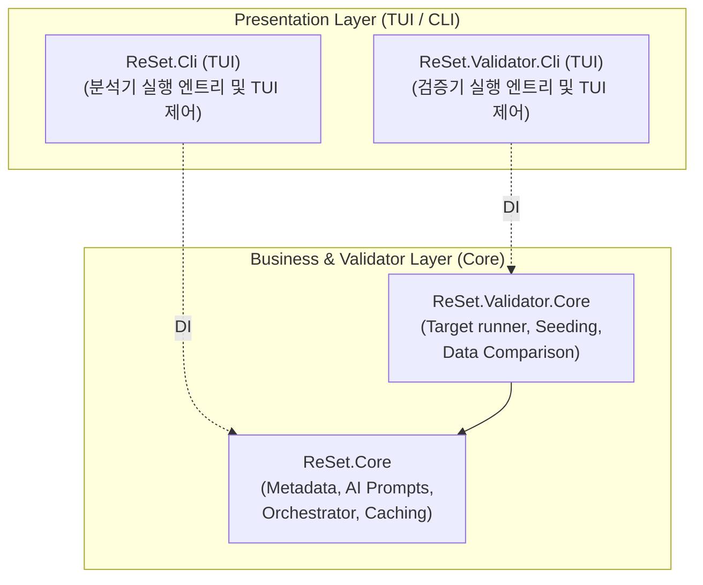

# ReSet (REverse engineering SETtlement) 시스템 아키텍처 정의서 (System Architecture Definition)

본 문서는 SQL Server Stored Procedure(SP)를 자율적으로 분석하고 신규 시스템으로의 전환 계획서를 도출하는 **ReSet (REverse engineering SETtlement) 에이전트** 프로그램의 모듈 설계, 구성 요소 간의 데이터 흐름, 핵심 알고리즘 및 검증 파이프라인의 구조적 아키텍처를 정의합니다.

---

## 1. 개요 (Overview)

### 1.1. 시스템의 목적
본 프로그램은 레거시 DB 비즈니스 로직(Stored Procedure)을 현대적인 애플리케이션 아키텍처(C#, Java Spring Batch 등)로 마이그레이션하기 위해, SP의 비즈니스 로직과 의존성을 자율적으로 분석하고 기능 명세서(`Spec.md`) 및 배치 전환 계획서(`BatchMigrationPlan.md`)를 자동 생성·검증하는 CLI/TUI 도구입니다.

### 1.2. 핵심 설계 사상
* **관심사 분리 (SoC)**: 사용자 인터페이스 레이어(Cli)와 핵심 도메인 비즈니스 레이어(Core), 코드 검증 레이어(Validator)를 명확히 분리하여 설계의 격리성을 극대화합니다.
* **3단계 점진적 신뢰성 보장**: 생성된 명세서의 무결성을 기계적 검증(L1), AI 교차 검토(L2), 인간 승인(L3)의 3단계 파이프라인을 거치며 검증합니다.
* **무인 자동화와 인간 피드백의 유기적 결합**: 대화형 모드(TUI)를 통해 개발자의 피드백을 실시간 수집하고, CI/CD 환경을 위한 무인 배치 실행 모드를 동시에 완벽하게 지원합니다.

---

## 2. 시스템 구성 및 컴포넌트 아키텍처 (System Components)

### 2.1. 컴포넌트 레이어링 및 관계
본 프로그램은 프레젠테이션 레이어(Cli)와 비즈니스 서비스 레이어(Core/Validator)로 구성되어 있습니다.

## 절 목차 (Section Index)

각 절은 독립 파일이다. **절 번호가 주소다** — `AGENTS.md`와 코드 주석이 `§4.4`처럼
절 번호로 부르므로, 파일을 옮기거나 이름을 바꿀 때 번호 접두사를 지우지 말 것.
새 절을 만들면 이 표에 행을 더한다. 안 더하면 그 절은 주소가 없는 미아가 된다.

| 절 | 내용 | 파일 |
| :--- | :--- | :--- |
| §2.2 | 핵심 모듈 및 클래스 목록 | [2.2-module-catalog.md](./architecture/2.2-module-catalog.md) |
| §3 | 전체 실행 라이프사이클 및 데이터 흐름 (§3.1–3.4) | [3-execution-lifecycle.md](./architecture/3-execution-lifecycle.md) |
| §4.1 | DFS 기반 재귀적 의존성 수집 및 Soft Fail (§4.1.1 포함) | [4.1-recursive-dependency.md](./architecture/4.1-recursive-dependency.md) |
| §4.2 | MS_Description 확장 속성 맵핑 및 AI 보완 | [4.2-ms-description.md](./architecture/4.2-ms-description.md) |
| §4.3 | T-SQL AST 정적 분석 고도화 (ScriptDom) | [4.3-tsql-ast.md](./architecture/4.3-tsql-ast.md) |
| §4.4 | 3단계 신뢰성 검증 파이프라인 | [4.4-verification-pipeline.md](./architecture/4.4-verification-pipeline.md) |
| §4.5 | 다중 AI 공급자(Multi-LLM Provider) 추상화 | [4.5-multi-llm-provider.md](./architecture/4.5-multi-llm-provider.md) |
| §4.6 | 소스코드 정합성 검증 엔진 (Validator) | [4.6-validator-engine.md](./architecture/4.6-validator-engine.md) |
| §4.7 | 관계지향 모의 데이터 적재 및 수명주기 격리 | [4.7-sandbox-seeding.md](./architecture/4.7-sandbox-seeding.md) |
| §4.8 | SHA-256 해시 기반 로컬 증분 캐싱 | [4.8-incremental-cache.md](./architecture/4.8-incremental-cache.md) |
| §4.9 | 하이브리드 영문화 프롬프트 및 환각 차단 | [4.9-prompt-engineering.md](./architecture/4.9-prompt-engineering.md) |
| §4.10 | 정산 정책 도출 (Policy Extraction) | [4.10-policy-extraction.md](./architecture/4.10-policy-extraction.md) |
| §4.11 | 지시서 번들 분할과 회차 단위 코드 생성 | [4.11-instruction-bundling.md](./architecture/4.11-instruction-bundling.md) |
| §4.12 | 단계 하한 검사 대조 기준의 결정론적 보강 | [4.12-step-floor-materials.md](./architecture/4.12-step-floor-materials.md) |
| §4.13 | Claude 프롬프트 캐시 중단점 | [4.13-prompt-cache-breakpoint.md](./architecture/4.13-prompt-cache-breakpoint.md) |
| §4.14 | 명세서 기반 요구사항 도출 (PRD Derivation) | [4.14-prd-derivation.md](./architecture/4.14-prd-derivation.md) |
| §5 | TUI/CLI 부가 기능 및 복구 파이프라인 (§5.1–5.8) | [5-secondary-features.md](./architecture/5-secondary-features.md) |

<!-- synced-through: 7ab3d10c -->
