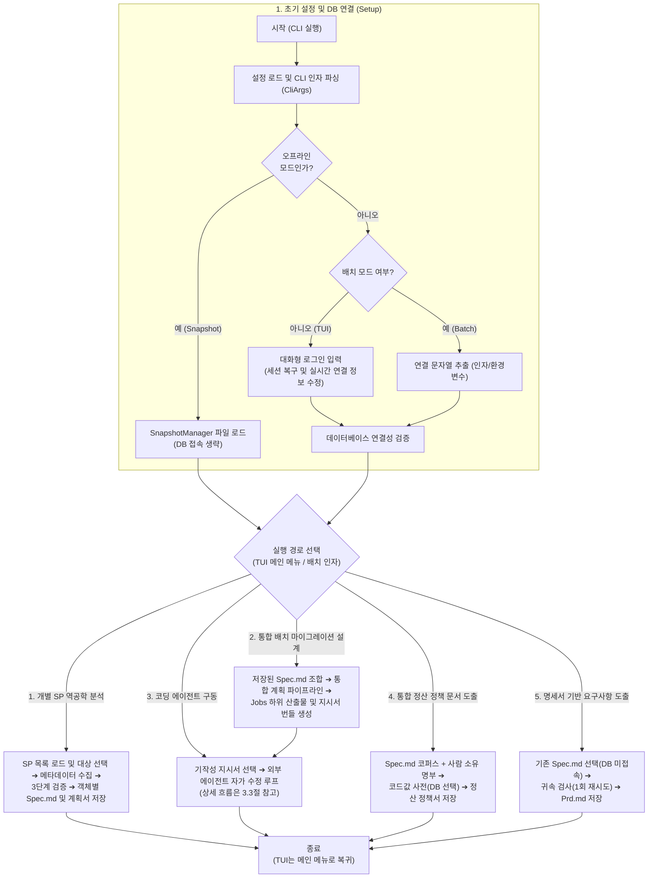
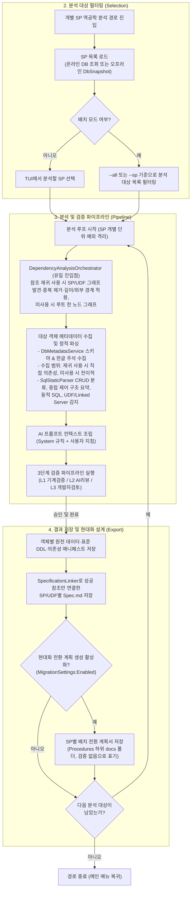
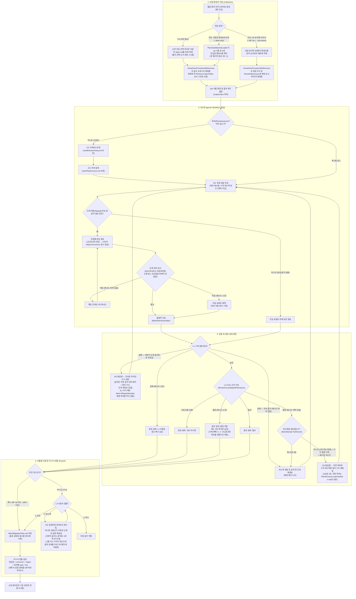
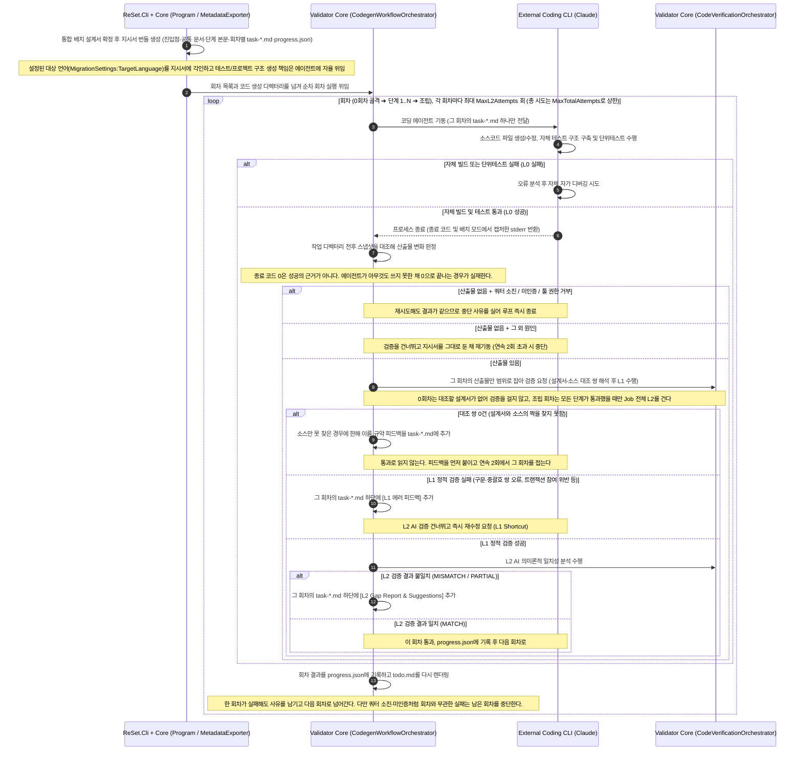
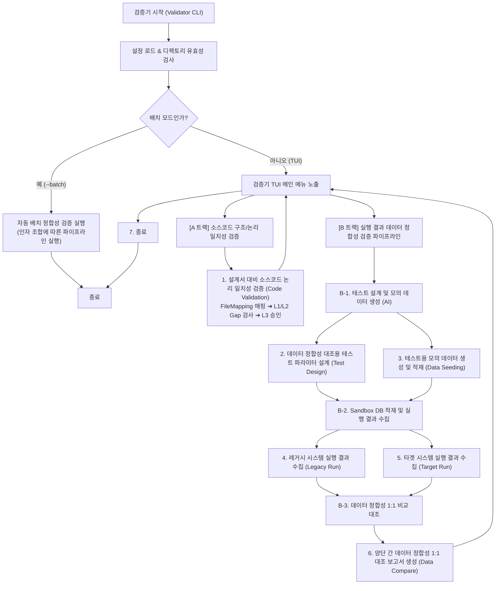

<!-- 아키텍처 정의서 §3 — 허브: [docs/architecture.md](../architecture.md) -->

## 3. 전체 실행 라이프사이클 및 데이터 흐름 (Visual Execution Flow)

### 3.1. 프로그램 거시 실행 흐름
ReSet 프로그램이 기동되어 설정을 파싱하고 DB에 연결한 뒤, 사용자가 고른 실행 경로에 따라 분기하는 거시적인(Macro) 흐름은 다음과 같습니다. 다섯 갈래 중 1번(개별 SP 역공학 분석)과 2번(통합 배치 마이그레이션 설계)의 상세 파이프라인을 아래에 접어 두었고, 3번(코딩 에이전트 구동)의 상세 시퀀스는 3.3절에, 4번(통합 정산 정책 문서 도출)의 메커니즘은 4.10절에, 5번(명세서 기반 요구사항 도출)의 메커니즘은 4.14절에 있습니다.

<b>1번 경로 상세 — 개별 SP 역공학 분석 파이프라인 (클릭하여 펼치기)</b>

<b>2번 경로 상세 — 통합 배치 마이그레이션 설계 파이프라인 (클릭하여 펼치기)</b>

### 3.2. 실행 모드 분기
* **대화형 TUI 모드**: 개발자가 직접 화면을 보며 분석할 SP를 원하는 순서대로 골라 담은 후 배치 전환 계획을 수립하고, AI 검증 결과와 피드백을 실시간 조율하며 승인 및 DB 동기화를 제어합니다.
* **무인 배치 모드 (CI/CD)**: `--all`·`--sp`·`--policy`·`--plan-only` 중 하나가 공급되면 사용자의 대화형 개입 단계를 생략하고 L1/L2 검증을 통과한 산출물을 자동 생성 및 병합하며, 외부 코딩 에이전트 기동까지 파이프라인을 무정지로 실행합니다. 단, Actor/Critic/Consolidator 중 하나라도 CLI 기반 AI 제공자(`claude-cli` | `codex-cli` | `agy-cli`)로 지정되어 있으면 `CliProviderBatchGuard`가 DB 연결 전에 실행을 즉시 중단시킵니다. `AiSettings:AllowCliProviderInBatch`(기본 `false`)를 켜면 `claude-cli`·`codex-cli`에 한해 차단을 열 수 있으며, 이때는 위험을 감수한 실행임을 알리는 경고를 남기고 진행합니다. `agy-cli`는 옵트인 대상이 아닙니다. `--job-name`은 그 자체로 이 모드를 켜지 않습니다 — 계획서를 놓을 이름일 뿐이라 단독으로 주면 TUI로 진입합니다.
* **계획 전용 모드 (`--plan-only`)**: 무인 모드의 한 갈래로, SP를 다시 분석하지 않고 **DB에 연결하지도 않은 채** 이미 저장된 명세서만으로 계획서와 지시서 번들을 만듭니다. 재료는 `--sp`에 적은 순서가 실행 순서가 되며, 진입점의 명세서를 하나라도 찾지 못하면 조용히 빼지 않고 종료 코드 1로 끝냅니다. 재료를 모으는 방식만 다르고 계획 수립부터 코딩 에이전트 기동까지는 위 갈래와 같은 코드를 탑니다. DB 연결을 건너뛸 수 있는 근거는 통합 배치 파이프라인과 지시서 번들 생성이 DB를 부르지 않는다는 것이며, 그 전제는 테스트가 되돌림으로 못박습니다(`ConsolidatedPipelineDbIndependenceTests`). AI는 무인으로 부르므로 `CliProviderBatchGuard`는 이 갈래에도 그대로 적용됩니다.

### 3.3. 외부 코딩 에이전트 자가 수정 및 TDD 검증 흐름 (Codegen Self-Correction Flow)
ReSet이 외부 코딩 에이전트를 가동하고 TDD 선제 검증(L0) 및 L1/L2 피드백 루프를 통해 코드를 고품질로 자가 교정하는 시퀀스 흐름은 다음과 같습니다.

<b>시퀀스 다이어그램 (클릭하여 펼치기)</b>

### 3.4. 정합성 검증기 거시 실행 흐름 (Validator Macro Flow)
마이그레이션된 소스코드와 레거시 DB Stored Procedure 간의 로직 일치성 및 결과 데이터 정합성을 검증하는 `ReSet.Validator` 프로그램의 거시 실행 흐름은 다음과 같습니다. 검증 과정은 단순 TUI 메뉴 분기 외에 선후행 파일의 의존성 관계에 의해 **구조 일치성 검증(A 트랙)** 및 **실행 데이터 정합성 검증(B 트랙)**으로 유기적으로 연결됩니다.

<b>검증기 거시 흐름도 (클릭하여 펼치기)</b>

---

