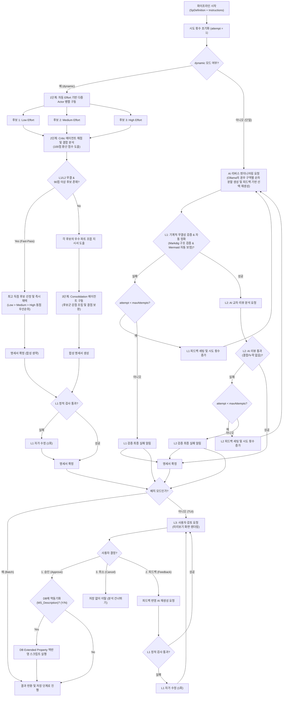
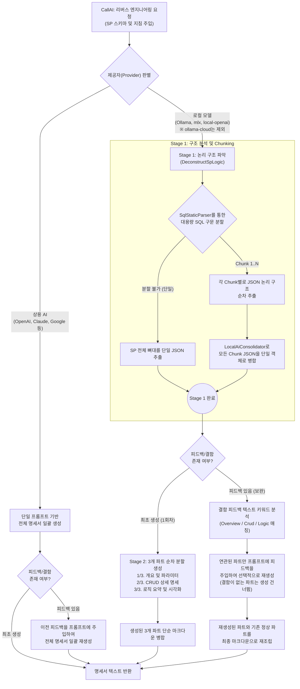

<!-- 아키텍처 정의서 §4.4 — 허브: [docs/architecture.md](../architecture.md) -->

### 4.4. 3단계 신뢰성 검증 파이프라인 (Verification Pipeline)
생성된 명세서의 무결성과 비즈니스 완성도를 보장하기 위해 L1, L2, L3 단계가 유기적으로 연결된 검증 아키텍처를 가동합니다.

* **단일 모드 명세서 생성 세부 흐름 (CallAI 단계)**: 상용 API(OpenAI, Claude 등)는 넓은 컨텍스트 윈도우를 활용해 전체 명세서를 한 번에 일괄 생성하는 반면, 로컬 Ollama 모델은 컨텍스트 한계와 인지 부하를 극복하기 위해 "논리 구조 추출(Deconstruct) ➔ 3개 구역 순차 분할 생성 ➔ 조립"의 파이프라인을 거치며, 피드백 보완 시에도 결함이 있는 파트만 선택적으로 재생성합니다.

#### 4.4.1. Level 1: 기계적 무결성 검증 (L1 Linter)
* **정적 헤더 검사**: Markdig AST 파서를 가동해 명세서 내 5대 필수 대분류 헤더(`## 개요`, `## 파라미터 목록`, `## CRUD 분석`, `## 로직 흐름 요약`, `## 비즈니스 흐름 시각화`)가 누락 없이 정확한 대소문자와 명칭으로 구성되었는지 점검합니다.
* **Mermaid 다이어그램 자동 정화 및 문법 검증**: 명세서 내 Mermaid 다이어그램 블록을 감지해 `PostProcessMarkdown`을 수행합니다. 화살표 라벨 따옴표 제거, 잘못된 화살표 기호 보정(비표준 화살표 조건절 및 누락된 화살표 복원), 노드 ID 특수문자/공백 제거 및 다이어그램 전체에 걸친 노드 ID의 공백/언더스코어 일괄 제거 정화, 특수문자 포함 라벨 큰따옴표 자동 래핑 등 문법 교정을 수행한 정화 마크다운을 반환합니다. 단, `subgraph` 키워드와 ID 사이의 공백은 보존하며, 연속 체이닝 화살표(`A --> B --> C`)가 라벨로 오인되지 않도록 안전하게 정화합니다. 이후 `mermaid-cli`로 백그라운드 컴파일을 수행합니다. 만약 컴파일 에러나 시간 초과(10초)가 발생하더라도 파이프라인을 중단시키지 않고, 기존의 정밀 정규식 기반 폴백 기계 린터(`ValidateMermaidFallback`)로 자동 전환하여 린트 검증 무결성을 최종 판단합니다. 단, T-SQL의 `@@ERROR`와 같이 자주 쓰이는 시스템 에러 변수 기입 건에 대해서는 Mermaid 문법 오류 린팅 감점에서 제외하는 예외 규칙을 탑재해 불필요한 보완 요청을 차단합니다.
  - **정화 마크다운 실반영**: 정화된 마크다운(`CleansedMarkdown`)은 검증 성공 여부와 상관없이 파이프라인 오케스트레이터를 통해 메모리 상의 원본 명세서/통합 계획서 텍스트에 실시간 반영되어 최종 파일로 안전하게 영속화됩니다.
* **정적 자가 보완**: 정적 검증 실패 시, 구체적인 구문 오류 내용과 수정 방향이 가이드된 `SuggestedPromptFix`를 조립해 AI 모델에게 즉각 자가 수정을 재요청합니다.

L1 기계 검증은 헤더·Mermaid 문법·UPDATE 컬럼 매핑에 더해 **스키마 주장 사실검증**을 한다.
명세서가 프롬프트에 실린 컬럼을 "존재하지 않음"으로 단정하면(`SchemaClaimFalse`), 또는 같은
물리 테이블을 서로 다른 표기로 나눠 적으면(`TableIdentitySplit`) 재생성을 요구한다.

대조 기준은 **DB 전체 컬럼이 아니라 프롬프트에 실제로 실린 컬럼**이다. 정당하게 필터에서
빠진 컬럼을 기준으로 삼으면 재생성으로 고칠 수 없는 L1 오류가 생겨 무한 재시도가 된다.
프롬프트가 참조 컬럼을 통째로 빠뜨린 경우는 별개의 결함으로 보고, L1 오류가 아니라
`spDef.Warnings`로 표면화한다 — 그것은 코드 버그이지 AI의 잘못이 아니다.

프롬프트에 어떤 컬럼이 실리는지는 `SchemaPromptColumnSelector`가 단독으로 결정한다.
`AiService`의 렌더러와 `SpecExpectations`가 같은 함수를 부른다. 이 판정을 어느 쪽에서든
복제하면 두 권위가 가장자리에서 어긋난다.

같은 불변식이 Anti-Shortcut 린트에도 적용된다. 금지 토큰 `etc.`를 부분 문자열로 찾던
검사는 컬럼명이 `Etc`로 끝나고 문장 끝에 올 때 생기는 `CLEtc.`를 축약어로 오인했다.
프롬프트가 만들어 넣은 자기참조 문장을 AI가 그대로 옮겨 적은 것이라 재생성으로 고칠
방법이 없었고, 실측에서 L1 재시도 3회를 모두 소진시켰다. 지금은 이 토큰만 앞 경계를
따지며, 검증 배너가 잔존 오류 메시지를 인용해 스스로를 오류로 만들지 않도록 인용문
줄은 검사 대상에서 제외한다. 금지 토큰 목록도 같은 이유로 한 곳에만 둔다
(`MechanicalValidator.ForbiddenShortcuts`) — 문서 검사와 단계 검사가 나눠 가지면 한쪽만
새 축약어를 알게 되고, 그 순간 단계에서 거르지 못한 것이 문서 레벨로 올라가 전체
재생성을 부른다.

**단계 검사의 명세서 문장 사실 대조 (2026-08-24, 축 B 재감사 대응).** 통합 배치 계획의 단계
검사(`MechanicalValidator.ValidateBatchStep`)는 명세서가 문장 단위로 확정한 사실을 받는
인자(`statementFactsByProcedure`)를 새로 받는다. `SpecStatementFactsExtractor`가 원본
프로시저 명세서의 DML 범위 표·갱신 절·지역 변수 표에서 문장 종류별 개수, 문장별 확정
컬럼·조인 키, 선언돼야 할 지역 변수와 타입을 뽑고, `StepSqlStatementReader`가 ScriptDom으로
생성된 단계 SQL을 문장 단위로 읽어 각 문장의 종류·주석 앵커(`/* U13: ... */` 형의 갱신
번호)·최상위 WHERE 술어 컬럼을 뽑는다. 이 재료 위에서 다섯 검사가 돈다: **A**
`CheckStatementCountAgainstSpec`(문장 종류별 개수가 명세서 확정 개수와 맞는지), **B**
`CheckAnchoredStatementFacts`(앵커로 문장을 명세서 갱신 행에 붙여 조인 키·술어 컬럼이
빠지지 않았는지), **C** `CheckAnchoredStatementExtras`(명세서에 없는 최상위 술어 컬럼이
앵커된 문장에 붙었는지), **D** `CheckSpecLocalVariablesDeclared`(명세서 지역 변수 표의
변수가 선언 없이 쓰였는지), **E** `CheckStepIdInitialValue`(`CATCH`가 돌려주는 상태 변수의
초기값이 그 단계의 오류 코드 집합과 겹치는지).

**제어 단계의 오류코드 대역과 분할 SP의 의무 귀속 (2026-08-26).** 위 다섯에 더해 두 검사가
같은 자리에서 돈다. `CheckControlStepErrorCodeBand`는 레거시 출신이 없는 단계가 쓰는 오류코드를
예약 대역(`ControlStepErrorCodes` — `-9000` 이하, 단계당 블록 10)으로 좁힌다. 이 단계들에는
보존할 원본 코드가 없어 규칙 6-1이 지킬 대상을 갖지 못하고, 규약이 없으면 모델이 어휘를
지어내는데 등장 검사는 그 지어낸 어휘가 본문에 있다는 이유로 통과시킨다 — 실측에서 그것이
SQL로 새어 `DECLARE @v_currentStepId INT = B161`처럼 해석되지 않는 식별자가 되었다. 검사는
신규 발급과 연속 범위 금지를 **레거시 출신이 있는 단계에만** 걸고, 문자열 리터럴·`NULL`
초기값·변수 참조·`CASE` 식·함수 호출에는 거짓 컴파일 실패를 주장하지 않는다.

**레거시 출신 단계의 코드 발명 (2026-08-30).** 위 검사의 정확한 여집합이
`CheckLegacyStepErrorCodeInvention`이다 — 저쪽이 `LegacyProcedures`가 **빈** 단계를 보고,
이쪽이 **있는** 단계를 본다. 규칙 9의 본문(「레거시 출신 단계는 원본 코드를 그대로 쓴다」)은
그때까지 아무도 안 봤다. 판정은 단계가 대입한 코드가 그 SP 명세의 코드 집합 ∪ `{0}`에
있는가 하나다.

**오라클이 목차가 아니라 명세서인 것이 요점이다.** `Steps[].ErrorCodes`는 계획서를 쓴 것과
같은 회차의 같은 모델이 채우므로 **발명과 선언이 함께 움직인다** — 실측에서 한 Job의 세 단계가
같은 부모 SP를 달고 발명한 코드를 목차에도 함께 실었고, 목차로 대조했다면 그 결함이 정의상
통과한다. 재료는 `SpecReturnCodeExtractor`가 명세서에서 뽑아 `codesByProcedure`로 이미
`ValidateBatchStep`까지 오고 있었다.

**그러나 명세서 산문도 오라클로는 부족했다(2026-09-02 정정).** 명세서를 쓴 것도 모델이라
그 재료는 오라클 출처의 세 번째 칸이다 — 산문이 같은 사실을 "`@po_intRetVal = -5`를 설정한 뒤"
로도 "`-5`를 반환합니다"로도 적어, 뒤쪽만 쓴 회차에서 실재하는 코드가 재료에서 빠지고 그대로
거짓 고발이 됐다. 지금 재료는 `ErrorCodeMaterial`이 만드는 **산문 ∪ 원본 DDL AST**의 합집합이고,
첫째 칸(DDL)이 산문의 흔들림을 덮는다. 왜 교체가 아니라 합집합인지는 그 부품 표 항목에 있다.

**방향이 역방향인 것도 요점이다.** 「선언한 코드가 대입되었는가」(순방향)는 실측 151건 중
62건이 **정당한 미대입**이라 96.9%가 거짓 고발이어서 접혔다. 역방향에는 그 갈래가 없다 —
명세에 없는 코드를 실었으면 발명이다. 명세에서 리터럴 코드가 하나도 안 나오는 SP
(오류를 음수 코드가 아니라 `ERROR_NUMBER()`로 내는 원본)는 **침묵한다**: 재료를 못 얻은 것과
결함이 없는 것은 다르다. 코퍼스 실측은 판정 194단계 · 재료가 없어 지나간 단계 1 ·
발화 10 · 오탐 0이다.

**그러나 그 오라클도 틀릴 수 있다 (2026-08-30 반례).** Batch5 대조 실행에서 이 검사가
`dbo.UP_Util_Settle_Summary`의 `-5`를 발명으로 고발했는데 원본 DDL과 명세서는 `-1`~`-8`을
전부 정의한다. `DmlScopeExtractor.ExtractErrorCodes`의 문장↔코드 귀속이 **DELETE 4개가 먼저
서고 INSERT 4개가 뒤에 몰린 배치**에서 INSERT 계열을 놓쳐, 허용 집합이 `0`·`-1`~`-4`로
좁아진 것이다(DELETE·INSERT가 번갈아 서는 `SUMMARY_EXTRA`에서는 옳게 작동했다). 모델이 L1을
만족시키려 `-5`~`-8`을 붕괴시키자 Critic이 그 붕괴를 필수 수정으로 지목해 루프가 갇혔고,
그 판의 단계 재생성 22회 중 10회가 이 한 줄이었다. **코퍼스 표본의 오탐 0은 그 표본이 번갈아
서는 형태였다는 뜻이지 검사가 옳다는 뜻이 아니다** — 재료를 고치기 전에 이 검사를 넓히지 마라
(`docs/known-defects.md`의 「고쳐야 하는 것」).

분할된 SP의 코드·테이블은 **단계마다 요구하지 않는다**. 한 원본 SP를 여러 단계가 나눠 맡으면
그 SP의 오류코드와 대상 테이블은 어느 한 단계에 다 들어갈 수 없고, 단계 단위로 요구하면 나눈
것 자체가 위반이 된다. 그래서 그 코드를 빚지는 SP가 **전부** 분할돼 있을 때에 한해 의무를 단계
단위에서 문서 단위로 올려, 그 SP를 나눠 맡은 단계들의 본문을 합친 것에 코드·테이블이 있는지로
판정한다. 하나라도 분할되지 않은 SP가 그 코드를 빚고 있으면 종전대로 단계 단위로 요구한다 —
분할을 핑계로 의무가 통째로 느슨해지지 않게 하는 경계다.

검사 B·C는 **한때 사실상 비활성이었다가 두 단계로 되살아났다**. `ReadAnchor`가 문장 바로
앞의 공백·주석만 보던 시절, 코퍼스 실물은 앵커 주석과 DML 사이에 `[Precise Error Tracking]`
규칙이 요구하는 `SET @v_currentStepId = ...;` 문이 끼어 있어 앵커가 326개 단계 파일 전수에서
0개 잡혔고, C는 B가 잡은 앵커 위에서만 도므로 함께 멈춰 있었다(근거는 `docs/known-defects.md`의
2026-08-24 항목). 지금은 (ㄱ) `ReadAnchor`가 그 필수 `SET`을 건너뛰어 U-앵커(`/* U13: … */`)를
다시 읽고, (ㄴ) 그것과 같은 「구간 내 유일성」 규칙을 재사용하는 **코드 앵커**(`CodeAnchor` —
DML 문장 뒤 오류 가드가 대입하는 음수 오류 코드 리터럴)가 더해져, 주석이 없는 문장도 명세서의
「오류 코드」 표가 주는 코드→갱신 번호 사전으로 서수에 환산된다.

두 앵커가 겹칠 때의 판정은 `MechanicalValidator.ResolveOrdinal`(:6800) 한 곳이 소유한다 —
U-앵커만 있으면 그것을 쓰고, 코드 앵커만 있으면 환산해 쓰며, 둘 다 있고 일치하면 쓰고,
둘 다 있는데 서수가 어긋나면 귀속하지 않고 침묵한다. 코드 앵커의 환산은 **종류까지 대조한다** —
사전(`codeMap`)은 오류 코드 원문을 `(종류, 서수)`로 보내므로, 코드가 우연히 맞아도 사전이
`UPDATE 9`인데 문장이 `DELETE`이면 다른 문장이라 매칭이 아니다. 침묵이 기본값인 이유는
검사 B·C가 "명세서가 확정한 것이 빠졌다"를 주장하는 검사여서, 귀속을 틀리면 정상 문장이
결함이 되기 때문이다. 같은 이유로 **한 `(종류, 서수)`를 두 문장이 다투면 그 서수는 통째로
침묵한다**(`AnchoredStatementKeyComparer`, :6825) — 한 코드 앵커가 여러 문장에 붙는 실물이 있어
(코드 앵커만 가진 UPDATE 둘이 같은 서수 4로 환산되는 형태) 먼저 만난 문장에 붙이면 그 귀속은
파일 순서가 정한 우연이 된다. 묶음의 단위가 서수가 아니라 `(종류, 서수)`인 이유는 서수가
종류별로 1부터 다시 시작하기 때문이다.
앵커 부재와 다툼은 조용히 접지 않고 스윕 지표(「코드 앵커가 둘 이상의 문장에 붙은 단계 수」)로
센다(§5.8).

검사 B는 술어가 **사라진 것**과 **하위 범위로 옮겨간 것**도 가른다. 생성된 단계가 원본의 최상위
WHERE 술어를 하위 질의나 파생 테이블의 WHERE로, 또는 JOIN ON 절로 옮겨 적었다면 대상 행
집합은 보존된 것이므로 소실로 보고하지 않는다 — 최상위만 읽으면 정상 이행이 전부 결함이 되고,
최상위와 하위를 다르게 취급하면 같은 이행이 문장 모양에 따라 갈린다. 그래서 `StepSqlStatementReader`가
하위 스코프의 술어 컬럼까지 재료로 싣는다.

검사 B·C는 **단계 내부 스테이징 계보**도 읽는다. 생성된 단계가 원본의 필터를 임시 테이블·테이블 변수·CTE에 먼저 적재하고 이후 문장이 그것만 되읽는 모양으로 옮겨 적었다면, 대상 행 집합은 보존된 것이므로 소실이나 초과로 보고하지 않는다. `StepSqlStatementReader`가 단계 안에서 「무엇이 무엇으로부터 적재되었는가」를 계보로 뽑고, `MechanicalValidator.StagingSources`·`ReadsOnlyStaging`이 그 계보를 검사 B(술어 이전 인정)와 검사 C(되읽기 술어를 초과로 세지 않음) 양쪽에서 쓴다. 계보는 **자기 참조 테이블과 도달 불가능한 CTE를 원천으로 잡지 않으며**, 순환 CTE는 유계 타임아웃으로 가둔다 — 그러지 않으면 자기참조 가드가 `ReadsOnlyStaging`을 공허하게 만들어 검사 C가 아무것도 기각하지 못한다. 이 면제는 **문장 단위**라는 한계가 있다(§4.4의 경계 주석).

단계 생성 프롬프트(`AiService`)는 그래도 문장 앵커를 요구하고, 명세서를 재생성해도 의미가
보존되도록 치환 두 가지를 금지하는 규약을 싣는다 — 스칼라 하위질의를 `CROSS
APPLY`/`OUTER APPLY`로 바꾸는 것(무결과 시 `NULL` 대입이 행 자체의 제외로 바뀐다), 비집계
조회 여러 문장을 `MAX(...)` 집계 한 문장으로 합치는 것(`@@ROWCOUNT > 1` 분기가 요구하는
"없음"의 표현이 `0`에서 `NULL`로 바뀌어 분기가 역전된다). 검사가 아직 뒷받침하지 못하는
유도다.

#### 4.4.2. Level 2: AI 교차 리뷰 (L2 Actor-Critic)
* **동적 모드 분기**: `ActorEffort` 설정값에 따라 검증 및 생성 경로가 이원화됩니다.
  * **단일 모드**: 지정된 LLM 모델을 사용해 1차 명세서를 빌드한 후(Ollama 제공자일 경우 1회차 생성 및 자가 수정/피드백 루프에서 `GenerateSpecSectionAsync`를 통해 "OverviewAndParameters", "CrudAnalysis", "LogicAndVisualization" 3개 파트로 나누어 순차 분할 생성 및 피드백 키워드 기반 선택적 재생성 조립을 구동), 이종 Critic 에이전트에게 5대 평가 기준(비즈니스 로직 정합성, 데이터 모델 및 CRUD 완전성, 연동 인터페이스 구체성, 예외 및 트랜잭션/격리성 정책, 다이어그램 및 시각화 가독성)을 바탕으로 교차 리뷰를 수행하도록 요청합니다. 특히 통합 배치 전환 계획의 경우 비즈니스 필터 보존 여부, 실패한 문장이 부분 커밋을 남기지 않는지, 그리고 원본 에러 코드 맵핑 무결성에 대해 더욱 가혹하게 감점 처리합니다. 결함 발견 시 자가 수정 루프를 가동하며, 설정된 Critic 기준 점수(Threshold)를 감쇄 없이 일관되게 엄격히 적용합니다. 최대 시도 횟수를 모두 사용한 후에도 기준 점수 미달로 최종 실패하는 경우, 명세서 문서 최상단에 `[!CAUTION]` 경고 배너와 최종 Critic 점수/피드백 코멘트를 보관하여 후속 수동 수정을 유도하도록 처리합니다.
  * **기준 점수 게이트의 단일 출처**: 감쇄 임계치는 쓰지 않고 언제나 설정된 기준 점수를 강제하며, Critic이 스스로 신고한 `HasDefects`는 참고일 뿐 게이트는 코드가 잡습니다. 5축 중 하나라도 기준 미만이면 결함으로 확정하는 이 비교는 `CriticScoreGate` 한 곳에만 있습니다 — 같은 비교가 단일 객체 루프·재생성 범위 선택·불합격 배너 세 곳에 흩어져 있었고, 통합 계획서 루프에는 아예 없어서 낮은 점수와 "검증 상태: 통과"가 나란히 찍혔습니다.
  * **dynamic 모드 (병렬 협업)**: 다형성 및 앙상블 효과를 극대화하는 dynamic 아키텍처 경로입니다. (상세 협업 시퀀스는 상위 통합 검증 파이프라인 흐름도 참고)
    - **차등 Effort 병렬 생성 (1단계)**: 동일한 SP 정의에 대해 `low`, `medium`, `high` 추론 강도를 병렬 구동하여 서로 다른 장점을 가진 3종의 후보 명세서를 확보합니다.
    - **Critic 채점 및 Fast-Pass 판정 (2단계)**: Critic 에이전트가 각 후보에 대해 정량 채점(5대 기준 각 10점, 총 50점 만점)을 실시하고 100점 만점으로 정규화합니다. L1 검증을 통과하고 Critic 결함이 없으며 90점 이상인 후보가 있다면 **Fast-Pass로 최고 점수 후보를 즉시 채택**하고 합성을 생략합니다. (동점 시 저-Effort 우선순위)
    - **Consolidation 합성 (3단계)**: 완벽한 후보가 없을 시에만 구동됩니다. 영역별 최고 득점을 기록한 후보의 파트를 진실의 원천으로 조립하여 결점을 보완한 단일 통합 명세서를 합성합니다.
    - **최종 L2 Critic 검증 및 1회 보완 (최종)**: 합성 완료 후, 최종 합성 명세서에 대해 L2 Critic 재검토를 기동합니다. 만약 합성본에서 결함이 식별될 경우 **최대 1회 보완 합성** 과정을 통해 완성도를 최대로 끌어올리며, 최종 통과된 L2 Critic의 항목별 채점 점수를 명세서 마크다운 파일 상단에 보존합니다.

#### 4.4.3. Level 3: 개발자 최종 검토 및 동기화 (L3 Human-in-the-loop)
* **피드백 수동 반영**: TUI 화면에 명세서 미리보기가 렌더링되며 개발자가 '승인', '취소', '피드백 입력' 중 하나를 선택합니다. 피드백 입력 시 사용자의 상세 요구사항을 컨텍스트에 추가하여 명세서를 재생성하고, 재생성된 결과물에 대해 L1 정적 검사 및 AI 자가 수정 루프를 1회 더 구동해 안정성을 유지합니다.
* **구조 변경 피드백 (통합 배치 계획 전용)**: 통합 배치 계획서의 L3에서는 피드백 입력 직후 그 피드백이 문서 구조(목차)까지 바꾸는지를 한 번 더 확인하고, 그렇다면 본문만이 아니라 목차부터 다시 세운 뒤 재생성합니다. 다시 세울 목차가 없는 단일 SP 명세서 경로에서는 이 질문 자체를 띄우지 않아, 답해도 반영될 곳이 없는 확인을 사용자에게 던지지 않습니다. 사용자의 명시적 구조 변경 지시는 자동 재설계 예산(Job당 1회)의 제한을 받지 않습니다.
* **단계 지목 재생성 (통합 배치 계획 전용)**: 구조를 바꾸지 않는 피드백에 대해서는 그 피드백이 어느 단계에 관한 것인지 사용자에게 직접 고르게 하고, 지목된 단계만 다시 만듭니다. 골격(개요·흐름도·검증 SQL)과 손대지 않은 단계의 본문은 그대로 재사용하므로, 한 단계를 고치자고 나머지를 잃는 일이 없습니다. 아무것도 고르지 않으면 전 단계를 다시 만들고, 골격을 고르면 공통 규약이 바뀌므로 그것을 인용한 전 단계도 함께 다시 만듭니다. 대상을 모델이 피드백 산문에서 추론하게 하지 않는 이유는 정답을 아는 사람이 화면 앞에 있기 때문입니다.
* **DB 동기화 제어**: 최종 승인 단계에서 보완 SQL 스크립트(`*_MetadataCleansing.sql`)가 물리적으로 존재할 경우에 한하여 개발자에게 DB 역반영 동의 여부를 묻고, 동의할 경우 스크립트를 호출하여 대상 데이터베이스의 Extended Properties 속성 주석을 정화합니다.
* **추론 로그 보존**: 파이프라인 진행 과정에서 축적된 모든 AI 모델의 깊은 생각/추론 내용(Thinking log) 및 Critic/Consolidator 리뷰 추론 텍스트를 취합하여 `docs/Thinking.md` 파일로 자동 기록하여 보존합니다. 추론 본문이 비어 있어도 문서는 생성되며, 그 자리에는 사유(추론 미지원·비활성화 또는 CLI 제공자의 본문 미노출)가 대신 기록됩니다. 헤더와 본문의 조립은 `ThinkingLogDocument`가 단독 소유하므로, 통합 배치·순차 SP·재귀 하위 객체 세 경로의 산출물이 같은 형식을 갖습니다.

#### 4.4.4. 검증 종료 상태 모델 (Verification Outcome)
* **네 가지 종료 지점**: 파이프라인이 어디서 끝났는지를 `VerificationOutcome` 열거형이 구분합니다. `ReviewNotRun`(L2 리뷰 호출 자체가 실패), `L1Exhausted`(재시도를 소진하고도 기계 검증 미통과), `QualityRejected`(리뷰는 돌았으나 기준 점수 미달), `Passed`(전 단계 통과). 열거형의 0번 값이 `ReviewNotRun`이므로 상태를 설정하지 않은 경로는 통과가 아닌 쪽으로 기울어집니다.
* **표기의 단일 출처**: 상태의 한국어 표기는 `VerificationDocumentFormatter.StatusLabel` 한 곳에서만 만들어집니다. 명세서·통합 계획서의 YAML 헤더, L3 승인 화면, 캐시로 복원된 문서의 재보고, 외부 코딩 에이전트 지시서 번들의 `## ⚠️ 0. 이 계획서의 검증 상태` 블록이 모두 이 표기를 공유하므로, 문서마다 다른 말을 하는 상황이 생기지 않습니다.
* **점수 노출의 게이팅**: Critic 점수는 종료 상태가 `Passed` 또는 `QualityRejected`일 때만 문서에 실립니다. 1차 시도의 리뷰 결과가 메모리에 남아 있더라도 최종적으로 검증되지 않은 문서에는 점수를 싣지 않습니다. 파이프라인에 진입한 적 없는 문서(단일 SP 계획서, 정산 정책서)는 애초에 `ReviewResult`를 받지 않는 별도 진입점으로 렌더링되어, 호출부가 점수를 유출시킬 수단 자체가 없습니다.
* **캐시 경계**: 종료 상태 게이팅이 도입되기 전에 기록된 캐시 항목은 검증 상태를 담고 있지 않으므로 무효 처리하여 재분석합니다. 이후 항목은 상태를 함께 보존해, 캐시로 복원된 산출물도 신규 분석과 동일한 상태로 보고됩니다.

#### 4.4.5. 통합 배치 계획의 목차 재설계와 기록 계약
* **재설계 트리거와 상한**: 통합 배치 경로는 목차(`PlanStructure`)를 재시도 루프 밖에 고정하므로, 목차 자체가 원인인 결함(스텝 누락, 청킹 불가 스텝의 오배치)은 본문만 다시 써서는 고쳐지지 않습니다. 재설계는 **두 조건이 모두 참일 때만** 발동하며, Job당 1회로 제한합니다 — **2회 연속** 최고점 미갱신, 그리고 **Critic이 구조 결함을 지목했을 것**(`StructureRedraftPolicy`). 미갱신 1회로 발동하던 종전 규칙은 1차가 후보 부재로 항상 갱신되므로 사실상 2차 결과 하나에 거는 도박이었고, 실측(POQSettleBatch4 2026-08-29)에서 그것이 터져 L1을 통과하며 점수를 받고 있던 14단계 체계를 16단계로 갈아엎고 골격·섹션 캐시를 전부 폐기했습니다. 두 번째 조건이 없으면 「본문이 나쁜 것」과 「목차가 나쁜 것」을 가르지 못합니다. 기본 예산(`MaxL2Attempts`=5 → 총 6회)에서 2회 연속 미갱신은 이르면 3차에 성립하므로 발동할 자리는 남습니다. L3에서 사용자가 직접 구조 변경을 요청하는 경로는 이 정책을 거치지 않습니다. 목차를 재설계하면 캐시해 둔 골격·단계 섹션·하한 위반 기록도 함께 지웁니다 — 남겨두면 새 목차에 없는 옛 단계 코드를 계속 실어 나릅니다. 같은 무효화(`ClearSplitGenerationCacheAfterRedraft`)는 골격 재시도가 실패해 단일 호출로 폴백할 때도 씁니다 — 위반 기록만 지우고 캐시된 섹션을 남기면, 그 회차와 무관한 나중 회차의 지목 재생성이 그 섹션을 재사용해 위반 기록 없는(=배너 없는) 하한 미달 본문을 조용히 되살릴 수 있습니다.
* **목차 기록의 계약**: `raw/PlanStructure.md`는 파이프라인이 종료하거나 문서를 사용자에게 건네는 모든 지점에서 **그 산출물을 실제로 만든 목차**를 담고 있어야 합니다. 따라서 목차를 만드는 일과 기록하는 일을 분리해, 재설계한 목차는 그 목차로 본문이 실제로 나온 것이 확정된 뒤에만 기록합니다. 재생성이 실패하거나 기록 자체가 실패하면 재설계는 통째로 폐기되고 이전 목차가 그대로 유효하며, 재설계 실패가 파이프라인을 중단시키지는 않습니다.
* **단계 목록과 분할 생성**: 목차는 산문과 함께 기계가 읽을 수 있는 단계 목록(`Steps[]`)을 같은 파일에 담습니다. 본문 생성은 이 목록을 단위로 나뉘어, 골격 1회와 단계마다 1회의 호출로 만들어진 뒤 결정적으로 조립됩니다. 단일 호출은 하나의 출력 예산 안에서 앞 단계가 예산을 선점하면 뒤쪽 단계가 구현 지시서로 쓸 수 없을 만큼 얇아지는데, 호출을 나누면 그 경쟁 자체가 사라집니다. 목록을 읽지 못하면 분할을 포기하고 단일 호출로 되돌아가므로 이 경로가 파이프라인을 막지는 않습니다. 다만 무해하지도 않습니다 — 상한(40단계) 초과는 목록을 통째로 버리는 실패 사유이고, 그 결과는 단계별 섹션이 하나도 없는 문서가 아무 오류 없이 `Passed`로 끝나는 것입니다(실측: 목차 73단계). 그래서 상한을 목차 생성 프롬프트에도 실어, 모델이 그 예산 안에서 단계 세분도를 정하게 합니다.
* **단계 본문의 동시 생성과 캐시 워밍**: 골격 이후의 단계별 호출은 `StepConcurrency`(기본 4)만큼 동시에 실행됩니다. 다만 첫 단계는 설정값과 무관하게 항상 단독으로 먼저 실행되어 프롬프트 접두사 캐시를 채운 뒤에야 나머지 단계가 동시에 시작됩니다 — 캐시는 요청이 완료돼야 채워지므로, 워밍 없이 여러 단계를 한 번에 쏘면 그 요청 전부가 캐시 미스가 됩니다. 아래 서술은 gpt-5 경로 기준입니다 — Claude는 [PromptCacheBreakpointPolicy](../src/ReSet.Core/Services/PromptCacheBreakpointPolicy.cs)가 두 번째 전송부터 공용 블록에 중단점을 찍으므로(§4.13), 첫 단계가 채우는 것은 시스템 블록뿐입니다. 모든 단계 호출이 끝나면(`Task.WhenAll`) 완료 순서와 무관하게 단일 스레드에서 목차 순서대로 결과를 이어붙이므로, 동시 실행은 벽시계 시간만 바꿀 뿐 산출물을 바꾸지 않습니다. 다만 워밍만으로는 캐시가 살지 않습니다. gpt-5.6 이후 모델은 캐시 접두사를 **cache breakpoint** 단위로 비교하고, breakpoint는 기본값이 **마지막 메시지**에 놓입니다 — 공통 컨텍스트 뒤에 단계 지시 한 줄을 이어 붙이면 그 지점의 접두사가 매번 달라져, 워밍이 채워 둔 캐시가 통째로 무효가 됩니다. 실측에서 단계 요청 113,142 토큰 중 `system` 크기인 2,062만 살아남았습니다(히트율 1.8%). 그래서 단계 지시와 재시도 피드백은 `volatileUserSuffix`로 분리해 별개 메시지로 보냅니다. 다만 **분리만으로는 캐시가 살지 않습니다** — 암묵적 breakpoint는 마지막 메시지 하나에만 놓여 공통 메시지 경계에는 아무것도 생기지 않기 때문이며, 분리만 적용한 회차의 실측치는 2,060으로 변화가 없었습니다. 그 경계를 explicit breakpoint로 직접 찍어야 비로소 앞부분이 캐시됩니다(최소 요청 검증에서 2회차부터 99.4% 히트). 즉 **메시지 분리와 explicit 지정 두 단계가 모두 필요**하며, 공통 두 메시지의 내용이 요청 간 바이트 단위로 같아야 이 구조가 성립합니다.
  이 구조가 **성립하지 않는 제공자**가 있습니다. CLI 제공자(`claude-cli`·`codex-cli`·`agy-cli`)는 프롬프트를 단일 텍스트로만 받아 `cache_control`을 찍을 자리 자체가 없으므로, 접두사를 아무리 고정해도 캐시가 살지 않습니다(실측 POQSettleBatch4 2026-08-29: 캐시 쓰기 24,065,539 대 읽기 775,702 — 재사용률 3.1%). 전량을 싣던 것은 버그가 아니라 그 캐시를 사려던 트레이드오프였으므로, 전제가 거짓인 제공자에게는 대가만 남습니다. 그래서 `PromptContextScope`가 단계 호출의 입력 범위를 가릅니다 — 기본값은 제공자로 정해져 CLI 제공자는 `Narrow`, 그 외는 `Full`이며 `AiSettings:PromptContextScope`로 못박을 수 있습니다. `Narrow`는 그 단계의 `LegacyProcedures`와 그것이 호출하는 **1-hop 이웃**의 명세서만 싣습니다. 이웃을 빼지 않는 것이 요점입니다 — 실측의 「필수 수정」 두 건이 정확히 그 관계로, 한 단계가 이웃 SP의 명세가 규정한 오류 코드와 전파 규칙을 지켜야 했습니다. 2-hop까지 끌면 전량으로 되돌아가므로 넓히지 않습니다. 비용만의 문제도 아닙니다: 250K 컨텍스트 안에서 16단계 규칙을 전부 지키게 하는 것 자체가 지시 이행력을 떨어뜨려 재현성 저하의 원인이 됩니다.
* **단계 하한과 국소 보수**: 각 단계 섹션은 생성 직후 SQL·의사코드 블록 1개 이상, 선언된 대상 테이블 전부, 원본 오류코드 전부(그리고 위 「단계 검사의 명세서 문장 사실 대조」의 검사 A~E)를 기계적으로 검사받고, 미달이면 그 단계만 다시 만듭니다. 단계당 최대 시도 횟수는 2026-08-24에 **2회(최초 1회 + 재시도 1회)에서 5회(최초 1회 + 재시도 4회)로** 올랐습니다 — 축 B 감사로 검사가 5개 늘어, 2회로는 첫 시도에서 2건 이상 걸린 단계가 재시도 1회 안에 다 못 고쳐 하한 미달로 확정됐기 때문입니다. 이 예산(`maxTries`)은 Actor-Critic의 문서 레벨 재시도 예산(`MaxL2Attempts`)과 완전히 독립이며, 이 메서드 자체가 문서 레벨 시도마다 처음부터 다시 돕니다 — 그래서 최악 비용은 단일 5회가 아니라 "단계 수 × 5 × 문서 레벨 시도 수"입니다. 그럼에도 별도의 총량 상한(예: Job 전체 호출 수 캡)은 **의도적으로 두지 않았습니다** — 실측상 대부분의 단계가 1~2회 안에 통과합니다. 재시도를 다 쓰고도 미달이면 그 사실을 배너에 남기고 진행합니다 — 문서 전체를 다시 만들게 하면 같은 결함으로 비용만 커집니다. L2가 결함 단계를 구조화 신호로 지목하면 골격과 나머지 단계를 재사용한 채 지목된 단계만 다시 만듭니다.
* **L1 위반의 단계 귀속과 수리 예산 분리**: L1 실패는 보고가 아니라 되돌림이므로, 지점이 특정되는 결함에까지 문서 전체 재생성을 걸면 채점받을 회차가 그대로 사라집니다(실측 POQSettleBatch4: 6회 중 2회가 채점 없이 L1에서 소진됐고, 3차는 규칙 3-1 위반 `END TRY` 하나, 4차는 `batch.BatchRun` INSERT 부재였습니다). 그래서 위반을 좌표로 되돌립니다 — `L1ViolationAttribution`이 위반 어휘가 실린 단계 섹션을, `ErrorCodeAttribution`이 누락 오류코드를 선언한 단계를 찾습니다. 어휘 귀속은 매칭되는 **모든** 단계를 엽니다: 규칙 3-1·10류 위반은 체계적이라 여러 단계에 함께 나타나는데, `MechanicalValidator`가 검사당 `DetailedError`를 하나만 내므로 첫 발견에서 멈추면 나머지 위반 단계가 영영 열리지 않고 다음 회차가 같은 위반으로 다시 실패합니다. **다만 「모든」이 「아무거나」가 되면 안 됩니다** — SQL 거처 축 넷의 메시지는 규칙 설명 안에 `GOTO`·`BEGIN TRY`·`NOLOCK` 같은 금지 어휘를 백틱으로 싣기 때문에, 메시지의 백틱 토큰을 훑는 기본 경로에서는 그 고정 문구가 이행 서술("원본의 `WITH(NOLOCK)` 힌트는 전부 제거했습니다")에 걸려 멀쩡한 단계를 엽니다. 규칙 10의 `NOLOCK`은 계획서 22편에서 산문 약 300건 대 코드 0건이라 한 발화가 Job의 모든 단계를 여는 데까지 갑니다. 그래서 그 넷은 `DetailedError.Lexemes`로 **발화가 있던 원문 줄**을 직접 싣고, 그 줄로만 귀속합니다. 헤딩 탐지만 코드 펜스를 존중합니다 — 위반 어휘 자체가 대개 SQL 블록 안에 있어 펜스를 통째로 건너뛰면 아무것도 귀속되지 않습니다. **귀속 성공 여부가 예산을 고릅니다.** 귀속되면 지목 재생성이 `AiSettings:MaxL1RepairAttempts`(기본 2, Job 전체 예산)를 쓰고 채점 예산(`MaxL2Attempts`)은 건드리지 않습니다. 귀속에 실패하면 채점 대상 문서를 새로 만드는 일이므로 종전대로 채점 예산을 씁니다. 억지 귀속은 하지 않습니다 — 잘못 붙이면 멀쩡한 단계를 다시 쓰게 되어 아래 회귀 롤백이 막으려는 회귀를 그대로 들입니다.
* **골격도 귀속 대상입니다**: 단계만 열 수 있던 동안 골격(개요·흐름도·공통 규약 절·마지막 검증 SQL 세트)의 위반은 **어느 재생성으로도 닿지 않았습니다** — 지목 재생성은 단계 섹션만 열고, 귀속 실패의 폴백인 전량 재생성조차 「골격이 원인이라는 신호가 없다」며 골격을 남겼기 때문입니다. 실측(반복 실행 3판, 2026-09-04): 판3의 L1 발화 7회가 전부 골격 mermaid의 같은 화살표 오류였고 골격 생성 호출 2회가 둘 다 첫 실패 이전이라, 깨진 다이어그램이 글자 하나 안 바뀐 채 6회차를 태웠습니다(채점 못한 회차 판2 3 · 판3 5). 이제 단계 섹션 밖의 위반은 골격에 귀속되어 **골격만** 다시 만들고 단계 섹션은 동결됩니다. **골격을 다시 만들 때의 정합은 패치로 지킵니다** — `SkeletonRevision`이 직전 골격 전문을 싣고 「지적된 자리만 고치고 나머지는 바이트 그대로(단계 목록 표·오류 코드 표·H2 넷 포함)」를 요구하며, 지켜졌는지는 프롬프트가 아니라 `SkeletonRevisionGuard`가 봅니다. 앵커를 잃었으면 그 자리를 이름으로 대고 1회 다시 부르고, 두 번째도 실패하면 알리고 채택합니다(버리면 그 회차가 예산을 쓰고도 문서가 바이트 그대로 남습니다). 같은 자리가 연속 2회 지목되면 패치를 포기하고 백지로 올립니다 — 단계 패치의 에스컬레이션과 같은 규칙입니다. 처방이 `MaxL1RepairAttempts` 인상이 **아닌** 이유가 여기 있습니다: 모자란 것은 예산이 아니라 그 예산 한 번이 닿는 범위였습니다. 함께 고친 것으로, 귀속 실패의 전량 재생성은 이제 골격도 버립니다 — 자리를 못 찾은 위반은 골격에 있을 수도 있고, 그 갈래는 애초에 섹션 전량을 다시 만들어 골격 호출 하나보다 훨씬 비쌉니다. L2의 `SkeletonDefective`는 그대로 백지 재작성입니다 — 그쪽은 「공통 규약이 단계 본문과 모순된다」는 의미 판정이라 고칠 범위가 한 줄로 좁혀지지 않습니다.
* **단계 동결과 회귀 롤백**: 회차를 거듭할수록 통과한 단계까지 다시 쓰이며 새 결함이 들어왔습니다(실측 POQSettleBatch4: 6차가 5차 대비 정합성 8→7, 예외 7→6). `StepFreezeState`가 이번 회차에 열 단계를 정하고 나머지는 직전 본문을 바이트 그대로 재사용합니다. 동결 조건은 셋의 AND입니다 — 하한 검사 통과·오류코드 검사 통과·Critic 미지목. 확률적인 신호(Critic) 하나에만 맡기지 않는 것이 요점이며, 기계가 아는 결함은 동결되지 않습니다. 예외는 `Unverifiable` 하나로, 그것은 「본문이 나쁘다」가 아니라 「대조할 재료가 목차에 없어 검사가 돌지 못했다」이므로 열어 두면 판정은 그대로인 채 예산만 태웁니다(그런 결함은 루프가 아니라 배너가 처리합니다). 동결과 짝을 이루는 것이 **회귀 롤백**입니다 — 이번 회차가 최고 후보보다 낮은 점수를 내면 산출물을 버리고 최고 후보 상태로 되감아, 다음 회차가 나쁜 문서 위에서 출발하지 않게 합니다. 목차·골격·섹션 캐시·하한 위반 기록을 함께 되감지 않으면 채택되지 않은 재수립 목차가 그대로 남습니다.
* **구제 채택과의 정합**: 재설계 이후 회차가 더 낮은 점수를 내 구제 채택(`RetryRescue`)이 재설계 이전 시도를 최종 선택하면, 그 시도를 만든 목차를 현행으로 되돌리고 밀려나는 목차를 `raw/PlanStructure.superseded-n.md`로 남깁니다. 이 파일들은 어떤 목차가 시도되고 왜 채택되지 않았는지를 `raw/` 디렉터리만으로 재구성하기 위한 이력이므로, 재설계로 밀려난 목차와 구제 채택으로 되돌려진 목차를 모두 담습니다.
* **목차 커버리지 검사**: 분할 계약 전체가 목차의 단계 목록에 기댑니다. 목차가 12개 원본 프로시저에 3개 단계만 냈다면, 분할은 3개의 통통하고 하한을 통과하는 섹션을 만들고 문서는 `Passed`로 끝나지만 나머지 9개는 최종 문서 어디에도 없습니다 — 하한 미달 단계보다 더 나쁜, 아무 신호 없는 누락입니다. 파이프라인은 재시도 루프가 끝난 뒤 채택된 목차의 각 단계 `LegacyProcedures`가 원본 명세서(`specs` 인자, 회차마다 덧붙는 `Feedback_Log.txt` 같은 작업 사본 항목은 제외) 전부를 커버하는지 대조하고, 빠진 프로시저를 배너로 알리며 경고 로그를 남깁니다. 비교는 스키마·DB 접두사를 뗀 "맨 이름"(대소문자 무시) 기준이며, 접두사 제거 규칙은 `MechanicalValidator.BareObjectName`을 그대로 재사용합니다. 하한 위반과 마찬가지로 `VerificationOutcome`을 바꾸지 않고 목차 재설계도 유발하지 않습니다 — 재설계 예산은 점수 정체를 위해 남겨두고, 이 검사는 가시성만 확보합니다. 이 값은 재시도 루프의 실시간 상태가 아니라 **채택이 확정된 뒤의 목차**(`currentPlanStructure`)에서 매번 새로 계산합니다 — 목차와 원본 `specs`에만 좌우되고 어느 회차가 무엇을 생성했는지와는 무관하므로, `stepFloorViolations`가 쓰는 회차별 스냅샷이 따로 필요하지 않습니다. 목차가 유효한 단계 목록을 못 냈으면(`BatchStepPlanParser.TryParse`가 `null`) 이 검사는 그냥 건너뜁니다 — 분할 자체가 개선이지 필수 단계가 아니라는 계약을 그대로 물려받은 의도된 동작입니다. 예전에는 목차가 망가진 바로 그 순간이 커버리지가 가장 의심스러운 순간인데도 이 검사가 침묵해 문서에 아무 흔적이 남지 않았습니다(실측 POQSettleProc7: 33개 단계 전부와 원본 오류코드 20개가 빠진 문서가 배너 하나 없이 92점으로 통과). 지금은 이 경로에서 `VerificationBanner.SplitGenerationSkipped`가 "분할이 무산되어 커버리지 검사와 단계 하한 검사가 둘 다 실행되지 않았다"는 사실 자체를 배너로 남겨, 그 사각지대를 닫습니다.
  단계 목록은 나왔는데 **모든 단계가 `LegacyProcedures`를 비운** 경우는 이 사각지대와 다르게 다룹니다. 대조 집합이 비면 검사는 필연적으로 명세서 전부를 "커버되지 않음"으로 내놓는데, 그것은 계산 결과가 아니라 재료가 없다는 사실의 부작용입니다. 실측(POQSettleProc6)에서 33단계가 전부 표기를 비운 채 나와 12개 프로시저가 모두 누락으로 보고됐지만, 본문은 12개를 전부 다루고 있었습니다. 그래서 이 경우에는 누락 배너 대신 `VerificationBanner.CoverageUnverifiable`이 "대조를 실행할 수 없었다"를 말하고 프로시저명은 싣지 않습니다 — 이름을 나열하면 그 자체가 누락 목록으로 읽히기 때문입니다. 일부 단계만 비었을 때는 누락 배너를 유지하되 그 목록이 과다 보고일 수 있다는 단서를 함께 답니다. 같은 원인이 단계 하한 검사의 대상 테이블·오류코드 대조도 함께 무력화하므로(보강기가 대조할 원본을 잃어 `ErrorCodes`·`TargetTables`·`SchemaTables`가 연쇄로 빕니다), 두 배너는 대개 같이 나타납니다.
  이 검사는 명세서의 `FileName`이 프로시저마다 실제로 다른 값이라는 전제에 전적으로 기댑니다. 2026-08-06 코드 리뷰는 두 호출부 모두가 그 전제를 어기고 있었음을 실측했습니다 — `--batch --job-name` 경로(`Program.cs`)는 모든 명세서에 고정 문자열 `"docs/Spec.md"`를 썼고, TUI 경로는 [BatchStepCatalog](../src/ReSet.Cli/BatchStepCatalog.cs)가 돌려주는 상대 경로를 그대로 썼는데 그 경로는 항상 `.../docs/Spec.md`로 끝납니다. 두 경우 모두 N개 명세서가 커버리지 검사에는(그리고 AI 프롬프트의 `Filename:` 레이블에도) 사실상 같은 값 하나로 보였습니다 — 검사가 매 실행마다 존재하지도 않는 갭을 보고하면서(대조 대상 값이 어느 목차의 `LegacyProcedures`와도 우연히 일치하지 않으므로) 정작 진짜 누락은 절대 이름으로 짚어내지 못하는 결과였습니다. 수정 후 두 호출부는 프로시저별 식별자(`{Schema}.{Name}` 또는 `BatchStepCatalog.ExtractProcedureIdentifier`가 뽑은 `dbo.UP_UTIL_SETTLE_INS` 형태)를 넘깁니다.
* **오류코드 누락 검사는 목차를 보지 않는다**: `MechanicalValidator.FindMissingErrorCodes`는 목차와 무관하게, 원본 반환 코드(`ErrorCodeMaterial` — 명세서 산문 ∪ 원본 DDL AST)가 최종 문서 어디에라도 등장하는지만 봅니다. 그 재료는 `AttachPipelineBanners`가 스스로 만들지 않고 호출부에서 받습니다 — 루프 안의 역방향 검사와 **같은 값**이어야 두 오라클이 갈리지 않습니다. 그래서 목차가 완전히 깨져 분할이 무산되어도(위 `SplitGenerationSkipped`) 단일 호출로 대체된 본문에서 여전히 누락을 잡아내며, `VerificationBanner.MissingErrorCodes`가 그 결과를 알립니다. 이 검사는 반드시 배너가 붙기 전의 원본 본문만 보아야 합니다 — `L1Exhausted`·`QualityRejected` 등의 배너는 실패 사유(L1 오류 목록, Critic 피드백 등)를 그대로 인용하는데, 그 문구에 우연히 코드 숫자가 섞이면 배너까지 함께 스캔하는 검사가 그것을 "문서에 존재"로 오판하기 때문입니다. 그래서 `AttachPipelineBanners`는 배너 없는 원본 사본을 별도로 들고 다니며 이 검사에만 넘깁니다.
* **목차 단계의 원본 프로시저 명단(roster)**: 목차 설계 단계는 명세서 본문을 받지 않는데도 `LegacyProcedures`·`TargetTables`·`ErrorCodes`를 명세서 수준으로 정확히 요구하면, 모델은 추정을 규칙 위반으로 읽어 `Steps` 자체를 비웁니다(실측 POQSettleProc7: 33개 단계와 원본 오류코드 20개 소실, 배너 없이 92점 통과). 그래서 목차 요청은 원본 프로시저 명단을 함께 실어 `LegacyProcedures`는 그 명단에서 그대로 골라 쓰게 하고, `TargetTables`·`ErrorCodes`는 최선의 추정만 요구하며 하류(`PlanStructureEnricher`)가 정적 분석·명세서로 다시 계산해 교정한다는 사실을 프롬프트에 명시합니다. 세 필드 모두 불완전해도 회복 가능하며, 비어서는 안 되는 것은 `Steps` 자체뿐입니다. 다만 그 교정은 레거시 출신이 있는 단계에만 미칩니다 — 교정이 `LegacyProcedures`를 키로 삼기 때문입니다. 출신이 없는 단계(잠금·저널·대사·종료)에서는 모델이 적은 것이 그대로 최종본이 되고, 그 단계들이 다루는 것이 정확히 배치 제어 객체라 규칙이 가장 필요한 자리에 사후 교정 장치가 없습니다. 그래서 배치 객체 스키마 규약(`[Batch Object Schema]`)은 본문 생성 세 경로뿐 아니라 목차 설계 프롬프트에도 걸어 둡니다(실측 POQSettleProc12: 목차가 `dbo.TBatchRun`을 선언하고 본문은 `batch.BatchRun`을 써 다섯 단계가 하한 미달로 걸렸습니다).

