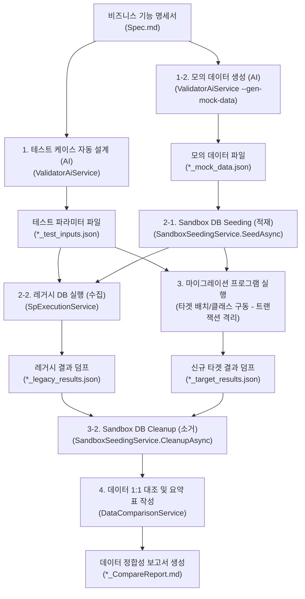

<!-- 아키텍처 정의서 §4.6 — 허브: [docs/architecture.md](../architecture.md) -->

### 4.6. 소스코드 정합성 검증 엔진 (Validator)
마이그레이션된 소스코드가 원래의 비즈니스 기능 명세서(Spec) 및 기존 Legacy DB SP의 구동 결과 데이터와 일치하는지 판정하는 정합성 검증 시스템 흐름은 다음과 같습니다.

검증기는 설정을 자기 `appsettings.json`과 `appsettings.local.json`에서만 읽습니다. 분석기(`ReSet.Cli`)의 로컬 설정 파일에서는 `ApiKey` 하나만 따로 가져옵니다 — 그 파일을 통째로 병합하면 나중에 추가된 소스가 이기는 구성 규칙 때문에 분석기 쪽 provider가 검증기까지 덮어써, 분석기에서 CLI provider를 쓰는 순간 검증기의 무인 배치가 `CliProviderBatchGuard`에 걸려 중단됩니다.

* **절대 경로 자동 보정**: CLI 인자나 설정으로 유입된 상대 경로는 프로세스 구동 시 `Directory.GetCurrentDirectory()`와 결합해 즉시 절대 경로로 고정하여 실행 디렉토리 변동으로 인한 파일 미조회 오류를 원천 차단합니다.
* **명세서-소스 스마트 매핑**: 파일명 매칭 규칙을 기반으로 마이그레이션된 소스코드를 스캔하되, 명세서 상단의 YAML Front Matter(`TargetCode: ...`) 지시를 최우선 순위로 해석합니다. 빌드 디렉토리와 소스 디렉토리 간 중복된 접두사 경로(예: `src/`)는 정규식 슬라이싱을 통해 자동 보정합니다.
* **타겟 런타임 격리 실행 (Runner)**:
  * **C# Reflection Runner**: 빌드된 C# DLL을 리플렉션 로드하고 생성자에 `SqlConnection` 및 `SqlTransaction`을 동적 주입하여 비즈니스 메소드를 직접 실행합니다. 비동기 호출 시 `Task`뿐만 아니라 `ValueTask` 및 `ValueTask<T>` 반환형식도 리플렉션을 통해 동적으로 대기(await)하며, 로직 수행 후 DB 수정 내역을 Sandbox에 반영하지 않고 항상 `Rollback()`을 호출해 격리합니다.
  * **Java Process Runner**: 타겟 클래스나 JAR를 외부 Java 프로세스로 기동하고 입력 인자를 stdin JSON 스트림으로 전달하며 결과를 stdout으로 수집합니다. 30초 타임아웃을 연결해 CLI 무한 대기 교착을 차단합니다.
* **유연한 1:1 데이터 동등성 비교**: 레거시 DB SP를 돌려 수집한 `_legacy_results.json`과 타겟 실행 결과를 덤프한 `_target_results.json`을 대조합니다. 단순 텍스트 비교 시 발생하는 실수 소수점 끝자리 차이 및 DateTime 날짜 포맷팅 문자 표현 차이는 타입 감지 후 `NormalizeValueString`을 통해 정형화한 후 동등성을 평가하여 False Positive(거짓 불일치) 경고를 방지합니다.
* **A 트랙(구조/논리 일치성)의 Gap 판정 규칙**: `ValidatorAiService`가 수행하는 L2 AI 의미론적 대조는 입력 파라미터·출력 데이터셋·비즈니스 로직·예외/트랜잭션에 이어 데이터 액세스 경계([DataAccessPolicy](../../src/ReSet.Core/Services/DataAccessPolicy.cs) 기반)까지 5대 범주로 Gap을 판정해 [GapReport](../../src/ReSet.Validator.Core/Models/GapReport.cs)에 담습니다. 프롬프트는 경계 위반이 하나라도 있으면 `OverallStatus`를 최소 `PARTIAL`로 판정하도록 지시하며, `CodeVerificationOrchestrator`는 여기에 더해 `DataAccessBoundaryGap`이 비어 있을 것까지 요구해 `L2Passed`를 세웁니다. 두 조건을 함께 보는 이유는, 경계 위반이 흔히 기능적으로는 동등하기 때문에 AI가 위반을 기록하면서도 `MATCH`로 답할 수 있고 그 경우 위반이 아무 신호 없이 통과하기 때문입니다. `DataAccessBoundaryGap`의 기본값이 `string.Empty`이므로 나머지 4개 범주의 판정 방식은 달라지지 않습니다.
* **항상 조항 1은 L2보다 앞선 L1에서 막습니다**: ORM을 전달받은 커넥션/트랜잭션에 참여시키는 조항만은 [TransactionEnlistmentCheck](../../src/ReSet.Validator.Core/Plugins/TransactionEnlistmentCheck.cs)가 언어별 플러그인에서 기계적으로 판정합니다. 위반 시 `CSharpReflectionRunner`의 Rollback 격리가 깨져 아래 B 트랙의 1:1 대조 결과 자체가 오염되므로, AI 판단을 기다리지 않고 L1 숏컷으로 반려합니다. 명백한 위반만 잡으며, DI로 주입된 컨텍스트가 참여하지 않는 경우는 파일 단위 검사로 판정할 수 없어 L2에 남습니다.

