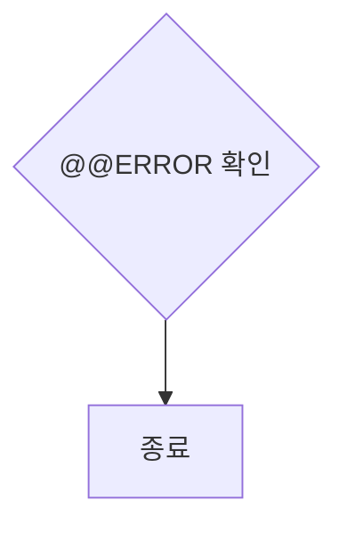

# 재시도 루프 수렴 구현 계획

> **For agentic workers:** REQUIRED SUB-SKILL: Use superpowers:subagent-driven-development (recommended) or superpowers:executing-plans to implement this plan task-by-task. Steps use checkbox (`- [ ]`) syntax for tracking.

**Goal:** 재시도 루프가 마지막 시도 대신 가장 점수가 높은 시도를 채택하고, 라운드 간 지적사항이 유실되지 않으며, Mermaid `@` 표기가 깨지지 않게 한다.

**Architecture:** 두 개의 작은 단일 책임 헬퍼(`BestAttempt`, `CriticFeedbackLog`)를 새로 만들어 순차 SP 루프와 배치 계획 루프가 공유한다. 헬퍼는 단위 테스트로 못박고, 루프는 배선만 한다. Mermaid는 정화기(결정적)와 프롬프트(확률적)를 함께 고친다.

**Tech Stack:** .NET 10, C#, xUnit, NSubstitute

**설계 문서:** `docs/superpowers/specs/2026-08-04-retry-best-attempt-convergence-design.md`

## Global Constraints

- 문구를 여러 곳에서 새로 작성하지 않는다. `VerificationBanner`, `DataAccessPolicy`, `ThinkingLogPlaceholder`와 같이 **단일 소유 클래스**를 만들고 그곳에서만 문구를 만든다.
- `OperationCanceledException`을 감싸지 않는다. `CancellationPolicyTests`가 `src/` 전체를 Roslyn으로 훑는 아키텍처 게이트이므로 위반 시 빌드가 아니라 테스트가 깨진다.
- 동점 시 **먼저 나온 시도**를 유지한다(엄격 부등호로만 갱신).
- 피드백 보관 상한은 **최근 3개 라운드**.
- `"at at ERROR"` → `@@ERROR` 역변환은 **하지 않는다**.
- 점수 나열 순서는 `VerificationBanner`와 동일하게 **정합성 → CRUD → 인터페이스 → 가독성 → 예외**로 맞춘다. (설계 문서 본문의 예시는 순서가 달랐으나, 산출물 전반의 일관성을 위해 배너 순서를 따른다.)
- 전체 테스트 명령: `dotnet test tests/ReSet.Core.Tests`

---

## File Structure

| 파일 | 책임 |
|---|---|
| `src/ReSet.Core/Services/BestAttempt.cs` (신규) | 재시도 후보 중 최고 점수 하나를 보관. 갱신 규칙(엄격 부등호)을 단독 소유 |
| `src/ReSet.Core/Services/CriticFeedbackLog.cs` (신규) | 라운드별 피드백 항목 조립, 상한 적용, 최종 주입 문자열 합성을 단독 소유 |
| `src/ReSet.Core/Services/VerificationPipelineOrchestrator.cs` (수정) | 두 루프에 위 헬퍼를 배선. 채택 지점과 알림 문구 변경 |
| `src/ReSet.Core/Services/MechanicalValidator.cs` (수정) | 자동 따옴표 트리거에 `@` 추가 |
| `src/ReSet.Core/Services/AiService.cs` (수정) | 생성·Critic 프롬프트의 Mermaid `@` 규칙 문구 교체 |
| `AGENTS.md` (수정) | 신규 클래스 2종과 변경된 계약 기록 |
| `tests/ReSet.Core.Tests/BestAttemptTests.cs` (신규) | 갱신 규칙 단위 테스트 |
| `tests/ReSet.Core.Tests/CriticFeedbackLogTests.cs` (신규) | 누적·상한·점수 동봉 단위 테스트 |
| `tests/ReSet.Core.Tests/VerificationPipelineOrchestratorTests.cs` (수정) | 70/90/78 사고 재현 등 통합 시나리오 |
| `tests/ReSet.Core.Tests/MechanicalValidatorTests.cs` (수정) | `@` 라벨 정화 테스트 |
| `tests/ReSet.Core.Tests/AiServiceTests.cs` (수정) | 프롬프트 규칙 문구 회귀 가드 |

---

## Task 1: BestAttempt — 최고 점수 후보 보관

**Files:**
- Create: `src/ReSet.Core/Services/BestAttempt.cs`
- Test: `tests/ReSet.Core.Tests/BestAttemptTests.cs`

**Interfaces:**
- Consumes: `ReviewResult` (`src/ReSet.Core/Services/IAiService.cs:24`, 네임스페이스 `ReSet.Core.Services`, `NormalizedScore` 프로퍼티 보유)
- Produces: `BestAttempt` 클래스 — `bool TryRecord(int attemptNumber, string markdown, ReviewResult review)`, `string? Markdown`, `ReviewResult? Review`, `int AttemptNumber`, `bool HasCandidate`

- [ ] **Step 1: 실패하는 테스트 작성**

`tests/ReSet.Core.Tests/BestAttemptTests.cs` 파일을 새로 만들고 아래 내용을 그대로 넣는다.

```csharp
using ReSet.Core.Services;
using Xunit;

namespace ReSet.Core.Tests
{
    public class BestAttemptTests
    {
        // 2026-08-04 dbo.UP_Util_PG_Client_CMRate_Ins 실행에서 실제로 나온 세 시도의 점수.
        // 파이프라인은 마지막(78점)을 채택했고 90점짜리를 버렸다.
        private static ReviewResult Attempt1() => new()
        { ScoreAccuracy = 8, ScoreCrud = 8, ScoreInterface = 7, ScoreReadability = 5, ScoreException = 7 };   // 70

        private static ReviewResult Attempt2() => new()
        { ScoreAccuracy = 10, ScoreCrud = 9, ScoreInterface = 9, ScoreReadability = 10, ScoreException = 7 }; // 90

        private static ReviewResult Attempt3() => new()
        { ScoreAccuracy = 8, ScoreCrud = 9, ScoreInterface = 6, ScoreReadability = 7, ScoreException = 9 };   // 78

        [Fact]
        public void NoCandidateRecorded_ExposesEmptyState()
        {
            var best = new BestAttempt();

            Assert.False(best.HasCandidate);
            Assert.Null(best.Markdown);
            Assert.Null(best.Review);
        }

        [Fact]
        public void FirstCandidate_IsAlwaysRecorded()
        {
            var best = new BestAttempt();

            Assert.True(best.TryRecord(1, "문서1", Attempt1()));
            Assert.True(best.HasCandidate);
            Assert.Equal("문서1", best.Markdown);
            Assert.Equal(1, best.AttemptNumber);
        }

        [Fact]
        public void HigherScore_ReplacesTheCurrentBest()
        {
            var best = new BestAttempt();
            best.TryRecord(1, "문서1", Attempt1());

            Assert.True(best.TryRecord(2, "문서2", Attempt2()));
            Assert.Equal("문서2", best.Markdown);
            Assert.Equal(2, best.AttemptNumber);
            Assert.Equal(90, best.Review!.NormalizedScore);
        }

        // 이번 사고의 핵심. 78점짜리가 90점짜리를 밀어내면 안 된다.
        [Fact]
        public void LowerScore_DoesNotReplaceTheCurrentBest()
        {
            var best = new BestAttempt();
            best.TryRecord(1, "문서1", Attempt1());
            best.TryRecord(2, "문서2", Attempt2());

            Assert.False(best.TryRecord(3, "문서3", Attempt3()));
            Assert.Equal("문서2", best.Markdown);
            Assert.Equal(2, best.AttemptNumber);
        }

        // 나중 시도가 더 낫다는 근거가 없고, 실제로 후속 시도가 다른 축을 망가뜨렸다.
        [Fact]
        public void EqualScore_KeepsTheEarlierAttempt()
        {
            var best = new BestAttempt();
            best.TryRecord(1, "문서1", Attempt2());

            Assert.False(best.TryRecord(2, "문서2", Attempt2()));
            Assert.Equal("문서1", best.Markdown);
            Assert.Equal(1, best.AttemptNumber);
        }
    }
}
```

- [ ] **Step 2: 실패 확인**

실행: `dotnet test tests/ReSet.Core.Tests --filter "FullyQualifiedName~BestAttemptTests"`

기대: 컴파일 실패 — `error CS0246: 'BestAttempt' 형식 또는 네임스페이스 이름을 찾을 수 없습니다`

- [ ] **Step 3: 최소 구현**

`src/ReSet.Core/Services/BestAttempt.cs` 파일을 새로 만들고 아래 내용을 그대로 넣는다.

```csharp
namespace ReSet.Core.Services
{
    /// <summary>
    /// 재시도 루프가 만들어 낸 후보 중 가장 점수가 높은 하나를 보관한다.
    ///
    /// 이 클래스가 존재하는 이유: 재시도가 소진되면 파이프라인이 마지막 시도를 그대로
    /// 확정했다. 2026-08-04 dbo.UP_Util_PG_Client_CMRate_Ins 실행에서 시도 2가 90점,
    /// 시도 3이 78점이었는데 78점이 산출물이 됐다. 시도 2는 다섯 항목 중 예외 하나만
    /// 기준에 미달했고 나머지는 정합성 10, 인터페이스 9, 가독성 10이었다.
    ///
    /// 갱신 규칙을 이곳에서만 정의한다. 두 재시도 루프가 각자 비교식을 쓰면 한쪽만
    /// 고쳐지는 사고가 그대로 재발한다.
    /// </summary>
    public sealed class BestAttempt
    {
        public string? Markdown { get; private set; }
        public ReviewResult? Review { get; private set; }
        public int AttemptNumber { get; private set; }

        public bool HasCandidate => Review != null;

        /// <summary>
        /// 후보를 제시한다. 기존 최고보다 점수가 높을 때만 교체하고 교체 여부를 돌려준다.
        /// 동점이면 교체하지 않는다 — 나중 시도가 더 낫다는 근거가 없고, 실제로 후속
        /// 시도가 이미 만점이던 항목을 망가뜨리는 사례가 관찰됐다.
        /// </summary>
        public bool TryRecord(int attemptNumber, string markdown, ReviewResult review)
        {
            if (review == null)
            {
                return false;
            }

            if (Review != null && review.NormalizedScore <= Review.NormalizedScore)
            {
                return false;
            }

            Markdown = markdown;
            Review = review;
            AttemptNumber = attemptNumber;
            return true;
        }
    }
}
```

- [ ] **Step 4: 통과 확인**

실행: `dotnet test tests/ReSet.Core.Tests --filter "FullyQualifiedName~BestAttemptTests"`

기대: `통과! - 실패: 0, 통과: 5`

- [ ] **Step 5: 커밋**

```bash
git add src/ReSet.Core/Services/BestAttempt.cs tests/ReSet.Core.Tests/BestAttemptTests.cs
git commit -m "feat: add BestAttempt to own the retry candidate selection rule"
```

---

## Task 2: 순차 SP 루프에 최고점 채택 배선

**Files:**
- Modify: `src/ReSet.Core/Services/VerificationPipelineOrchestrator.cs:788` (선언), `:1077` 뒤(기록), `:1095-1106`(채택)
- Test: `tests/ReSet.Core.Tests/VerificationPipelineOrchestratorTests.cs`

**Interfaces:**
- Consumes: Task 1의 `BestAttempt.TryRecord(int, string, ReviewResult)`, `.Markdown`, `.Review`, `.AttemptNumber`, `.HasCandidate`
- Produces: 없음 (루프 내부 배선)

- [ ] **Step 1: 실패하는 테스트 작성**

`tests/ReSet.Core.Tests/VerificationPipelineOrchestratorTests.cs`의 마지막 `private static readonly string[] RequiredSpecHeaderNames` 선언 **바로 앞**에 아래 두 테스트를 넣는다.

```csharp
        // 2026-08-04 사고 재현. 시도 1=70점, 시도 2=90점, 시도 3=78점이었고
        // 마지막인 78점이 채택됐다. 90점짜리를 채택해야 한다.
        [Fact]
        public async Task RunPipelineAsync_RetriesExhausted_AdoptsHighestScoringAttemptNotTheLast()
        {
            var spDef = new SpDefinition { Schema = "dbo", Name = "USP_Test", DdlText = "CREATE PROCEDURE USP_Test AS SELECT 1" };
            _dbService.GetSpDetailsAsync(Arg.Any<string>(), "dbo", "USP_Test", Arg.Any<int>())
                .Returns(Task.FromResult(spDef));

            const string body = "## 개요\n## 파라미터 목록\n## CRUD 분석\n## 로직 흐름 요약\n## 비즈니스 흐름 시각화\n```mermaid\ngraph TD\nA-->B\n```\n\n";
            var spec1 = body + "시도1고유표시";
            var spec2 = body + "시도2고유표시";
            var spec3 = body + "시도3고유표시";

            _aiService.GenerateSpecificationAsync(spDef, Arg.Any<string>(), Arg.Any<string>(), Arg.Any<string>(), Arg.Any<CancellationToken>())
                .Returns(
                    _ => Task.FromResult(new AiResult { Content = spec1 }),
                    _ => Task.FromResult(new AiResult { Content = spec2 }),
                    _ => Task.FromResult(new AiResult { Content = spec3 }));

            _aiService.ReviewSpecificationAsync(spDef, Arg.Is<string>(s => s.Contains("시도1고유표시")))
                .Returns(Task.FromResult(new ReviewResult
                { HasDefects = true, ScoreAccuracy = 8, ScoreCrud = 8, ScoreInterface = 7, ScoreReadability = 5, ScoreException = 7 }));
            _aiService.ReviewSpecificationAsync(spDef, Arg.Is<string>(s => s.Contains("시도2고유표시")))
                .Returns(Task.FromResult(new ReviewResult
                { HasDefects = true, ScoreAccuracy = 10, ScoreCrud = 9, ScoreInterface = 9, ScoreReadability = 10, ScoreException = 7 }));
            _aiService.ReviewSpecificationAsync(spDef, Arg.Is<string>(s => s.Contains("시도3고유표시")))
                .Returns(Task.FromResult(new ReviewResult
                { HasDefects = true, ScoreAccuracy = 8, ScoreCrud = 9, ScoreInterface = 6, ScoreReadability = 7, ScoreException = 9 }));

            var orchestrator = new VerificationPipelineOrchestrator(
                _dbService, _aiService, _validator, _userInteraction, "2", "gpt-4");

            var (resultSpec, _, _, _, _) = await orchestrator.RunPipelineAsync(
                "connection_string", "dbo", "USP_Test", 3, "OpenAI", "instructions", isBatchMode: true);

            Assert.NotNull(resultSpec);
            Assert.Contains("시도2고유표시", resultSpec);
            Assert.DoesNotContain("시도3고유표시", resultSpec);
            Assert.Contains("90/100", resultSpec);
        }

        // 후보가 하나도 없으면(리뷰 자체가 전부 실패) 현행 경로를 유지한다.
        [Fact]
        public async Task RunPipelineAsync_AllReviewsFail_KeepsReviewNotRunPath()
        {
            var spDef = new SpDefinition { Schema = "dbo", Name = "USP_Test", DdlText = "CREATE PROCEDURE USP_Test AS SELECT 1" };
            _dbService.GetSpDetailsAsync(Arg.Any<string>(), "dbo", "USP_Test", Arg.Any<int>())
                .Returns(Task.FromResult(spDef));

            var spec = "## 개요\n## 파라미터 목록\n## CRUD 분석\n## 로직 흐름 요약\n## 비즈니스 흐름 시각화\n```mermaid\ngraph TD\nA-->B\n```";
            _aiService.GenerateSpecificationAsync(spDef, Arg.Any<string>(), Arg.Any<string>(), Arg.Any<string>(), Arg.Any<CancellationToken>())
                .Returns(Task.FromResult(new AiResult { Content = spec }));
            _aiService.ReviewSpecificationAsync(spDef, Arg.Any<string>())
                .Returns<Task<ReviewResult>>(_ => throw new InvalidOperationException("critic down"));

            var orchestrator = new VerificationPipelineOrchestrator(
                _dbService, _aiService, _validator, _userInteraction, "2", "gpt-4");

            var (resultSpec, _, _, _, _) = await orchestrator.RunPipelineAsync(
                "connection_string", "dbo", "USP_Test", 3, "OpenAI", "instructions", isBatchMode: true);

            Assert.NotNull(resultSpec);
            Assert.Contains("L2 AI 교차 리뷰가 수행되지 않았습니다", resultSpec);
        }
```

- [ ] **Step 2: 실패 확인**

실행: `dotnet test tests/ReSet.Core.Tests --filter "FullyQualifiedName~RunPipelineAsync_RetriesExhausted_AdoptsHighestScoringAttemptNotTheLast"`

기대: FAIL — `Assert.Contains() Failure` (현재는 `시도3고유표시`가 채택되므로 `시도2고유표시`를 찾지 못한다)

- [ ] **Step 3: 최소 구현 — 선언**

`src/ReSet.Core/Services/VerificationPipelineOrchestrator.cs:788`의 `int attempt = 1;` **바로 아래**에 한 줄을 넣는다.

```csharp
                int attempt = 1;
                var bestAttempt = new BestAttempt();
```

- [ ] **Step 4: 최소 구현 — 후보 기록**

같은 파일에서 점수 게이트 블록(`overriddenHasDefects`를 다루는 `if (reviewSuccess && l2Result != null) { ... }`)이 끝나는 닫는 중괄호 **바로 다음**, `if (reviewSuccess && l2Result != null && l2Result.HasDefects)` **앞**에 아래를 넣는다.

```csharp
                    // 불합격 여부와 무관하게 후보로 등록한다. 재시도가 소진됐을 때
                    // 마지막이 아니라 가장 좋은 것을 채택하기 위해서다.
                    // specificationMarkdown은 이 시점에 L1 정화가 끝난 값이다.
                    if (reviewSuccess && l2Result != null)
                    {
                        bestAttempt.TryRecord(attempt, specificationMarkdown, l2Result);
                    }
```

- [ ] **Step 5: 최소 구현 — 채택**

같은 파일의 재시도 소진 `else` 블록(현재 `Log.Error("[파이프라인] L2 AI 교차 리뷰 최종 실패 ...")`로 시작하는 곳)을 아래로 통째로 교체한다.

```csharp
                        else
                        {
                            Log.Error("[파이프라인] L2 AI 교차 리뷰 최종 실패 - SP: {SpName}", selectedOption);

                            // 마지막이 아니라 최고점을 채택한다. 이 분기에 도달했다는 것은
                            // 직전 시도의 리뷰가 성공했다는 뜻이므로 후보는 반드시 존재하지만,
                            // 앞으로 이 루프가 바뀌어도 깨지지 않도록 폴백을 둔다.
                            var adoptedReview = bestAttempt.Review ?? l2Result;
                            var adoptedMarkdown = bestAttempt.Markdown ?? specificationMarkdown;

                            _userInteraction.NotifyError(
                                $"{selectedOption} - [[L2 AI 리뷰]] 최종 보완 실패. " +
                                $"가장 높은 점수를 받은 {bestAttempt.AttemptNumber}차 시도({adoptedReview.NormalizedScore}/100)를 채택합니다.");

                            finalReview = adoptedReview;
                            verificationOutcome = VerificationOutcome.QualityRejected;
                            specificationMarkdown =
                                VerificationBanner.QualityRejected(adoptedReview, _criticScoreThreshold) + adoptedMarkdown;
                            break;
                        }
```

- [ ] **Step 6: 통과 확인**

실행: `dotnet test tests/ReSet.Core.Tests --filter "FullyQualifiedName~VerificationPipelineOrchestratorTests"`

기대: 전부 통과. 특히 `RunPipelineAsync_RetriesExhausted_AdoptsHighestScoringAttemptNotTheLast`와 `RunPipelineAsync_AllReviewsFail_KeepsReviewNotRunPath`가 PASS.

- [ ] **Step 7: 커밋**

```bash
git add src/ReSet.Core/Services/VerificationPipelineOrchestrator.cs tests/ReSet.Core.Tests/VerificationPipelineOrchestratorTests.cs
git commit -m "fix: adopt the highest-scoring attempt when SP spec retries are exhausted"
```

---

## Task 3: 배치 계획 루프에 최고점 채택 배선

**Files:**
- Modify: `src/ReSet.Core/Services/VerificationPipelineOrchestrator.cs:1635` 부근(선언), `:1732` 앞(기록), `:1747-1757`(채택)
- Test: `tests/ReSet.Core.Tests/VerificationPipelineOrchestratorTests.cs`

**Interfaces:**
- Consumes: Task 1의 `BestAttempt`
- Produces: 없음

**주의:** 이 루프에는 순차 루프의 점수 임계 게이트(`_criticScoreThreshold` 비교)가 **없다.** Critic이 돌려준 `HasDefects`만 사용한다. 최고점 선택은 `NormalizedScore` 기준이므로 게이트 유무와 무관하게 동작한다.

- [ ] **Step 1: 실패하는 테스트 작성**

Task 2에서 추가한 테스트들 **바로 뒤**에 아래를 넣는다.

```csharp
        // 배치 계획 루프도 같은 결함을 갖는다. 한쪽만 고치면 증상이 이쪽에 남는다.
        [Fact]
        public async Task RunConsolidatedPipelineAsync_RetriesExhausted_AdoptsHighestScoringAttempt()
        {
            var specs = new List<(string, string)>
            {
                ("dbo.USP_Test1", "## 개요\n내용1")
            };

            const string body = "## 통합 배치 아키텍처 개요\n## Mermaid 기반 통합 흐름도\n## 단계별 이행 상세 및 의사코드\n## 통합 데이터 정합성 검증 SQL 세트\n\n";
            var plan1 = body + "계획1고유표시";
            var plan2 = body + "계획2고유표시";
            var plan3 = body + "계획3고유표시";

            _aiService.BrainstormBatchPlanAsync(Arg.Any<List<(string, string)>>(), Arg.Any<string>(), Arg.Any<string>(), Arg.Any<string>(), Arg.Any<CancellationToken>())
                .Returns(new AiResult { Content = "Brainstorm Result" });
            _aiService.DraftBatchPlanStructureAsync(Arg.Any<string>(), Arg.Any<string>(), Arg.Any<string>(), Arg.Any<string>(), Arg.Any<CancellationToken>())
                .Returns(new AiResult { Content = "Plan Structure" });
            _aiService.GenerateConsolidatedBatchPlanAsync(Arg.Any<string>(), Arg.Any<List<(string, string)>>(), "C#", "Job_Test", Arg.Any<string>(), Arg.Any<CancellationToken>())
                .Returns(
                    _ => Task.FromResult(new AiResult { Content = plan1 }),
                    _ => Task.FromResult(new AiResult { Content = plan2 }),
                    _ => Task.FromResult(new AiResult { Content = plan3 }));

            _aiService.ReviewConsolidatedPlanAsync(Arg.Any<List<(string, string)>>(), Arg.Is<string>(s => s.Contains("계획1고유표시")), "Job_Test")
                .Returns(Task.FromResult(new ReviewResult
                { HasDefects = true, ScoreAccuracy = 8, ScoreCrud = 8, ScoreInterface = 7, ScoreReadability = 5, ScoreException = 7 }));
            _aiService.ReviewConsolidatedPlanAsync(Arg.Any<List<(string, string)>>(), Arg.Is<string>(s => s.Contains("계획2고유표시")), "Job_Test")
                .Returns(Task.FromResult(new ReviewResult
                { HasDefects = true, ScoreAccuracy = 10, ScoreCrud = 9, ScoreInterface = 9, ScoreReadability = 10, ScoreException = 7 }));
            _aiService.ReviewConsolidatedPlanAsync(Arg.Any<List<(string, string)>>(), Arg.Is<string>(s => s.Contains("계획3고유표시")), "Job_Test")
                .Returns(Task.FromResult(new ReviewResult
                { HasDefects = true, ScoreAccuracy = 8, ScoreCrud = 9, ScoreInterface = 6, ScoreReadability = 7, ScoreException = 9 }));

            _userInteraction.RequestHumanReviewAsync("Job_Test", Arg.Any<string>(), Arg.Any<VerificationOutcome>())
                .Returns(Task.FromResult(new HumanReviewResult { Decision = UserDecision.Approve }));

            var orchestrator = new VerificationPipelineOrchestrator(
                _dbService, _aiService, _validator, _userInteraction, "2", "gpt-4");

            var result = await orchestrator.RunConsolidatedPipelineAsync(
                specs, "C#", "Job_Test", "OpenAI", _consolidatedOutputRoot);

            Assert.NotNull(result.Plan);
            Assert.Contains("계획2고유표시", result.Plan);
            Assert.DoesNotContain("계획3고유표시", result.Plan);
        }
```

- [ ] **Step 2: 실패 확인**

실행: `dotnet test tests/ReSet.Core.Tests --filter "FullyQualifiedName~RunConsolidatedPipelineAsync_RetriesExhausted_AdoptsHighestScoringAttempt"`

기대: FAIL — `Assert.Contains() Failure` (현재는 `계획3고유표시`가 채택된다)

- [ ] **Step 3: 최소 구현 — 선언**

`src/ReSet.Core/Services/VerificationPipelineOrchestrator.cs`의 배치 루프 진입 직전 `int attempt = 1;`(현재 `1635`행) **바로 아래**에 넣는다.

```csharp
            int attempt = 1;
            var bestAttempt = new BestAttempt();
```

- [ ] **Step 4: 최소 구현 — 후보 기록**

같은 루프에서 `if (reviewSuccess && l2Result != null && l2Result.HasDefects)`(현재 `1732`행) **바로 앞**에 넣는다.

```csharp
                // 불합격 여부와 무관하게 후보로 등록한다.
                if (reviewSuccess && l2Result != null)
                {
                    bestAttempt.TryRecord(attempt, consolidatedPlan, l2Result);
                }
```

- [ ] **Step 5: 최소 구현 — 채택**

같은 루프의 재시도 소진 `else` 블록(현재 `1747-1757`행, `$"{jobName} - [[L2 AI 리뷰]] 최종 보완 실패. 마지막 리뷰 반영 버전을 사용합니다."`로 시작)을 아래로 교체한다.

```csharp
                    else
                    {
                        var adoptedReview = bestAttempt.Review ?? l2Result;
                        var adoptedPlan = bestAttempt.Markdown ?? consolidatedPlan;

                        _userInteraction.NotifyError(
                            $"{jobName} - [[L2 AI 리뷰]] 최종 보완 실패. " +
                            $"가장 높은 점수를 받은 {bestAttempt.AttemptNumber}차 시도({adoptedReview.NormalizedScore}/100)를 채택합니다.");

                        planOutcome = VerificationOutcome.QualityRejected;
                        planReview = adoptedReview;
                        consolidatedPlan =
                            VerificationBanner.QualityRejected(adoptedReview, _criticScoreThreshold) + adoptedPlan;
                        break;
                    }
```

- [ ] **Step 6: 통과 확인**

실행: `dotnet test tests/ReSet.Core.Tests --filter "FullyQualifiedName~VerificationPipelineOrchestratorTests"`

기대: 전부 통과.

- [ ] **Step 7: 커밋**

```bash
git add src/ReSet.Core/Services/VerificationPipelineOrchestrator.cs tests/ReSet.Core.Tests/VerificationPipelineOrchestratorTests.cs
git commit -m "fix: adopt the highest-scoring attempt when batch plan retries are exhausted"
```

---

## Task 4: CriticFeedbackLog — 누적·상한·점수 동봉

**Files:**
- Create: `src/ReSet.Core/Services/CriticFeedbackLog.cs`
- Test: `tests/ReSet.Core.Tests/CriticFeedbackLogTests.cs`

**Interfaces:**
- Consumes: `ReviewResult`
- Produces: `CriticFeedbackLog` 정적 클래스 — `const int MaxRetainedRounds = 3`, `void Record(List<string> history, int attempt, ReviewResult review, int scoreThreshold)`, `string Compose(IReadOnlyList<string> history, string instruction)`

- [ ] **Step 1: 실패하는 테스트 작성**

`tests/ReSet.Core.Tests/CriticFeedbackLogTests.cs` 파일을 새로 만든다.

```csharp
using System.Collections.Generic;
using ReSet.Core.Services;
using Xunit;

namespace ReSet.Core.Tests
{
    public class CriticFeedbackLogTests
    {
        private static ReviewResult Review(string comment) => new()
        {
            FeedbackComment = comment,
            ScoreAccuracy = 10,
            ScoreCrud = 9,
            ScoreInterface = 9,
            ScoreReadability = 10,
            ScoreException = 7
        };

        // Actor는 지금까지 어느 항목이 미달인지 몰랐다. 산문 피드백만 받았다.
        [Fact]
        public void Record_EmbedsThePerDimensionScoresAndThreshold()
        {
            var history = new List<string>();

            CriticFeedbackLog.Record(history, 2, Review("예외 처리를 보완하십시오."), 8);

            var entry = Assert.Single(history);
            Assert.Contains("시도 2", entry);
            Assert.Contains("정합성 10", entry);
            Assert.Contains("CRUD 9", entry);
            Assert.Contains("인터페이스 9", entry);
            Assert.Contains("가독성 10", entry);
            Assert.Contains("예외 7", entry);
            Assert.Contains("기준 8", entry);
            Assert.Contains("예외 처리를 보완하십시오.", entry);
        }

        // 이전 라운드 지적이 유실되면 Actor가 같은 오류를 다시 만든다.
        [Fact]
        public void Record_AccumulatesAcrossRoundsInsteadOfReplacing()
        {
            var history = new List<string>();

            CriticFeedbackLog.Record(history, 1, Review("1차 지적"), 8);
            CriticFeedbackLog.Record(history, 2, Review("2차 지적"), 8);

            Assert.Equal(2, history.Count);
            Assert.Contains("1차 지적", history[0]);
            Assert.Contains("2차 지적", history[1]);
        }

        [Fact]
        public void Record_DropsTheOldestBeyondTheRetentionCap()
        {
            var history = new List<string>();

            CriticFeedbackLog.Record(history, 1, Review("1차 지적"), 8);
            CriticFeedbackLog.Record(history, 2, Review("2차 지적"), 8);
            CriticFeedbackLog.Record(history, 3, Review("3차 지적"), 8);
            CriticFeedbackLog.Record(history, 4, Review("4차 지적"), 8);

            Assert.Equal(CriticFeedbackLog.MaxRetainedRounds, history.Count);
            Assert.DoesNotContain(history, entry => entry.Contains("1차 지적"));
            Assert.Contains(history, entry => entry.Contains("4차 지적"));
        }

        [Fact]
        public void Compose_JoinsEveryRetainedRoundAndAppendsTheInstruction()
        {
            var history = new List<string>();
            CriticFeedbackLog.Record(history, 1, Review("1차 지적"), 8);
            CriticFeedbackLog.Record(history, 2, Review("2차 지적"), 8);

            var composed = CriticFeedbackLog.Compose(history, "※ 지시사항: 테스트 지시");

            Assert.Contains("1차 지적", composed);
            Assert.Contains("2차 지적", composed);
            Assert.Contains("※ 지시사항: 테스트 지시", composed);
        }
    }
}
```

- [ ] **Step 2: 실패 확인**

실행: `dotnet test tests/ReSet.Core.Tests --filter "FullyQualifiedName~CriticFeedbackLogTests"`

기대: 컴파일 실패 — `error CS0103: 'CriticFeedbackLog' 이름이 현재 컨텍스트에 없습니다`

- [ ] **Step 3: 최소 구현**

`src/ReSet.Core/Services/CriticFeedbackLog.cs` 파일을 새로 만든다.

```csharp
using System.Collections.Generic;

namespace ReSet.Core.Services
{
    /// <summary>
    /// 재시도 라운드 사이에 Actor에게 주입할 Critic 피드백을 조립한다.
    /// 문구를 이곳에서만 만든다.
    ///
    /// 이전 구현은 라운드마다 이력을 통째로 비우고 최신 지적 하나만 넣었다. Actor는
    /// 매번 백지에서 다시 쓰므로(GenerateSpecificationAsync는 이전 명세서를 받지 않는다)
    /// 앞 라운드에서 이미 정리된 오류가 되살아났다. 2026-08-04 실행에서 시도 3은 앞선
    /// 시도에서 정리됐던 조인 서술을 '자체조인'으로 되돌렸다.
    ///
    /// 항목별 점수를 함께 싣는 이유: Actor는 산문 피드백만 받아 어느 항목이 기준에
    /// 미달인지 몰랐다. "예외만 부족하다"가 명시되면 멀쩡한 항목을 갈아엎을 이유가 준다.
    /// </summary>
    public static class CriticFeedbackLog
    {
        /// <summary>
        /// 보관할 최근 라운드 수. 기본 설정(MaxL2Attempts=2)에서는 최대 2개라 닿지 않고,
        /// unlimited 모드에서 프롬프트가 무한히 커지는 것을 막는다.
        /// </summary>
        public const int MaxRetainedRounds = 3;

        public static void Record(List<string> history, int attempt, ReviewResult review, int scoreThreshold)
        {
            // 점수 나열 순서는 VerificationBanner와 같게 유지한다. 두 산출물을 눈으로
            // 대조하기 때문이다.
            history.Add(
                $"### [시도 {attempt} 피드백]\n" +
                $"- 이 시도의 점수: 정합성 {review.ScoreAccuracy}, CRUD {review.ScoreCrud}, " +
                $"인터페이스 {review.ScoreInterface}, 가독성 {review.ScoreReadability}, " +
                $"예외 {review.ScoreException} (기준 {scoreThreshold})\n" +
                $"- 지적사항: {review.FeedbackComment}");

            while (history.Count > MaxRetainedRounds)
            {
                history.RemoveAt(0);
            }
        }

        public static string Compose(IReadOnlyList<string> history, string instruction) =>
            $"[L2 AI 리뷰 누적 피드백 (최근 {history.Count}개 라운드)]:\n" +
            string.Join("\n\n", history) +
            "\n\n" + instruction;
    }
}
```

- [ ] **Step 4: 통과 확인**

실행: `dotnet test tests/ReSet.Core.Tests --filter "FullyQualifiedName~CriticFeedbackLogTests"`

기대: `통과! - 실패: 0, 통과: 4`

- [ ] **Step 5: 커밋**

```bash
git add src/ReSet.Core/Services/CriticFeedbackLog.cs tests/ReSet.Core.Tests/CriticFeedbackLogTests.cs
git commit -m "feat: add CriticFeedbackLog to accumulate retry feedback with scores"
```

---

## Task 5: 두 루프에 누적 피드백 배선

**Files:**
- Modify: `src/ReSet.Core/Services/VerificationPipelineOrchestrator.cs:1087-1091`(순차), `:1739-1743`(배치)
- Test: `tests/ReSet.Core.Tests/VerificationPipelineOrchestratorTests.cs`

**Interfaces:**
- Consumes: Task 4의 `CriticFeedbackLog.Record(...)`, `CriticFeedbackLog.Compose(...)`
- Produces: 없음

**설계 결정:** 기존 지시 문구의 `"이전에 생성된 실패한 응답의 잔재에 영향을 받지 말고"`를 **제거한다.** 이 문장은 이미 통과한 서술까지 버리라는 뜻으로 읽혀 누적 피드백의 목적과 정면으로 충돌한다.

- [ ] **Step 1: 실패하는 테스트 작성**

Task 3에서 추가한 테스트 **바로 뒤**에 넣는다.

```csharp
        // 3번째 시도의 프롬프트에 1·2차 지적이 모두 살아 있어야 한다.
        [Fact]
        public async Task RunPipelineAsync_CarriesEveryPriorRoundFeedbackIntoTheNextPrompt()
        {
            var spDef = new SpDefinition { Schema = "dbo", Name = "USP_Test", DdlText = "CREATE PROCEDURE USP_Test AS SELECT 1" };
            _dbService.GetSpDetailsAsync(Arg.Any<string>(), "dbo", "USP_Test", Arg.Any<int>())
                .Returns(Task.FromResult(spDef));

            var spec = "## 개요\n## 파라미터 목록\n## CRUD 분석\n## 로직 흐름 요약\n## 비즈니스 흐름 시각화\n```mermaid\ngraph TD\nA-->B\n```";
            var capturedFeedback = new List<string?>();

            _aiService.GenerateSpecificationAsync(spDef, Arg.Any<string>(), Arg.Any<string>(), Arg.Any<string>(), Arg.Any<CancellationToken>())
                .Returns(callInfo =>
                {
                    capturedFeedback.Add(callInfo.ArgAt<string>(2));
                    return Task.FromResult(new AiResult { Content = spec });
                });

            var round = 0;
            _aiService.ReviewSpecificationAsync(spDef, Arg.Any<string>())
                .Returns(_ =>
                {
                    round++;
                    return Task.FromResult(new ReviewResult
                    {
                        HasDefects = true,
                        FeedbackComment = $"{round}차 고유지적",
                        ScoreAccuracy = 7, ScoreCrud = 7, ScoreInterface = 7, ScoreReadability = 7, ScoreException = 7
                    });
                });

            var orchestrator = new VerificationPipelineOrchestrator(
                _dbService, _aiService, _validator, _userInteraction, "2", "gpt-4");

            await orchestrator.RunPipelineAsync(
                "connection_string", "dbo", "USP_Test", 3, "OpenAI", "instructions", isBatchMode: true);

            Assert.Equal(3, capturedFeedback.Count);
            var thirdPrompt = capturedFeedback[2];
            Assert.NotNull(thirdPrompt);
            Assert.Contains("1차 고유지적", thirdPrompt);
            Assert.Contains("2차 고유지적", thirdPrompt);
            Assert.Contains("정합성 7", thirdPrompt);
            Assert.DoesNotContain("잔재에 영향을 받지", thirdPrompt);
        }
```

- [ ] **Step 2: 실패 확인**

실행: `dotnet test tests/ReSet.Core.Tests --filter "FullyQualifiedName~RunPipelineAsync_CarriesEveryPriorRoundFeedbackIntoTheNextPrompt"`

기대: FAIL — `Assert.Contains() Failure`, 3번째 프롬프트에 `1차 고유지적`이 없다

- [ ] **Step 3: 최소 구현 — 순차 루프**

`src/ReSet.Core/Services/VerificationPipelineOrchestrator.cs:1087-1091`의 다섯 줄(`feedbackHistory.Clear();`부터 지시사항 문자열 끝까지)을 아래로 교체한다.

```csharp
                            CriticFeedbackLog.Record(feedbackHistory, attempt, l2Result, _criticScoreThreshold);
                            feedbackLog = CriticFeedbackLog.Compose(
                                feedbackHistory,
                                "※ 지시사항: 위 지적사항을 모두 반영하여 본문을 수정하십시오. " +
                                "이전 라운드에서 이미 기준 점수를 통과한 항목의 서술 수준을 낮추지 마십시오. " +
                                "원본 DDL과 위 피드백을 절대적 기준으로 삼으십시오.");
```

- [ ] **Step 4: 최소 구현 — 배치 루프**

같은 파일 `:1739-1743`의 다섯 줄을 아래로 교체한다.

```csharp
                        CriticFeedbackLog.Record(feedbackHistory, attempt, l2Result, _criticScoreThreshold);
                        feedbackLog = CriticFeedbackLog.Compose(
                            feedbackHistory,
                            "※ 지시사항: 위 지적사항을 모두 반영하여 본문을 수정하십시오. " +
                            "이전 라운드에서 이미 기준 점수를 통과한 항목의 서술 수준을 낮추지 마십시오. " +
                            "제공된 '원본 명세서(Specifications)'와 위 피드백을 절대적 기준으로 삼으십시오. " +
                            "특히 비즈니스 로직 누락이 지적된 경우, 원본 명세서의 해당 Step(프로시저) 내용을 다시 " +
                            "주의 깊게 정독하여 누락된 비즈니스 로직(UNION, 커서, JOIN, 필터 조건 등)을 완벽히 복원하십시오.");
```

- [ ] **Step 5: 통과 확인**

실행: `dotnet test tests/ReSet.Core.Tests`

기대: 전체 통과.

- [ ] **Step 6: 커밋**

```bash
git add src/ReSet.Core/Services/VerificationPipelineOrchestrator.cs tests/ReSet.Core.Tests/VerificationPipelineOrchestratorTests.cs
git commit -m "fix: accumulate critic feedback across retry rounds instead of clearing it"
```

---

## Task 6: Mermaid 정화기 — `@` 라벨 자동 따옴표

**Files:**
- Modify: `src/ReSet.Core/Services/MechanicalValidator.cs:451-457`
- Test: `tests/ReSet.Core.Tests/MechanicalValidatorTests.cs`

**Interfaces:**
- Consumes: 없음
- Produces: 없음 (기존 `PostProcessMarkdown(string)` 동작 확장)

**근거:** mermaid-cli 11.16.0 실측 — 따옴표 안의 `@@ERROR`는 정상 렌더링(exit 0), 따옴표 없는 `@@ERROR`는 파스 에러(exit 1, `got 'LINK_ID'`).

- [ ] **Step 1: 실패하는 테스트 작성**

`tests/ReSet.Core.Tests/MechanicalValidatorTests.cs`의 `PostProcessMarkdown_ShouldPreserveSubgraphAndChainedArrows` 테스트 **바로 뒤**에 넣는다.

```csharp
        // 따옴표 없는 @는 Mermaid 파스 에러를 낸다(실측: mermaid-cli 11.16.0,
        // "got 'LINK_ID'"). 따옴표만 씌우면 정상 렌더링된다.
        [Fact]
        public void PostProcessMarkdown_ShouldQuoteLabelsContainingAtSign()
        {
            var dirtyMarkdown = @"
## 비즈니스 흐름 시각화
```mermaid
graph TD
    DELPG[TPGSettleRate 삭제] --> CHK{@@ERROR 확인}
```
";
            var result = _validator.PostProcessMarkdown(dirtyMarkdown);

            Assert.Contains("CHK{\"@@ERROR 확인\"}", result);
        }

        // 이미 따옴표가 있으면 이중으로 감싸지 않는다.
        [Fact]
        public void PostProcessMarkdown_ShouldNotDoubleQuoteAtSignLabels()
        {
            var markdown = @"
## 비즈니스 흐름 시각화

";
            var result = _validator.PostProcessMarkdown(markdown);

            Assert.Contains("CHK{\"@@ERROR 확인\"}", result);
            Assert.DoesNotContain("\"\"@@ERROR", result);
        }
```

- [ ] **Step 2: 실패 확인**

실행: `dotnet test tests/ReSet.Core.Tests --filter "FullyQualifiedName~PostProcessMarkdown_ShouldQuoteLabelsContainingAtSign"`

기대: FAIL — `Assert.Contains() Failure` (`@`가 트리거 목록에 없어 따옴표가 붙지 않는다)

- [ ] **Step 3: 최소 구현**

`src/ReSet.Core/Services/MechanicalValidator.cs`의 특수문자 조건(현재 `451-457`행)에서 마지막 줄을 아래로 교체한다.

```csharp
                        trimmedLabel.Contains("/") || trimmedLabel.Contains("\\") ||
                        // Mermaid 11에서 따옴표 없는 '@'는 링크 ID 문법으로 해석돼
                        // 파스 에러가 난다(실측: "got 'LINK_ID'"). 따옴표만 씌우면 정상이다.
                        trimmedLabel.Contains("@"))
```

- [ ] **Step 4: 통과 확인**

실행: `dotnet test tests/ReSet.Core.Tests --filter "FullyQualifiedName~MechanicalValidatorTests"`

기대: 전부 통과.

- [ ] **Step 5: 커밋**

```bash
git add src/ReSet.Core/Services/MechanicalValidator.cs tests/ReSet.Core.Tests/MechanicalValidatorTests.cs
git commit -m "fix: quote mermaid labels containing '@' instead of letting them fail to parse"
```

---

## Task 7: Mermaid 프롬프트 규칙 문구 교체

**Files:**
- Modify: `src/ReSet.Core/Services/AiService.cs:308`(생성 규칙), `:1587`(Critic 채점 기준)
- Test: `tests/ReSet.Core.Tests/AiServiceTests.cs`

**Interfaces:**
- Consumes: 없음
- Produces: 없음

**한계:** 이 변경의 품질 효과는 확률적이라 단위 테스트로 증명할 수 없다. 회귀 가드로 문구의 존재만 확인하고, 실제 효과는 Task 9의 실행 비교로 확인한다.

- [ ] **Step 1: 실패하는 테스트 작성**

`tests/ReSet.Core.Tests/AiServiceTests.cs`(이미 존재)의 클래스 안에 넣는다. 저장소 루트는 손으로 상대 경로를 조립하지 말고 기존 헬퍼 `RepoPaths.FindRepoRoot()`를 쓴다 — `CliProviderSettingsTests.cs:11`이 같은 방식으로 소스 파일을 읽는다.

```csharp
        // 이전 문구는 "@를 쓰지 마라(단, @@ERROR는 예외)"로 금지를 앞세웠다.
        // 모델이 과잉 적용해 @@ERROR를 "at at ERROR"로 풀어 썼고 가독성 점수를 깎았다.
        // 규칙은 허용을 앞세우고, 역설명을 명시적으로 금지해야 한다.
        [Fact]
        public void MermaidAtSignRule_LeadsWithTheQuotingRequirementAndBansParaphrase()
        {
            var fullPath = System.IO.Path.Combine(
                RepoPaths.FindRepoRoot(), "src/ReSet.Core/Services/AiService.cs");
            var source = System.IO.File.ReadAllText(fullPath);

            // 생성 프롬프트와 Critic 채점 기준 양쪽이 같은 기준을 말해야 한다.
            Assert.Contains("MUST be wrapped in double quotes", source);
            Assert.Contains("never paraphrase or spell out", source);
            Assert.Contains("Flag any paraphrased or spelled-out", source);

            // 과잉 회피를 유발하던 옛 문구가 남아 있으면 안 된다.
            Assert.DoesNotContain("Do not include variables prefixed with '@'", source);
            Assert.DoesNotContain("Avoid variable names with '@'", source);
        }
```

- [ ] **Step 2: 실패 확인**

실행: `dotnet test tests/ReSet.Core.Tests --filter "FullyQualifiedName~MermaidAtSignRule"`

기대: FAIL — `Assert.Contains() Failure`, `"MUST be wrapped in double quotes"`를 찾지 못한다

- [ ] **Step 3: 최소 구현 — 생성 프롬프트**

`src/ReSet.Core/Services/AiService.cs:308`의 한 줄을 아래로 교체한다.

```csharp
            rules.Add("   - Node labels containing '@' (e.g. '@@ERROR', '@po_intRetVal') MUST be wrapped in double quotes. Write the identifier exactly as it appears in the source - never paraphrase or spell out '@' (writing 'at ERROR' for '@@ERROR' is a defect).");
```

- [ ] **Step 4: 최소 구현 — Critic 프롬프트**

같은 파일 `:1587`의 한 줄을 아래로 교체한다. 한쪽만 바꾸면 Critic이 올바른 표기를 감점할 수 있다.

```
   - Node labels containing '@' must be wrapped in double quotes, with the identifier written exactly as in the source. Flag any paraphrased or spelled-out '@' (e.g. 'at ERROR' for '@@ERROR').
```

- [ ] **Step 5: 통과 확인**

실행: `dotnet test tests/ReSet.Core.Tests`

기대: 전체 통과.

- [ ] **Step 6: 커밋**

```bash
git add src/ReSet.Core/Services/AiService.cs tests/ReSet.Core.Tests/AiServiceTests.cs
git commit -m "fix: lead the mermaid '@' rule with the quoting requirement, not a ban"
```

---

## Task 8: 문서 동기화

**Files:**
- Modify: `AGENTS.md`

**Interfaces:**
- Consumes: Task 1~7의 결과
- Produces: 없음

- [ ] **Step 1: AGENTS.md에 신규 클래스 2종 추가**

`AGENTS.md`의 `ThinkingLogPlaceholder.cs` 항목 **바로 뒤**에 두 줄을 넣는다.

```markdown
    *   [BestAttempt.cs](./src/ReSet.Core/Services/BestAttempt.cs): 재시도 루프가 만든 후보 중 `NormalizedScore`가 가장 높은 하나를 보관하는 클래스. 갱신 규칙(엄격 부등호 — 동점이면 먼저 나온 시도 유지)을 단독 소유합니다. 순차 SP 루프와 배치 계획 루프가 같은 규칙을 쓰도록 이곳에서만 비교하십시오. 재시도 소진 시 **마지막이 아니라 최고점**을 채택하는 것이 이 클래스의 존재 이유입니다.
    *   [CriticFeedbackLog.cs](./src/ReSet.Core/Services/CriticFeedbackLog.cs): 재시도 라운드 사이에 Actor에게 주입할 Critic 피드백을 조립하는 정적 클래스. 최근 3개 라운드를 누적하고 항목별 점수를 동봉합니다. Actor는 이전 명세서를 받지 않고 매번 백지에서 다시 쓰므로, 누적이 끊기면 앞 라운드에서 정리된 오류가 되살아납니다. 점수 나열 순서는 `VerificationBanner`와 같게 유지하십시오.
```

- [ ] **Step 2: 오케스트레이터 항목 갱신**

`AGENTS.md`의 `VerificationPipelineOrchestrator.cs` 설명 끝에 아래 문장을 덧붙인다.

```markdown
재시도가 소진되면 마지막 시도가 아니라 [BestAttempt](./src/ReSet.Core/Services/BestAttempt.cs)가 보관한 최고 점수 시도를 채택합니다. 순차 SP 루프와 배치 계획 루프 **양쪽 모두**에 적용되어 있으니 한쪽만 고치지 마십시오.
```

- [ ] **Step 3: 정화기 항목 갱신**

`AGENTS.md`의 `MechanicalValidator.cs` 설명 끝에 아래를 덧붙인다.

```markdown
Mermaid 라벨에 `@`가 있으면 자동으로 큰따옴표를 씌웁니다 — Mermaid 11에서 따옴표 없는 `@`는 링크 ID 문법으로 해석돼 파스 에러가 나기 때문입니다(실측).
```

- [ ] **Step 4: 최종 검증**

```bash
dotnet build ReSet.slnx
dotnet test tests/ReSet.Core.Tests
```

기대: 빌드 성공, 전체 테스트 통과.

- [ ] **Step 5: 커밋**

```bash
git add AGENTS.md
git commit -m "docs: record the best-attempt adoption and feedback accumulation contracts"
```

---

## Task 9: 실증 확인 (수동)

**Files:** 없음 (실행 검증)

계획의 A·C-3은 테스트로 못박혔지만, 피드백 누적과 프롬프트 문구의 품질 효과는 단위 테스트로 증명할 수 없다. 유일한 실증 수단은 재실행이다.

- [ ] **Step 1: 이전 산출물 보존**

```bash
cp -r output/Procedures/dbo.UP_Util_PG_Client_CMRate_Ins /tmp/before-fix-artifact
```

- [ ] **Step 2: 재실행**

`dbo.UP_Util_PG_Client_CMRate_Ins`를 다시 분석한다. 설정은 그대로 둔다(`Provider: claude-cli`, `Critic: codex-cli`, `MaxL2Attempts: 2`, `ThresholdScore: 8`).

- [ ] **Step 3: 시도별 점수 추이 비교**

```bash
grep -ao '{"HasDefects":[^}]*}' output/logs/reset-*.log | python3 -c "
import sys, json
seen=set()
for line in sys.stdin:
    try: d=json.loads(line)
    except: continue
    key=(d['ScoreAccuracy'],d['ScoreCrud'],d['ScoreInterface'],d['ScoreException'],d['ScoreReadability'])
    if key in seen: continue
    seen.add(key)
    print(key, '->', round(sum(key)*100/50), '/100')
"
```

확인 항목:
- 최종 채택 점수가 **시도별 최고점과 같은가** (이것이 A의 실증)
- Mermaid에 `at at ERROR`가 **없는가** (C의 실증)
- 3번째 시도 프롬프트에 1·2차 지적이 살아 있는가 — `output/Procedures/.../raw/prompt-context.md` 확인 (B의 실증)

- [ ] **Step 4: 결과 기록**

관찰 결과를 설계 문서 하단에 "실증 결과" 절로 덧붙이고 커밋한다. 점수가 개선되지 않았다면 그 사실도 그대로 적는다 — 이 계획의 B·C는 확률적 개입이므로 한 번의 실행으로 효과가 증명되지도, 반증되지도 않는다.

---

## Self-Review

**스펙 커버리지**

| 스펙 항목 | 구현 태스크 |
|---|---|
| 설계 A — 최고점 채택(순차) | Task 1, 2 |
| 설계 A — 최고점 채택(배치) | Task 1, 3 |
| 설계 B — 피드백 누적 + 점수 동봉 | Task 4, 5 |
| 설계 C-1 — 생성 프롬프트 | Task 7 |
| 설계 C-2 — Critic 프롬프트 | Task 7 |
| 설계 C-3 — 정화기 자동 따옴표 | Task 6 |
| 경계: 후보 없음 | Task 2 Step 1의 `RunPipelineAsync_AllReviewsFail_KeepsReviewNotRunPath` |
| 경계: 동점 | Task 1 Step 1의 `EqualScore_KeepsTheEarlierAttempt` |
| 경계: 최고점이 마지막 | `TryRecord`의 엄격 부등호로 자연히 성립 (별도 태스크 불필요) |
| 검증의 한계 — 재실행 비교 | Task 9 |
| 문서 동기화 | Task 8 |

**타입 일관성**

`BestAttempt.TryRecord(int, string, ReviewResult)` / `.Markdown` / `.Review` / `.AttemptNumber` / `.HasCandidate` — Task 1에서 정의하고 Task 2·3에서 같은 이름으로 사용. `CriticFeedbackLog.Record(List<string>, int, ReviewResult, int)` / `.Compose(IReadOnlyList<string>, string)` / `.MaxRetainedRounds` — Task 4에서 정의하고 Task 5에서 같은 이름으로 사용. 불일치 없음.

**범위**

단일 구현 계획으로 적정하다. 하위 시스템이 분리되지 않고 하나의 파이프라인 수렴 동작을 다룬다.
