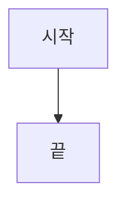

# 통합 배치 계획서 단계별 분할 생성 Implementation Plan

> **For agentic workers:** REQUIRED SUB-SKILL: Use superpowers:subagent-driven-development (recommended) or superpowers:executing-plans to implement this plan task-by-task. Steps use checkbox (`- [ ]`) syntax for tracking.

**Goal:** 통합 배치 계획서의 `## 단계별 이행 상세 및 의사코드`를 단계마다 별도 AI 호출로 나눠 생성해 출력 예산 경쟁을 제거하고, 단계별 하한을 기계적으로 검사·보수한다.

**Architecture:** 목차 수립 단계가 산문 목차와 함께 구조화된 단계 목록(JSON)을 낸다. 그 목록을 파싱해 (1) 골격 1회 호출, (2) 단계마다 1회 호출, (3) 결정적 조립으로 문서를 만든다. 각 단계 섹션은 생성 직후 `MechanicalValidator.ValidateBatchStep`으로 하한을 검사하고 미달이면 그 단계만 1회 재시도한다. L2 Critic은 결함 단계를 `DefectiveSteps` JSON 필드로 지목하고, 다음 회차는 골격과 나머지 단계를 재사용한 채 지목된 단계만 다시 뽑는다. JSON 파싱이 실패하면 현행 단일 호출 경로로 폴백한다.

**Tech Stack:** C# / .NET 10, xUnit, NSubstitute, Markdig, System.Text.Json, Serilog

**Spec:** `docs/superpowers/specs/2026-08-06-batch-plan-step-split-design.md`

## Global Constraints

- 대상 프레임워크 `net10.0`, `<Nullable>enable</Nullable>`, `<ImplicitUsings>enable</ImplicitUsings>`.
- AI 프롬프트 본문은 **영문**으로 작성한다 (AGENTS.md 하이브리드 영문 프롬프트 규칙). 코드 주석·로그·사용자 노출 문자열은 한국어.
- 취소 가능한 `await`를 감싸는 모든 `catch`에 `when (ex is not OperationCanceledException)` 필터를 단다. `CancellationPolicyTests`가 Roslyn 구문 트리로 자동 검사한다.
- `MaxL2Attempts`(기본 2 → 총 3회 시도), `BestAttempt`, `RetryRescue`, `StructureRedraftPolicy`, `VerificationOutcome` enum은 **변경하지 않는다**.
- 새 설정 키를 추가하지 않는다. 단계 재시도 1회와 `MaxSteps = 40`은 하드코딩한다.
- `raw/PlanStructure.md`는 파이프라인이 종료하거나 문서를 사용자에게 건네는 모든 지점에서 그 산출물을 실제로 만든 목차를 담아야 한다. 단계 목록 JSON은 이 파일 **안에** 두어 이 계약을 자동 충족시킨다.
- 착수 시점 실측값: `dotnet clean && dotnet build` 경고 **8건**(`DbMetadataServiceTests`의 CS8600/CS8602), `dotnet test` **667건** 통과.
- 기존 `ReSet.Cli`의 `BatchStepCatalog`와 이름이 비슷하지만 무관하다. 그쪽은 디스크에서 명세 파일을 찾는 CLI 도우미이고, 이 계획의 `BatchStepPlan`은 `ReSet.Core.Services`의 목차 계약 객체다.

---

## File Structure

**신규 파일**

| 파일 | 책임 |
|---|---|
| `src/ReSet.Core/Services/BatchStepPlan.cs` | 단계 계약 레코드 `BatchStepPlan` + 목차 JSON 파서 `BatchStepPlanParser` |
| `src/ReSet.Core/Services/BatchPlanAssembler.cs` | 골격에서 공통 규약 추출, 골격 + 단계 섹션 결정적 조립 |
| `tests/ReSet.Core.Tests/BatchStepPlanParserTests.cs` | 파서 단위 테스트 |
| `tests/ReSet.Core.Tests/BatchPlanAssemblerTests.cs` | 조립기 단위 테스트 |

**수정 파일**

| 파일 | 변경 |
|---|---|
| `src/ReSet.Core/Services/MechanicalValidator.cs` | `StepValidationResult` 타입 + `ValidateBatchStep` 메서드 |
| `src/ReSet.Core/Services/IAiService.cs` | `GenerateBatchStepSectionAsync`, `GenerateBatchPlanSkeletonAsync` 선언, `ReviewResult.DefectiveSteps` |
| `src/ReSet.Core/Services/AiService.cs` | 규칙 블록 상수 추출, 두 신규 메서드 구현, 목차·Critic 프롬프트 수정, `ParseReviewResult` 확장 |
| `src/ReSet.Core/Services/VerificationBanner.cs` | `StepFloorViolations` 배너 |
| `src/ReSet.Core/Services/VerificationPipelineOrchestrator.cs` | 분할 생성 배선, 단계 재시도, 지목 재생성, 배너 부착 |
| `tests/ReSet.Core.Tests/MechanicalValidatorTests.cs` | `ValidateBatchStep` 테스트 |
| `tests/ReSet.Core.Tests/AiServiceTests.cs` | 프롬프트 계약 테스트 |
| `tests/ReSet.Core.Tests/VerificationPipelineOrchestratorTests.cs` | 파이프라인 통합 테스트 |
| `README.md`, `AGENTS.md`, `docs/architecture.md` | 문서 동기화 |

---

## Task 1: 단계 계약 레코드와 목차 JSON 파서

**Files:**
- Create: `src/ReSet.Core/Services/BatchStepPlan.cs`
- Test: `tests/ReSet.Core.Tests/BatchStepPlanParserTests.cs`

**Interfaces:**
- Consumes: 없음 (순수 함수)
- Produces:
  - `public sealed record BatchStepPlan(string Code, string Name, IReadOnlyList<string> LegacyProcedures, IReadOnlyList<string> TargetTables, IReadOnlyList<string> ErrorCodes, bool Chunkable)`
  - `public static class BatchStepPlanParser` — `public const int MaxSteps = 40;`, `public static IReadOnlyList<BatchStepPlan>? TryParse(string? planStructureMarkdown)` (실패 시 `null`)

- [ ] **Step 1: 실패 테스트 작성**

`tests/ReSet.Core.Tests/BatchStepPlanParserTests.cs`:

```csharp
using System.Collections.Generic;
using ReSet.Core.Services;
using Xunit;

namespace ReSet.Core.Tests
{
    public class BatchStepPlanParserTests
    {
        private const string ValidBlock = @"## 목차

본문 산문이 앞에 온다.

```json
{
  ""Steps"": [
    {
      ""Code"": ""S01"",
      ""Name"": ""일별 계약 수수료율 스냅샷"",
      ""LegacyProcedures"": [""UP_Util_PG_Client_CMRate_Ins""],
      ""TargetTables"": [""dbo.TPGSettleRate""],
      ""ErrorCodes"": [""-1"", ""-2""],
      ""Chunkable"": false
    },
    {
      ""Code"": ""S02"",
      ""Name"": ""기본 정산 원장 생성"",
      ""LegacyProcedures"": [""UP_UTIL_SETTLE_INS""],
      ""TargetTables"": [""dbo.TSettleMst""],
      ""ErrorCodes"": [""-1""],
      ""Chunkable"": true
    }
  ]
}
```

뒤에도 산문이 있다.";

        [Fact]
        public void TryParse_WithValidStepsBlock_ReturnsStepsInOrder()
        {
            var steps = BatchStepPlanParser.TryParse(ValidBlock);

            Assert.NotNull(steps);
            Assert.Equal(2, steps!.Count);
            Assert.Equal("S01", steps[0].Code);
            Assert.Equal("기본 정산 원장 생성", steps[1].Name);
            Assert.Equal(new[] { "dbo.TSettleMst" }, steps[1].TargetTables);
            Assert.Equal(new[] { "-1", "-2" }, steps[0].ErrorCodes);
            Assert.False(steps[0].Chunkable);
            Assert.True(steps[1].Chunkable);
        }

        [Fact]
        public void TryParse_WithNoJsonBlock_ReturnsNull()
        {
            Assert.Null(BatchStepPlanParser.TryParse("## 목차\n산문만 있다."));
        }

        [Fact]
        public void TryParse_WithMalformedJson_ReturnsNull()
        {
            Assert.Null(BatchStepPlanParser.TryParse("```json\n{ \"Steps\": [ }\n```"));
        }

        [Fact]
        public void TryParse_WithEmptyStepsArray_ReturnsNull()
        {
            Assert.Null(BatchStepPlanParser.TryParse("```json\n{ \"Steps\": [] }\n```"));
        }

        [Fact]
        public void TryParse_WithMoreThanMaxSteps_ReturnsNull()
        {
            var items = new List<string>();
            for (int i = 0; i <= BatchStepPlanParser.MaxSteps; i++)
            {
                items.Add($"{{ \"Code\": \"S{i:D2}\", \"Name\": \"n{i}\" }}");
            }
            var markdown = "```json\n{ \"Steps\": [" + string.Join(",", items) + "] }\n```";

            Assert.Null(BatchStepPlanParser.TryParse(markdown));
        }

        [Fact]
        public void TryParse_WithStepMissingCode_ReturnsNull()
        {
            Assert.Null(BatchStepPlanParser.TryParse(
                "```json\n{ \"Steps\": [ { \"Name\": \"이름만 있다\" } ] }\n```"));
        }

        [Fact]
        public void TryParse_SkipsUnrelatedJsonBlockAndFindsStepsBlock()
        {
            var markdown = "```json\n{ \"Unrelated\": 1 }\n```\n\n" +
                "```json\n{ \"Steps\": [ { \"Code\": \"S01\", \"Name\": \"첫 단계\" } ] }\n```";

            var steps = BatchStepPlanParser.TryParse(markdown);

            Assert.NotNull(steps);
            Assert.Single(steps!);
            Assert.Equal("S01", steps![0].Code);
        }

        [Fact]
        public void TryParse_WithMissingOptionalArrays_ReturnsEmptyCollections()
        {
            var steps = BatchStepPlanParser.TryParse(
                "```json\n{ \"Steps\": [ { \"Code\": \"S01\", \"Name\": \"첫 단계\" } ] }\n```");

            Assert.NotNull(steps);
            Assert.Empty(steps![0].TargetTables);
            Assert.Empty(steps[0].ErrorCodes);
            Assert.Empty(steps[0].LegacyProcedures);
        }
    }
}
```

- [ ] **Step 2: 테스트가 실패하는지 확인**

Run: `dotnet test tests/ReSet.Core.Tests --filter "FullyQualifiedName~BatchStepPlanParserTests"`
Expected: 컴파일 실패 — `BatchStepPlanParser` 형식을 찾을 수 없음

- [ ] **Step 3: 구현**

`src/ReSet.Core/Services/BatchStepPlan.cs`:

```csharp
using System;
using System.Collections.Generic;
using System.Text.Json;
using System.Text.RegularExpressions;
using Serilog;

namespace ReSet.Core.Services
{
    /// <summary>
    /// 목차(PlanStructure)가 선언하는 통합 배치 단계 하나.
    ///
    /// 이 레코드가 존재하는 이유: 목차의 헤딩을 파싱해서는 단계 목록을 얻을 수 없다.
    /// 실측한 두 산출물이 이미 반증한다 — 한쪽은 단계를 H3(`### P00.`)에, 다른 쪽은
    /// H4(`#### S00.`)에 뒀고, 후자는 단계가 아닌 헤딩(`#### Phase 1.`)을 같은 레벨에
    /// 섞었다. 결정적으로 전자는 `### P20~P23.`으로 4개 단계를 헤딩 하나에 묶었다.
    ///
    /// 세 가지로 쓰인다: 분할 생성의 단위, 하한 검사의 기준(TargetTables/ErrorCodes),
    /// L2가 결함을 지목할 때의 좌표(Code).
    /// </summary>
    public sealed record BatchStepPlan(
        string Code,
        string Name,
        IReadOnlyList<string> LegacyProcedures,
        IReadOnlyList<string> TargetTables,
        IReadOnlyList<string> ErrorCodes,
        bool Chunkable);

    /// <summary>
    /// `raw/PlanStructure.md` 안의 ```json 블록에서 단계 목록을 읽는다.
    ///
    /// 별도 파일로 빼지 않는 이유: PlanStructure.md가 산출물을 실제로 만든 목차를
    /// 담아야 한다는 계약이 이미 있고, 파일이 둘이면 재수립·구제 채택 시 두 파일의
    /// 원자성을 따로 보장해야 한다. 한 파일 안에 있으면 목차를 되돌리는 것만으로
    /// 단계 목록도 함께 되돌아간다.
    ///
    /// 실패는 예외가 아니라 null이다. 분할은 개선이지 필수 단계가 아니므로,
    /// 파싱하지 못하면 호출부가 현행 단일 호출 경로로 폴백한다.
    /// </summary>
    public static class BatchStepPlanParser
    {
        /// <summary>단계 수 상한. 목차가 폭주했을 때 호출을 무제한 늘리지 않기 위한 방어선이다.</summary>
        public const int MaxSteps = 40;

        // 닫는 펜스까지를 통째로 잡는다. 비탐욕 `\{.*?\}`로 잡으면 중첩 객체의
        // 첫 번째 `}`에서 끊겨 항상 파싱에 실패한다.
        private static readonly Regex JsonBlockRegex = new(
            @"```json\s*\r?\n(?<body>.*?)```",
            RegexOptions.Singleline | RegexOptions.Compiled);

        public static IReadOnlyList<BatchStepPlan>? TryParse(string? planStructureMarkdown)
        {
            if (string.IsNullOrWhiteSpace(planStructureMarkdown))
            {
                return null;
            }

            foreach (Match match in JsonBlockRegex.Matches(planStructureMarkdown))
            {
                var parsed = TryParseBlock(match.Groups["body"].Value);
                if (parsed != null)
                {
                    Log.Information("목차에서 단계 목록을 읽었습니다 - 단계 수: {Count}개", parsed.Count);
                    return parsed;
                }
            }

            Log.Warning("목차에서 유효한 단계 목록 JSON을 찾지 못했습니다. 분할 생성을 건너뜁니다.");
            return null;
        }

        private static IReadOnlyList<BatchStepPlan>? TryParseBlock(string json)
        {
            try
            {
                using var document = JsonDocument.Parse(json);
                if (!document.RootElement.TryGetProperty("Steps", out var stepsProperty) ||
                    stepsProperty.ValueKind != JsonValueKind.Array)
                {
                    return null;
                }

                var steps = new List<BatchStepPlan>();
                foreach (var element in stepsProperty.EnumerateArray())
                {
                    var code = ReadString(element, "Code");
                    var name = ReadString(element, "Name");

                    // Code나 Name이 없으면 그 단계를 특정할 수도, 헤딩을 검사할 수도 없다.
                    // 일부만 성한 목록을 쓰면 어느 단계가 누락됐는지 아무도 모른다.
                    if (string.IsNullOrWhiteSpace(code) || string.IsNullOrWhiteSpace(name))
                    {
                        Log.Warning("단계 목록에 Code 또는 Name이 없는 항목이 있어 전체를 버립니다.");
                        return null;
                    }

                    steps.Add(new BatchStepPlan(
                        code.Trim(),
                        name.Trim(),
                        ReadStringArray(element, "LegacyProcedures"),
                        ReadStringArray(element, "TargetTables"),
                        ReadStringArray(element, "ErrorCodes"),
                        element.TryGetProperty("Chunkable", out var chunkable) &&
                            chunkable.ValueKind == JsonValueKind.True));
                }

                if (steps.Count == 0 || steps.Count > MaxSteps)
                {
                    Log.Warning("단계 목록 개수가 허용 범위를 벗어났습니다 - 개수: {Count}개, 상한: {Max}개",
                        steps.Count, MaxSteps);
                    return null;
                }

                return steps;
            }
            catch (JsonException)
            {
                return null;
            }
        }

        private static string ReadString(JsonElement element, string propertyName) =>
            element.TryGetProperty(propertyName, out var property) &&
            property.ValueKind == JsonValueKind.String
                ? property.GetString() ?? string.Empty
                : string.Empty;

        private static IReadOnlyList<string> ReadStringArray(JsonElement element, string propertyName)
        {
            if (!element.TryGetProperty(propertyName, out var property) ||
                property.ValueKind != JsonValueKind.Array)
            {
                return Array.Empty<string>();
            }

            var values = new List<string>();
            foreach (var item in property.EnumerateArray())
            {
                if (item.ValueKind != JsonValueKind.String)
                {
                    continue;
                }

                var text = item.GetString();
                if (!string.IsNullOrWhiteSpace(text))
                {
                    values.Add(text.Trim());
                }
            }

            return values;
        }
    }
}
```

- [ ] **Step 4: 테스트 통과 확인**

Run: `dotnet test tests/ReSet.Core.Tests --filter "FullyQualifiedName~BatchStepPlanParserTests"`
Expected: PASS (8건)

- [ ] **Step 5: 커밋**

```bash
git add src/ReSet.Core/Services/BatchStepPlan.cs tests/ReSet.Core.Tests/BatchStepPlanParserTests.cs
git commit -m "feat: read a structured step list out of the plan outline"
```

---

## Task 2: 단계 하한 검사 `ValidateBatchStep`

**Files:**
- Modify: `src/ReSet.Core/Services/MechanicalValidator.cs` (`ValidationResult` 클래스 뒤, 파일 말미)
- Test: `tests/ReSet.Core.Tests/MechanicalValidatorTests.cs` (파일 말미에 추가)

**Interfaces:**
- Consumes: `BatchStepPlan` (Task 1)
- Produces:
  - `public class StepValidationResult` — `bool IsValid`, `List<string> Errors`, `string? SuggestedPromptFix`
  - `MechanicalValidator.ValidateBatchStep(string? stepMarkdown, BatchStepPlan step) → StepValidationResult`

- [ ] **Step 1: 실패 테스트 작성**

`tests/ReSet.Core.Tests/MechanicalValidatorTests.cs` 파일 말미(마지막 `}` 두 개 앞)에 추가:

```csharp
        // ── ValidateBatchStep: 단계 섹션 하한 검사 ─────────────────────────
        //
        // 픽스처는 실제 산출물에서 가져온다. output/jobs/POQSettleProcDaily의
        // S10은 12줄에 코드 블록이 하나도 없어 붕괴한 단계이고, S12는 24줄로 짧지만
        // 자기 조인 SQL과 원본 오류코드를 갖춰 통과해야 하는 단계다. 이 둘을
        // 갈라내지 못하면 검사가 조준되지 않은 것이다.

        private static BatchStepPlan S10Plan() => new(
            "S10", "PG 회수 통계 생성",
            new[] { "UP_UTIL_STAT_PGCOLLECT_INS" },
            new[] { "dbo.TStatPGCollect", "dbo.TSettleMst" },
            new[] { "-1" },
            Chunkable: false);

        private const string S10CollapsedSection = @"### 14. S10 PG 회수 통계 생성

`S10`은 `TSettleMst`, `TTArsPGCollect`, `TBArsPGCollect`를 `UNION ALL`로 결합한다.

- `TSettleMst`: `INYMD = @pi_strYMD AND INSTATE = 1`
- 고객사, PG, MallID는 소문자 변환 후 집계

복잡한 `UNION ALL` 집계이므로 chunking하지 않고 `TStatPGCollect`에 대한 Single-Transaction Shadow Swap을 사용한다. 오류코드 `-1`을 보존한다.";

        private const string S10HealthySection = @"### 14. S10 PG 회수 통계 생성

`S10`은 `TStatPGCollect`를 재생성한다. `TSettleMst`가 원천이다.

```sql
SET XACT_ABORT ON;
DECLARE @v_currentStepId int = -1;
INSERT INTO dbo.TStatPGCollect SELECT 1;
```";

        [Fact]
        public void ValidateBatchStep_WithCodeBlockAndAllTokens_IsValid()
        {
            var result = _validator.ValidateBatchStep(S10HealthySection, S10Plan());

            Assert.True(result.IsValid, string.Join(" / ", result.Errors));
            Assert.Null(result.SuggestedPromptFix);
        }

        [Fact]
        public void ValidateBatchStep_WithoutCodeBlock_Fails()
        {
            var result = _validator.ValidateBatchStep(S10CollapsedSection, S10Plan());

            Assert.False(result.IsValid);
            Assert.Contains(result.Errors, e => e.Contains("의사코드 블록이 없습니다"));
            Assert.NotNull(result.SuggestedPromptFix);
        }

        [Fact]
        public void ValidateBatchStep_WithBareTableName_SatisfiesQualifiedRequirement()
        {
            // 실제 문서는 같은 테이블을 dbo.TSettleMst와 TSettleMst로 섞어 쓴다.
            // 접두사까지 포함해 대조하면 정상 문서가 실패한다.
            var section = "### S02 기본 정산 원장 생성\n\n본문은 TSettleMst만 적었다. 오류코드 -1.\n\n```sql\nSELECT 1;\n```";
            var plan = new BatchStepPlan("S02", "기본 정산 원장 생성",
                new[] { "UP_UTIL_SETTLE_INS" }, new[] { "dbo.TSettleMst" }, new[] { "-1" }, false);

            var result = _validator.ValidateBatchStep(section, plan);

            Assert.True(result.IsValid, string.Join(" / ", result.Errors));
        }

        [Fact]
        public void ValidateBatchStep_WithErrorCodeSubstringOnly_Fails()
        {
            // -1을 요구하는데 본문에 -10만 있으면 실패해야 한다. 부분 문자열 대조로
            // 회귀하면 -1이 -10 안에서 걸려 이 검사가 통째로 무력해진다.
            var section = "### S08 회수일 산정\n\n대상은 TSettleMst이고 오류코드는 -10뿐이다.\n\n```sql\nSELECT 1;\n```";
            var plan = new BatchStepPlan("S08", "회수일 산정",
                new[] { "UP_UTIL_SETTLE_EXPECT_PROC" }, new[] { "dbo.TSettleMst" }, new[] { "-1" }, false);

            var result = _validator.ValidateBatchStep(section, plan);

            Assert.False(result.IsValid);
            Assert.Contains(result.Errors, e => e.Contains("-1"));
        }

        [Fact]
        public void ValidateBatchStep_WithMissingTargetTable_Fails()
        {
            var section = "### S10 PG 회수 통계 생성\n\nTStatPGCollect만 적었다. 오류코드 -1.\n\n```sql\nSELECT 1;\n```";

            var result = _validator.ValidateBatchStep(section, S10Plan());

            Assert.False(result.IsValid);
            Assert.Contains(result.Errors, e => e.Contains("TSettleMst"));
        }

        [Fact]
        public void ValidateBatchStep_WithWrongHeading_Fails()
        {
            var section = "## S10 PG 회수 통계 생성\n\nTStatPGCollect와 TSettleMst. 오류코드 -1.\n\n```sql\nSELECT 1;\n```";

            var result = _validator.ValidateBatchStep(section, S10Plan());

            Assert.False(result.IsValid);
            Assert.Contains(result.Errors, e => e.Contains("헤딩"));
        }

        [Fact]
        public void ValidateBatchStep_WithHeadingMissingStepCode_Fails()
        {
            var section = "### PG 회수 통계 생성\n\nTStatPGCollect와 TSettleMst. 오류코드 -1.\n\n```sql\nSELECT 1;\n```";

            var result = _validator.ValidateBatchStep(section, S10Plan());

            Assert.False(result.IsValid);
        }

        [Fact]
        public void ValidateBatchStep_WithEmptyMarkdown_Fails()
        {
            var result = _validator.ValidateBatchStep("", S10Plan());

            Assert.False(result.IsValid);
            Assert.Contains(result.Errors, e => e.Contains("비어있습니다"));
        }
```

- [ ] **Step 2: 테스트가 실패하는지 확인**

Run: `dotnet test tests/ReSet.Core.Tests --filter "FullyQualifiedName~MechanicalValidatorTests"`
Expected: 컴파일 실패 — `ValidateBatchStep` 메서드 없음

- [ ] **Step 3: 구현**

`src/ReSet.Core/Services/MechanicalValidator.cs`의 `ValidateConsolidated` 메서드(현재 108~143행) **바로 뒤**에 추가:

```csharp
        /// <summary>
        /// 단계 섹션 하나가 구현 지시서로서의 최소 요건을 갖췄는지 검사한다.
        ///
        /// 이 검사가 필요한 이유: 실측한 산출물에서 L2가 88점을 준 문서의 S10이
        /// 12줄이고 코드 블록이 하나도 없었다. 문서 레벨 L1은 H2 4개 존재만 보고,
        /// L2는 12개 프로시저의 오류코드를 전수 대조하지 못한다. 문자열 대조는
        /// 기계의 일인데 지금까지 기계가 그 일을 하지 않았다.
        ///
        /// AI 호출이 없으므로 비용이 0이다. 단계마다 돌려도 무료다.
        /// </summary>
        public StepValidationResult ValidateBatchStep(string? stepMarkdown, BatchStepPlan step)
        {
            var result = new StepValidationResult();

            if (string.IsNullOrWhiteSpace(stepMarkdown))
            {
                result.Errors.Add($"{step.Code} 섹션 내용이 비어있습니다.");
                result.IsValid = false;
                return result;
            }

            var firstLine = FirstNonEmptyLine(stepMarkdown);
            if (!firstLine.StartsWith("### ", StringComparison.Ordinal))
            {
                result.Errors.Add($"{step.Code} 섹션이 '### ' 헤딩으로 시작하지 않습니다.");
            }
            else if (firstLine.IndexOf(step.Code, StringComparison.OrdinalIgnoreCase) < 0)
            {
                result.Errors.Add($"{step.Code} 섹션의 헤딩에 단계 코드가 없습니다: \"{firstLine}\"");
            }

            // 펜스는 열고 닫으므로 2개 미만이면 블록이 하나도 없다는 뜻이다.
            if (Regex.Matches(stepMarkdown, @"(?m)^\s*```").Count < 2)
            {
                result.Errors.Add($"{step.Code} 섹션에 SQL 또는 의사코드 블록이 없습니다.");
            }

            foreach (var table in step.TargetTables)
            {
                var bareName = BareObjectName(table);
                if (bareName.Length == 0)
                {
                    continue;
                }

                if (!ContainsToken(stepMarkdown, bareName))
                {
                    result.Errors.Add($"{step.Code} 섹션에 대상 테이블 '{table}'이 등장하지 않습니다.");
                }
            }

            foreach (var errorCode in step.ErrorCodes)
            {
                if (string.IsNullOrWhiteSpace(errorCode))
                {
                    continue;
                }

                if (!ContainsToken(stepMarkdown, errorCode.Trim()))
                {
                    result.Errors.Add($"{step.Code} 섹션에 원본 오류코드 '{errorCode}'가 등장하지 않습니다.");
                }
            }

            result.IsValid = result.Errors.Count == 0;
            return result;
        }

        private static string FirstNonEmptyLine(string markdown)
        {
            foreach (var line in markdown.Split('\n'))
            {
                var trimmed = line.Trim();
                if (trimmed.Length > 0)
                {
                    return trimmed;
                }
            }

            return string.Empty;
        }

        /// <summary>
        /// 스키마·DB 접두사를 뗀 이름. `SETTLE_POQ_DB.dbo.TSettleMst` → `TSettleMst`.
        /// 실제 문서가 같은 테이블을 접두사 있이/없이 섞어 쓰므로 접두사까지
        /// 대조하면 정상 문서가 실패한다.
        /// </summary>
        private static string BareObjectName(string qualifiedName)
        {
            var trimmed = (qualifiedName ?? string.Empty).Trim().Trim('[', ']');
            var lastDot = trimmed.LastIndexOf('.');
            return (lastDot >= 0 ? trimmed[(lastDot + 1)..] : trimmed).Trim('[', ']').Trim();
        }

        /// <summary>
        /// 단어 경계 대조.
        ///
        /// 단순 부분 문자열 대조로 하면 `-1`이 `-10`·`-13` 안에서 걸려 오류코드
        /// 검사가 통째로 무력해진다. 실제로 S08의 오류코드가 -1부터 -17까지
        /// 11개라 정확히 이 함정에 빠진다.
        /// </summary>
        private static bool ContainsToken(string haystack, string token)
        {
            if (token.Length == 0)
            {
                return true;
            }

            return Regex.IsMatch(
                haystack,
                $@"(?<!\w){Regex.Escape(token)}(?!\w)",
                RegexOptions.IgnoreCase);
        }
```

**실제 구현은 `RegexOptions.IgnoreCase | RegexOptions.ECMAScript`를 쓴다(`MechanicalValidator.cs`).** .NET 기본 유니코드 `\w`는 한글을 단어 문자로 취급하므로, 테이블명이나 오류코드 바로 뒤에 한글 조사가 붙으면(`dbo.T1이`, `-1을`) `(?!\w)` 경계가 실패해 정상 문서가 하한 미달로 오판된다. `ECMAScript` 옵션은 `\w`를 ASCII(`[a-zA-Z0-9_]`)로 좁혀 한글 조사를 경계로 인식하게 한다.

같은 파일의 `ValidationResult` 클래스 **뒤**(현재 507행 `}` 이후, 네임스페이스 닫기 전)에 추가:

```csharp
    /// <summary>
    /// 단계 섹션 하한 검사 결과.
    ///
    /// ValidationResult를 재사용하지 않는 이유: 그 타입의 SuggestedPromptFix는
    /// 문서 전체의 H2 템플릿을 제안하도록 만들어져 있어, 단계 섹션 하나를 고치라는
    /// 지시에는 엉뚱한 교정 가이드가 붙는다.
    /// </summary>
    public class StepValidationResult
    {
        public bool IsValid { get; set; }
        public List<string> Errors { get; set; } = new();

        public string? SuggestedPromptFix
        {
            get
            {
                if (IsValid)
                {
                    return null;
                }

                var builder = new System.Text.StringBuilder();
                builder.AppendLine("[L1 Step Floor Check]: This step section does not meet the minimum requirements for an implementation instruction. Rewrite the WHOLE section, resolving every item below.");
                foreach (var error in Errors)
                {
                    builder.AppendLine($"  - {error}");
                }

                return builder.ToString();
            }
        }
    }
```

- [ ] **Step 4: 테스트 통과 확인**

Run: `dotnet test tests/ReSet.Core.Tests --filter "FullyQualifiedName~MechanicalValidatorTests"`
Expected: PASS (기존분 + 신규 8건)

- [ ] **Step 5: 커밋**

```bash
git add src/ReSet.Core/Services/MechanicalValidator.cs tests/ReSet.Core.Tests/MechanicalValidatorTests.cs
git commit -m "feat: enforce a mechanical floor on each batch step section"
```

---

## Task 3: 골격·단계 섹션 조립기

**Files:**
- Create: `src/ReSet.Core/Services/BatchPlanAssembler.cs`
- Test: `tests/ReSet.Core.Tests/BatchPlanAssemblerTests.cs`

**Interfaces:**
- Consumes: 없음 (순수 함수)
- Produces: `public static class BatchPlanAssembler`
  - `public const string StepDetailHeader = "## 단계별 이행 상세 및 의사코드";`
  - `public static string ExtractSharedConventions(string? skeletonMarkdown)`
  - `public static string Assemble(string? skeletonMarkdown, IReadOnlyList<string> stepSections)`

- [ ] **Step 1: 실패 테스트 작성**

`tests/ReSet.Core.Tests/BatchPlanAssemblerTests.cs`:

```csharp
using ReSet.Core.Services;
using Xunit;

namespace ReSet.Core.Tests
{
    public class BatchPlanAssemblerTests
    {
        private const string Skeleton = @"# 계획서

## 통합 배치 아키텍처 개요

개요 본문.

## Mermaid 기반 통합 흐름도

흐름도 본문.

## 단계별 이행 상세 및 의사코드

### 공통 SQL 오류 추적 패턴

공통 규약 본문.

<!-- STEP:S01 -->
<!-- STEP:S02 -->

## 통합 데이터 정합성 검증 SQL 세트

검증 SQL 본문.";

        [Fact]
        public void Assemble_InsertsSectionsBeforeNextH2()
        {
            var result = BatchPlanAssembler.Assemble(
                Skeleton,
                new[] { "### S01 첫 단계\n\n본문1", "### S02 둘째 단계\n\n본문2" });

            var s01 = result.IndexOf("### S01 첫 단계");
            var s02 = result.IndexOf("### S02 둘째 단계");
            var validation = result.IndexOf("## 통합 데이터 정합성 검증 SQL 세트");
            var conventions = result.IndexOf("### 공통 SQL 오류 추적 패턴");

            Assert.True(conventions < s01, "공통 규약이 단계보다 앞에 와야 한다");
            Assert.True(s01 < s02, "단계는 목록 순서를 지켜야 한다");
            Assert.True(s02 < validation, "단계는 다음 H2 앞에 삽입돼야 한다");
        }

        [Fact]
        public void Assemble_StripsStepPlaceholders()
        {
            var result = BatchPlanAssembler.Assemble(Skeleton, new[] { "### S01 첫 단계\n\n본문1" });

            Assert.DoesNotContain("<!-- STEP:", result);
        }

        [Fact]
        public void Assemble_WithoutStepDetailHeader_AppendsHeaderAndSections()
        {
            var result = BatchPlanAssembler.Assemble(
                "# 계획서\n\n## 통합 배치 아키텍처 개요\n\n개요.",
                new[] { "### S01 첫 단계\n\n본문1" });

            Assert.Contains(BatchPlanAssembler.StepDetailHeader, result);
            Assert.Contains("### S01 첫 단계", result);
        }

        [Fact]
        public void Assemble_WithNoSections_ReturnsSkeletonWithoutPlaceholders()
        {
            var result = BatchPlanAssembler.Assemble(Skeleton, new string[0]);

            Assert.DoesNotContain("<!-- STEP:", result);
            Assert.Contains("### 공통 SQL 오류 추적 패턴", result);
            Assert.DoesNotContain("### S01", result);
        }

        [Fact]
        public void ExtractSharedConventions_ReturnsOnlyStepDetailBody()
        {
            var conventions = BatchPlanAssembler.ExtractSharedConventions(Skeleton);

            Assert.Contains("### 공통 SQL 오류 추적 패턴", conventions);
            Assert.Contains("공통 규약 본문.", conventions);
            Assert.DoesNotContain("검증 SQL 본문.", conventions);
            Assert.DoesNotContain("개요 본문.", conventions);
            Assert.DoesNotContain("<!-- STEP:", conventions);
        }

        [Fact]
        public void ExtractSharedConventions_WithoutHeader_ReturnsEmpty()
        {
            Assert.Equal(string.Empty, BatchPlanAssembler.ExtractSharedConventions("# 계획서\n\n본문만."));
        }
    }
}
```

- [ ] **Step 2: 테스트가 실패하는지 확인**

Run: `dotnet test tests/ReSet.Core.Tests --filter "FullyQualifiedName~BatchPlanAssemblerTests"`
Expected: 컴파일 실패 — `BatchPlanAssembler` 형식을 찾을 수 없음

- [ ] **Step 3: 구현**

`src/ReSet.Core/Services/BatchPlanAssembler.cs`:

```csharp
using System;
using System.Collections.Generic;
using System.Linq;
using System.Text.RegularExpressions;

namespace ReSet.Core.Services
{
    /// <summary>
    /// 골격 문서와 단계별 섹션을 하나의 계획서로 합친다.
    ///
    /// 조립은 모델이 넣은 자리표시자의 위치를 신뢰하지 않는다. 자리표시자가
    /// 빠지거나 순서가 틀려도 조립이 깨지지 않도록, 목록 순서대로 `## 단계별
    /// 이행 상세 및 의사코드` 블록 끝에 결정적으로 덧붙이고 자리표시자는 지운다.
    /// 프롬프트가 자리표시자를 요구하는 것은 모델이 단계 본문까지 써 버리는 것을
    /// 막기 위해서지, 조립이 그것에 의존하기 때문이 아니다.
    /// </summary>
    public static class BatchPlanAssembler
    {
        public const string StepDetailHeader = "## 단계별 이행 상세 및 의사코드";

        private static readonly Regex StepPlaceholderRegex = new(
            @"(?m)^[ \t]*<!--\s*STEP:[^>]*-->[ \t]*\r?\n?",
            RegexOptions.Compiled);

        /// <summary>
        /// 골격의 `## 단계별 이행 상세 및 의사코드` 본문(공통 규약 소절들)만 뽑는다.
        /// 단계별 호출에 그대로 실어, 13개 단계가 서로 다른 오류 처리 관례를
        /// 선언하는 일을 막는다.
        /// </summary>
        public static string ExtractSharedConventions(string? skeletonMarkdown)
        {
            var lines = Normalize(skeletonMarkdown);
            var (headerIndex, endIndex) = LocateStepDetailBlock(lines);
            if (headerIndex < 0)
            {
                return string.Empty;
            }

            return string.Join("\n", lines.Skip(headerIndex + 1).Take(endIndex - headerIndex - 1)).Trim();
        }

        public static string Assemble(string? skeletonMarkdown, IReadOnlyList<string> stepSections)
        {
            var sections = (stepSections ?? Array.Empty<string>())
                .Where(section => !string.IsNullOrWhiteSpace(section))
                .Select(section => section.Trim())
                .ToList();

            var lines = Normalize(skeletonMarkdown);
            if (sections.Count == 0)
            {
                return string.Join("\n", lines);
            }

            var body = string.Join("\n\n", sections);
            var (headerIndex, endIndex) = LocateStepDetailBlock(lines);

            // 골격이 H2를 빠뜨렸더라도 단계 본문을 잃지 않는다. 문서 레벨 L1이
            // 그 누락을 별도로 잡으므로 여기서 조용히 버리면 안 된다.
            if (headerIndex < 0)
            {
                return string.Join("\n", lines).TrimEnd() + "\n\n" + StepDetailHeader + "\n\n" + body + "\n";
            }

            var merged = new List<string>(lines);
            merged.InsertRange(endIndex, new[] { string.Empty }.Concat(body.Split('\n')).Append(string.Empty));
            return string.Join("\n", merged);
        }

        private static List<string> Normalize(string? markdown)
        {
            var stripped = StepPlaceholderRegex.Replace(markdown ?? string.Empty, string.Empty);
            return stripped.Replace("\r\n", "\n").Split('\n').ToList();
        }

        /// <summary>
        /// 단계 상세 H2의 헤더 줄 인덱스와, 그 블록이 끝나는(= 다음 H2가 시작하는)
        /// 인덱스를 돌려준다. 헤더가 없으면 (-1, -1).
        /// </summary>
        private static (int HeaderIndex, int EndIndex) LocateStepDetailBlock(List<string> lines)
        {
            var headerIndex = lines.FindIndex(line => line.Trim() == StepDetailHeader);
            if (headerIndex < 0)
            {
                return (-1, -1);
            }

            // "### "는 인덱스 2가 '#'이라 StartsWith("## ")에 걸리지 않는다.
            var endIndex = lines.FindIndex(
                headerIndex + 1,
                line => line.TrimStart().StartsWith("## ", StringComparison.Ordinal));

            return (headerIndex, endIndex < 0 ? lines.Count : endIndex);
        }
    }
}
```

- [ ] **Step 4: 테스트 통과 확인**

Run: `dotnet test tests/ReSet.Core.Tests --filter "FullyQualifiedName~BatchPlanAssemblerTests"`
Expected: PASS (6건)

- [ ] **Step 5: 커밋**

```bash
git add src/ReSet.Core/Services/BatchPlanAssembler.cs tests/ReSet.Core.Tests/BatchPlanAssemblerTests.cs
git commit -m "feat: assemble the plan from a skeleton and per-step sections"
```

---

## Task 4: 목차 프롬프트에 단계 목록 JSON 출력 지시 추가

**Files:**
- Modify: `src/ReSet.Core/Services/AiService.cs:1838-1843` (`DraftBatchPlanStructureAsync`의 `systemPrompt`)
- Test: `tests/ReSet.Core.Tests/AiServiceTests.cs` (기존 `DraftBatchPlanStructureAsync_*` 테스트 뒤)

**Interfaces:**
- Consumes: 없음
- Produces: 목차 응답이 ` ```json ` 블록에 `{"Steps":[...]}` 를 포함하게 됨 (Task 1의 `BatchStepPlanParser.TryParse`가 읽는 형식)

- [ ] **Step 1: 실패 테스트 작성**

`tests/ReSet.Core.Tests/AiServiceTests.cs`의 `DraftBatchPlanStructureAsync_WithPreviousStructure_CarriesRedraftInstructionAndFeedback` (현재 260행에서 끝남) **바로 뒤**에 추가:

```csharp
        // 목차가 단계 목록을 구조화해 내지 않으면 분할 생성이 시작조차 못 한다.
        // 헤딩 파싱은 대안이 아니다 — 실측한 두 목차가 단계를 각각 H3/H4에 뒀고,
        // 한쪽은 `### P20~P23.`으로 4개 단계를 헤딩 하나에 묶었다.
        [Fact]
        public async Task DraftBatchPlanStructureAsync_AlwaysRequestsStructuredStepList()
        {
            var mockResponse = "{\"choices\":[{\"message\":{\"content\":\"## 목차\"}}]}";
            var mockHandler = new MockHttpMessageHandler(mockResponse);
            var httpClient = new HttpClient(mockHandler);
            var client = new OpenAiClient(httpClient, "test_key", "https://api.openai.com/v1", "gpt-4o");
            IAiService service = new AiService(client, 0.2f);

            var result = await service.DraftBatchPlanStructureAsync("brainstorming", "C#", "Test_Job");

            Assert.Contains("```json", result.SystemPrompt);
            Assert.Contains("\"Steps\"", result.SystemPrompt);
            Assert.Contains("TargetTables", result.SystemPrompt);
            Assert.Contains("ErrorCodes", result.SystemPrompt);
        }

        // 재수립 모드에서도 유지돼야 한다. 여기서 빠지면 재수립 이후 회차가
        // 조용히 폴백해 분할이 사라진다.
        [Fact]
        public async Task DraftBatchPlanStructureAsync_RedraftAlsoRequestsStructuredStepList()
        {
            var mockResponse = "{\"choices\":[{\"message\":{\"content\":\"## 목차\"}}]}";
            var mockHandler = new MockHttpMessageHandler(mockResponse);
            var httpClient = new HttpClient(mockHandler);
            var client = new OpenAiClient(httpClient, "test_key", "https://api.openai.com/v1", "gpt-4o");
            IAiService service = new AiService(client, 0.2f);

            var result = await service.DraftBatchPlanStructureAsync(
                "brainstorming", "C#", "Test_Job",
                effort: null,
                previousStructure: "## 낡은 목차",
                redraftFeedback: "스텝 누락");

            Assert.Contains("\"Steps\"", result.SystemPrompt);
            Assert.Contains("[Redraft]", result.SystemPrompt);
        }
```

- [ ] **Step 2: 테스트가 실패하는지 확인**

Run: `dotnet test tests/ReSet.Core.Tests --filter "FullyQualifiedName~AiServiceTests.DraftBatchPlanStructureAsync"`
Expected: FAIL — `Assert.Contains() Failure`, 시스템 프롬프트에 `"Steps"` 없음

- [ ] **Step 3: 구현**

`src/ReSet.Core/Services/AiService.cs`에서 `DraftBatchPlanStructureAsync`의 `systemPrompt` 초기화(1838~1843행)를 아래로 교체한다. 기존 4개 H2 강제 문구는 **한 글자도 바꾸지 않고** 뒤에 블록을 덧붙인다.

```csharp
            var systemPrompt = $@"You are a principal database modernization architect. Based on the previous brainstorming, draft a detailed step-by-step structural plan (Table of Contents and execution flow) for the final '{jobName}' {targetLanguage} batch application document.
You MUST use exactly the following 4 mandatory H2 headers in Korean, and design the detailed sub-headers (H3, H4) beneath them:
1. ## 통합 배치 아키텍처 개요
2. ## Mermaid 기반 통합 흐름도
3. ## 단계별 이행 상세 및 의사코드
4. ## 통합 데이터 정합성 검증 SQL 세트

[Machine-Readable Step List — MANDATORY]
In ADDITION to the prose outline, you MUST emit exactly one fenced ```json block containing the ordered step list. The downstream pipeline generates one document section per entry, so an omitted step is never written at all.

```json
{{
  ""Steps"": [
    {{
      ""Code"": ""S01"",
      ""Name"": ""Short Korean step name"",
      ""LegacyProcedures"": [""UP_SOURCE_PROC""],
      ""TargetTables"": [""dbo.TargetTable""],
      ""ErrorCodes"": [""-1"", ""-2""],
      ""Chunkable"": false
    }}
  ]
}}
```

Rules for the step list:
- One entry per executable step. NEVER collapse several steps into one entry (no `S01~S04` style ranges).
- `Code` must be unique and must also appear in the prose outline heading for that step.
- `TargetTables` must list every table the step creates or modifies, as written in the source specifications.
- `ErrorCodes` must reproduce the EXACT original return codes of the source procedure. Do not invent, remap, or compress them into ranges.
- `Chunkable` is false when the step is an aggregation or cross-DB join that cannot be chunked by a single key.
- Emit the block once. Do not wrap the whole answer in a code block.";
```

**주의**: 이 문자열은 `$@"..."` 보간 문자열이므로 JSON 예시의 중괄호를 `{{`, `}}`로 이스케이프해야 한다. 위 코드는 이미 이스케이프되어 있다. 큰따옴표는 `""`로 이스케이프한다.

재수립 블록(`if (isRedraft)` 안의 `systemPrompt += ...`)은 **수정하지 않는다.** 위 블록이 초기 문자열에 있으므로 재수립 모드에서도 자동으로 유지된다.

- [ ] **Step 4: 테스트 통과 확인**

Run: `dotnet test tests/ReSet.Core.Tests --filter "FullyQualifiedName~AiServiceTests.DraftBatchPlanStructureAsync"`
Expected: PASS (기존 2건 + 신규 2건)

- [ ] **Step 5: 커밋**

```bash
git add src/ReSet.Core/Services/AiService.cs tests/ReSet.Core.Tests/AiServiceTests.cs
git commit -m "feat: make the outline stage emit a machine-readable step list"
```

---

## Task 5: 공통 규칙 블록 상수화 + `GenerateBatchStepSectionAsync`

**Files:**
- Modify: `src/ReSet.Core/Services/IAiService.cs` (인터페이스에 메서드 추가)
- Modify: `src/ReSet.Core/Services/AiService.cs` (규칙 상수 추출 + 신규 메서드)
- Test: `tests/ReSet.Core.Tests/AiServiceTests.cs`

**Interfaces:**
- Consumes: `BatchStepPlan` (Task 1)
- Produces:
```csharp
Task<AiResult> GenerateBatchStepSectionAsync(
    BatchStepPlan step,
    IReadOnlyList<BatchStepPlan> allSteps,
    string sharedConventions,
    List<(string FileName, string Content)> specs,
    string targetLanguage,
    string jobName,
    string? effort = null,
    string? floorFeedback = null,
    CancellationToken cancellationToken = default);
```
  - 반환 `AiResult.Content`는 **H3 섹션 하나**의 마크다운이다 (H2 없음).
  - `floorFeedback`은 프롬프트 **말미**에 붙는다. 캐시 접두사를 깨지 않기 위해서다.
  - **시스템 프롬프트에는 `step`에서 파생된 값이 하나도 들어가지 않는다.** 시스템 메시지는 요청의 맨 앞이므로, 단계마다 달라지면 그 뒤 전부 — 규칙 블록 8,000자와 명세서 수백 KB — 가 매 호출 캐시 미스가 된다. 13단계 기준 입력이 약 110k에서 약 1.4M 토큰으로 뛰어, 분할 설계의 비용 근거 자체가 무너진다. 단계 정체는 user 프롬프트 마지막 줄이 이미 나르므로 정보 손실은 없다. 두 단계의 시스템 프롬프트가 바이트 단위로 같은지 단언하는 테스트가 이 불변식을 지킨다.

- [ ] **Step 1: 실패 테스트 작성**

`tests/ReSet.Core.Tests/AiServiceTests.cs` 파일 말미에 추가:

```csharp
        private static IReadOnlyList<BatchStepPlan> TwoSteps() => new[]
        {
            new BatchStepPlan("S01", "수수료율 스냅샷",
                new[] { "UP_Util_PG_Client_CMRate_Ins" }, new[] { "dbo.TPGSettleRate" }, new[] { "-1" }, false),
            new BatchStepPlan("S02", "정산 원장 생성",
                new[] { "UP_UTIL_SETTLE_INS" }, new[] { "dbo.TSettleMst" }, new[] { "-2" }, true)
        };

        private static IAiService StepService()
        {
            var mockResponse = "{\"choices\":[{\"message\":{\"content\":\"### S01 수수료율 스냅샷\"}}]}";
            var httpClient = new HttpClient(new MockHttpMessageHandler(mockResponse));
            return new AiService(new OpenAiClient(httpClient, "test_key", "https://api.openai.com/v1", "gpt-4o"), 0.2f);
        }

        [Fact]
        public async Task GenerateBatchStepSectionAsync_CarriesStepContract()
        {
            var specs = new System.Collections.Generic.List<(string FileName, string Content)>
            {
                ("dbo.UP_UTIL_SETTLE_INS", "## 개요\n원장 생성")
            };
            var steps = TwoSteps();

            var result = await StepService().GenerateBatchStepSectionAsync(
                steps[1], steps, "공통 규약 본문", specs, "C#", "Test_Job");

            Assert.Contains("S02", result.UserPrompt);
            Assert.Contains("공통 규약 본문", result.UserPrompt);
            Assert.Contains("dbo.TSettleMst", result.UserPrompt);
            // 단계 하나만 쓰라는 계약이 시스템 프롬프트에 있어야 한다.
            Assert.Contains("ONE step section", result.SystemPrompt);
            // 문서 전체 규칙(오류코드 원본 재사용 등)도 함께 실려야 한다.
            Assert.Contains("[Required Content & Rules]", result.SystemPrompt);
        }

        // 접두사가 갈라지면 프롬프트 캐시가 매 단계 미스가 되어 분할 비용이 N배로 뛴다.
        // 이 테스트가 그 회귀를 막는 유일한 장치다.
        [Fact]
        public async Task GenerateBatchStepSectionAsync_KeepsIdenticalPromptPrefixAcrossSteps()
        {
            var specs = new System.Collections.Generic.List<(string FileName, string Content)>
            {
                ("dbo.UP_UTIL_SETTLE_INS", "## 개요\n원장 생성")
            };
            var steps = TwoSteps();
            var service = StepService();

            var first = await service.GenerateBatchStepSectionAsync(
                steps[0], steps, "공통 규약 본문", specs, "C#", "Test_Job");
            var second = await service.GenerateBatchStepSectionAsync(
                steps[1], steps, "공통 규약 본문", specs, "C#", "Test_Job");

            const string marker = "Now write the section for step";
            var firstPrefix = first.UserPrompt.Substring(0, first.UserPrompt.IndexOf(marker, StringComparison.Ordinal));
            var secondPrefix = second.UserPrompt.Substring(0, second.UserPrompt.IndexOf(marker, StringComparison.Ordinal));

            Assert.Equal(firstPrefix, secondPrefix);
            Assert.Equal(first.SystemPrompt.Replace("S01", "S02").Replace("수수료율 스냅샷", "정산 원장 생성"), second.SystemPrompt);
        }

        // 하한 미달 재시도 피드백은 접두사 뒤(말미)에 붙어야 캐시가 유지된다.
        [Fact]
        public async Task GenerateBatchStepSectionAsync_AppendsFloorFeedbackAfterThePrefix()
        {
            var specs = new System.Collections.Generic.List<(string FileName, string Content)>
            {
                ("dbo.UP_UTIL_SETTLE_INS", "## 개요\n원장 생성")
            };
            var steps = TwoSteps();

            var result = await StepService().GenerateBatchStepSectionAsync(
                steps[0], steps, "공통 규약 본문", specs, "C#", "Test_Job",
                effort: null, floorFeedback: "코드 블록이 없습니다");

            var marker = result.UserPrompt.IndexOf("Now write the section for step", StringComparison.Ordinal);
            var feedback = result.UserPrompt.IndexOf("코드 블록이 없습니다", StringComparison.Ordinal);

            Assert.True(feedback > marker, "피드백은 지시문 뒤에 붙어야 한다");
        }
```

파일 상단 `using` 에 `using ReSet.Core.Services;` 가 이미 있으므로 `BatchStepPlan`은 그대로 쓸 수 있다.

- [ ] **Step 2: 테스트가 실패하는지 확인**

Run: `dotnet test tests/ReSet.Core.Tests --filter "FullyQualifiedName~AiServiceTests.GenerateBatchStepSectionAsync"`
Expected: 컴파일 실패 — `IAiService`에 `GenerateBatchStepSectionAsync` 없음

- [ ] **Step 3-a: 규칙 블록을 상수로 추출**

`src/ReSet.Core/Services/AiService.cs`의 `GenerateConsolidatedBatchPlanAsync`에서 `[Required Content & Rules]` 로 시작하는 줄(현재 1904행)부터 few-shot 예시의 마지막 닫는 펜스(현재 1976행의 ``` 다음 `";`의 바로 앞)까지를 **한 글자도 바꾸지 않고** 잘라내어, 클래스 필드 영역(`ParseReviewResult` 정의 앞, 현재 550행 부근)에 상수로 옮긴다.

```csharp
        /// <summary>
        /// 통합 배치 계획서의 SQL 안전성 규칙과 few-shot 예시.
        ///
        /// 골격 생성과 단계 본문 생성이 같은 규칙을 써야 한다. 문구가 갈라지면
        /// 단계마다 다른 오류 처리·트랜잭션 관례가 나오고, 그것이 정확히 이
        /// 파이프라인이 없애려는 결함이다.
        ///
        /// 보간 문자열이 아니다. 이 블록에는 치환할 값이 없고, 상수로 두어야
        /// SQL 예시의 중괄호를 이스케이프할 필요가 없다.
        /// </summary>
        private const string ConsolidatedPlanRules = @"[Required Content & Rules]
... (잘라낸 원문을 한 글자도 바꾸지 않고 그대로. 마지막 few-shot 예시의 닫는 펜스까지 포함하고, 그 뒤에 문자열 종결자) ...";
```

그리고 원래 자리에는 이렇게 남긴다.

```csharp
            var systemPrompt = $@"You are a principal database modernization architect consolidating multiple legacy stored procedure specifications into a single {targetLanguage} batch application and scheduler plan (Consolidated Batch Modernization Plan).
Consolidate the provided specifications into a single unified batch job named '{jobName}'.

" + ConsolidatedPlanRules;
```

**주의**: 원문은 `$@"..."` 안에 있어 큰따옴표가 `""`로 이스케이프되어 있다. `@"..."` 상수로 옮겨도 이스케이프 규칙은 같으므로 그대로 복사하면 된다. 중괄호는 원문에 없으므로 추가 조치가 필요 없다.

검증: 기존 `GenerateConsolidatedBatchPlanAsync_Prompt_*` 테스트들이 그대로 통과해야 한다. 통과하지 않으면 잘라내기가 정확하지 않은 것이다.

- [ ] **Step 3-b: 인터페이스와 구현 추가**

`src/ReSet.Core/Services/IAiService.cs`의 `GenerateConsolidatedBatchPlanAsync` 선언 **바로 뒤**에 추가:

```csharp
        Task<AiResult> GenerateBatchStepSectionAsync(BatchStepPlan step, IReadOnlyList<BatchStepPlan> allSteps, string sharedConventions, System.Collections.Generic.List<(string FileName, string Content)> specs, string targetLanguage, string jobName, string? effort = null, string? floorFeedback = null, CancellationToken cancellationToken = default);
```

`src/ReSet.Core/Services/AiService.cs`의 `GenerateConsolidatedBatchPlanAsync` **뒤**에 추가:

```csharp
        /// <summary>
        /// 단계 섹션 하나를 생성한다.
        ///
        /// 문서를 통째로 만드는 GenerateConsolidatedBatchPlanAsync를 플래그로
        /// 확장하지 않고 메서드를 나눈 이유: 반환 계약이 다르다. 저쪽은 H2 4개를
        /// 갖춘 완결 문서를, 이쪽은 H3 섹션 하나를 돌려준다. 같은 메서드에 두
        /// 계약을 겹치면 L1 검증 대상이 호출부마다 달라진다.
        ///
        /// floorFeedback은 반드시 프롬프트 말미에 붙는다. 앞에 끼우면 캐시
        /// 접두사가 깨져 분할의 비용 이점이 사라진다.
        /// </summary>
        public async Task<AiResult> GenerateBatchStepSectionAsync(
            BatchStepPlan step,
            IReadOnlyList<BatchStepPlan> allSteps,
            string sharedConventions,
            System.Collections.Generic.List<(string FileName, string Content)> specs,
            string targetLanguage,
            string jobName,
            string? effort = null,
            string? floorFeedback = null,
            CancellationToken cancellationToken = default)
        {
            var systemPrompt = $@"You are a principal database modernization architect writing ONE step section of the '{jobName}' consolidated {targetLanguage} batch migration plan.

[Output Contract]
- Output ONLY the markdown for the single requested step section. Do NOT output any H2 header, any other step, or any conversational text.
- The section MUST begin with a level-3 heading that contains the step code given at the END of the user message.
- The section MUST contain at least one fenced SQL or pseudocode block. A bullet list alone is not an implementation instruction.
- EVERY target table listed for this step MUST appear in the section.
- EVERY original error code listed for this step MUST appear verbatim in the section.
- Write the section body in Korean.
- The shared conventions below are ALREADY written elsewhere in the document. Follow them; do not restate them.

" + ConsolidatedPlanRules;

            var userPrompt = new StringBuilder();
            AppendSharedStepContext(userPrompt, allSteps, sharedConventions, specs, targetLanguage, jobName);
            userPrompt.AppendLine($"Now write the section for step {step.Code} ({step.Name}) ONLY.");

            if (!string.IsNullOrWhiteSpace(floorFeedback))
            {
                userPrompt.AppendLine();
                userPrompt.AppendLine("[Previous Attempt Rejected]");
                userPrompt.AppendLine(floorFeedback);
            }

            if (ReSet.Core.Services.Clients.AiClientFactory.IsLocalProvider(ProviderName) && _enableOllamaThinking)
            {
                systemPrompt += "\n\n[Ollama Thinking Requirements]\n- Detail your analytical thoughts inside <think> and </think> tags. The final markdown must be placed outside the think tags.";
            }

            Log.Information("AI 배치 단계 섹션 생성 요청 전송 - JobName: {JobName}, Step: {Step}, 재시도 피드백: {HasFeedback}",
                jobName, step.Code, !string.IsNullOrWhiteSpace(floorFeedback));

            var aiResult = await _aiClient.ChatAsync(systemPrompt, userPrompt.ToString(), _temperature, effort, cancellationToken);
            if (aiResult == null) aiResult = new AiResult();
            aiResult.SystemPrompt = systemPrompt;
            aiResult.UserPrompt = userPrompt.ToString();

            Log.Information("AI 배치 단계 섹션 생성 응답 수신 완료 - JobName: {JobName}, Step: {Step}, 응답 길이: {Length}",
                jobName, step.Code, aiResult.Content.Length);
            return aiResult;
        }

        /// <summary>
        /// 단계별 호출이 공유하는 프롬프트 접두사.
        ///
        /// 이 메서드가 만드는 부분은 단계마다 완전히 동일해야 한다. 여기에
        /// 단계별 값이 섞여 들어가면 프롬프트 캐시가 매 호출 미스가 되어,
        /// 분할 생성의 입력 비용이 1배에서 N배로 뛴다.
        /// </summary>
        private static void AppendSharedStepContext(
            StringBuilder builder,
            IReadOnlyList<BatchStepPlan> allSteps,
            string sharedConventions,
            System.Collections.Generic.List<(string FileName, string Content)> specs,
            string targetLanguage,
            string jobName)
        {
            builder.AppendLine($"Unified Batch Job Name: {jobName}");
            builder.AppendLine($"Target Language Stack: {targetLanguage}");
            builder.AppendLine($"Total Legacy Stored Procedures to Consolidate: {specs.Count} procedures");
            builder.AppendLine();
            builder.AppendLine("[Provided Stored Procedure Specifications]");

            foreach (var spec in specs)
            {
                builder.AppendLine("---");
                builder.AppendLine($"Filename: {spec.FileName}");
                builder.AppendLine("[Content Start]");
                builder.AppendLine(spec.Content);
                builder.AppendLine("[Content End]");
                builder.AppendLine();
            }

            builder.AppendLine("[Approved Step List]");
            foreach (var candidate in allSteps)
            {
                builder.AppendLine(
                    $"- {candidate.Code} | {candidate.Name} " +
                    $"| Legacy: {string.Join(", ", candidate.LegacyProcedures)} " +
                    $"| Tables: {string.Join(", ", candidate.TargetTables)} " +
                    $"| ErrorCodes: {string.Join(", ", candidate.ErrorCodes)} " +
                    $"| Chunkable: {candidate.Chunkable}");
            }
            builder.AppendLine();

            builder.AppendLine("[Shared Conventions Already Written In The Document]");
            builder.AppendLine(sharedConventions);
            builder.AppendLine();
        }
```

`AiService.cs` 상단 `using` 에 `using System.Collections.Generic;` 이 없다면 추가한다 (`IReadOnlyList<>` 사용).

- [ ] **Step 4: 테스트 통과 확인**

Run: `dotnet test tests/ReSet.Core.Tests --filter "FullyQualifiedName~AiServiceTests"`
Expected: PASS (기존 전부 + 신규 3건). 기존 `GenerateConsolidatedBatchPlanAsync_Prompt_*` 가 깨지면 Step 3-a의 잘라내기가 원문과 어긋난 것이다.

- [ ] **Step 5: 커밋**

```bash
git add src/ReSet.Core/Services/IAiService.cs src/ReSet.Core/Services/AiService.cs tests/ReSet.Core.Tests/AiServiceTests.cs
git commit -m "feat: generate one batch step section per call"
```

---

## Task 6: `GenerateBatchPlanSkeletonAsync`

**Files:**
- Modify: `src/ReSet.Core/Services/IAiService.cs`
- Modify: `src/ReSet.Core/Services/AiService.cs` (`GenerateBatchStepSectionAsync` 앞)
- Test: `tests/ReSet.Core.Tests/AiServiceTests.cs`

**Interfaces:**
- Consumes: `BatchStepPlan` (Task 1), `ConsolidatedPlanRules` 상수 (Task 5), `BatchPlanAssembler.StepDetailHeader` (Task 3)
- Produces:
```csharp
Task<AiResult> GenerateBatchPlanSkeletonAsync(
    string planStructure,
    IReadOnlyList<BatchStepPlan> steps,
    List<(string FileName, string Content)> specs,
    string targetLanguage,
    string jobName,
    string? effort = null,
    CancellationToken cancellationToken = default);
```
  - 반환 `AiResult.Content`는 H2 4개를 모두 가진 문서이되, `## 단계별 이행 상세 및 의사코드` 아래에는 공통 규약 소절과 `<!-- STEP:{Code} -->` 자리표시자만 있다.

- [ ] **Step 1: 실패 테스트 작성**

`tests/ReSet.Core.Tests/AiServiceTests.cs` 파일 말미에 추가:

```csharp
        [Fact]
        public async Task GenerateBatchPlanSkeletonAsync_RequestsPlaceholdersInsteadOfStepBodies()
        {
            var specs = new System.Collections.Generic.List<(string FileName, string Content)>
            {
                ("dbo.UP_UTIL_SETTLE_INS", "## 개요\n원장 생성")
            };
            var steps = TwoSteps();

            var result = await StepService().GenerateBatchPlanSkeletonAsync(
                "## 목차 산문", steps, specs, "C#", "Test_Job");

            Assert.Contains("<!-- STEP:S01 -->", result.SystemPrompt);
            Assert.Contains("<!-- STEP:S02 -->", result.SystemPrompt);
            Assert.Contains("단계별 이행 상세 및 의사코드", result.SystemPrompt);
            // 문서 전체 규칙이 함께 실려야 골격의 공통 규약이 그 규칙을 따른다.
            Assert.Contains("[Required Content & Rules]", result.SystemPrompt);
            Assert.Contains("## 목차 산문", result.UserPrompt);
        }
```

- [ ] **Step 2: 테스트가 실패하는지 확인**

Run: `dotnet test tests/ReSet.Core.Tests --filter "FullyQualifiedName~GenerateBatchPlanSkeletonAsync"`
Expected: 컴파일 실패 — 메서드 없음

- [ ] **Step 3: 구현**

`src/ReSet.Core/Services/IAiService.cs`의 `GenerateBatchStepSectionAsync` 선언 **앞**에 추가:

```csharp
        Task<AiResult> GenerateBatchPlanSkeletonAsync(IReadOnlyList<BatchStepPlan> steps, string planStructure, System.Collections.Generic.List<(string FileName, string Content)> specs, string targetLanguage, string jobName, string? effort = null, CancellationToken cancellationToken = default);
```

`src/ReSet.Core/Services/AiService.cs`의 `GenerateBatchStepSectionAsync` **앞**에 추가:

```csharp
        /// <summary>
        /// 단계 본문을 뺀 골격을 만든다. H2 4개를 모두 쓰되, 단계 상세 H2 아래에는
        /// 모든 단계가 공유할 공통 규약 소절과 단계별 자리표시자만 남긴다.
        ///
        /// 공통 규약을 여기서 한 번 확정하는 이유: 단계별로 각자 쓰게 하면 13개
        /// 단계가 서로 다른 오류 처리·Shadow·Chunk 관례를 선언한다.
        /// </summary>
        public async Task<AiResult> GenerateBatchPlanSkeletonAsync(
            IReadOnlyList<BatchStepPlan> steps,
            string planStructure,
            System.Collections.Generic.List<(string FileName, string Content)> specs,
            string targetLanguage,
            string jobName,
            string? effort = null,
            CancellationToken cancellationToken = default)
        {
            var placeholders = new StringBuilder();
            foreach (var step in steps)
            {
                placeholders.AppendLine($"<!-- STEP:{step.Code} -->");
            }

            var systemPrompt = $@"You are a principal database modernization architect writing the SKELETON of the '{jobName}' consolidated {targetLanguage} batch migration plan.
Consolidate the provided specifications into a single unified batch job named '{jobName}'.

[Skeleton Contract]
- Write ALL four mandatory H2 sections in full, EXCEPT for the individual step bodies.
- Under `{BatchPlanAssembler.StepDetailHeader}`, write ONLY the shared subsections that every step relies on: the common SQL error-tracking pattern, the Shadow Table and recovery policy, and the chunk-paging policy.
- After those shared subsections, emit the following placeholder lines VERBATIM, in this exact order, and write NOTHING else under that H2. Each step body is generated separately and will replace these lines.

{placeholders}
- Do NOT write any `###` step section under that H2 yourself.
- The Mermaid flowchart and the architecture overview MUST cover every step in the approved step list.

" + ConsolidatedPlanRules;

            var userPrompt = new StringBuilder();
            AppendSharedStepContext(userPrompt, steps, string.Empty, specs, targetLanguage, jobName);
            userPrompt.AppendLine("[Approved Document Structure & Plan]");
            userPrompt.AppendLine(planStructure);
            userPrompt.AppendLine();
            userPrompt.AppendLine("Please draft the skeleton, STRICTLY adhering to the [Skeleton Contract] and the [Approved Document Structure & Plan] above.");

            if (ReSet.Core.Services.Clients.AiClientFactory.IsLocalProvider(ProviderName) && _enableOllamaThinking)
            {
                systemPrompt += "\n\n[Ollama Thinking Requirements]\n- Detail your analytical thoughts inside <think> and </think> tags before writing the plan. The final markdown must be placed outside the think tags.";
            }

            Log.Information("AI 배치 계획 골격 생성 요청 전송 - JobName: {JobName}, 단계 수: {Count}개", jobName, steps.Count);

            var aiResult = await _aiClient.ChatAsync(systemPrompt, userPrompt.ToString(), _temperature, effort, cancellationToken);
            if (aiResult == null) aiResult = new AiResult();
            aiResult.SystemPrompt = systemPrompt;
            aiResult.UserPrompt = userPrompt.ToString();

            Log.Information("AI 배치 계획 골격 생성 응답 수신 완료 - JobName: {JobName}, 응답 길이: {Length}", jobName, aiResult.Content.Length);
            return aiResult;
        }
```

테스트의 호출 인자 순서를 구현 시그니처(`steps, planStructure, ...`)에 맞춰 Step 1의 테스트를 다음으로 수정한다:

```csharp
            var result = await StepService().GenerateBatchPlanSkeletonAsync(
                steps, "## 목차 산문", specs, "C#", "Test_Job");
```

- [ ] **Step 4: 테스트 통과 확인**

Run: `dotnet test tests/ReSet.Core.Tests --filter "FullyQualifiedName~AiServiceTests"`
Expected: PASS

- [ ] **Step 5: 커밋**

```bash
git add src/ReSet.Core/Services/IAiService.cs src/ReSet.Core/Services/AiService.cs tests/ReSet.Core.Tests/AiServiceTests.cs
git commit -m "feat: generate a step-free plan skeleton with placeholders"
```

---

## Task 7: Critic이 결함 단계를 구조화 신호로 지목

**Files:**
- Modify: `src/ReSet.Core/Services/IAiService.cs` (`ReviewResult`)
- Modify: `src/ReSet.Core/Services/AiService.cs:552-597` (`ParseReviewResult`), `:2054-2064` (Critic 출력 스키마)
- Test: `tests/ReSet.Core.Tests/AiServiceTests.cs`

**Interfaces:**
- Consumes: 없음
- Produces: `ReviewResult.DefectiveSteps` (`List<string>`, 기본 빈 목록)

- [ ] **Step 1: 실패 테스트 작성**

`tests/ReSet.Core.Tests/AiServiceTests.cs` 파일 말미에 추가:

```csharp
        // 산문 피드백에서 단계 코드를 키워드 매칭으로 뽑지 않는다.
        // RegenerationScopeSelector의 클래스 주석이 그 방식의 실패를 이미 기록하고 있다 —
        // LLM이 쓴 산문에 키워드를 걸면 프롬프트 문구가 바뀔 때 아무 신호 없이 오작동한다.
        [Fact]
        public async Task ReviewConsolidatedPlanAsync_ParsesDefectiveStepsFromJson()
        {
            var reviewJson = "{\\\"HasDefects\\\":true,\\\"FeedbackComment\\\":\\\"S08 SQL 누락\\\"," +
                "\\\"DefectiveSteps\\\":[\\\"S08\\\",\\\"S10\\\"]," +
                "\\\"ScoreAccuracy\\\":7,\\\"ScoreCrud\\\":9,\\\"ScoreInterface\\\":9,\\\"ScoreException\\\":9,\\\"ScoreReadability\\\":9}";
            var mockResponse = "{\"choices\":[{\"message\":{\"content\":\"" + reviewJson + "\"}}]}";
            var httpClient = new HttpClient(new MockHttpMessageHandler(mockResponse));
            IAiService service = new AiService(
                new OpenAiClient(httpClient, "test_key", "https://api.openai.com/v1", "gpt-4o"), 0.2f);

            var specs = new System.Collections.Generic.List<(string FileName, string Content)>
            {
                ("dbo.UP_UTIL_SETTLE_INS", "## 개요\n원장 생성")
            };

            var review = await service.ReviewConsolidatedPlanAsync(specs, "## 계획서", "Test_Job");

            Assert.Equal(new[] { "S08", "S10" }, review.DefectiveSteps);
        }

        [Fact]
        public async Task ReviewConsolidatedPlanAsync_WithoutDefectiveSteps_ReturnsEmptyList()
        {
            var reviewJson = "{\\\"HasDefects\\\":false,\\\"FeedbackComment\\\":\\\"\\\"," +
                "\\\"ScoreAccuracy\\\":9,\\\"ScoreCrud\\\":9,\\\"ScoreInterface\\\":9,\\\"ScoreException\\\":9,\\\"ScoreReadability\\\":9}";
            var mockResponse = "{\"choices\":[{\"message\":{\"content\":\"" + reviewJson + "\"}}]}";
            var httpClient = new HttpClient(new MockHttpMessageHandler(mockResponse));
            IAiService service = new AiService(
                new OpenAiClient(httpClient, "test_key", "https://api.openai.com/v1", "gpt-4o"), 0.2f);

            var specs = new System.Collections.Generic.List<(string FileName, string Content)>
            {
                ("dbo.UP_UTIL_SETTLE_INS", "## 개요\n원장 생성")
            };

            var review = await service.ReviewConsolidatedPlanAsync(specs, "## 계획서", "Test_Job");

            Assert.Empty(review.DefectiveSteps);
        }
```

- [ ] **Step 2: 테스트가 실패하는지 확인**

Run: `dotnet test tests/ReSet.Core.Tests --filter "FullyQualifiedName~ReviewConsolidatedPlanAsync_Parses"`
Expected: 컴파일 실패 — `ReviewResult`에 `DefectiveSteps` 없음

- [ ] **Step 3: 구현**

`src/ReSet.Core/Services/IAiService.cs`의 `ReviewResult`에서 `ThinkingText` 뒤에 추가:

```csharp
        /// <summary>
        /// 통합 배치 계획서에서 결함이 있는 단계 코드. 단일 SP 명세서 리뷰에서는 늘 빈 목록이다.
        ///
        /// 이 필드가 있어야 결함 하나 때문에 문서를 통째로 다시 만들지 않는다.
        /// FeedbackComment 산문에서 코드를 파싱하지 않는 이유는
        /// RegenerationScopeSelector의 클래스 주석에 기록되어 있다.
        /// </summary>
        public List<string> DefectiveSteps { get; set; } = new();
```

`IAiService.cs` 상단에는 이미 `using System.Collections.Generic;` 이 있다.

`src/ReSet.Core/Services/AiService.cs`의 `ParseReviewResult`에서 점수 파싱 뒤(현재 569행 다음)에 추가:

```csharp
                    var defectiveSteps = new List<string>();
                    if (resultRoot.TryGetProperty("DefectiveSteps", out var stepsProp) &&
                        stepsProp.ValueKind == JsonValueKind.Array)
                    {
                        foreach (var item in stepsProp.EnumerateArray())
                        {
                            if (item.ValueKind != JsonValueKind.String) continue;
                            var code = item.GetString();
                            if (!string.IsNullOrWhiteSpace(code)) defectiveSteps.Add(code.Trim());
                        }
                    }
```

그리고 성공 경로의 객체 초기자에 `DefectiveSteps = defectiveSteps,` 를 추가한다. **예외 경로(583~596행)는 수정하지 않는다** — 파싱 자체가 실패한 상황에서는 지목할 단계를 알 수 없고, 빈 목록이 곧 "통짜 재생성"을 뜻하므로 기본값이 정확한 동작이다.

`ReviewConsolidatedPlanAsync`의 출력 스키마(현재 2056~2064행)를 아래로 교체:

```csharp
{
  ""HasDefects"": true or false (boolean),
  ""FeedbackComment"": ""Detailed correction instructions if defects are found. Return empty string if HasDefects is false."",
  ""DefectiveSteps"": [""S08"", ""S10""],
  ""ScoreAccuracy"": 10,
  ""ScoreCrud"": 10,
  ""ScoreInterface"": 10,
  ""ScoreException"": 10,
  ""ScoreReadability"": 10
}";
```

그리고 `[Output Format]` 바로 앞(현재 2053행 뒤)에 지시를 추가:

```
[Defective Step Attribution]
- `DefectiveSteps` MUST list the step codes (e.g. `S08`) of the `###` sections under `## 단계별 이행 상세 및 의사코드` that caused the defects, using the exact codes as written in the document.
- Include a step ONLY when rewriting that one section would fix the defect. Leave the array EMPTY when the defect is document-wide (a missing H2, a broken flowchart, an inconsistency across steps).
- An empty array causes the whole document to be regenerated, so listing steps precisely is what makes the repair cheap.
```

- [ ] **Step 4: 테스트 통과 확인**

Run: `dotnet test tests/ReSet.Core.Tests --filter "FullyQualifiedName~AiServiceTests"`
Expected: PASS

- [ ] **Step 5: 커밋**

```bash
git add src/ReSet.Core/Services/IAiService.cs src/ReSet.Core/Services/AiService.cs tests/ReSet.Core.Tests/AiServiceTests.cs
git commit -m "feat: let the critic name the defective steps as structured output"
```

---

## Task 8: 오케스트레이터 분할 생성 배선 · 폴백 · 단계 하한 재시도

**Files:**
- Modify: `src/ReSet.Core/Services/VerificationPipelineOrchestrator.cs` (`RunConsolidatedPipelineAsync`, 1648행부터. 지역 변수 선언부 ~1683행, 생성 블록 1703~1724행)
- Test: `tests/ReSet.Core.Tests/VerificationPipelineOrchestratorTests.cs`

**Interfaces:**
- Consumes: `BatchStepPlanParser.TryParse` (Task 1), `BatchPlanAssembler` (Task 3), `ValidateBatchStep` (Task 2), `GenerateBatchStepSectionAsync` (Task 5), `GenerateBatchPlanSkeletonAsync` (Task 6)
- Produces: 오케스트레이터 private 멤버
  - `private sealed record SplitGeneration(string Markdown, AiResult Generation, string Skeleton, Dictionary<string, string> Sections, List<string> FloorViolations)`
  - `private async Task<SplitGeneration?> GenerateBySplitAsync(...)`
  - `private async Task<string> GenerateStepSectionWithFloorRetryAsync(...)` — 하한 검사와 단계당 1회 재시도를 포함한 **완성형**. `floorViolations`에 `"{Code} (하한 미달)"` / `"{Code} (생성 실패)"`가 쌓인다

- [ ] **Step 1: 실패 테스트 작성**

`tests/ReSet.Core.Tests/VerificationPipelineOrchestratorTests.cs` 파일 말미(마지막 `}` 두 개 앞)에 추가:

```csharp
        private const string StepsJson = @"```json
{
  ""Steps"": [
    { ""Code"": ""S01"", ""Name"": ""첫 단계"", ""TargetTables"": [""dbo.T1""], ""ErrorCodes"": [""-1""] },
    { ""Code"": ""S02"", ""Name"": ""둘째 단계"", ""TargetTables"": [""dbo.T2""], ""ErrorCodes"": [""-2""] }
  ]
}
```";

        private const string SkeletonMarkdown = @"## 통합 배치 아키텍처 개요
개요.

## Mermaid 기반 통합 흐름도


## 단계별 이행 상세 및 의사코드
### 공통 SQL 오류 추적 패턴
공통 규약.

<!-- STEP:S01 -->
<!-- STEP:S02 -->

## 통합 데이터 정합성 검증 SQL 세트
```sql
SELECT 1;
```";

        private static string HealthyStepSection(string code, string table, string errorCode) =>
            $"### {code} 단계\n\n대상은 {table}이고 오류코드는 {errorCode}이다.\n\n```sql\nSELECT 1;\n```";

        [Fact]
        public async Task RunConsolidatedPipeline_WithStepList_GeneratesOneSectionPerStep()
        {
            var aiService = Substitute.For<IAiService>();
            aiService.BrainstormBatchPlanAsync(Arg.Any<List<(string, string)>>(), Arg.Any<string>(), Arg.Any<string>(), Arg.Any<string>(), Arg.Any<CancellationToken>())
                .Returns(new AiResult { Content = "Brainstorm" });
            aiService.DraftBatchPlanStructureAsync(Arg.Any<string>(), Arg.Any<string>(), Arg.Any<string>(), Arg.Any<string>(), Arg.Any<string?>(), Arg.Any<string?>(), Arg.Any<CancellationToken>())
                .Returns(new AiResult { Content = "## 목차\n" + StepsJson });
            aiService.GenerateBatchPlanSkeletonAsync(Arg.Any<IReadOnlyList<BatchStepPlan>>(), Arg.Any<string>(), Arg.Any<List<(string, string)>>(), Arg.Any<string>(), Arg.Any<string>(), Arg.Any<string>(), Arg.Any<CancellationToken>())
                .Returns(new AiResult { Content = SkeletonMarkdown });
            aiService.GenerateBatchStepSectionAsync(Arg.Any<BatchStepPlan>(), Arg.Any<IReadOnlyList<BatchStepPlan>>(), Arg.Any<string>(), Arg.Any<List<(string, string)>>(), Arg.Any<string>(), Arg.Any<string>(), Arg.Any<string>(), Arg.Any<string?>(), Arg.Any<CancellationToken>())
                .Returns(call =>
                {
                    var step = call.Arg<BatchStepPlan>();
                    return new AiResult { Content = HealthyStepSection(step.Code, step.TargetTables[0], step.ErrorCodes[0]) };
                });
            aiService.ReviewConsolidatedPlanAsync(Arg.Any<List<(string, string)>>(), Arg.Any<string>(), Arg.Any<string>(), Arg.Any<string>(), Arg.Any<CancellationToken>())
                .Returns(new ReviewResult { HasDefects = false, ScoreAccuracy = 10, ScoreCrud = 10, ScoreInterface = 10, ScoreException = 10, ScoreReadability = 10 });

            var result = await RunBatchPipeline(aiService);

            await aiService.Received(2).GenerateBatchStepSectionAsync(
                Arg.Any<BatchStepPlan>(), Arg.Any<IReadOnlyList<BatchStepPlan>>(), Arg.Any<string>(),
                Arg.Any<List<(string, string)>>(), Arg.Any<string>(), Arg.Any<string>(),
                Arg.Any<string>(), Arg.Any<string?>(), Arg.Any<CancellationToken>());
            await aiService.DidNotReceive().GenerateConsolidatedBatchPlanAsync(
                Arg.Any<string>(), Arg.Any<List<(string, string)>>(), Arg.Any<string>(),
                Arg.Any<string>(), Arg.Any<string>(), Arg.Any<CancellationToken>());

            Assert.Contains("### S01 단계", result.Markdown);
            Assert.Contains("### S02 단계", result.Markdown);
            Assert.DoesNotContain("<!-- STEP:", result.Markdown);
        }

        [Fact]
        public async Task RunConsolidatedPipeline_WithoutStepList_FallsBackToSingleCall()
        {
            var aiService = Substitute.For<IAiService>();
            aiService.BrainstormBatchPlanAsync(Arg.Any<List<(string, string)>>(), Arg.Any<string>(), Arg.Any<string>(), Arg.Any<string>(), Arg.Any<CancellationToken>())
                .Returns(new AiResult { Content = "Brainstorm" });
            // 목차에 JSON 블록이 없다.
            aiService.DraftBatchPlanStructureAsync(Arg.Any<string>(), Arg.Any<string>(), Arg.Any<string>(), Arg.Any<string>(), Arg.Any<string?>(), Arg.Any<string?>(), Arg.Any<CancellationToken>())
                .Returns(new AiResult { Content = "## 목차 산문만 있다" });
            aiService.GenerateConsolidatedBatchPlanAsync(Arg.Any<string>(), Arg.Any<List<(string, string)>>(), Arg.Any<string>(), Arg.Any<string>(), Arg.Any<string>(), Arg.Any<CancellationToken>())
                .Returns(new AiResult { Content = SkeletonMarkdown.Replace("<!-- STEP:S01 -->\n<!-- STEP:S02 -->", "### S01 단계\n본문") });
            aiService.ReviewConsolidatedPlanAsync(Arg.Any<List<(string, string)>>(), Arg.Any<string>(), Arg.Any<string>(), Arg.Any<string>(), Arg.Any<CancellationToken>())
                .Returns(new ReviewResult { HasDefects = false, ScoreAccuracy = 10, ScoreCrud = 10, ScoreInterface = 10, ScoreException = 10, ScoreReadability = 10 });

            await RunBatchPipeline(aiService);

            await aiService.Received(1).GenerateConsolidatedBatchPlanAsync(
                Arg.Any<string>(), Arg.Any<List<(string, string)>>(), Arg.Any<string>(),
                Arg.Any<string>(), Arg.Any<string>(), Arg.Any<CancellationToken>());
            await aiService.DidNotReceive().GenerateBatchStepSectionAsync(
                Arg.Any<BatchStepPlan>(), Arg.Any<IReadOnlyList<BatchStepPlan>>(), Arg.Any<string>(),
                Arg.Any<List<(string, string)>>(), Arg.Any<string>(), Arg.Any<string>(),
                Arg.Any<string>(), Arg.Any<string?>(), Arg.Any<CancellationToken>());
        }

        [Fact]
        public async Task RunConsolidatedPipeline_WhenSkeletonReturnsBlank_FallsBackToSingleCall()
        {
            var aiService = Substitute.For<IAiService>();
            aiService.BrainstormBatchPlanAsync(Arg.Any<List<(string, string)>>(), Arg.Any<string>(), Arg.Any<string>(), Arg.Any<string>(), Arg.Any<CancellationToken>())
                .Returns(new AiResult { Content = "Brainstorm" });
            aiService.DraftBatchPlanStructureAsync(Arg.Any<string>(), Arg.Any<string>(), Arg.Any<string>(), Arg.Any<string>(), Arg.Any<string?>(), Arg.Any<string?>(), Arg.Any<CancellationToken>())
                .Returns(new AiResult { Content = "## 목차\n" + StepsJson });
            aiService.GenerateBatchPlanSkeletonAsync(Arg.Any<IReadOnlyList<BatchStepPlan>>(), Arg.Any<string>(), Arg.Any<List<(string, string)>>(), Arg.Any<string>(), Arg.Any<string>(), Arg.Any<string>(), Arg.Any<CancellationToken>())
                .Returns(new AiResult { Content = "" });
            aiService.GenerateConsolidatedBatchPlanAsync(Arg.Any<string>(), Arg.Any<List<(string, string)>>(), Arg.Any<string>(), Arg.Any<string>(), Arg.Any<string>(), Arg.Any<CancellationToken>())
                .Returns(new AiResult { Content = SkeletonMarkdown });
            aiService.ReviewConsolidatedPlanAsync(Arg.Any<List<(string, string)>>(), Arg.Any<string>(), Arg.Any<string>(), Arg.Any<string>(), Arg.Any<CancellationToken>())
                .Returns(new ReviewResult { HasDefects = false, ScoreAccuracy = 10, ScoreCrud = 10, ScoreInterface = 10, ScoreException = 10, ScoreReadability = 10 });

            await RunBatchPipeline(aiService);

            await aiService.Received(1).GenerateConsolidatedBatchPlanAsync(
                Arg.Any<string>(), Arg.Any<List<(string, string)>>(), Arg.Any<string>(),
                Arg.Any<string>(), Arg.Any<string>(), Arg.Any<CancellationToken>());
        }

        [Fact]
        public async Task RunConsolidatedPipeline_WhenStepMissesFloor_RetriesThatStepExactlyOnce()
        {
            var aiService = Substitute.For<IAiService>();
            aiService.BrainstormBatchPlanAsync(Arg.Any<List<(string, string)>>(), Arg.Any<string>(), Arg.Any<string>(), Arg.Any<string>(), Arg.Any<CancellationToken>())
                .Returns(new AiResult { Content = "Brainstorm" });
            aiService.DraftBatchPlanStructureAsync(Arg.Any<string>(), Arg.Any<string>(), Arg.Any<string>(), Arg.Any<string>(), Arg.Any<string?>(), Arg.Any<string?>(), Arg.Any<CancellationToken>())
                .Returns(new AiResult { Content = "## 목차\n" + StepsJson });
            aiService.GenerateBatchPlanSkeletonAsync(Arg.Any<IReadOnlyList<BatchStepPlan>>(), Arg.Any<string>(), Arg.Any<List<(string, string)>>(), Arg.Any<string>(), Arg.Any<string>(), Arg.Any<string>(), Arg.Any<CancellationToken>())
                .Returns(new AiResult { Content = SkeletonMarkdown });

            // S01은 코드 블록이 없어 하한 미달, S02는 정상.
            aiService.GenerateBatchStepSectionAsync(Arg.Any<BatchStepPlan>(), Arg.Any<IReadOnlyList<BatchStepPlan>>(), Arg.Any<string>(), Arg.Any<List<(string, string)>>(), Arg.Any<string>(), Arg.Any<string>(), Arg.Any<string>(), Arg.Any<string?>(), Arg.Any<CancellationToken>())
                .Returns(call =>
                {
                    var step = call.Arg<BatchStepPlan>();
                    return step.Code == "S01"
                        ? new AiResult { Content = "### S01 단계\n\ndbo.T1과 -1만 적고 코드 블록은 없다." }
                        : new AiResult { Content = HealthyStepSection(step.Code, step.TargetTables[0], step.ErrorCodes[0]) };
                });
            aiService.ReviewConsolidatedPlanAsync(Arg.Any<List<(string, string)>>(), Arg.Any<string>(), Arg.Any<string>(), Arg.Any<string>(), Arg.Any<CancellationToken>())
                .Returns(new ReviewResult { HasDefects = false, ScoreAccuracy = 10, ScoreCrud = 10, ScoreInterface = 10, ScoreException = 10, ScoreReadability = 10 });

            await RunBatchPipeline(aiService);

            // S01은 2회(최초 + 재시도 1회), S02는 1회. 3회 이상이면 재시도 상한이 깨진 것이다.
            await aiService.Received(2).GenerateBatchStepSectionAsync(
                Arg.Is<BatchStepPlan>(s => s.Code == "S01"), Arg.Any<IReadOnlyList<BatchStepPlan>>(), Arg.Any<string>(),
                Arg.Any<List<(string, string)>>(), Arg.Any<string>(), Arg.Any<string>(),
                Arg.Any<string>(), Arg.Any<string?>(), Arg.Any<CancellationToken>());
            await aiService.Received(1).GenerateBatchStepSectionAsync(
                Arg.Is<BatchStepPlan>(s => s.Code == "S02"), Arg.Any<IReadOnlyList<BatchStepPlan>>(), Arg.Any<string>(),
                Arg.Any<List<(string, string)>>(), Arg.Any<string>(), Arg.Any<string>(),
                Arg.Any<string>(), Arg.Any<string?>(), Arg.Any<CancellationToken>());
        }

        [Fact]
        public async Task RunConsolidatedPipeline_WhenStepMissesFloor_SendsFloorFeedbackOnRetry()
        {
            var aiService = Substitute.For<IAiService>();
            aiService.BrainstormBatchPlanAsync(Arg.Any<List<(string, string)>>(), Arg.Any<string>(), Arg.Any<string>(), Arg.Any<string>(), Arg.Any<CancellationToken>())
                .Returns(new AiResult { Content = "Brainstorm" });
            aiService.DraftBatchPlanStructureAsync(Arg.Any<string>(), Arg.Any<string>(), Arg.Any<string>(), Arg.Any<string>(), Arg.Any<string?>(), Arg.Any<string?>(), Arg.Any<CancellationToken>())
                .Returns(new AiResult { Content = "## 목차\n" + StepsJson });
            aiService.GenerateBatchPlanSkeletonAsync(Arg.Any<IReadOnlyList<BatchStepPlan>>(), Arg.Any<string>(), Arg.Any<List<(string, string)>>(), Arg.Any<string>(), Arg.Any<string>(), Arg.Any<string>(), Arg.Any<CancellationToken>())
                .Returns(new AiResult { Content = SkeletonMarkdown });
            aiService.GenerateBatchStepSectionAsync(Arg.Any<BatchStepPlan>(), Arg.Any<IReadOnlyList<BatchStepPlan>>(), Arg.Any<string>(), Arg.Any<List<(string, string)>>(), Arg.Any<string>(), Arg.Any<string>(), Arg.Any<string>(), Arg.Any<string?>(), Arg.Any<CancellationToken>())
                .Returns(call =>
                {
                    var step = call.Arg<BatchStepPlan>();
                    return step.Code == "S01"
                        ? new AiResult { Content = "### S01 단계\n\ndbo.T1과 -1만 적고 코드 블록은 없다." }
                        : new AiResult { Content = HealthyStepSection(step.Code, step.TargetTables[0], step.ErrorCodes[0]) };
                });
            aiService.ReviewConsolidatedPlanAsync(Arg.Any<List<(string, string)>>(), Arg.Any<string>(), Arg.Any<string>(), Arg.Any<string>(), Arg.Any<CancellationToken>())
                .Returns(new ReviewResult { HasDefects = false, ScoreAccuracy = 10, ScoreCrud = 10, ScoreInterface = 10, ScoreException = 10, ScoreReadability = 10 });

            await RunBatchPipeline(aiService);

            await aiService.Received(1).GenerateBatchStepSectionAsync(
                Arg.Is<BatchStepPlan>(s => s.Code == "S01"), Arg.Any<IReadOnlyList<BatchStepPlan>>(), Arg.Any<string>(),
                Arg.Any<List<(string, string)>>(), Arg.Any<string>(), Arg.Any<string>(),
                Arg.Any<string>(), Arg.Is<string?>(f => f != null && f.Contains("의사코드 블록이 없습니다")),
                Arg.Any<CancellationToken>());
        }

        [Fact]
        public async Task RunConsolidatedPipeline_WhenStepGenerationThrows_InsertsWarningAndKeepsGoing()
        {
            var aiService = Substitute.For<IAiService>();
            aiService.BrainstormBatchPlanAsync(Arg.Any<List<(string, string)>>(), Arg.Any<string>(), Arg.Any<string>(), Arg.Any<string>(), Arg.Any<CancellationToken>())
                .Returns(new AiResult { Content = "Brainstorm" });
            aiService.DraftBatchPlanStructureAsync(Arg.Any<string>(), Arg.Any<string>(), Arg.Any<string>(), Arg.Any<string>(), Arg.Any<string?>(), Arg.Any<string?>(), Arg.Any<CancellationToken>())
                .Returns(new AiResult { Content = "## 목차\n" + StepsJson });
            aiService.GenerateBatchPlanSkeletonAsync(Arg.Any<IReadOnlyList<BatchStepPlan>>(), Arg.Any<string>(), Arg.Any<List<(string, string)>>(), Arg.Any<string>(), Arg.Any<string>(), Arg.Any<string>(), Arg.Any<CancellationToken>())
                .Returns(new AiResult { Content = SkeletonMarkdown });
            aiService.GenerateBatchStepSectionAsync(Arg.Any<BatchStepPlan>(), Arg.Any<IReadOnlyList<BatchStepPlan>>(), Arg.Any<string>(), Arg.Any<List<(string, string)>>(), Arg.Any<string>(), Arg.Any<string>(), Arg.Any<string>(), Arg.Any<string?>(), Arg.Any<CancellationToken>())
                .Returns(call =>
                {
                    var step = call.Arg<BatchStepPlan>();
                    if (step.Code == "S01") throw new InvalidOperationException("쿼터 초과");
                    return new AiResult { Content = HealthyStepSection(step.Code, step.TargetTables[0], step.ErrorCodes[0]) };
                });
            aiService.ReviewConsolidatedPlanAsync(Arg.Any<List<(string, string)>>(), Arg.Any<string>(), Arg.Any<string>(), Arg.Any<string>(), Arg.Any<CancellationToken>())
                .Returns(new ReviewResult { HasDefects = false, ScoreAccuracy = 10, ScoreCrud = 10, ScoreInterface = 10, ScoreException = 10, ScoreReadability = 10 });

            var result = await RunBatchPipeline(aiService);

            Assert.Contains("이 단계는 생성에 실패했습니다", result.Markdown);
            Assert.Contains("### S02 단계", result.Markdown);
        }
```

**`RunBatchPipeline` 도우미**: 이 파일에는 이미 배치 파이프라인을 세우는 패턴이 1730~1960행에 반복되어 있다. 그 패턴(오케스트레이터 생성 + `RunConsolidatedPipelineAsync` 호출 + 임시 출력 디렉터리)을 그대로 따라 private 도우미로 뽑고, 위 테스트 6건과 Task 9·10의 테스트가 공유한다. 반환은 `ConsolidatedPipelineResult`이며 테스트에서 `result.Markdown`으로 문서를 읽는다. 기존 테스트는 건드리지 않는다.

- [ ] **Step 2: 테스트가 실패하는지 확인**

Run: `dotnet test tests/ReSet.Core.Tests --filter "FullyQualifiedName~RunConsolidatedPipeline_With"`
Expected: FAIL — 분할 경로가 없어 `GenerateBatchStepSectionAsync`가 0회 호출됨

- [ ] **Step 3: 구현**

**(a)** `RunConsolidatedPipelineAsync`의 지역 변수 선언부(현재 1683행 `ReviewResult? planReview = null;` 뒤)에 추가:

```csharp
            // 분할 생성 상태. 지목 재생성이 골격과 통과한 단계를 재사용하려면
            // 회차를 넘어 살아 있어야 한다.
            IReadOnlyList<BatchStepPlan>? currentSteps = null;
            string? lastSkeleton = null;
            Dictionary<string, string>? lastStepSections = null;
            var stepFloorViolations = new List<string>();
            var pendingDefectiveSteps = new List<string>();
```

**(b)** 생성 블록(현재 1703~1724행)을 아래로 교체한다.

```csharp
                    AiResult aiResult = new AiResult();
                    string? splitMarkdown = null;
                    using (var progressScope = _userInteraction.CreateProgressScope("배치 계획 수립") ?? NullProgressScope.Instance)
                    {
                        if (string.IsNullOrEmpty(currentPlanStructure))
                        {
                            progressScope.AddTask("phase1", "1/3. 브레인스토밍 중...");
                            var brainstormResult = await WrapWithProgress(_consolidatorService.BrainstormBatchPlanAsync(specsCopy, targetLanguage, jobName, _consolidatorEffort, cancellationToken), progressScope, "phase1");

                            var rawDir = System.IO.Path.Combine(outputRoot, "Jobs", jobName, "raw");
                            if (!System.IO.Directory.Exists(rawDir)) System.IO.Directory.CreateDirectory(rawDir);
                            await System.IO.File.WriteAllTextAsync(System.IO.Path.Combine(rawDir, "Brainstorming.md"), brainstormResult.Content);
                            currentBrainstorming = brainstormResult.Content;

                            progressScope.AddTask("phase2", "2/3. 목차 설계 중...");
                            var planResult = await WrapWithProgress(_consolidatorService.DraftBatchPlanStructureAsync(brainstormResult.Content, targetLanguage, jobName, _consolidatorEffort, cancellationToken: cancellationToken), progressScope, "phase2");
                            currentPlanStructure = planResult.Content;
                            await System.IO.File.WriteAllTextAsync(System.IO.Path.Combine(rawDir, "PlanStructure.md"), currentPlanStructure);
                        }

                        progressScope.AddTask("phase3", "3/3. 최종 생성 중...");

                        // 목차가 단계 목록을 냈을 때만 분할한다. 못 냈으면 조용히
                        // 현행 단일 호출로 폴백한다 — 분할은 개선이지 필수가 아니다.
                        currentSteps = BatchStepPlanParser.TryParse(currentPlanStructure);
                        if (currentSteps != null)
                        {
                            var split = await GenerateBySplitAsync(
                                currentPlanStructure, currentSteps, specsCopy, targetLanguage, jobName,
                                progressScope, lastSkeleton, lastStepSections, pendingDefectiveSteps, cancellationToken);

                            if (split != null)
                            {
                                splitMarkdown = split.Markdown;
                                aiResult = split.Generation;
                                lastSkeleton = split.Skeleton;
                                lastStepSections = split.Sections;
                                stepFloorViolations = split.FloorViolations;
                            }
                            else
                            {
                                _userInteraction.NotifyError($"{jobName} - 골격 생성에 실패하여 단일 호출로 계획서를 생성합니다.");
                            }
                        }

                        pendingDefectiveSteps.Clear();

                        if (splitMarkdown == null)
                        {
                            aiResult = await WrapWithProgress(_consolidatorService.GenerateConsolidatedBatchPlanAsync(currentPlanStructure, specsCopy, targetLanguage, jobName, _consolidatorEffort, cancellationToken), progressScope, "phase3");
                        }
                    }
                    consolidatedPlan = splitMarkdown ?? aiResult.Content;
                    finalAiResult = aiResult;
                    genSuccess = true;
```

**(c)** 클래스에 private 멤버를 추가한다 (`DraftReplacementPlanStructureAsync` 근처, 현재 2132행 `TryCommitPlanStructureAsync` 앞).

```csharp
        /// <summary>
        /// 분할 생성 1회분의 결과. 골격과 단계 섹션을 함께 들고 나오는 이유는
        /// 다음 회차의 지목 재생성이 그 둘을 재사용하기 때문이다.
        /// </summary>
        private sealed record SplitGeneration(
            string Markdown,
            AiResult Generation,
            string Skeleton,
            Dictionary<string, string> Sections,
            List<string> FloorViolations);

        /// <summary>
        /// 골격 1회 + 단계 N회로 계획서를 만든다.
        ///
        /// 이 경로가 존재하는 이유: 단일 호출은 모델이 하나의 출력 예산 안에서
        /// 앞 단계에 66%를 쓰고 뒤를 굶겼다(실측). 단계마다 독립 호출이면 그
        /// 경쟁 자체가 사라진다.
        ///
        /// defectiveSteps가 비어 있지 않고 이전 골격·섹션이 남아 있으면 지목된
        /// 단계만 다시 뽑는다. 골격 호출은 하지 않는다.
        ///
        /// 골격을 얻지 못하면 null을 돌려주고 호출부가 단일 호출로 폴백한다.
        /// </summary>
        private async Task<SplitGeneration?> GenerateBySplitAsync(
            string planStructure,
            IReadOnlyList<BatchStepPlan> steps,
            System.Collections.Generic.List<(string FileName, string Content)> specs,
            string targetLanguage,
            string jobName,
            IMultiProgressScope progressScope,
            string? previousSkeleton,
            Dictionary<string, string>? previousSections,
            IReadOnlyList<string> defectiveSteps,
            CancellationToken cancellationToken)
        {
            var targeted = previousSkeleton != null && previousSections != null && defectiveSteps.Count > 0;

            string skeleton;
            AiResult generation;

            if (targeted)
            {
                skeleton = previousSkeleton!;
                generation = new AiResult { Content = skeleton };
            }
            else
            {
                try
                {
                    var skeletonResult = await WrapWithProgress(
                        _consolidatorService.GenerateBatchPlanSkeletonAsync(
                            steps, planStructure, specs, targetLanguage, jobName, _consolidatorEffort, cancellationToken),
                        progressScope, "phase3");

                    if (skeletonResult == null || string.IsNullOrWhiteSpace(skeletonResult.Content))
                    {
                        return null;
                    }

                    skeleton = skeletonResult.Content;
                    generation = skeletonResult;
                }
                catch (Exception ex) when (ex is not OperationCanceledException)
                {
                    _userInteraction.NotifyError($"{jobName} - 배치 계획 골격 생성 실패: {ex.Message}");
                    return null;
                }
            }

            var conventions = BatchPlanAssembler.ExtractSharedConventions(skeleton);
            var sections = previousSections != null
                ? new Dictionary<string, string>(previousSections)
                : new Dictionary<string, string>();
            var floorViolations = new List<string>();

            // 지목 재생성이면 지목된 단계만, 아니면 전부 만든다.
            // 지목 코드가 목록에 없으면(모델이 지어낸 코드) 무시한다.
            var pending = targeted
                ? steps.Where(step => defectiveSteps.Contains(step.Code, StringComparer.OrdinalIgnoreCase)).ToList()
                : steps.ToList();

            for (int index = 0; index < pending.Count; index++)
            {
                var step = pending[index];
                var taskKey = $"step_{step.Code}";
                progressScope.AddTask(taskKey, $"3/3. 최종 생성 중 ({step.Code} · {index + 1}/{pending.Count})...");

                sections[step.Code] = await GenerateStepSectionWithFloorRetryAsync(
                    step, steps, conventions, specs, targetLanguage, jobName, floorViolations, cancellationToken);

                progressScope.CompleteTask(taskKey);
            }

            // 목록 순서대로 조립한다. 사전의 삽입 순서가 아니라 목차의 순서가 기준이다.
            var ordered = steps
                .Select(step => sections.TryGetValue(step.Code, out var markdown) ? markdown : string.Empty)
                .Where(markdown => !string.IsNullOrWhiteSpace(markdown))
                .ToList();

            return new SplitGeneration(
                BatchPlanAssembler.Assemble(skeleton, ordered),
                generation,
                skeleton,
                sections,
                floorViolations);
        }
```

`CompleteTask(string taskName)`은 `IMultiProgressScope`(`src/ReSet.Core/Services/IMultiProgressScope.cs:9`)에 이미 있다. 단계 호출은 `WrapWithProgress`를 거치지 않으므로 완료 처리를 직접 해야 한다.

파일 상단 `using`에 `using System.Linq;` 과 `using System.Collections.Generic;` 이 없으면 추가한다.

**(d)** `GenerateStepSectionWithFloorRetryAsync`를 추가한다.

```csharp
        /// <summary>
        /// 단계 섹션 하나를 만들고 하한을 검사한다. 미달이면 그 단계만 1회 재시도한다.
        ///
        /// 이 재시도는 MaxL2Attempts를 소모하지 않는다. 그 예산은 Actor-Critic 문서
        /// 레벨의 것이고, 이 보수는 리뷰 호출이 0인 국소 작업이라 성격이 다르다.
        /// 대신 단계당 1회로 하드 캡해 폭주를 막는다.
        ///
        /// 재시도 후에도 미달이면 채택하고 기록만 한다. 여기서 문서 L1을 실패시키면
        /// 같은 결함으로 골격+단계 전체 재생성을 유발해 비용만 태운다.
        /// </summary>
        private async Task<string> GenerateStepSectionWithFloorRetryAsync(
            BatchStepPlan step,
            IReadOnlyList<BatchStepPlan> steps,
            string conventions,
            System.Collections.Generic.List<(string FileName, string Content)> specs,
            string targetLanguage,
            string jobName,
            List<string> floorViolations,
            CancellationToken cancellationToken)
        {
            const int maxTries = 2;   // 최초 1회 + 재시도 1회
            string? adopted = null;
            string? floorFeedback = null;

            for (int tries = 0; tries < maxTries; tries++)
            {
                string? content = null;
                try
                {
                    var result = await _consolidatorService.GenerateBatchStepSectionAsync(
                        step, steps, conventions, specs, targetLanguage, jobName,
                        _consolidatorEffort, floorFeedback, cancellationToken);
                    content = result?.Content;
                }
                // 취소를 삼키면 실패로 위장한 정상 반환이 되어 취소 사실이 사라진다.
                catch (Exception ex) when (ex is not OperationCanceledException)
                {
                    _userInteraction.NotifyError($"{jobName} - {step.Code} 단계 섹션 생성 실패: {ex.Message}");
                }

                if (string.IsNullOrWhiteSpace(content))
                {
                    floorFeedback = null;
                    continue;
                }

                adopted = content;

                var stepResult = _validator.ValidateBatchStep(content, step);
                if (stepResult.IsValid)
                {
                    return content;
                }

                _userInteraction.NotifyStatus(
                    $"  [grey]* {step.Code} 단계가 하한 검사를 통과하지 못해 다시 생성합니다: {string.Join(" / ", stepResult.Errors)}[/]");
                floorFeedback = stepResult.SuggestedPromptFix;
            }

            if (adopted == null)
            {
                floorViolations.Add($"{step.Code} (생성 실패)");
                return $"### {step.Code} {step.Name}\n\n> [!WARNING]\n> 이 단계는 생성에 실패했습니다. 원본 프로시저를 직접 확인하십시오.\n";
            }

            floorViolations.Add($"{step.Code} (하한 미달)");
            return adopted;
        }
```

- [ ] **Step 4: 테스트 통과 확인**

Run: `dotnet test tests/ReSet.Core.Tests --filter "FullyQualifiedName~VerificationPipelineOrchestratorTests"`
Expected: PASS (기존 전부 + 신규 6건)

- [ ] **Step 5: 취소 정책·전체 회귀 확인 후 커밋**

```bash
dotnet test tests/ReSet.Core.Tests --filter "FullyQualifiedName~CancellationPolicyTests"
dotnet test
git add src/ReSet.Core/Services/VerificationPipelineOrchestrator.cs tests/ReSet.Core.Tests/VerificationPipelineOrchestratorTests.cs
git commit -m "feat: build the consolidated plan from a skeleton plus per-step calls"
```

---

## Task 9: L2 지목 재생성 배선

**Files:**
- Modify: `src/ReSet.Core/Services/VerificationPipelineOrchestrator.cs` (L2 결함 + 재시도 가능 분기, 현재 1838~1871행)
- Test: `tests/ReSet.Core.Tests/VerificationPipelineOrchestratorTests.cs`

**Interfaces:**
- Consumes: `ReviewResult.DefectiveSteps` (Task 7), `GenerateBySplitAsync`의 `defectiveSteps` 인자 (Task 8)
- Produces: 없음 (오케스트레이터 내부 배선)

- [ ] **Step 1: 실패 테스트 작성**

`tests/ReSet.Core.Tests/VerificationPipelineOrchestratorTests.cs`에 추가:

```csharp
        [Fact]
        public async Task RunConsolidatedPipeline_WithDefectiveSteps_RegeneratesOnlyThoseSteps()
        {
            var aiService = Substitute.For<IAiService>();
            aiService.BrainstormBatchPlanAsync(Arg.Any<List<(string, string)>>(), Arg.Any<string>(), Arg.Any<string>(), Arg.Any<string>(), Arg.Any<CancellationToken>())
                .Returns(new AiResult { Content = "Brainstorm" });
            aiService.DraftBatchPlanStructureAsync(Arg.Any<string>(), Arg.Any<string>(), Arg.Any<string>(), Arg.Any<string>(), Arg.Any<string?>(), Arg.Any<string?>(), Arg.Any<CancellationToken>())
                .Returns(new AiResult { Content = "## 목차\n" + StepsJson });
            aiService.GenerateBatchPlanSkeletonAsync(Arg.Any<IReadOnlyList<BatchStepPlan>>(), Arg.Any<string>(), Arg.Any<List<(string, string)>>(), Arg.Any<string>(), Arg.Any<string>(), Arg.Any<string>(), Arg.Any<CancellationToken>())
                .Returns(new AiResult { Content = SkeletonMarkdown });
            aiService.GenerateBatchStepSectionAsync(Arg.Any<BatchStepPlan>(), Arg.Any<IReadOnlyList<BatchStepPlan>>(), Arg.Any<string>(), Arg.Any<List<(string, string)>>(), Arg.Any<string>(), Arg.Any<string>(), Arg.Any<string>(), Arg.Any<string?>(), Arg.Any<CancellationToken>())
                .Returns(call =>
                {
                    var step = call.Arg<BatchStepPlan>();
                    return new AiResult { Content = HealthyStepSection(step.Code, step.TargetTables[0], step.ErrorCodes[0]) };
                });

            // 1회차는 S02를 지목해 결함, 2회차는 통과.
            var reviewCall = 0;
            aiService.ReviewConsolidatedPlanAsync(Arg.Any<List<(string, string)>>(), Arg.Any<string>(), Arg.Any<string>(), Arg.Any<string>(), Arg.Any<CancellationToken>())
                .Returns(_ => reviewCall++ == 0
                    ? new ReviewResult { HasDefects = true, FeedbackComment = "S02 결함", DefectiveSteps = { "S02" }, ScoreAccuracy = 6, ScoreCrud = 9, ScoreInterface = 9, ScoreException = 9, ScoreReadability = 9 }
                    : new ReviewResult { HasDefects = false, ScoreAccuracy = 10, ScoreCrud = 10, ScoreInterface = 10, ScoreException = 10, ScoreReadability = 10 });

            await RunBatchPipeline(aiService);

            // 골격은 1회만. 지목 재생성은 골격을 다시 만들지 않는다.
            await aiService.Received(1).GenerateBatchPlanSkeletonAsync(
                Arg.Any<IReadOnlyList<BatchStepPlan>>(), Arg.Any<string>(), Arg.Any<List<(string, string)>>(),
                Arg.Any<string>(), Arg.Any<string>(), Arg.Any<string>(), Arg.Any<CancellationToken>());
            // S01은 1회차에만, S02는 1회차 + 지목 재생성으로 2회.
            await aiService.Received(1).GenerateBatchStepSectionAsync(
                Arg.Is<BatchStepPlan>(s => s.Code == "S01"), Arg.Any<IReadOnlyList<BatchStepPlan>>(), Arg.Any<string>(),
                Arg.Any<List<(string, string)>>(), Arg.Any<string>(), Arg.Any<string>(),
                Arg.Any<string>(), Arg.Any<string?>(), Arg.Any<CancellationToken>());
            await aiService.Received(2).GenerateBatchStepSectionAsync(
                Arg.Is<BatchStepPlan>(s => s.Code == "S02"), Arg.Any<IReadOnlyList<BatchStepPlan>>(), Arg.Any<string>(),
                Arg.Any<List<(string, string)>>(), Arg.Any<string>(), Arg.Any<string>(),
                Arg.Any<string>(), Arg.Any<string?>(), Arg.Any<CancellationToken>());
        }

        [Fact]
        public async Task RunConsolidatedPipeline_WithoutDefectiveSteps_RegeneratesTheWholeDocument()
        {
            var aiService = Substitute.For<IAiService>();
            aiService.BrainstormBatchPlanAsync(Arg.Any<List<(string, string)>>(), Arg.Any<string>(), Arg.Any<string>(), Arg.Any<string>(), Arg.Any<CancellationToken>())
                .Returns(new AiResult { Content = "Brainstorm" });
            aiService.DraftBatchPlanStructureAsync(Arg.Any<string>(), Arg.Any<string>(), Arg.Any<string>(), Arg.Any<string>(), Arg.Any<string?>(), Arg.Any<string?>(), Arg.Any<CancellationToken>())
                .Returns(new AiResult { Content = "## 목차\n" + StepsJson });
            aiService.GenerateBatchPlanSkeletonAsync(Arg.Any<IReadOnlyList<BatchStepPlan>>(), Arg.Any<string>(), Arg.Any<List<(string, string)>>(), Arg.Any<string>(), Arg.Any<string>(), Arg.Any<string>(), Arg.Any<CancellationToken>())
                .Returns(new AiResult { Content = SkeletonMarkdown });
            aiService.GenerateBatchStepSectionAsync(Arg.Any<BatchStepPlan>(), Arg.Any<IReadOnlyList<BatchStepPlan>>(), Arg.Any<string>(), Arg.Any<List<(string, string)>>(), Arg.Any<string>(), Arg.Any<string>(), Arg.Any<string>(), Arg.Any<string?>(), Arg.Any<CancellationToken>())
                .Returns(call =>
                {
                    var step = call.Arg<BatchStepPlan>();
                    return new AiResult { Content = HealthyStepSection(step.Code, step.TargetTables[0], step.ErrorCodes[0]) };
                });

            var reviewCall = 0;
            aiService.ReviewConsolidatedPlanAsync(Arg.Any<List<(string, string)>>(), Arg.Any<string>(), Arg.Any<string>(), Arg.Any<string>(), Arg.Any<CancellationToken>())
                .Returns(_ => reviewCall++ == 0
                    ? new ReviewResult { HasDefects = true, FeedbackComment = "문서 전반 결함", ScoreAccuracy = 6, ScoreCrud = 9, ScoreInterface = 9, ScoreException = 9, ScoreReadability = 9 }
                    : new ReviewResult { HasDefects = false, ScoreAccuracy = 10, ScoreCrud = 10, ScoreInterface = 10, ScoreException = 10, ScoreReadability = 10 });

            await RunBatchPipeline(aiService);

            // 지목이 없으면 골격부터 다시 만든다.
            await aiService.Received(2).GenerateBatchPlanSkeletonAsync(
                Arg.Any<IReadOnlyList<BatchStepPlan>>(), Arg.Any<string>(), Arg.Any<List<(string, string)>>(),
                Arg.Any<string>(), Arg.Any<string>(), Arg.Any<string>(), Arg.Any<CancellationToken>());
        }
```

두 번째 테스트는 목차 재수립이 끼어들면 골격 호출 수가 달라질 수 있다. 재수립은 `improvedThisAttempt`가 false일 때만 발동하는데 1회차는 후보가 없어 항상 갱신되므로, 2회차 진입 시점에는 발동하지 않는다. 재수립이 발동해도 `lastSkeleton`이 무효화되어 골격을 다시 만드는 것은 같으므로 단언은 유지된다.

- [ ] **Step 2: 테스트가 실패하는지 확인**

Run: `dotnet test tests/ReSet.Core.Tests --filter "FullyQualifiedName~DefectiveSteps"`
Expected: FAIL — 지목 재생성이 없어 골격이 2회 호출됨

- [ ] **Step 3: 구현**

L2 결함 + `canRetry` 분기(현재 1838~1871행)에서 `attempt++; continue;` **바로 앞**에 추가:

```csharp
                        // 어느 단계가 문제인지 Critic이 구조화 신호로 알려줬다면
                        // 골격과 통과한 단계를 재사용하고 그 단계만 다시 뽑는다.
                        // FeedbackComment 산문에서 코드를 파싱하지 않는다 —
                        // RegenerationScopeSelector가 그 방식의 실패를 이미 기록했다.
                        pendingDefectiveSteps.Clear();
                        if (currentSteps != null && l2Result.DefectiveSteps.Count > 0)
                        {
                            pendingDefectiveSteps.AddRange(
                                l2Result.DefectiveSteps.Where(code =>
                                    currentSteps.Any(step =>
                                        string.Equals(step.Code, code, StringComparison.OrdinalIgnoreCase))));
                        }
```

그리고 목차 재수립 블록(`if (redraftPolicy.TryConsume(...))`) 안에서 `currentPlanStructure = redrafted;` **바로 뒤**에 캐시 무효화를 추가:

```csharp
                                currentPlanStructure = redrafted;
                                // 목차가 바뀌면 단계 목록도 바뀐다. 낡은 골격·섹션을
                                // 재사용하면 새 목차가 없는 단계를 계속 실어 나른다.
                                lastSkeleton = null;
                                lastStepSections = null;
                                currentSteps = null;
                                pendingDefectiveSteps.Clear();
```

`System.Linq`가 이미 `using`에 있는지 확인하고 없으면 추가한다.

- [ ] **Step 4: 테스트 통과 확인**

Run: `dotnet test tests/ReSet.Core.Tests --filter "FullyQualifiedName~VerificationPipelineOrchestratorTests"`
Expected: PASS

- [ ] **Step 5: 커밋**

```bash
dotnet test
git add src/ReSet.Core/Services/VerificationPipelineOrchestrator.cs tests/ReSet.Core.Tests/VerificationPipelineOrchestratorTests.cs
git commit -m "feat: repair only the steps the critic named"
```

---

## Task 10: 하한 미달 단계를 배너에 표기

**Files:**
- Modify: `src/ReSet.Core/Services/VerificationBanner.cs`
- Modify: `src/ReSet.Core/Services/VerificationPipelineOrchestrator.cs` (while 루프 종료 직후, 현재 1942행 뒤)
- Test: `tests/ReSet.Core.Tests/VerificationBannerTests.cs`, `tests/ReSet.Core.Tests/VerificationPipelineOrchestratorTests.cs`

**Interfaces:**
- Consumes: `stepFloorViolations` 목록 (Task 8)
- Produces: `VerificationBanner.StepFloorViolations(IReadOnlyList<string> steps) → string`

- [ ] **Step 1: 실패 테스트 작성**

`tests/ReSet.Core.Tests/VerificationBannerTests.cs`에 추가:

```csharp
        [Fact]
        public void StepFloorViolations_ListsEveryStep()
        {
            var banner = VerificationBanner.StepFloorViolations(new[] { "S10 (하한 미달)", "S06 (생성 실패)" });

            Assert.Contains("하한 미달", banner);
            Assert.Contains(">   - S10 (하한 미달)", banner);
            Assert.Contains(">   - S06 (생성 실패)", banner);
        }

        [Fact]
        public void StepFloorViolations_WithEmptyList_StillRendersPlaceholder()
        {
            var banner = VerificationBanner.StepFloorViolations(new string[0]);

            Assert.Contains(">   - ", banner);
        }
```

`tests/ReSet.Core.Tests/VerificationPipelineOrchestratorTests.cs`에 추가:

```csharp
        [Fact]
        public async Task RunConsolidatedPipeline_WhenAStepStaysBelowFloor_PrependsWarningBanner()
        {
            var aiService = Substitute.For<IAiService>();
            aiService.BrainstormBatchPlanAsync(Arg.Any<List<(string, string)>>(), Arg.Any<string>(), Arg.Any<string>(), Arg.Any<string>(), Arg.Any<CancellationToken>())
                .Returns(new AiResult { Content = "Brainstorm" });
            aiService.DraftBatchPlanStructureAsync(Arg.Any<string>(), Arg.Any<string>(), Arg.Any<string>(), Arg.Any<string>(), Arg.Any<string?>(), Arg.Any<string?>(), Arg.Any<CancellationToken>())
                .Returns(new AiResult { Content = "## 목차\n" + StepsJson });
            aiService.GenerateBatchPlanSkeletonAsync(Arg.Any<IReadOnlyList<BatchStepPlan>>(), Arg.Any<string>(), Arg.Any<List<(string, string)>>(), Arg.Any<string>(), Arg.Any<string>(), Arg.Any<string>(), Arg.Any<CancellationToken>())
                .Returns(new AiResult { Content = SkeletonMarkdown });
            // S01은 재시도해도 코드 블록이 없다.
            aiService.GenerateBatchStepSectionAsync(Arg.Any<BatchStepPlan>(), Arg.Any<IReadOnlyList<BatchStepPlan>>(), Arg.Any<string>(), Arg.Any<List<(string, string)>>(), Arg.Any<string>(), Arg.Any<string>(), Arg.Any<string>(), Arg.Any<string?>(), Arg.Any<CancellationToken>())
                .Returns(call =>
                {
                    var step = call.Arg<BatchStepPlan>();
                    return step.Code == "S01"
                        ? new AiResult { Content = "### S01 단계\n\ndbo.T1과 -1만 있다." }
                        : new AiResult { Content = HealthyStepSection(step.Code, step.TargetTables[0], step.ErrorCodes[0]) };
                });
            aiService.ReviewConsolidatedPlanAsync(Arg.Any<List<(string, string)>>(), Arg.Any<string>(), Arg.Any<string>(), Arg.Any<string>(), Arg.Any<CancellationToken>())
                .Returns(new ReviewResult { HasDefects = false, ScoreAccuracy = 10, ScoreCrud = 10, ScoreInterface = 10, ScoreException = 10, ScoreReadability = 10 });

            var result = await RunBatchPipeline(aiService);

            Assert.Contains("하한 미달", result.Markdown);
            Assert.Contains("S01", result.Markdown);
        }
```

- [ ] **Step 2: 테스트가 실패하는지 확인**

Run: `dotnet test tests/ReSet.Core.Tests --filter "FullyQualifiedName~StepFloorViolations"`
Expected: 컴파일 실패 — `VerificationBanner.StepFloorViolations` 없음

- [ ] **Step 3: 구현**

`src/ReSet.Core/Services/VerificationBanner.cs`의 `ReviewNotRun` 뒤에 추가:

```csharp
    /// <summary>
    /// 하한 검사를 통과하지 못한 단계를 알린다.
    ///
    /// VerificationOutcome에 상태를 새로 만들지 않는다. L2를 통과한 문서의 종료
    /// 상태는 Passed가 맞고, 미달 사실은 이 배너가 나른다. 이것은 절대적 보장이
    /// 아니라 가시성 확보다 — 강제로 막으려면 골격+단계 전체 재생성을 유발해야
    /// 해서 비용이 맞지 않는다.
    ///
    /// 개수 대신 단계명을 싣는다. 읽는 사람이 다음에 할 일이 그 단계의 원본
    /// 프로시저를 직접 보는 것이기 때문이다.
    /// </summary>
    public static string StepFloorViolations(IReadOnlyList<string> steps)
    {
        var stepLines = RenderBulletList(steps, "(단계명이 기록되지 않았습니다.)");

        return "\n> [!WARNING]\n> **[하한 미달] 아래 단계 섹션이 최소 요건을 충족하지 못했습니다.**"
            + " 최소 요건은 SQL 또는 의사코드 블록 1개 이상, 선언된 대상 테이블 전부, 원본 오류코드 전부입니다."
            + " 해당 단계는 원본 프로시저를 직접 확인해야 합니다.\n"
            + stepLines
            + "\n\n";
    }
```

`src/ReSet.Core/Services/VerificationPipelineOrchestrator.cs`의 while 루프가 끝나는 자리(현재 1942행 `}` 뒤, `// L3: 인간 개입형 승인` 주석 앞)에 추가:

```csharp
            // 하한 미달은 파이프라인을 막지 않지만, 조용히 넘어가지도 않는다.
            // 12줄짜리 S10이 아무 신호 없이 나온 것이 이 배너가 필요한 이유다.
            if (stepFloorViolations.Count > 0 && !string.IsNullOrEmpty(consolidatedPlan))
            {
                consolidatedPlan = VerificationBanner.StepFloorViolations(stepFloorViolations) + consolidatedPlan;
            }
```

- [ ] **Step 4: 테스트 통과 확인**

Run: `dotnet test tests/ReSet.Core.Tests --filter "FullyQualifiedName~VerificationBannerTests|FullyQualifiedName~VerificationPipelineOrchestratorTests"`
Expected: PASS

- [ ] **Step 5: 전체 회귀 확인 후 커밋**

```bash
dotnet clean && dotnet build   # 경고가 정확히 8건인지 확인
dotnet test                    # 667건 + 신규분 전부 통과
git add src/ReSet.Core/Services/VerificationBanner.cs src/ReSet.Core/Services/VerificationPipelineOrchestrator.cs tests/ReSet.Core.Tests/VerificationBannerTests.cs tests/ReSet.Core.Tests/VerificationPipelineOrchestratorTests.cs
git commit -m "feat: surface steps that stayed below the floor in the banner"
```

---

## Task 11: 문서 동기화

**Files:**
- Modify: `docs/architecture.md` (§3.1 배치 Mermaid, §4.4.5)
- Modify: `AGENTS.md` (`AiService.cs`·`MechanicalValidator.cs` 항목, 완료 체크리스트 테스트 수)
- Modify: `README.md` (Multi-Step Agentic Workflow 설명)

**Interfaces:**
- Consumes: Task 1~10의 최종 동작
- Produces: 없음

- [ ] **Step 1: `docs/architecture.md` §3.1 배치 Mermaid 갱신**

`3/3. 최종 생성` 노드를 골격 1회 + 단계 N회 + 조립으로 나누고, 단계 L1을 그 안에 표시한다. 노드 라벨은 반드시 큰따옴표로 감싸고 줄바꿈은 `<br/>`만 쓴다(기존 파일의 규칙).

예시:

```
P3 --> Skel["골격 생성 (H2 4개 · 단계 자리표시자)"]
Skel --> StepGen["단계별 본문 생성 (목록 순서대로 N회)"]
StepGen --> StepL1{"단계 하한 검사"}
StepL1 -- "미달" --> StepRetry["해당 단계만 1회 재시도"]
StepRetry --> StepGen
StepL1 -- "통과" --> Asm["조립"]
Asm --> L1
```

- [ ] **Step 2: `docs/architecture.md` §4.4.5에 항목 추가**

「목차 기록의 계약」 불릿 뒤에 추가:

```markdown
* **단계 목록과 분할 생성**: 목차는 산문과 함께 기계가 읽을 수 있는 단계 목록(`Steps[]`)을 같은 파일에 담습니다. 본문 생성은 이 목록을 단위로 나뉘어, 골격 1회와 단계마다 1회의 호출로 만들어진 뒤 결정적으로 조립됩니다. 단일 호출은 하나의 출력 예산 안에서 앞 단계가 예산을 선점하면 뒤쪽 단계가 구현 지시서로 쓸 수 없을 만큼 얇아지는데, 호출을 나누면 그 경쟁 자체가 사라집니다. 목록을 읽지 못하면 분할을 포기하고 단일 호출로 되돌아가므로 이 경로가 파이프라인을 막지는 않습니다.
* **단계 하한과 국소 보수**: 각 단계 섹션은 생성 직후 SQL·의사코드 블록 1개 이상, 선언된 대상 테이블 전부, 원본 오류코드 전부를 기계적으로 검사받고, 미달이면 그 단계만 1회 다시 만듭니다. 이 재시도는 Actor-Critic의 문서 레벨 재시도 예산과 별개입니다. 재시도 후에도 미달이면 그 사실을 배너에 남기고 진행합니다 — 문서 전체를 다시 만들게 하면 같은 결함으로 비용만 커집니다. L2가 결함 단계를 구조화 신호로 지목하면 골격과 나머지 단계를 재사용한 채 지목된 단계만 다시 만듭니다.
```

- [ ] **Step 3: `AGENTS.md` 갱신**

`AiService.cs` 항목 말미에 추가:

```
통합 배치 본문은 단계마다 `GenerateBatchStepSectionAsync`로 나눠 생성합니다 — 단계별 프롬프트는 마지막 지시문을 뺀 접두사가 **모든 단계에서 완전히 동일해야** 합니다. 접두사가 갈라지면 프롬프트 캐시가 매 호출 미스가 되어 입력 비용이 단계 수만큼 뜁니다. 하한 재시도 피드백(`floorFeedback`)도 반드시 말미에 붙이십시오. 문서 전체 규칙은 `ConsolidatedPlanRules` 한 곳에서만 정의하고 골격·단계 생성이 공유합니다.
```

`MechanicalValidator.cs` 항목 말미에 추가:

```
단계 섹션 하한은 `ValidateBatchStep`이 검사합니다. 테이블명은 스키마 접두사를 뗀 이름으로, 오류코드는 **단어 경계로** 대조하십시오 — 부분 문자열 대조로 바꾸면 `-1`이 `-10` 안에서 걸려 검사가 통째로 무력해집니다.
```

완료 체크리스트의 테스트 개수를 실측값으로 갱신한다 (`dotnet test 2>&1 | tail -1` 결과).

- [ ] **Step 4: `README.md` 갱신**

「Multi-Step Agentic Workflow 적용」 항목 말미에 추가:

```
본문은 목차가 선언한 단계 단위로 나눠 생성되므로, 뒤쪽 단계가 앞쪽 단계에 출력 예산을 빼앗기지 않습니다.
```

- [ ] **Step 5: 링크·개수 검증 후 커밋**

```bash
grep -o '](\.\./src/[^)]*)' docs/architecture.md | sed 's/](\(.*\))/\1/' \
  | while read -r p; do [ -e "docs/$p" ] || echo "BROKEN architecture.md: $p"; done
grep -ho '](\./[^)]*)' AGENTS.md README.md | sed 's/](\(.*\))/\1/' \
  | while read -r p; do [ -e "$p" ] || echo "BROKEN: $p"; done
dotnet test 2>&1 | tail -1
grep -n "개의 단위 테스트" AGENTS.md

git add README.md AGENTS.md docs/architecture.md
git commit -m "docs: record step-split generation and the per-step floor"
```

---

## Self-Review

**1. Spec coverage**

| 스펙 절 | 구현 태스크 |
|---|---|
| §1 계약 객체 `BatchStepPlan` / `Steps[]` / `PlanStructure.md` 내부 저장 | Task 1, Task 4 |
| §2(1) 목차 프롬프트 JSON 지시 | Task 4 |
| §2(2) `GenerateBatchStepSectionAsync` | Task 5 |
| §2(3) `DefectiveSteps` + 산문 파싱 금지 | Task 7 |
| §3 3a 골격 | Task 6 (스펙 §2가 골격 메서드 시그니처를 빠뜨렸다. 이 계획이 `GenerateBatchPlanSkeletonAsync`로 채운다) |
| §3 3b 단계 본문 + 캐시 접두사 고정 | Task 5, Task 8 |
| §3 3c 조립 | Task 3, Task 8 |
| §3 진행률 `3/3 (S05 · 5/13)` | Task 8 |
| §4 하한 검사 4항목 + 대조 규칙 2건 | Task 2 |
| §5 실패 경로 9종 | Task 8 (폴백 3종 + 단계 실패·미달), Task 9 (지목/통짜), 나머지는 기존 코드 그대로 |
| §6 기존 계약 정합 (재수립 시 캐시 무효화 포함) | Task 9 |
| §8 설정 키 없음, 하드코딩 | Task 1 (`MaxSteps`), Task 8 (`maxTries`) |
| 테스트 목록 | Task 1~10 각 Step 1 |
| 문서 동기화 | Task 11 |

**2. Placeholder scan** — "TBD"·"TODO"·"Similar to Task N" 없음. Task 5 Step 3-a의 `... (잘라낸 원문 그대로) ...`는 자리표시자가 아니라 **의도적 지시**다. 70줄 규칙 블록을 이 문서에 다시 옮겨 적으면 원문과 갈라질 위험이 실제 이득보다 크므로, 정확한 시작·끝 앵커(1904행 `[Required Content & Rules]` ~ 1976행 마지막 펜스)와 검증 방법(기존 `GenerateConsolidatedBatchPlanAsync_Prompt_*` 테스트 통과)을 대신 명시했다.

**3. Type consistency** — 확인한 항목:
- `BatchStepPlan` 생성자 인자 순서가 Task 1 정의, Task 2 테스트, Task 5 테스트에서 모두 `(Code, Name, LegacyProcedures, TargetTables, ErrorCodes, Chunkable)`로 일치.
- `GenerateBatchPlanSkeletonAsync`의 인자 순서를 `(steps, planStructure, specs, ...)`로 확정하고 Task 6 Step 3에서 테스트를 그 순서에 맞추도록 명시.
- `GenerateBatchStepSectionAsync`의 인자 개수(9개)가 Task 5 정의와 Task 8~10의 모든 NSubstitute `Arg.Any<>` 나열에서 일치.
- `StepValidationResult`가 Task 2에서 정의되고 Task 8에서만 소비됨.
- `SplitGeneration` 레코드 필드가 Task 8 정의와 사용처에서 일치.

**발견해 고친 것**: 초안은 분할 배선(Task 8)과 하한 재시도(옛 Task 9)를 나누고, Task 8에는 `floorViolations`와 `_validator`를 쓰지 않는 최소 구현을 넣었다. 그 최소 구현은 미사용 매개변수이자 이름/동작 불일치라 리뷰 루브릭과 정면으로 충돌한다. 사전 스캔에서 사용자에게 확인해 두 태스크를 하나로 합쳤고, 이제 `GenerateStepSectionWithFloorRetryAsync`는 처음부터 완성형으로 들어간다. 태스크는 12개에서 11개가 되었다.
