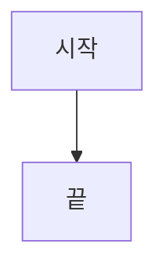

# UPDATE 매핑 계약 구현 계획

> **For agentic workers:** REQUIRED SUB-SKILL: Use superpowers:subagent-driven-development (recommended) or superpowers:executing-plans to implement this plan task-by-task. Steps use checkbox (`- [ ]`) syntax for tracking.

**Goal:** 정적 파서가 UPDATE SET 절을 추출하고, 그것이 명세서 프롬프트에서 fill-in-the-blank 표로 강제되며, 누락이 L1 기계 검증에 걸리게 한다.

**Architecture:** INSERT가 이미 쓰는 경로(`AstInsertMappings` → 프롬프트 표)를 UPDATE에 대칭으로 복제한다. INSERT와 다른 점은 SET 절이 `컬럼 = 표현식`으로 이미 1:1이라 표현식까지 파서가 확정할 수 있다는 것, 그리고 그 확정값을 L1이 기계적으로 대조한다는 것이다.

**Tech Stack:** C# / .NET 10, `Microsoft.SqlServer.TransactSql.ScriptDom`, xUnit, Markdig

**Spec:** `docs/superpowers/specs/2026-08-09-update-mapping-contract-design.md`

## Global Constraints

- 빌드 경고는 정확히 8건을 유지한다 (기존 `DbMetadataServiceTests`의 CS8600/CS8602). 새 경고를 만들지 않는다.
- 테스트 기준선은 1,211건이다 (`dotnet test --list-tests` 실측, 2026-08-09). 기존 테스트를 삭제하지 않는다.
- 새로 만드는 함수는 예외 탈출 경로를 호출부까지 따라가 확인하고, **확인한 함수 이름을 커밋 메시지나 주석에 남긴다.**
- 테스트는 xUnit이며 `// Arrange` / `// Act` / `// Assert` 주석 관례를 따른다.
- 주석과 로그 메시지는 한국어로 쓴다. 코드 식별자는 영어다.
- 함수(`CodeObjectType.Function`) 경로는 손대지 않는다. `BuildFunctionSpecificationPrompts`는 별도 분기다.

## File Structure

| 파일 | 책임 | 변경 |
|---|---|---|
| `src/ReSet.Core/Models/SpDefinition.cs` | `AstUpdateMapping`·`AstUpdateAssignment` 모델, `SpStaticAnalysisResult.AstUpdateMappings` | 수정 |
| `src/ReSet.Core/Services/SqlStaticParser.cs` | SET 절 추출, FROM 절 원문, 자기참조 감지 | 수정 |
| `src/ReSet.Core/Services/StaticAnalysisNormalizer.cs` | `TargetTable`만 canonical 3-part로 | 수정 |
| `src/ReSet.Core/Services/CacheManager.cs` | 캐시 포맷 버전 2 → 3 | 수정 |
| `src/ReSet.Core/Services/AiService.cs` | 정적 분석 블록, fill-in-the-blank 표, 조건부 경고 2종 | 수정 |
| `src/ReSet.Core/Services/SpecExpectations.cs` | L1이 대조할 기대값과 그 생성 | **신규** |
| `src/ReSet.Core/Services/MechanicalValidator.cs` | `Validate` 오버로드, `CheckUpdateMappings`, `ErrorType`, 재생성 피드백 문구 | 수정 |
| `src/ReSet.Core/Services/VerificationPipelineOrchestrator.cs` | 6개 `Validate` 호출부에 기대값 전달 | 수정 |

`SpecExpectations`를 별도 파일로 빼는 이유: `MechanicalValidator.cs`는 이미 800줄이 넘고 `ValidationResult`·`StepValidationResult`·`DetailedError`를 함께 담고 있다. 기대값 **생성**은 정적 분석을 읽는 일이고 **소비**는 검증기의 일이라, 생성 쪽을 분리하면 검증기가 정적 분석 모델을 몰라도 된다.

---

### Task 1: 파서가 SET 절을 본다

**Files:**
- Modify: `src/ReSet.Core/Models/SpDefinition.cs`
- Modify: `src/ReSet.Core/Services/SqlStaticParser.cs`
- Test: `tests/ReSet.Core.Tests/SqlStaticParserTests.cs`

**Interfaces:**
- Consumes: 없음 (첫 태스크)
- Produces:
  - `ReSet.Core.Models.AstUpdateMapping` — `string TargetTable`, `int StatementOrdinal`, `List<AstUpdateAssignment> Assignments`, `string? FromClauseText`, `List<string> SelfReferencedColumns`
  - `ReSet.Core.Models.AstUpdateAssignment` — `string Column`, `string SourceExpression`
  - `SpStaticAnalysisResult.AstUpdateMappings` (`List<AstUpdateMapping>`, 기본 빈 리스트)

- [ ] **Step 1: 실패 테스트를 쓴다**

`tests/ReSet.Core.Tests/SqlStaticParserTests.cs` 끝(클래스 닫는 중괄호 앞)에 붙인다. 파일 상단 `using`에 `System.Linq`가 없으면 추가한다.

```csharp
        private static SpStaticAnalysisResult AnalyzeUpdate(string body)
        {
            var parser = new SqlStaticParser();
            return parser.Analyze($@"
CREATE PROCEDURE dbo.UpdateProbe
AS
BEGIN
{body}
END");
        }

        [Fact]
        public void Analyze_WithSimpleSetClause_ShouldExtractColumnsAndExpressions()
        {
            // Arrange & Act
            var result = AnalyzeUpdate("    UPDATE dbo.TCommMst SET CLVT = 100, PGVT = @amount;");

            // Assert
            var mapping = Assert.Single(result.AstUpdateMappings);
            Assert.Equal("dbo.TCommMst", mapping.TargetTable);
            Assert.Equal(1, mapping.StatementOrdinal);
            Assert.Collection(mapping.Assignments,
                a => { Assert.Equal("CLVT", a.Column); Assert.Equal("100", a.SourceExpression); },
                a => { Assert.Equal("PGVT", a.Column); Assert.Equal("@amount", a.SourceExpression); });
        }

        [Fact]
        public void Analyze_WithQualifiedSetTarget_ShouldStripTableQualifier()
        {
            // Arrange & Act
            var result = AnalyzeUpdate("    UPDATE T SET T.COMM = 0 FROM dbo.TCommMst T;");

            // Assert
            var mapping = Assert.Single(result.AstUpdateMappings);
            Assert.Equal("COMM", Assert.Single(mapping.Assignments).Column);
        }

        [Fact]
        public void Analyze_WithVariableAssignment_ShouldRecordOnlyColumnAssignments()
        {
            // Arrange & Act
            var result = AnalyzeUpdate(
                "    DECLARE @total INT;\r\n" +
                "    UPDATE dbo.TCommMst SET @total = CLVT, CLVT = 0;");

            // Assert
            var mapping = Assert.Single(result.AstUpdateMappings);
            Assert.Equal("CLVT", Assert.Single(mapping.Assignments).Column);
        }

        [Fact]
        public void Analyze_WithFromClause_ShouldCaptureFromTextAndResolveAlias()
        {
            // Arrange & Act
            var result = AnalyzeUpdate(
                "    UPDATE A SET A.CLVT = B.CLVT FROM dbo.TCommMst A INNER JOIN dbo.TStage B ON A.SEQ = B.SEQ;");

            // Assert
            var mapping = Assert.Single(result.AstUpdateMappings);
            Assert.Equal("dbo.TCommMst", mapping.TargetTable);
            Assert.NotNull(mapping.FromClauseText);
            Assert.Contains("dbo.TCommMst", mapping.FromClauseText!);
            Assert.Contains("dbo.TStage", mapping.FromClauseText!);
        }

        [Fact]
        public void Analyze_WithoutFromClause_ShouldLeaveFromTextNull()
        {
            // Arrange & Act
            var result = AnalyzeUpdate("    UPDATE dbo.TCommMst SET CLVT = 0 WHERE SEQ = 1;");

            // Assert
            Assert.Null(Assert.Single(result.AstUpdateMappings).FromClauseText);
        }

        [Fact]
        public void Analyze_WithSelfReferencingSet_ShouldReportSelfReferencedColumns()
        {
            // Arrange & Act
            var result = AnalyzeUpdate("    UPDATE dbo.TCommMst SET CLVT = CLVT * -1, PGVT = PGVT * -1;");

            // Assert
            var mapping = Assert.Single(result.AstUpdateMappings);
            Assert.Equal(new[] { "CLVT", "PGVT" }, mapping.SelfReferencedColumns);
        }

        [Fact]
        public void Analyze_WhenRightHandSideIsNotATarget_ShouldNotReportSelfReference()
        {
            // Arrange & Act
            var result = AnalyzeUpdate("    UPDATE dbo.TCommMst SET CLVT = PGVT * -1;");

            // Assert
            Assert.Empty(Assert.Single(result.AstUpdateMappings).SelfReferencedColumns);
        }

        [Fact]
        public void Analyze_WithTwoUpdatesOnSameTable_ShouldNumberStatements()
        {
            // Arrange & Act
            var result = AnalyzeUpdate(
                "    UPDATE dbo.TCommMst SET CLVT = 0;\r\n" +
                "    UPDATE dbo.TCommMst SET PGVT = 1;");

            // Assert
            Assert.Equal(2, result.AstUpdateMappings.Count);
            Assert.Equal(1, result.AstUpdateMappings[0].StatementOrdinal);
            Assert.Equal(2, result.AstUpdateMappings[1].StatementOrdinal);
        }

        [Fact]
        public void Analyze_WhenTargetIsUnresolvable_ShouldNotCreateMapping()
        {
            // Arrange & Act - 테이블 변수는 NamedTableReference가 아니므로 대상이 풀리지 않는다.
            var result = AnalyzeUpdate(
                "    DECLARE @T TABLE (CLVT INT);\r\n" +
                "    UPDATE @T SET CLVT = 0;");

            // Assert
            Assert.Empty(result.AstUpdateMappings);
        }
```

- [ ] **Step 2: 실패를 확인한다**

Run: `dotnet test --filter "FullyQualifiedName~SqlStaticParserTests"`
Expected: 컴파일 실패 — `AstUpdateMappings`, `AstUpdateMapping`이 정의되지 않음.

- [ ] **Step 3: 모델을 추가한다**

`src/ReSet.Core/Models/SpDefinition.cs`의 `AstInsertMapping` 클래스 바로 뒤에 넣는다.

```csharp
    public class AstUpdateMapping
    {
        public string TargetTable { get; set; } = string.Empty;

        /// <summary>이 SP 안에서 같은 TargetTable에 대한 몇 번째 UPDATE 문장인가. 1부터 센다.</summary>
        public int StatementOrdinal { get; set; }

        public List<AstUpdateAssignment> Assignments { get; set; } = new();

        /// <summary>FROM 절 원문. 없으면 null이며, 자기참조 의미 경고가 붙지 않는다.</summary>
        public string? FromClauseText { get; set; }

        /// <summary>SET 우변이 같은 문장의 타겟 컬럼을 참조하는 컬럼들. 동시평가 경고의 근거다.</summary>
        public List<string> SelfReferencedColumns { get; set; } = new();
    }

    public class AstUpdateAssignment
    {
        /// <summary>테이블 한정을 걷어낸 순수 컬럼명.</summary>
        public string Column { get; set; } = string.Empty;

        /// <summary>SET 우변 원문. 파서도 정규화기도 손대지 않는다.</summary>
        public string SourceExpression { get; set; } = string.Empty;
    }
```

같은 파일 `SpStaticAnalysisResult`의 `UpdateTables` 선언 바로 아래에 넣는다.

```csharp
        public List<AstUpdateMapping> AstUpdateMappings { get; set; } = new();
```

- [ ] **Step 4: 파서를 고친다**

`src/ReSet.Core/Services/SqlStaticParser.cs` 상단 `using`에 `System.Linq`를 추가한다.

`Analyze` 안에서 `result.AstInsertMappings = visitor.AstInsertMappings;` 바로 아래에 넣는다.

```csharp
                        result.AstUpdateMappings = visitor.AstUpdateMappings;
```

`SpStructureVisitor`의 `AstInsertMappings` 선언 뒤에 넣는다.

```csharp
        public List<AstUpdateMapping> AstUpdateMappings { get; } = new();
```

같은 클래스의 private 필드 영역(`_foundDelete` 근처)에 넣는다.

```csharp
        private readonly Dictionary<string, int> _updateOrdinals = new(StringComparer.OrdinalIgnoreCase);
```

`RecordDmlTarget`이 푼 이름을 호출부에 돌려주도록 시그니처를 바꾼다. 기존 본문은 그대로 두고 `out`만 채운다.

```csharp
        private bool RecordDmlTarget(
            TableReference? target,
            FromClause? fromClause,
            List<string> targetList,
            HashSet<string> seen,
            out string? resolvedName)
        {
            resolvedName = null;
            if (target is not NamedTableReference named || named.SchemaObject == null) return false;

            var written = GetSchemaObjectString(named.SchemaObject);
            if (string.IsNullOrWhiteSpace(written)) return false;

            var resolved = ResolveDmlTargetName(written, fromClause);
            resolvedName = resolved;

            if (resolved.StartsWith("#", StringComparison.Ordinal))
            {
                if (_foundTemps.Add(resolved)) CreatedTempTables.Add(resolved);
                return true;
            }

            if (_foundTables.Add(resolved)) ReferencedTables.Add(resolved);
            if (seen.Add(resolved)) targetList.Add(resolved);
            return true;
        }
```

`ExplicitVisit(DeleteSpecification)`의 호출을 고친다(대상 이름을 쓰지 않는다).

```csharp
            _dmlTargetResolved = RecordDmlTarget(node.Target, node.FromClause, DeleteTables, _foundDelete, out _);
```

`ExplicitVisit(UpdateSpecification)`을 고친다.

```csharp
        public override void ExplicitVisit(UpdateSpecification node)
        {
            _statementContext.Push("UPDATE");
            var prevTargetNode = _currentDmlTargetNode;
            var prevResolved = _dmlTargetResolved;

            _currentDmlTargetNode = node.Target;
            _dmlTargetResolved = RecordDmlTarget(
                node.Target, node.FromClause, UpdateTables, _foundUpdate, out var resolvedTarget);

            // 대상을 풀지 못한 문장은 매핑을 만들지 않는다. 잘못 푼 테이블 이름에 컬럼을
            // 붙이면 L1이 존재하지 않는 표를 요구하게 되고, 그것은 무한 재시도가 된다.
            if (_dmlTargetResolved && !string.IsNullOrWhiteSpace(resolvedTarget))
            {
                RecordUpdateMapping(node, resolvedTarget!);
            }

            base.ExplicitVisit(node);

            _currentDmlTargetNode = prevTargetNode;
            _dmlTargetResolved = prevResolved;
            _statementContext.Pop();
        }

        private void RecordUpdateMapping(UpdateSpecification node, string targetTable)
        {
            if (node.SetClauses == null) return;

            var assignments = new List<AstUpdateAssignment>();
            foreach (var clause in node.SetClauses)
            {
                var column = ExtractSetColumn(clause);
                if (string.IsNullOrWhiteSpace(column)) continue;

                assignments.Add(new AstUpdateAssignment
                {
                    Column = column!,
                    SourceExpression = ExtractSetExpression(clause)
                });
            }

            // SET 절이 컬럼을 하나도 대입하지 않으면(변수 대입뿐이면) 표로 만들 것이 없다.
            if (assignments.Count == 0) return;

            _updateOrdinals.TryGetValue(targetTable, out var previous);
            _updateOrdinals[targetTable] = previous + 1;

            var mapping = new AstUpdateMapping
            {
                TargetTable = targetTable,
                StatementOrdinal = previous + 1,
                FromClauseText = node.FromClause == null ? null : GetFragmentText(node.FromClause)
            };
            mapping.Assignments.AddRange(assignments);
            mapping.SelfReferencedColumns.AddRange(FindSelfReferences(node, assignments));
            AstUpdateMappings.Add(mapping);
        }

        private static string? ExtractSetColumn(SetClause clause)
        {
            switch (clause)
            {
                case AssignmentSetClause assignment:
                    // Column이 null이면 SET @var = ... 변수 대입이다. 컬럼이 아니다.
                    return LastIdentifier(assignment.Column?.MultiPartIdentifier);
                case FunctionCallSetClause call
                    when call.MutatorFunction?.CallTarget is MultiPartIdentifierCallTarget target:
                    // .WRITE() 변형. 컬럼만 뽑고 표현식은 절 원문을 쓴다.
                    return LastIdentifier(target.MultiPartIdentifier);
                default:
                    return null;
            }
        }

        private string ExtractSetExpression(SetClause clause) =>
            clause is AssignmentSetClause { NewValue: not null } assignment
                ? GetFragmentText(assignment.NewValue)
                : GetFragmentText(clause);

        private static string? LastIdentifier(MultiPartIdentifier? identifier)
        {
            var last = identifier?.Identifiers?.LastOrDefault();
            return string.IsNullOrWhiteSpace(last?.Value) ? null : last!.Value;
        }

        /// <summary>
        /// SET 우변이 같은 문장의 타겟 컬럼을 참조하는지 본다.
        ///
        /// 판정을 한 문장 안으로 제한한다. 전역 컬럼 사전을 쓰면 다른 문장이 갱신하는
        /// 동명 컬럼이 섞여 오탐이 난다 - RecordDmlTarget이 전역 별칭 사전을 쓰지 않는
        /// 것과 같은 이유다.
        /// </summary>
        private static List<string> FindSelfReferences(
            UpdateSpecification node, List<AstUpdateAssignment> assignments)
        {
            var targets = new HashSet<string>(
                assignments.Select(a => a.Column), StringComparer.OrdinalIgnoreCase);
            var found = new List<string>();
            var seen = new HashSet<string>(StringComparer.OrdinalIgnoreCase);

            foreach (var clause in node.SetClauses.OfType<AssignmentSetClause>())
            {
                if (clause.NewValue == null) continue;

                var collector = new ColumnReferenceCollector();
                clause.NewValue.Accept(collector);

                foreach (var column in collector.Columns)
                {
                    if (targets.Contains(column) && seen.Add(column)) found.Add(column);
                }
            }

            return found;
        }

        private sealed class ColumnReferenceCollector : TSqlFragmentVisitor
        {
            public List<string> Columns { get; } = new();

            public override void Visit(ColumnReferenceExpression node)
            {
                var column = LastIdentifier(node.MultiPartIdentifier);
                if (column != null) Columns.Add(column);
            }
        }
```

- [ ] **Step 5: 통과를 확인한다**

Run: `dotnet test --filter "FullyQualifiedName~SqlStaticParserTests"`
Expected: 신규 9건 포함 전부 PASS.

`Analyze_WhenTargetIsUnresolvable_ShouldNotCreateMapping`이나 `.WRITE()` 관련이 실패하면 실제 AST 모양이 예상과 다른 것이다. 디버거로 노드 타입을 확인해 조건을 맞추되, **테스트의 기대값을 낮추지 않는다.**

- [ ] **Step 6: 커밋**

```bash
git add src/ReSet.Core/Models/SpDefinition.cs src/ReSet.Core/Services/SqlStaticParser.cs tests/ReSet.Core.Tests/SqlStaticParserTests.cs
git commit -m "feat: extract UPDATE SET clauses in the static parser

Records target columns, source expressions, FROM-clause text, and
self-referencing columns per UPDATE statement, mirroring what
AstInsertMappings already does for INSERT. Statements whose target does not
resolve produce no mapping - misattributing columns to a wrong table would
make L1 demand a table that cannot exist.

Verified exception escape paths: ExplicitVisit(UpdateSpecification),
RecordUpdateMapping, FindSelfReferences - all stay inside Analyze's existing
catch-all soft-fail envelope."
```

---

### Task 2: 정규화기와 캐시 버전

**Files:**
- Modify: `src/ReSet.Core/Services/StaticAnalysisNormalizer.cs`
- Modify: `src/ReSet.Core/Services/CacheManager.cs:22`
- Test: `tests/ReSet.Core.Tests/StaticAnalysisNormalizerTests.cs`

**Interfaces:**
- Consumes: Task 1의 `AstUpdateMapping`, `AstUpdateAssignment`, `SpStaticAnalysisResult.AstUpdateMappings`
- Produces: `StaticAnalysisNormalizer.Normalize`가 `AstUpdateMappings`를 채운 결과. 이후 태스크가 보는 `TargetTable`은 canonical 3-part다.

- [ ] **Step 1: 실패 테스트를 쓴다**

`tests/ReSet.Core.Tests/StaticAnalysisNormalizerTests.cs`의 클래스 안에 붙인다.

```csharp
        [Fact]
        public void Normalize_ShouldCanonicalizeUpdateMappingTableOnly()
        {
            // Arrange
            var analysis = new SpStaticAnalysisResult();
            var mapping = new AstUpdateMapping
            {
                TargetTable = "TCommMst",
                StatementOrdinal = 2,
                FromClauseText = "FROM TCommMst A"
            };
            mapping.Assignments.Add(new AstUpdateAssignment { Column = "CLVT", SourceExpression = "CLVT * -1" });
            mapping.SelfReferencedColumns.Add("CLVT");
            analysis.AstUpdateMappings.Add(mapping);

            // Act
            var normalized = StaticAnalysisNormalizer.Normalize(analysis, "SETTLE_POQ_DB", "dbo");

            // Assert
            var result = Assert.Single(normalized.AstUpdateMappings);
            Assert.Equal("SETTLE_POQ_DB.dbo.TCommMst", result.TargetTable);
            Assert.Equal(2, result.StatementOrdinal);
            Assert.Equal("FROM TCommMst A", result.FromClauseText);
            Assert.Equal("CLVT * -1", Assert.Single(result.Assignments).SourceExpression);
            Assert.Equal("CLVT", Assert.Single(result.SelfReferencedColumns));
        }

        [Fact]
        public void Normalize_ShouldNotShareUpdateMappingInstancesWithInput()
        {
            // Arrange
            var analysis = new SpStaticAnalysisResult();
            var mapping = new AstUpdateMapping { TargetTable = "dbo.T" };
            mapping.Assignments.Add(new AstUpdateAssignment { Column = "A", SourceExpression = "1" });
            analysis.AstUpdateMappings.Add(mapping);

            // Act
            var normalized = StaticAnalysisNormalizer.Normalize(analysis, "DB", "dbo");
            normalized.AstUpdateMappings[0].Assignments.Clear();

            // Assert - 입력을 변경하지 않는다는 Normalize의 계약
            Assert.Single(analysis.AstUpdateMappings[0].Assignments);
        }
```

> 위 첫 테스트의 `SourceExpressionsProbe: null` 줄은 **오타 방지용 표식이 아니라 실수다. 지운다.** 객체 초기화자에는 `TargetTable`, `StatementOrdinal`, `FromClauseText`만 남긴다.

- [ ] **Step 2: 실패를 확인한다**

Run: `dotnet test --filter "FullyQualifiedName~StaticAnalysisNormalizerTests"`
Expected: FAIL — `normalized.AstUpdateMappings`가 비어 있음.

- [ ] **Step 3: 정규화기를 고친다**

`StaticAnalysisNormalizer.Normalize`의 `foreach (var mapping in analysis.AstInsertMappings)` 블록 바로 뒤에 넣는다.

```csharp
            // 테이블 이름만 다룬다. 컬럼과 표현식은 그대로 옮긴다 - 표현식을 정규화하면
            // SQL 재작성이 되고, 그것은 이 클래스가 하지 않기로 한 일이다.
            foreach (var mapping in analysis.AstUpdateMappings)
            {
                var copy = new AstUpdateMapping
                {
                    TargetTable = Canonicalize(mapping.TargetTable, database, defaultSchema),
                    StatementOrdinal = mapping.StatementOrdinal,
                    FromClauseText = mapping.FromClauseText
                };

                foreach (var assignment in mapping.Assignments)
                {
                    copy.Assignments.Add(new AstUpdateAssignment
                    {
                        Column = assignment.Column,
                        SourceExpression = assignment.SourceExpression
                    });
                }

                copy.SelfReferencedColumns.AddRange(mapping.SelfReferencedColumns);
                normalized.AstUpdateMappings.Add(copy);
            }
```

- [ ] **Step 4: 캐시 포맷 버전을 올린다**

`src/ReSet.Core/Services/CacheManager.cs:22`

```csharp
        // 3: SpStaticAnalysisResult에 AstUpdateMappings가 추가되어 프롬프트 입력이 달라졌다.
        //    DDL이 같아도 기존 산출물은 UPDATE 매핑표가 없으므로 재분석해야 한다.
        private const int CurrentCacheFormatVersion = 3;
```

- [ ] **Step 5: 통과를 확인한다**

Run: `dotnet test --filter "FullyQualifiedName~StaticAnalysisNormalizerTests|FullyQualifiedName~CacheManagerTests"`
Expected: PASS. `CacheManagerTests`가 버전 상수를 하드코딩하고 있으면 그 기대값도 3으로 고친다.

- [ ] **Step 6: 커밋**

```bash
git add src/ReSet.Core/Services/StaticAnalysisNormalizer.cs src/ReSet.Core/Services/CacheManager.cs tests/ReSet.Core.Tests/StaticAnalysisNormalizerTests.cs
git commit -m "feat: normalize UPDATE mapping table names and bump the cache format

Only TargetTable becomes canonical 3-part; columns and expressions are copied
verbatim. Cache format goes 2 -> 3 because the prompt input changed."
```

---

### Task 3: 프롬프트가 표를 미리 채운다

**Files:**
- Modify: `src/ReSet.Core/Services/AiService.cs` (정적 분석 블록: `UPDATE 대상 테이블` 줄 뒤 / 규칙: INSERT 템플릿 블록 뒤)
- Test: `tests/ReSet.Core.Tests/AiServiceTests_Rich.cs`

**Interfaces:**
- Consumes: Task 2가 정규화한 `SpStaticAnalysisResult.AstUpdateMappings`
- Produces: 프롬프트 문자열 안의 `### UPDATE 대상 테이블: <table> (문장 <n>)` 헤딩과 그 아래 표. **Task 4의 L1 대조가 이 헤딩 형태에 의존한다.**

- [ ] **Step 1: 실패 테스트를 쓴다**

`tests/ReSet.Core.Tests/AiServiceTests_Rich.cs`의 클래스 안에 붙인다. `MockHttpMessageHandler.LastRequestBody`로 실제 전송된 프롬프트를 본다.

```csharp
        private static (AiService Service, MockHttpMessageHandler Handler) CreateProbe()
        {
            var handler = new MockHttpMessageHandler(
                "{\"choices\":[{\"message\":{\"content\":\"## 생성된 명세서\"}}]}");
            var client = new OpenAiClient(new HttpClient(handler), "k", "https://api.openai.com/v1", "gpt-4o");
            return (new AiService(client, 0.2f), handler);
        }

        private static SpDefinition ProbeSpDef(params AstUpdateMapping[] mappings)
        {
            var spDef = new SpDefinition { Schema = "dbo", Name = "COMM_UPD", DdlText = "SELECT 1;" };
            spDef.StaticAnalysis = new SpStaticAnalysisResult
            {
                IsParsedSuccessfully = true,
                UpdateTables = new List<string> { "DB.dbo.TCommMst" },
                AstUpdateMappings = new List<AstUpdateMapping>(mappings)
            };
            return spDef;
        }

        private static AstUpdateMapping Mapping(
            string? fromClause = null, params string[] selfReferenced)
        {
            var mapping = new AstUpdateMapping
            {
                TargetTable = "DB.dbo.TCommMst",
                StatementOrdinal = 2,
                FromClauseText = fromClause
            };
            mapping.Assignments.Add(new AstUpdateAssignment { Column = "CLVT", SourceExpression = "CLVT * -1" });
            mapping.SelfReferencedColumns.AddRange(selfReferenced);
            return mapping;
        }

        [Fact]
        public async Task GenerateSpecificationAsync_WithUpdateMappings_ShouldPrefillTheTable()
        {
            // Arrange
            var (service, handler) = CreateProbe();

            // Act
            await service.GenerateSpecificationAsync(ProbeSpDef(Mapping()), "지침", null);

            // Assert
            var body = handler.LastRequestBody;
            Assert.Contains("AST UPDATE 타겟-소스 1:1 매핑 추출 데이터", body);
            Assert.Contains("### UPDATE 대상 테이블: DB.dbo.TCommMst (문장 2)", body);
            Assert.Contains("CLVT * -1", body);
            Assert.Contains("(FILL_DESCRIPTION_HERE)", body);
        }

        [Fact]
        public async Task GenerateSpecificationAsync_WithoutUpdateMappings_ShouldOmitTheBlock()
        {
            // Arrange
            var (service, handler) = CreateProbe();

            // Act
            await service.GenerateSpecificationAsync(ProbeSpDef(), "지침", null);

            // Assert
            Assert.DoesNotContain("AST UPDATE 타겟-소스 1:1 매핑 추출 데이터", handler.LastRequestBody);
            Assert.DoesNotContain("### UPDATE 대상 테이블:", handler.LastRequestBody);
        }

        [Fact]
        public async Task GenerateSpecificationAsync_WithFromClause_ShouldAttachNondeterminismWarning()
        {
            // Arrange
            var (service, handler) = CreateProbe();

            // Act
            await service.GenerateSpecificationAsync(
                ProbeSpDef(Mapping(fromClause: "FROM DB.dbo.TCommMst A")), "지침", null);

            // Assert
            Assert.Contains("비결정적", handler.LastRequestBody);
        }

        [Fact]
        public async Task GenerateSpecificationAsync_WithoutFromClause_ShouldNotAttachNondeterminismWarning()
        {
            // Arrange
            var (service, handler) = CreateProbe();

            // Act
            await service.GenerateSpecificationAsync(ProbeSpDef(Mapping()), "지침", null);

            // Assert
            Assert.DoesNotContain("비결정적", handler.LastRequestBody);
        }

        [Fact]
        public async Task GenerateSpecificationAsync_WithSelfReference_ShouldAttachSimultaneousEvaluationRule()
        {
            // Arrange
            var (service, handler) = CreateProbe();

            // Act
            await service.GenerateSpecificationAsync(
                ProbeSpDef(Mapping(fromClause: null, "CLVT")), "지침", null);

            // Assert
            Assert.Contains("갱신 전 값", handler.LastRequestBody);
        }

        [Fact]
        public async Task GenerateSpecificationAsync_WithoutSelfReference_ShouldNotAttachSimultaneousEvaluationRule()
        {
            // Arrange
            var (service, handler) = CreateProbe();

            // Act
            await service.GenerateSpecificationAsync(ProbeSpDef(Mapping()), "지침", null);

            // Assert
            Assert.DoesNotContain("갱신 전 값", handler.LastRequestBody);
        }

        [Fact]
        public async Task GenerateSpecificationAsync_WithPipeInExpression_ShouldEscapeTheTableCell()
        {
            // Arrange
            var (service, handler) = CreateProbe();
            var mapping = new AstUpdateMapping { TargetTable = "DB.dbo.TCommMst", StatementOrdinal = 1 };
            mapping.Assignments.Add(new AstUpdateAssignment
            {
                Column = "FLAGS",
                SourceExpression = "FLAGS | 4"
            });

            // Act
            await service.GenerateSpecificationAsync(ProbeSpDef(mapping), "지침", null);

            // Assert - 이스케이프하지 않으면 표의 셀 경계가 깨진다.
            // JSON 직렬화가 백슬래시를 한 번 더 이스케이프하므로 본문에는 `\\|`로 나타난다.
            Assert.Contains(@"FLAGS \\| 4", handler.LastRequestBody);
        }
```

> 마지막 Assert가 실패하면 실제 직렬화 형태를 먼저 확인한다(`handler.LastRequestBody`를 출력해 본다). JSON 인코더에 따라 백슬래시가 한 번만 나타날 수 있다. **기대값을 `Assert.Contains("FLAGS", ...)`처럼 약화시키지 말고**, 파이프 앞에 백슬래시가 실제로 붙는지를 확인하는 형태로만 조정한다.

- [ ] **Step 2: 실패를 확인한다**

Run: `dotnet test --filter "FullyQualifiedName~AiServiceTests_Rich"`
Expected: 신규 7건 FAIL (프롬프트에 해당 문자열 없음).

- [ ] **Step 3: 정적 분석 블록을 붙인다**

`AiService.cs`의 `staticAnalysisText.AppendLine($"  * UPDATE 대상 테이블: ...")` 줄 **바로 뒤**, `DELETE 대상 테이블` 줄 앞에 넣는다.

```csharp
                    if (spDef.StaticAnalysis.AstUpdateMappings != null && spDef.StaticAnalysis.AstUpdateMappings.Count > 0)
                    {
                        staticAnalysisText.AppendLine();
                        staticAnalysisText.AppendLine("  [AST UPDATE 타겟-소스 1:1 매핑 추출 데이터 (ABSOLUTE SOURCE OF TRUTH)]");
                        staticAnalysisText.AppendLine("  * L1 정적 파서(SqlScriptDom)가 SET 절의 타겟 컬럼과 원천 표현식을 기계적으로 정확히 추출했습니다.");
                        staticAnalysisText.AppendLine("  * 아래 정보를 매핑 원천으로 절대적으로 신뢰하고 반영하십시오. 원본 쿼리에 없는 변환이나 추가 논리를 임의로 지어내지(할루시네이션) 마십시오.");
                        foreach (var mapping in spDef.StaticAnalysis.AstUpdateMappings)
                        {
                            staticAnalysisText.AppendLine($"    <update-target table=\"{mapping.TargetTable}\" statement=\"{mapping.StatementOrdinal}\">");
                            foreach (var assignment in mapping.Assignments)
                            {
                                staticAnalysisText.AppendLine($"      <set column=\"{assignment.Column}\">{assignment.SourceExpression}</set>");
                            }
                            if (!string.IsNullOrEmpty(mapping.FromClauseText))
                            {
                                staticAnalysisText.AppendLine($"      <from-clause>{mapping.FromClauseText}</from-clause>");
                            }
                            if (mapping.SelfReferencedColumns.Count > 0)
                            {
                                staticAnalysisText.AppendLine($"      <self-referenced-columns>{string.Join(", ", mapping.SelfReferencedColumns)}</self-referenced-columns>");
                            }
                            staticAnalysisText.AppendLine("    </update-target>");
                        }
                        staticAnalysisText.AppendLine();
                    }
```

- [ ] **Step 4: 규칙 템플릿과 조건부 경고를 붙인다**

`BuildSpecificationPrompts`의 INSERT 템플릿 `if` 블록 **바로 뒤**에 넣는다.

```csharp
            var updateMappings = spDef.StaticAnalysis?.AstUpdateMappings;
            if (updateMappings != null && updateMappings.Count > 0)
            {
                rules.Add($"{ruleIndex++}. [CRITICAL CRUD TEMPLATE (Fill-in-the-blanks)] For the UPDATE tables in the `## CRUD 분석` section, you MUST use the following pre-filled markdown table template exactly as provided. The `컬럼명` and `원천 표현식 (SET)` cells are already filled from the AST: do NOT alter, reorder, merge, or skip any row, and do NOT use '...'. Your ONLY job is to fill in the `설명` column for each row:");
                foreach (var mapping in updateMappings)
                {
                    rules.Add($"   ### UPDATE 대상 테이블: {mapping.TargetTable} (문장 {mapping.StatementOrdinal})");
                    rules.Add("   | 테이블명 | 컬럼명 | 원천 표현식 (SET) | 설명 |");
                    rules.Add("   | :--- | :--- | :--- | :--- |");
                    foreach (var assignment in mapping.Assignments)
                    {
                        rules.Add($"   | {mapping.TargetTable} | {assignment.Column} | {EscapeTableCell(assignment.SourceExpression)} | (FILL_DESCRIPTION_HERE) |");
                    }

                    if (!string.IsNullOrEmpty(mapping.FromClauseText))
                    {
                        rules.Add("   위 문장은 FROM 절을 동반합니다. 갱신 대상은 FROM 절에 등장하는 해당 별칭의 인스턴스입니다. 조인이 대상 행 하나에 여러 소스 행을 매칭시킬 경우 T-SQL은 어느 값이 반영될지 정의하지 않습니다(비결정적). 조인 키의 유일성이 보장되는지 판단할 수 없으면 \"보장되지 않으면 결과가 비결정적\"이라는 사실만 기술하고, 유일성 여부를 추측하지 마십시오.");
                    }

                    if (mapping.SelfReferencedColumns.Count > 0)
                    {
                        rules.Add($"   다음 컬럼은 SET 우변에서 자기 자신을 참조합니다: {string.Join(", ", mapping.SelfReferencedColumns)}. SQL의 SET 절은 우변을 모두 **갱신 전 값**으로 동시에 평가합니다. 절차형 언어로 이행할 때 순차 대입하면 계산 결과가 달라지므로, 이 사실을 `## CRUD 분석`에 명시적으로 기술하십시오.");
                    }

                    rules.Add("");
                }
            }
```

같은 클래스에 헬퍼를 추가한다(`BuildSpecificationPrompts` 근처의 private 영역).

```csharp
        /// <summary>
        /// 마크다운 표 셀에 넣을 수 있게 다듬는다. SET 우변에 비트 연산자 `|`가 들어가면
        /// (예: FLAGS | 4) 셀 경계로 읽혀 표가 통째로 어긋난다. 개행도 같은 이유로 접는다.
        /// </summary>
        private static string EscapeTableCell(string expression)
        {
            if (string.IsNullOrEmpty(expression)) return string.Empty;

            return expression
                .Replace("\r\n", " ")
                .Replace("\n", " ")
                .Replace("\r", " ")
                .Replace("|", "\\|");
        }
```

- [ ] **Step 5: 통과를 확인한다**

Run: `dotnet test --filter "FullyQualifiedName~AiServiceTests_Rich"`
Expected: PASS. 파이프 이스케이프 테스트의 Assert를 Step 1의 지시대로 실제 형태에 맞춰 확정한다.

- [ ] **Step 6: 커밋**

```bash
git add src/ReSet.Core/Services/AiService.cs tests/ReSet.Core.Tests/AiServiceTests_Rich.cs
git commit -m "feat: pre-fill the UPDATE mapping table in the specification prompt

Columns and source expressions come from the AST; the model only fills in the
description. The FROM-clause nondeterminism rule and the SET simultaneous
evaluation rule attach only to the statements where the parser detected them,
following the existing dynamic-pruning pattern.

Table cells escape pipes - a bitwise OR in a SET expression would otherwise
break the markdown table."
```

---

### Task 4: L1이 기계적으로 대조한다

**Files:**
- Create: `src/ReSet.Core/Services/SpecExpectations.cs`
- Modify: `src/ReSet.Core/Services/MechanicalValidator.cs`
- Test: `tests/ReSet.Core.Tests/MechanicalValidatorTests.cs`

**Interfaces:**
- Consumes: Task 2의 `SpStaticAnalysisResult.AstUpdateMappings`, Task 3이 정한 `### UPDATE 대상 테이블: <table> (문장 <n>)` 헤딩 형태
- Produces:
  - `SpecExpectations.FromStaticAnalysis(SpStaticAnalysisResult?)` → `SpecExpectations?`
  - `MechanicalValidator.Validate(string markdown, SpecExpectations? expectations = null)` → `ValidationResult`
  - `ErrorType.UpdateMappingMissing`

- [ ] **Step 1: 실패 테스트를 쓴다**

`tests/ReSet.Core.Tests/MechanicalValidatorTests.cs`의 클래스 안에 붙인다.

```csharp
        private const string SpecSkeleton = @"## 개요
본문
## 파라미터 목록
본문
## CRUD 분석
{0}
## 로직 흐름 요약
본문
## 비즈니스 흐름 시각화

";

        private static string SpecWith(string crudBody) => SpecSkeleton.Replace("{0}", crudBody);

        private static SpecExpectations ExpectClvtAndPgvt()
        {
            var analysis = new SpStaticAnalysisResult();
            var mapping = new AstUpdateMapping { TargetTable = "DB.dbo.TCommMst", StatementOrdinal = 1 };
            mapping.Assignments.Add(new AstUpdateAssignment { Column = "CLVT", SourceExpression = "CLVT * -1" });
            mapping.Assignments.Add(new AstUpdateAssignment { Column = "PGVT", SourceExpression = "PGVT * -1" });
            analysis.AstUpdateMappings.Add(mapping);
            return SpecExpectations.FromStaticAnalysis(analysis)!;
        }

        [Fact]
        public void Validate_WhenAllExpectedUpdateColumnsPresent_ShouldPass()
        {
            // Arrange
            var markdown = SpecWith(@"### UPDATE 대상 테이블: DB.dbo.TCommMst (문장 1)
| 테이블명 | 컬럼명 | 원천 표현식 (SET) | 설명 |
| :--- | :--- | :--- | :--- |
| DB.dbo.TCommMst | CLVT | CLVT * -1 | 취소 시 음수 전환 |
| DB.dbo.TCommMst | PGVT | PGVT * -1 | 취소 시 음수 전환 |");

            // Act
            var result = new MechanicalValidator().Validate(markdown, ExpectClvtAndPgvt());

            // Assert
            Assert.True(result.IsValid);
        }

        [Fact]
        public void Validate_WhenAnExpectedUpdateColumnIsMissing_ShouldReportIt()
        {
            // Arrange
            var markdown = SpecWith(@"### UPDATE 대상 테이블: DB.dbo.TCommMst (문장 1)
| 테이블명 | 컬럼명 | 원천 표현식 (SET) | 설명 |
| :--- | :--- | :--- | :--- |
| DB.dbo.TCommMst | CLVT | CLVT * -1 | 취소 시 음수 전환 |");

            // Act
            var result = new MechanicalValidator().Validate(markdown, ExpectClvtAndPgvt());

            // Assert
            Assert.False(result.IsValid);
            Assert.Contains(result.DetailedErrors, e => e.Type == ErrorType.UpdateMappingMissing);
            Assert.Contains(result.Errors, e => e.Contains("PGVT"));
            Assert.DoesNotContain(result.Errors, e => e.Contains("CLVT") && !e.Contains("PGVT"));
        }

        [Fact]
        public void Validate_WhenTheUpdateTableSectionIsAbsent_ShouldReportIt()
        {
            // Arrange
            var markdown = SpecWith("UPDATE 대상 테이블의 금액 컬럼을 -1배 처리합니다.");

            // Act
            var result = new MechanicalValidator().Validate(markdown, ExpectClvtAndPgvt());

            // Assert
            Assert.False(result.IsValid);
            Assert.Contains(result.DetailedErrors, e => e.Type == ErrorType.UpdateMappingMissing);
        }

        [Fact]
        public void Validate_WithoutExpectations_ShouldBehaveAsBefore()
        {
            // Arrange
            var markdown = SpecWith("UPDATE 대상 테이블의 금액 컬럼을 -1배 처리합니다.");

            // Act
            var result = new MechanicalValidator().Validate(markdown);

            // Assert
            Assert.True(result.IsValid);
        }

        [Fact]
        public void Validate_ShouldNotAcceptAPrefixMatchAsTheColumn()
        {
            // Arrange - CLVTOTAL은 CLVT가 아니다.
            var markdown = SpecWith(@"### UPDATE 대상 테이블: DB.dbo.TCommMst (문장 1)
| 테이블명 | 컬럼명 | 원천 표현식 (SET) | 설명 |
| :--- | :--- | :--- | :--- |
| DB.dbo.TCommMst | CLVTOTAL | 0 | 무관한 컬럼 |
| DB.dbo.TCommMst | PGVT | PGVT * -1 | 취소 시 음수 전환 |");

            // Act
            var result = new MechanicalValidator().Validate(markdown, ExpectClvtAndPgvt());

            // Assert
            Assert.False(result.IsValid);
            Assert.Contains(result.Errors, e => e.Contains("CLVT"));
        }

        [Fact]
        public void Validate_WhenHeadingUsesTheShortTableName_ShouldStillMatch()
        {
            // Arrange
            var markdown = SpecWith(@"### UPDATE 대상 테이블: TCommMst
| 테이블명 | 컬럼명 | 원천 표현식 (SET) | 설명 |
| :--- | :--- | :--- | :--- |
| TCommMst | CLVT | CLVT * -1 | 취소 시 음수 전환 |
| TCommMst | PGVT | PGVT * -1 | 취소 시 음수 전환 |");

            // Act
            var result = new MechanicalValidator().Validate(markdown, ExpectClvtAndPgvt());

            // Assert
            Assert.True(result.IsValid);
        }

        [Fact]
        public void Validate_WhenTheTableIsSplitAcrossTwoSections_ShouldUnionThem()
        {
            // Arrange
            var markdown = SpecWith(@"### UPDATE 대상 테이블: DB.dbo.TCommMst (문장 1)
| 테이블명 | 컬럼명 | 원천 표현식 (SET) | 설명 |
| :--- | :--- | :--- | :--- |
| DB.dbo.TCommMst | CLVT | CLVT * -1 | 취소 시 음수 전환 |

### UPDATE 대상 테이블: DB.dbo.TCommMst (문장 2)
| 테이블명 | 컬럼명 | 원천 표현식 (SET) | 설명 |
| :--- | :--- | :--- | :--- |
| DB.dbo.TCommMst | PGVT | PGVT * -1 | 취소 시 음수 전환 |");

            // Act
            var result = new MechanicalValidator().Validate(markdown, ExpectClvtAndPgvt());

            // Assert
            Assert.True(result.IsValid);
        }

        [Fact]
        public void SuggestedPromptFix_ShouldCarryTheUpdateMappingFailure()
        {
            // Arrange
            var markdown = SpecWith("UPDATE 대상 테이블의 금액 컬럼을 -1배 처리합니다.");

            // Act
            var result = new MechanicalValidator().Validate(markdown, ExpectClvtAndPgvt());

            // Assert - 재생성 프롬프트에 실리지 않으면 L1이 실패해도 고칠 재료가 없다.
            Assert.NotNull(result.SuggestedPromptFix);
            Assert.Contains("UPDATE", result.SuggestedPromptFix!);
            Assert.Contains("CLVT", result.SuggestedPromptFix!);
        }
```

- [ ] **Step 2: 실패를 확인한다**

Run: `dotnet test --filter "FullyQualifiedName~MechanicalValidatorTests"`
Expected: 컴파일 실패 — `SpecExpectations`, `ErrorType.UpdateMappingMissing`이 없음.

- [ ] **Step 3: 기대값 타입을 만든다**

`src/ReSet.Core/Services/SpecExpectations.cs` 신규 생성.

```csharp
using System;
using System.Collections.Generic;
using System.Linq;
using ReSet.Core.Models;

namespace ReSet.Core.Services
{
    /// <summary>
    /// 정적 분석이 확정한 사실 중 L1이 명세서 본문과 기계적으로 대조할 것들.
    ///
    /// MechanicalValidator에 두지 않는 이유: 기대값 <b>생성</b>은 정적 분석을 읽는
    /// 일이고 <b>소비</b>는 검증기의 일이다. 나눠 두면 검증기가 SpStaticAnalysisResult를
    /// 몰라도 된다.
    /// </summary>
    public sealed record SpecExpectations(IReadOnlyList<UpdateColumnExpectation> UpdateColumns)
    {
        /// <summary>
        /// 대조할 것이 없으면 null을 돌려준다. 호출부가 null 검사를 하지 않고 그대로
        /// 넘길 수 있게 하기 위해서다 - Validate는 null을 "종전 동작"으로 받는다.
        ///
        /// 테이블 단위로 접는다. 대조가 테이블 합집합이므로 기대도 같은 단위여야 한다.
        /// </summary>
        public static SpecExpectations? FromStaticAnalysis(SpStaticAnalysisResult? analysis)
        {
            if (analysis == null || analysis.AstUpdateMappings.Count == 0) return null;

            var byTable = new Dictionary<string, List<string>>(StringComparer.OrdinalIgnoreCase);

            foreach (var mapping in analysis.AstUpdateMappings)
            {
                if (string.IsNullOrWhiteSpace(mapping.TargetTable)) continue;

                if (!byTable.TryGetValue(mapping.TargetTable, out var columns))
                {
                    columns = new List<string>();
                    byTable[mapping.TargetTable] = columns;
                }

                foreach (var assignment in mapping.Assignments)
                {
                    if (string.IsNullOrWhiteSpace(assignment.Column)) continue;
                    if (columns.Contains(assignment.Column, StringComparer.OrdinalIgnoreCase)) continue;
                    columns.Add(assignment.Column);
                }
            }

            var expectations = byTable
                .Where(kvp => kvp.Value.Count > 0)
                .Select(kvp => new UpdateColumnExpectation(kvp.Key, kvp.Value))
                .ToList();

            return expectations.Count == 0 ? null : new SpecExpectations(expectations);
        }
    }

    /// <summary>한 테이블에 대해 명세서의 UPDATE 매핑 표에 반드시 있어야 하는 컬럼들.</summary>
    public sealed record UpdateColumnExpectation(string Table, IReadOnlyList<string> Columns);
}
```

- [ ] **Step 4: 검증기를 고친다**

`ErrorType` enum에 값을 더한다.

```csharp
    public enum ErrorType
    {
        HeaderMissing,
        MermaidQuoteMissing,
        MermaidCliError,
        UpdateMappingMissing,
        General
    }
```

`Validate` 시그니처와 본문을 고친다. `ValidateMarkdownStructure` 호출 뒤에 대조를 넣는다 — **기존 soft-fail `try` 안이다.**

```csharp
        public ValidationResult Validate(string markdown, SpecExpectations? expectations = null)
```

```csharp
                var cleansed = PostProcessMarkdown(markdown);
                result.CleansedMarkdown = cleansed;
                ValidateMarkdownStructure(cleansed, RequiredHeaders, result);

                if (expectations != null)
                {
                    CheckUpdateMappings(cleansed, expectations, result);
                }
```

같은 클래스에 대조 로직을 넣는다.

```csharp
        private const string UpdateHeadingPrefix = "### UPDATE 대상 테이블:";

        /// <summary>
        /// 정적 파서가 확정한 UPDATE 대상 컬럼이 명세서 본문에 실제로 있는지 본다.
        ///
        /// 문장 서수까지 대조하지 않고 테이블 단위 합집합으로 완화한다. 프롬프트는 문장별
        /// 표를 요구하지만, AI가 표를 합쳐 썼다는 이유로 재생성을 강요하면 내용이 옳은데도
        /// 루프가 돈다. L1은 형식 검증이고, 잡아야 할 것은 누락이다.
        /// </summary>
        private static void CheckUpdateMappings(
            string markdown, SpecExpectations expectations, ValidationResult result)
        {
            var lines = MarkdownSectionLocator.SplitLines(markdown);
            var (crudStart, crudEnd) = MarkdownSectionLocator.LocateSection(lines, "## CRUD 분석", "## ");

            // 헤더 자체가 없으면 ValidateMarkdownStructure가 이미 보고했다. 중복하지 않는다.
            if (crudStart < 0) return;

            var sections = CollectUpdateSections(lines, crudStart + 1, crudEnd);

            foreach (var expectation in expectations.UpdateColumns)
            {
                var key = LastNamePart(expectation.Table);

                if (!sections.TryGetValue(key, out var body))
                {
                    AddUpdateMappingError(result,
                        $"`## CRUD 분석`에 UPDATE 대상 테이블 `{expectation.Table}`의 매핑 표가 없습니다. " +
                        $"정적 파서가 확정한 SET 대상 컬럼: {string.Join(", ", expectation.Columns)}");
                    continue;
                }

                var missing = expectation.Columns.Where(column => !ContainsToken(body, column)).ToList();
                if (missing.Count > 0)
                {
                    AddUpdateMappingError(result,
                        $"UPDATE 대상 테이블 `{expectation.Table}`의 매핑 표에 다음 컬럼이 누락되었습니다: " +
                        string.Join(", ", missing));
                }
            }
        }

        private static void AddUpdateMappingError(ValidationResult result, string message)
        {
            result.Errors.Add(message);
            result.DetailedErrors.Add(new DetailedError
            {
                Type = ErrorType.UpdateMappingMissing,
                Message = message
            });
        }

        /// <summary>
        /// UPDATE 표 구간을 테이블별로 모은다. 같은 테이블이 여러 번 나오면 이어 붙인다.
        /// </summary>
        private static Dictionary<string, string> CollectUpdateSections(
            IReadOnlyList<string> lines, int start, int end)
        {
            var sections = new Dictionary<string, string>(StringComparer.OrdinalIgnoreCase);
            var index = start;

            while (index < end)
            {
                if (!lines[index].TrimStart().StartsWith(UpdateHeadingPrefix, StringComparison.Ordinal))
                {
                    index++;
                    continue;
                }

                var table = LastNamePart(ReadHeadingTable(lines[index].TrimStart()));
                var bodyStart = index + 1;

                var bodyEnd = MarkdownSectionLocator.FindIndexOutsideFence(
                    lines, bodyStart,
                    line => line.TrimStart().StartsWith("### ", StringComparison.Ordinal)
                         || line.TrimStart().StartsWith("## ", StringComparison.Ordinal));

                if (bodyEnd < 0 || bodyEnd > end) bodyEnd = end;

                var body = string.Join("\n", lines.Skip(bodyStart).Take(bodyEnd - bodyStart));
                sections[table] = sections.TryGetValue(table, out var existing)
                    ? existing + "\n" + body
                    : body;

                index = bodyEnd;
            }

            return sections;
        }

        /// <summary>
        /// 헤딩에서 테이블명을 읽는다. 프롬프트가 요구하는 "(문장 N)" 꼬리와 AI가 덧붙일
        /// 수 있는 부연을 첫 공백에서 떨어낸다.
        /// </summary>
        private static string ReadHeadingTable(string headingLine)
        {
            var rest = headingLine.Substring(UpdateHeadingPrefix.Length).Trim();
            var space = rest.IndexOf(' ');
            return space < 0 ? rest : rest.Substring(0, space);
        }

        /// <summary>
        /// 한정된 이름에서 마지막 파트만 남긴다. 프롬프트는 canonical 3-part를 요구하지만
        /// AI가 짧게 쓰는 것은 결함이 아니다.
        /// </summary>
        private static string LastNamePart(string name)
        {
            var trimmed = name.Trim().Trim('`');
            var dot = trimmed.LastIndexOf('.');
            var last = dot < 0 ? trimmed : trimmed.Substring(dot + 1);
            return last.Trim('[', ']', '`');
        }
```

`MechanicalValidator.cs` 상단 `using`에 `System.Linq`가 없으면 추가한다.

`BuildSuggestedPromptFix`의 "4. 기타 에러" 블록 **앞**에 새 블록을 넣고, 기존 "기타"의 번호를 5로 바꾼다.

```csharp
            // 4. UPDATE 매핑 누락
            var updateErrors = DetailedErrors.FindAll(e => e.Type == ErrorType.UpdateMappingMissing);
            if (updateErrors.Count > 0)
            {
                sb.AppendLine("### 🚨 4. UPDATE 컬럼 매핑 누락 오류");
                sb.AppendLine("정적 파서(AST)가 확정한 UPDATE SET 대상 컬럼이 `## CRUD 분석`의 매핑 표에서 빠졌습니다. 프롬프트에 제공된 fill-in-the-blank 표를 그대로 사용하고, 행을 생략하거나 '...'로 축약하지 마십시오. 표의 헤딩은 반드시 `### UPDATE 대상 테이블: <테이블명>` 형식이어야 합니다.");
                foreach (var err in updateErrors)
                {
                    sb.AppendLine($"  - {err.Message}");
                }
                sb.AppendLine();
            }
```

- [ ] **Step 5: 통과를 확인한다**

Run: `dotnet test --filter "FullyQualifiedName~MechanicalValidatorTests"`
Expected: 신규 8건 포함 전부 PASS.

- [ ] **Step 6: 커밋**

```bash
git add src/ReSet.Core/Services/SpecExpectations.cs src/ReSet.Core/Services/MechanicalValidator.cs tests/ReSet.Core.Tests/MechanicalValidatorTests.cs
git commit -m "feat: check expected UPDATE columns mechanically in L1

Validate takes an optional SpecExpectations; null keeps the previous behavior.
The check unions sections per table rather than matching statement ordinals -
demanding the exact split would loop on specs whose content is already correct.

BuildSuggestedPromptFix carries the new error type, otherwise an L1 failure
would have nothing to regenerate from.

Verified exception escape path: CheckUpdateMappings stays inside Validate's
existing soft-fail try/catch."
```

---

### Task 5: 오케스트레이터가 기대값을 넘긴다

**Files:**
- Modify: `src/ReSet.Core/Services/VerificationPipelineOrchestrator.cs` (6개 `_validator.Validate(...)` 호출부: 483, 608, 623, 705, 982, 1381 — 줄 번호는 앞 태스크의 편집으로 밀린다. `_validator.Validate(` 로 찾는다)

**Interfaces:**
- Consumes: Task 4의 `SpecExpectations.FromStaticAnalysis`
- Produces: 없음 (배선만)

- [ ] **Step 1: 호출부를 모두 찾는다**

Run: `grep -n "_validator.Validate(" src/ReSet.Core/Services/VerificationPipelineOrchestrator.cs`
Expected: 6곳. 전부 `RunCodeObjectPipelineCoreAsync` 안이며 `spDef`(132행에서 `SpDefinition? spDef = null`로 선언, 165/177에서 대입)가 스코프에 있다.

- [ ] **Step 2: 기대값을 한 번만 만든다**

`spDef`가 대입된 뒤이면서 첫 `Validate` 호출보다 앞인 지점(합성 후보 루프 직전)에 지역 변수를 둔다.

```csharp
            // 정적 파서가 확정한 UPDATE 컬럼. L1이 명세서 본문과 대조한다.
            // 매핑이 없으면 null이고, 그때 Validate는 종전대로 동작한다.
            var specExpectations = SpecExpectations.FromStaticAnalysis(spDef?.StaticAnalysis);
```

- [ ] **Step 3: 6개 호출부에 넘긴다**

각 호출을 `_validator.Validate(X)` → `_validator.Validate(X, specExpectations)`로 바꾼다. `SpecificationLinker`는 **바꾸지 않는다** — 참조 섹션을 덧붙인 뒤 정화 목적으로만 부르고 `IsValid`를 보지 않는다.

- [ ] **Step 4: 전체 스위트를 돌린다**

Run: `dotnet test`
Expected: 전부 PASS. 오케스트레이터 테스트가 UPDATE 매핑 없는 `spDef`를 쓰므로 기대값이 `null`이 되어 동작이 바뀌지 않는다.

- [ ] **Step 5: 커밋**

```bash
git add src/ReSet.Core/Services/VerificationPipelineOrchestrator.cs
git commit -m "feat: pass UPDATE column expectations into the six L1 call sites

SpecificationLinker keeps the default (null) - it only cleanses and never reads
IsValid."
```

---

### Task 6: 가드가 실제로 일하는지 확인한다

**Files:** 없음 (일시적 편집 후 되돌린다)

이 태스크는 **코드를 남기지 않는다.** 각 가드를 지우고 테스트가 깨지는지 본 뒤 복원한다. 깨지지 않으면 테스트를 보강한다.

- [ ] **Step 1: 변수 대입 제외 가드**

`ExtractSetColumn`의 `AssignmentSetClause` 분기가 `assignment.Column?.MultiPartIdentifier` 대신 무조건 `"X"`를 돌려주게 바꾼다.
Run: `dotnet test --filter "FullyQualifiedName~SqlStaticParserTests"`
Expected: `Analyze_WithVariableAssignment_ShouldRecordOnlyColumnAssignments` FAIL. 복원한다.

- [ ] **Step 2: 대상 미해결 시 매핑 생략 가드**

`ExplicitVisit(UpdateSpecification)`의 `if (_dmlTargetResolved && ...)` 조건을 `if (true)`로 바꾸고 `resolvedTarget ?? "unknown"`을 넘긴다.
Run: `dotnet test --filter "FullyQualifiedName~SqlStaticParserTests"`
Expected: `Analyze_WhenTargetIsUnresolvable_ShouldNotCreateMapping` FAIL. 복원한다.

- [ ] **Step 3: 단어 경계 매칭**

`CheckUpdateMappings`의 `ContainsToken(body, column)`을 `body.Contains(column, StringComparison.OrdinalIgnoreCase)`로 바꾼다.
Run: `dotnet test --filter "FullyQualifiedName~MechanicalValidatorTests"`
Expected: `Validate_ShouldNotAcceptAPrefixMatchAsTheColumn` FAIL. 복원한다.

- [ ] **Step 4: 자기참조 교집합 판정**

`FindSelfReferences`의 `targets.Contains(column)` 조건을 지워 모든 참조 컬럼을 담게 한다.
Run: `dotnet test --filter "FullyQualifiedName~SqlStaticParserTests"`
Expected: `Analyze_WhenRightHandSideIsNotATarget_ShouldNotReportSelfReference` FAIL. 복원한다.

- [ ] **Step 5: 복원을 확인한다**

Run: `git diff --stat`
Expected: 출력 없음 (작업 트리가 깨끗함).

Run: `dotnet test`
Expected: 전부 PASS.

- [ ] **Step 6: 결과를 기록한다**

네 확인이 모두 의도대로 실패했으면 다음 태스크의 커밋 메시지에 한 줄로 남긴다. **하나라도 실패하지 않았으면 그 테스트를 보강하고 다시 확인한다** — 통과하는데 아무것도 증명하지 않는 테스트를 남기지 않는다.

---

### Task 7: 문서 동기화

**Files:**
- Modify: `docs/architecture.md` (정적 분석 절)
- Modify: `AGENTS.md`

- [ ] **Step 1: 대상 절을 찾는다**

Run: `grep -n "정적 분석\|SqlStaticParser" docs/architecture.md | head`
Run: `grep -n "AstInsertMappings\|정적 분석" AGENTS.md | head`

- [ ] **Step 2: `docs/architecture.md`를 고친다**

정적 분석 절에 한 문단을 넣는다. 주변 서술 형식(존댓말/평서체)에 맞춘다.

> 파서는 INSERT의 타겟-소스 매핑과 함께 UPDATE의 SET 절도 추출합니다. 각 UPDATE 문장에서 타겟 컬럼과 원천 표현식을 1:1로 담고, FROM 절이 있으면 그 원문을, SET 우변이 같은 문장의 타겟 컬럼을 참조하면 그 컬럼 목록을 함께 기록합니다. 이 값들은 명세서 프롬프트에서 미리 채워진 표가 되며, L1 기계 검증이 명세서 본문과 대조합니다.

- [ ] **Step 3: `AGENTS.md`를 고친다**

규칙을 넣는다.

> UPDATE 매핑표는 정적 파서(`SqlStaticParser`)가 확정합니다. `AiService`의 fill-in-the-blank 표에서 컬럼이나 원천 표현식을 AI가 채우도록 되돌리지 마십시오. 되돌렸을 때의 증상은 "명세서가 산문으로 뭉개지는데 검증은 통과함"이라 코드만 봐서는 원인을 알 수 없습니다. `MechanicalValidator`가 같은 컬럼 목록을 대조하므로, 프롬프트 쪽만 지우면 L1이 영원히 실패합니다.

- [ ] **Step 4: 전체 검증**

Run: `dotnet clean && dotnet build`
Expected: 오류 0건, 경고 정확히 8건.

Run: `dotnet test`
Expected: 1,211건 + 신규 26건 = 1,237건 전부 PASS. (신규 내역: 파서 9, 정규화기 2, 프롬프트 7, L1 8)

- [ ] **Step 5: 커밋**

```bash
git add docs/architecture.md AGENTS.md
git commit -m "docs: record that the parser owns the UPDATE mapping table

Mutation checks confirmed: variable-assignment exclusion, unresolved-target
skip, word-boundary column matching, and self-reference intersection each fail
their test when removed."
```

---

## 자체 리뷰 결과

**스펙 커버리지** — 스펙의 각 절을 태스크에 대응시켰다.

| 스펙 절 | 태스크 |
|---|---|
| §1 파서가 SET 절을 본다 | Task 1 |
| §2 정규화기는 이름만 다룬다 | Task 2 |
| §3 프롬프트가 표를 미리 채운다 | Task 3 |
| §4 L1이 기계적으로 대조한다 | Task 4, 5 |
| §5 캐시 무효화 | Task 2 |
| 오류 처리 (예외 탈출 경로 확인) | Task 1·4 커밋 메시지에 함수명 기록 |
| 테스트 (뮤테이션 저항 포함) | Task 1~4, Task 6 |
| 문서 동기화 | Task 7 |

**스펙에 없던 것 둘을 계획이 추가했다.** 스펙 쪽도 보완해야 한다.

1. **`BuildSuggestedPromptFix`에 새 오류 타입 블록** (Task 4 Step 4). 이 함수는 `HeaderMissing`·`MermaidQuoteMissing`·`MermaidCliError`·`General` 넷만 다룬다. `UpdateMappingMissing`을 추가하고 여기를 손대지 않으면, L1이 실패해도 재생성 프롬프트에 사유가 실리지 않아 같은 명세서가 무한히 재생성된다.
2. **표 셀의 파이프 이스케이프** (Task 3 Step 4). SET 우변에 비트 OR(`FLAGS | 4`)가 오면 마크다운 표의 셀 경계가 깨진다.
