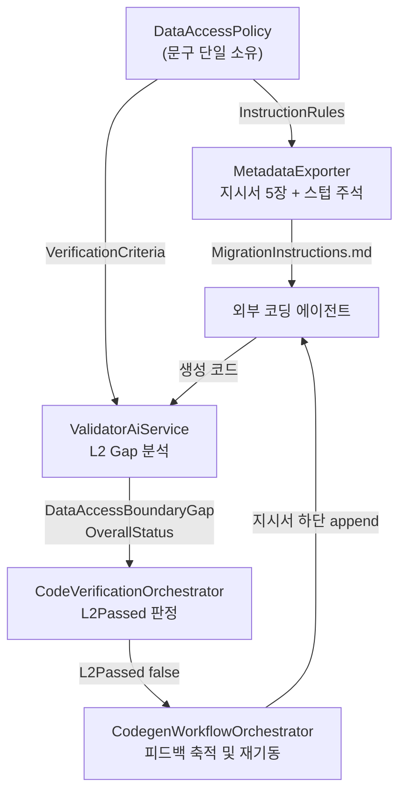

# 하이브리드 데이터 액세스 경계 규칙 설계

- 작성일: 2026-08-03
- 상태: 설계 승인됨 (구현 계획 수립 전)

## 배경

외부 코딩 에이전트가 생성하는 통합 배치 코드에 ORM을 도입하고 싶다는 요구에서 출발했다. 현행 설계를 코드 수준에서 확인한 결과, ReSet은 SQL 매퍼(Dapper / MyBatis)를 명시적으로 선택하고 ORM을 배제하고 있다.

| 위치 | 현행 내용 |
|---|---|
| `MetadataExporter.cs:532` | "반드시 명세서에 있는 원본 DML(SELECT/INSERT/UPDATE/DELETE) 로직을 모두 프로그래밍 언어의 **텍스트 쿼리로 풀어서 100% 완전하게** 작성" |
| `MetadataExporter.cs:540` | C#: "데이터베이스 접근은 ADO.NET(또는 Dapper)를 사용" |
| `MetadataExporter.cs:555` | Java: "데이터베이스 접근은 MyBatis(또는 Spring Data JDBC)를 사용" |
| `MetadataExporter.cs:615-704` | `AbstractSettleTasklet` 스텁이 `RunBusinessSteps(IDbConnection conn, IDbTransaction tran, ...)` 계약과 `SET XACT_ABORT ON; SET TRANSACTION ISOLATION LEVEL SNAPSHOT;` 직접 실행에 기반 |

이 선택은 우연이 아니다. PRD 6장 3번(`docs/prd.md:155`)이 마이그레이션 성공을 **"레거시 SP 실행 데이터 대비 1:1 값 정합성 100% 일치"**로 정의하고, `ValidatorAiService.cs:40`의 L2 Gap 항목이 `"비즈니스 로직 및 쿼리 조건 불일치"`를 판정하며, Critic 채점 기준(`AiService.cs:2012,2016`)이 NOLOCK 잔존과 `GOTO` 분기를 **의사코드 텍스트에서** 검사한다. SQL이 코드에 보이는 상태가 검증 능력의 전제다.

반면 ReSet은 ORM을 배격하지 않는다. `AiService.cs:1722-1725`가 이미 `modern OOP/ORM pseudocode`, `parameterized queries or safe query builders`, `specific ORM read-only options`를 언급하고, 지시서 지침 3·4번(`MetadataExporter.cs:528-529`)이 Repository/DAO 계층 분리와 DIP 준수를 요구한다. 즉 현행 철학이 배격하는 것은 ORM이 아니라 **동적 SQL 문자열 조립과 인젝션**이다.

전면 ORM 전환은 다음 이유로 채택하지 않았다.

- `MERGE`, `#TempTable` 파이프라인, `OUTPUT INSERTED.*`, 세션 수준 격리 제어에 EF Core/JPA 등가물이 없다. 에이전트는 결국 `FromSqlRaw`/native query로 도피하고, SQL이 사라지지 않은 채 가시성만 잃는다
- set-based 대량 처리가 row-by-row로 풀리면 정합성이 맞아도 야간 배치 윈도우를 초과한다
- Critic 채점 기준이 검사할 텍스트가 사라져 품질 게이트가 **조용히** 무력화된다. 게이트가 없어진 사실을 아무도 관측하지 못하는 상태가 가장 위험하다

따라서 정합성 리스크는 현행 수준으로 유지하면서 ORM의 유지보수 이득 중 값이 큰 것만 취하는 하이브리드를 채택한다.

## 목표와 범위

### 목표

에이전트가 생성하는 코드에서 SQL과 ORM의 경계를 규칙으로 명시하고, 위반이 L2 검증에서 결함으로 판정되어 자가 수정 루프를 재기동시키도록 한다.

### 결정 사항

| 항목 | 결정 | 근거 |
|---|---|---|
| 강제 수준 | 문구 + L2 채점. 기계 검증 없음 | ReSet 기존 품질 게이트 방식과 동일 |
| 설정 구조 | 설정 키 없이 하이브리드 단일 방식으로 교체 | 지시서·프롬프트 3곳이 각각 변형을 갖는 것을 피한다. AGENTS.md의 문구 단일 소유 원칙 |
| 경계 기준 형태 | ORM 허용 목록법 | 목록에 없으면 SQL이므로, 판단이 애매할 때 안전한 쪽(SQL)으로 실패한다 |
| 채점 지점 | 생성 코드 단계 (Validator L2) | 계획서 의사코드는 T-SQL 정합성 기준선으로 보존한다 |
| 스텁 처리 | 주석 + 패턴 예시만 추가 | 스텁이 `System.Data`만 쓰는 상태를 유지해 EF Core에 결합되지 않는다. 지시서 지침 9번의 "임의 구조 금지"와 충돌하지 않는다 |
| Gap 표현 | 독립 필드 `DataAccessBoundaryGap` 신설 | AGENTS.md 범주 4의 "상태를 다른 항목의 널 여부로 대체 판정하지 말라" 원칙 |

### 범위 밖

- `AiService`의 **통합** 계획 프롬프트(`GenerateConsolidatedBatchPlanAsync`, `:1871-1946`)와 Critic 5대 기준(`ReviewConsolidatedPlanAsync`, `:1997-2019`) — 계획서 의사코드는 T-SQL로 유지한다. 단, 단일 SP 계획 프롬프트(`GenerateBatchMigrationPlanAsync`, `:1722`)의 `ORM` 한 단어 제거는 범위에 포함한다 (아래 "컴포넌트별 변경 5" 참조)
- `MechanicalValidator` 규칙 추가 — 기계 검증 배제 결정에 따름
- ArchUnit/NetArchTest 규칙 자동 생성 — 아래 "잔여 리스크"에 승격 지점으로 기록
- `MigrationSettings:DataAccessStyle` 설정 키 — YAGNI

## 경계 규칙 본문

지시서와 L2 프롬프트가 **같은 문장**을 공유한다. 두 곳에 다른 문구가 생기면 에이전트와 검증자가 서로 다른 기준을 갖게 된다.

### ORM 허용 목록

ORM은 아래 4가지 용도에만 허용한다. 목록에 없는 모든 데이터 액세스는 파라미터 바인딩된 SQL로 작성한다. 판단이 애매하면 SQL을 택한다.

1. 엔티티/DTO 타입 정의 및 조회 결과 객체 매핑
2. 마스터·공통코드 등 참조 데이터의 단건/소량 조회
3. 체크포인트 상태 읽기/쓰기 (`ICheckpointRepository` 구현)
4. 배치 실행 이력·로그의 단건 기록

### SQL 필수

- 정산 대상 테이블의 대량 SELECT/INSERT/UPDATE/DELETE
- 집계(`GROUP BY`), `UNION`/`UNION ALL`, 다중 테이블 JOIN
- 청킹 `WHILE` 루프와 그 내부 DML, 루프별 `BEGIN TRAN`/`COMMIT TRAN` 경계
- Shadow 테이블 생성·스왑·복원, 보상 트랜잭션 `DELETE`
- 세션 제어 (`SET XACT_ABORT ON`, `SET TRANSACTION ISOLATION LEVEL SNAPSHOT`)
- 크로스 DB 3부 식별자 참조 쿼리

### 경계와 무관하게 항상 적용되는 조항

1. ORM은 반드시 `RunBusinessSteps`가 받은 `conn`/`tran`에 참여한다. 새 커넥션이나 새 트랜잭션 생성 금지 (C#: `Database.UseTransaction`, Java: 동일 `DataSource`/`TransactionManager` 공유)
2. ORM 경로에서도 SQL 문자열 연결 금지, 파라미터 바인딩 강제
3. 지연 로딩(lazy loading) 금지 — 배치에서 N+1을 유발한다. 명시적 조회만
4. 허용 목록 항목이라도 반환 행 수의 상한을 예측할 수 없으면 SQL로 내린다

### 타겟별 스택

| 타겟 | SQL 경로 | ORM 경로 |
|---|---|---|
| C# | Dapper (ADO.NET) | EF Core |
| Java | MyBatis | Spring Data JPA |

## 아키텍처

### 신규: `src/ReSet.Core/Services/DataAccessPolicy.cs`

경계 규칙 문구의 단일 소유자. `VerificationBanner`가 배너 문구를, `VerificationDocumentFormatter.StatusLabel`이 상태 표기를 단독 소유하는 기존 패턴을 따른다. 의존성이 없는 순수 문자열 생성기라 단위 테스트가 단순하다.

| 멤버 | 반환 | 소비자 |
|---|---|---|
| `InstructionRules(string targetLanguage)` | 지시서 5장용 마크다운 블록 (허용 목록 + SQL 필수 + 항상 조항 + 스택 표) | `MetadataExporter` |
| `VerificationCriteria` | L2 프롬프트용 판정 기준 문장 | `ValidatorAiService` |
| `TaskletOrmComment` | 스텁 삽입용 조항 1 준수 패턴 주석 | `MetadataExporter` |

`VerificationCriteria`는 `InstructionRules`와 같은 규칙을 **판정형**으로 다시 쓴다. 지시서는 "이렇게 작성하라", 검증 기준은 "이것을 위반했는지 확인하라"가 되어야 하므로 문장 형태가 다르고, 지시서에만 필요한 스택 표와 패키지 안내는 제외한다. 담을 내용은 다음 세 가지다.

1. ORM이 허용 목록 4항목 밖에서 쓰였는지
2. 항상 조항 4개(외부 트랜잭션 참여, 문자열 연결 금지, 지연 로딩 금지, 행 수 상한 불명 시 SQL) 위반이 있는지
3. 위반이 하나라도 있으면 `OverallStatus`를 `MATCH`로 두지 말고 최소 `PARTIAL`로 판정하라는 지시

`TaskletOrmComment`는 조항 1의 준수 패턴을 C# 주석으로 담는다. 스텁이 `System.Data`만 참조하는 상태를 유지하기 위해 실행 코드가 아닌 주석으로만 넣는다.

```csharp
// [데이터 액세스 경계] ORM(EF Core)은 MigrationInstructions.md 5장의 허용 목록에 한해 사용한다.
// 사용할 경우 반드시 아래 conn/tran에 참여시켜야 하며, 새 커넥션이나 새 트랜잭션을 만들면
// 검증기의 Rollback 격리(CSharpReflectionRunner)가 깨져 정합성 대조 결과가 오염된다.
//   var options = new DbContextOptionsBuilder<XxxContext>().UseSqlServer((SqlConnection)conn).Options;
//   using var db = new XxxContext(options);
//   db.Database.UseTransaction((SqlTransaction)tran);
// 정산 대상 대량 DML, 집계, 청킹 루프, Shadow 처리, 세션 제어는 파라미터 바인딩 SQL로 작성한다.
```

`ReSet.Validator.Core.csproj`가 `ReSet.Core`를 참조하므로 `ValidatorAiService`에서 직접 접근할 수 있다.

지시서와 L2 프롬프트가 모두 한국어이므로 문장을 그대로 공유한다. AGENTS.md 범주 4의 영문 프롬프트 원칙은 `AiService`의 분석·계획 프롬프트에 적용되는 규칙이고, 이 설계는 그쪽을 건드리지 않으므로 충돌하지 않는다.

`targetLanguage`가 C#/Java가 아닌 경우에도 공통 규칙과 허용 목록은 반환하고 스택 표만 생략한다. 현행 `MetadataExporter.cs:538-569`는 C#/Java가 아니면 5장이 통째로 비므로, 이 결함을 함께 고친다.

### 데이터 흐름



## 컴포넌트별 변경

### 1. `MetadataExporter.cs` — 6지점

| 위치 | 변경 |
|---|---|
| `:528` 지침 3번 | "프레임워크 권장 패턴을 따를 일" → "5장 경계 규칙을 준수하며 권장 패턴을 따를 일" |
| `:532` 지침 7번 | placeholder 금지는 유지. "원본 DML을 텍스트 쿼리로 100%" → "SQL 경로로 분류된 DML은 조건절·집계식·에러코드를 축약 없이 파라미터 바인딩 SQL로 작성. ORM은 5장 허용 목록에 한해 사용" |
| `:537-569` 5장 | 기존 한 줄 스택 문장을 `DataAccessPolicy.InstructionRules(targetLanguage)` 블록으로 대체. 멀티 DB 커넥션 JSON/YAML 예시는 유지 |
| `:588` todo 0번 | 패키지 목록에 EF Core(C#) / Spring Data JPA(Java) 추가 |
| `:590` todo 2번 | "데이터 액세스 계층 구현"에 경계 규칙 준수 명시 |
| `:626` 스텁 | `RunBusinessSteps` 선언 위에 `TaskletOrmComment` 삽입 |

`ExportConsolidatedMigrationInstructionsAsync`의 시그니처는 변경하지 않는다. 설정 키를 도입하지 않으므로 파라미터 추가가 없고, 호출부 2곳(`Program.cs:819,1327`)과 기존 테스트 6곳이 수정 없이 컴파일된다.

`AppendFeedbackToInstructionsAsync`(`:857`)는 손대지 않는다. 경계 위반 피드백도 기존 축적 경로를 그대로 탄다.

### 2. `ValidatorAiService.cs` — L2 경계 검증

**게이트의 실체**: 자가 수정 루프는 `CodeVerificationOrchestrator.cs:151`의 `L2Passed = gapReport.OverallStatus == "MATCH"`로만 판정한다. `GapReport.HasGaps`는 현재 테스트에서만 쓰인다(`ValidatorTests.cs:154,173`). 따라서 필드 추가만으로는 위반이 기록되고도 조용히 통과한다. 프롬프트에 **"경계 위반이 있으면 `OverallStatus`를 `MATCH`로 두지 말고 최소 `PARTIAL`로 판정하라"**를 명시해야 게이트가 성립한다.

변경 내용:

- 검증 항목 5번 추가 (`DataAccessPolicy.VerificationCriteria` 삽입)
- JSON 스키마에 `DataAccessBoundaryGap` 필드 추가
- `OverallStatus` 판정 규칙 명시

프롬프트 조립은 **보간 대신 문자열 연결**로 한다.

```
systemPrompt = PromptHead + DataAccessPolicy.VerificationCriteria + PromptTail
```

현행 `@"..."` verbatim 문자열 안에 JSON 예시 중괄호가 있어, `$@"..."`로 전환하면 모든 중괄호를 `{{ }}`로 이스케이프해야 한다(AGENTS.md 범주 7의 C# 보간 이스케이프 규칙). 연결 방식이 이 함정을 원천 회피한다.

`ParseGapReport`는 `JsonSerializer.Deserialize<GapReport>`를 쓰므로 새 필드가 자동 파싱된다. 파싱 코드 변경은 없다.

### 3. `GapReport.cs`

`DataAccessBoundaryGap` 필드 추가 및 `HasGaps` 조건에 포함. `HasGaps`가 현재 게이트가 아니더라도, 항목을 빼두면 이후 `HasGaps`를 게이트로 쓰는 코드가 생겼을 때 경계 위반만 조용히 누락된다.

### 4. Gap 항목 5번 소비 지점 4곳

기존 번호 체계에 이어 "5. 데이터 액세스 경계 Gap"으로 표기한다.

| 파일 | 역할 |
|---|---|
| `ReSet.Cli/ValidationUiProxy.cs:80` | 분석기 TUI 패널 |
| `ReSet.Validator.Cli/ConsoleUserInteraction.cs:45` | 검증기 TUI 패널 |
| `Validator.Core/CodeVerificationOrchestrator.cs:258` | `ValidationReport.md` 마크다운 |
| `Validator.Core/CodegenWorkflowOrchestrator.cs:88` | 자가 수정 루프 피드백 축적 |

### 5. `AiService.cs:1722` — 표현 정합성

단일 SP 계획 프롬프트의 `modern OOP/ORM pseudocode`에서 `ORM` 한 단어를 제거한다. 의사코드 구조는 바뀌지 않는다.

이 경로의 실제 상태를 확인한 결과는 다음과 같다.

- TUI 메뉴 1(개별 SP 분석)은 계획서를 생성하지 않는다 (`Program.cs:1051-1052`의 명시적 주석)
- CLI 배치 모드(`--all`/`--sp`)에서는 여전히 생성된다 (`Program.cs:689` → `:692` → `:733`, `MigrationSettings:Enabled` 기본값 `true`)
- 이 계획서는 코딩 에이전트에 전달되지 않는다. AGENTS.md 범주 6이 "개별 SP 분석 시에는 에이전트 지시서 번들을 생성하지 않으며, 통합 배치 시에만"이라고 규정한다

따라서 이 변경은 생성 코드에 영향이 없고, 사람이 읽는 문서에서 지시서와 어긋나는 표현을 없애는 코스메틱 수정이다.

## 오류 처리

이 설계는 새로운 실패 경로를 만들지 않는다. 기존 정책을 그대로 따른다.

- `DataAccessPolicy`는 순수 문자열 생성기로 I/O도 예외 발생 지점도 없다. 알 수 없는 타겟 언어는 예외가 아니라 스택 표 생략으로 처리한다
- L2 AI 호출 실패는 기존 `catch`가 `OverallStatus = "MISMATCH"`로 반환한다(`ValidatorAiService.cs:76-84`). 경계 검증 항목이 추가되어도 이 동작은 불변이다
- 새 `catch`를 도입하지 않으므로 `CancellationPolicyTests`의 기준선(`cancellation-policy-baseline.txt`)은 변동이 없어야 한다

## 테스트

### 신규 `tests/ReSet.Core.Tests/DataAccessPolicyTests.cs`

- `InstructionRules("C#")`은 Dapper·EF Core를 담고 MyBatis·JPA를 담지 않는다 (Java는 역)
- 허용 목록 4항목이 모두 존재한다
- SQL 필수 열거에 청킹·Shadow·세션 제어가 존재한다
- 항상 조항 4개가 존재한다
- `VerificationCriteria`는 `PARTIAL` 판정 규칙 문장을 담는다
- 알 수 없는 타겟 언어(`"Kotlin"`)에도 공통 규칙과 허용 목록을 반환하고 스택 표만 생략한다

### 수정 대상

| 파일 | 추가할 단정 |
|---|---|
| `MetadataExporterTests.cs` | 지시서에 경계 규칙 블록이 실린다 / 지침 7번의 placeholder 금지 문구가 유지된다 / todo.md 0번에 ORM 패키지가 실린다 / 스텁에 트랜잭션 참여 주석이 실린다 |
| `ValidatorAiServiceTests.cs` | 프롬프트에 경계 기준이 실린다 (`report.SystemPrompt` 단정) / 경계 위반이 담긴 `PARTIAL` 응답이 필드로 파싱된다 |
| `ValidatorTests.cs:154,173` | `DataAccessBoundaryGap`만 채워진 경우 `HasGaps`가 참이다 |
| `CodeVerificationOrchestratorTests.cs:49,115` | JSON 픽스처에 필드 추가 |

구현은 `superpowers:test-driven-development`를 적용해 실패하는 테스트를 먼저 작성한다. 게이트는 `dotnet build` 및 `dotnet test` 전량 통과다.

## 잔여 리스크

경계 준수의 최종 판정자는 대체로 LLM이다. 허용 목록 위반과 SQL 필수 항목 위반은 L2의 AI 판단에 남아 있다.

**항상 조항 1(외부 트랜잭션 참여)은 기계 검증으로 승격됐다.** 이 조항만 떼어낸 이유는 위반의 결과가 다르기 때문이다. 다른 조항 위반은 코드 품질 문제지만, 이 조항 위반은 검증기의 Rollback 격리(`CSharpReflectionRunner`)를 깨뜨려 1:1 정합성 대조 결과 자체를 신뢰할 수 없게 만든다.

승격 위치는 당초 계획한 생성 프로젝트의 아키텍처 테스트가 아니라 ReSet 자신의 L1이다. `TransactionEnlistmentCheck`가 `CsValidatorPlugin`·`JavaValidatorPlugin`에서 호출된다. 이유 두 가지:

- 에이전트는 생성된 테스트 파일을 지울 수 있지만 ReSet의 검증기는 지울 수 없다.
- 두 언어 플러그인이 이미 있어 대칭적으로 적용되고, 생성 프로젝트에 새 종속성이 붙지 않는다.

당초 승격 지점으로 적었던 NetArchTest 경로는 전제가 틀렸다. NetArchTest의 내장 fluent 조건은 타입 수준(이름·상속·수정자·네임스페이스·직접 타입 의존)만 다루므로 "컨텍스트 생성이 주입된 트랜잭션을 받는지"를 표현할 수 없다. `MeetCustomRule`로 Mono.Cecil `TypeDefinition`을 받아 IL을 직접 걷는다면 가능하지만, 그 IL 분석 코드를 ReSet이 생성해 유지해야 한다.

기계 검사는 명백한 위반만 잡는다. 오탐이 정상 코드를 파이프라인에서 막기 때문이다. 남는 구멍: DI로 주입된 컨텍스트가 참여하지 않는 경우는 파일 단위 검사로 판정할 수 없어 L2에 남는다.

## 작업 공간과 문서 동기화

AGENTS.md 범주 8에 따라 `superpowers:using-git-worktrees`로 격리 작업 공간에서 구현하고, 빌드·테스트 통과 후 병합한다.

구현 완료 후 `reset-doc-sync` 스킬로 문서를 갱신한다.

| 문서 | 갱신 내용 |
|---|---|
| `AGENTS.md` 범주 6 | 지시서가 경계 규칙을 포함해야 함 + 문구는 `DataAccessPolicy`가 단독 소유 |
| `AGENTS.md` 서비스 목록 | Core에 `DataAccessPolicy.cs` 추가, `GapReport` 5번째 항목 설명 |
| `README.md` 3장·4장 | 코딩 에이전트 브릿지의 하이브리드 정책, Validator의 경계 Gap 검출 |
| `docs/architecture.md` 4.6·5.3절 | L2 Gap 5항목, 지시서 번들의 경계 규칙 |
