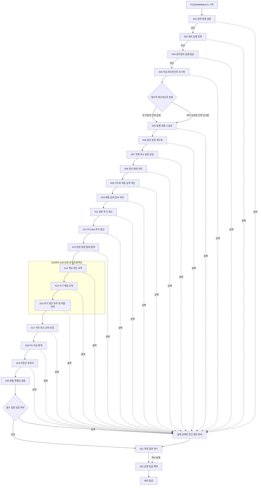

# POQSettleBatch11 C# 통합 배치 마이그레이션 계획

## 통합 배치 아키텍처 개요

### 1. 목적과 범위

`POQSettleBatch11`은 14개 레거시 저장 프로시저의 업무 의미를 22개 애플리케이션 단계로 전환하는 C# 오케스트레이션 배치다. 데이터베이스에는 신규 프로시저·함수·트리거를 만들지 않으며, C# 애플리케이션이 SQL 문장을 직접 전송하고 실행 순서, 트랜잭션, 오류 처리, 재시작 및 최종 상태 게시를 소유한다.

핵심 목표는 다음과 같다.

- 레거시 프로시저의 DML 순서, 필터, 조인, `UNION ALL`, `GROUP BY`, UDF 호출 및 금액식을 보존한다.
- `SETTLE_POQ_DB.dbo.TSettleMst` 작성 단계를 직렬화한다.
- 원본 프로시저별 논리 트랜잭션 경계를 유지한다.
- 모든 데이터베이스 작업에 SNAPSHOT 격리를 적용하고 원본의 모든 `NOLOCK` 힌트를 제거한다.
- 원본 입력·출력 인터페이스와 오류 코드를 보존한다.
- 체크포인트 판정은 단계 외부의 오케스트레이터가 수행한다.
- S14~S16을 하나의 연결과 하나의 복합 트랜잭션으로 실행한다.
- S13 이후 원장을 동결하고 요약·통계·미정산 결과를 검증한다.
- 신규 배치 테이블은 `batch`, 필요한 섀도 테이블은 `batch_shadow` 스키마만 사용한다.

전체 배치를 하나의 장기 트랜잭션으로 묶거나, 집계·교차 데이터베이스 작업을 독립 커밋 청크로 분할하지 않는다. 비즈니스 테이블 이름은 SQL에 리터럴로 기술하며 동적으로 조립하지 않는다.

### 2. 논리 애플리케이션 구성

구현체가 보장해야 할 논리 구성요소는 다음과 같다. 구체적인 데이터 접근 라이브러리나 프레임워크 형식은 구현 단계에서 결정한다.

| 구성요소 | 책임 |
|---|---|
| 실행 진입점 | 업무일자와 실행 모드를 수신하고 코디네이터를 호출 |
| 배치 코디네이터 | S01~S22 순서, 실패 분기, 재시작 건너뛰기 및 최종 종료 제어 |
| 실행 컨텍스트 | `RunId`, `BusinessYmd`, 작업명, 실행 모드, SQL Server 기준 현재일을 불변 값으로 유지 |
| 연결 공급자 | 동일 SQL Server 인스턴스의 대상 데이터베이스에 접근 가능한 연결 제공 |
| 단계 실행기 | 애플리케이션이 보내는 SQL 문장과 문장별 오류 코드를 연결 |
| 트랜잭션 정책 | 단계별 단일 트랜잭션과 S14~S16 복합 트랜잭션의 개시·커밋·롤백 보장 |
| 저널 저장소 | `batch.BatchStepJournal`의 단계 소유 행 기록 |
| 체크포인트 저장소 | `batch.BatchCheckpoint` 조회 및 커밋 후 `Succeeded` 전환 |
| 통제 합계 서비스 | `batch.BatchControlTotal`에 동결·최종 합계 기록 |
| 정합성 검증 서비스 | 검증 SQL 실행 및 `batch.BatchValidationIssue` 적재 |
| 호환 금액 정책 | SQL 호환 반올림·절사·NULL·다중 컬럼 동시 평가 규칙 보존 |
| 구조화 진단 | 단계, 문장 식별자, 원본 오류 코드, 실행 시간 및 오류 메시지 기록 |

### 3. 실행 컨텍스트와 인터페이스 원칙

공통 실행 컨텍스트는 다음 값을 유지한다.

- `RunId`: S02에서 `batch.BatchRun.RunId`의 IDENTITY 값으로 발급하며 `SCOPE_IDENTITY()`로 읽는다.
- `JobName`: 고정값 `POQSettleBatch11`.
- `BusinessYmd`: 정확히 8자리인 유효한 `YYYYMMDD`.
- 실행 모드: 패리티 실행, 정합성 대조 또는 재시작.
- 추가 정산 순서: 기본값 S11 후 S12.
- SQL Server 기준 현재 날짜: S11 등 서버 달력 날짜가 필요한 단계에서 데이터베이스로부터 조회한다.
- 단계별 제한 시간 및 취소 정책.
- 모든 데이터베이스 작업에 대한 SNAPSHOT 격리 의무.

`BusinessYmd`는 공통 값이지만 단계별 의미는 보존한다.

- S05: 요율 스냅샷 `YMD`
- S06: 거래일, 부분취소일, 환불 요청일
- S07: 취소일
- S08~S10: 원장 `YMD`
- S11~S12: `ResYMD`, `ReqYMD`, `ProcYMD`
- S15: `EDIReqYmd`
- S18: `INYMD`

재시작·건너뛰기 입력은 레거시 단계 인터페이스에 추가하지 않는다. 오케스트레이터가 단계 호출 전에 `batch.BatchCheckpoint`를 조회하고 `CheckpointStatus=N'Succeeded'`인 단계는 호출하지 않는다. 호출된 단계는 사전 지급완료 가드를 포함한 전체 업무 로직을 무조건 수행한다.

### 4. 신규 배치 객체와 상태 계약

신규 테이블은 다음 고정 이름만 사용한다.

- `batch.BatchRun`
- `batch.BatchRunLock`
- `batch.BatchStepJournal`
- `batch.BatchCheckpoint`
- `batch.BatchValidationIssue`
- `batch.BatchControlTotal`

기존 초안의 `batch.ControlTotal`은 `batch.BatchControlTotal`로, `batch.ReconciliationResult`는 `batch.BatchValidationIssue`로 정규화한다. 다른 이름이나 별도 작업 전용 스키마를 만들지 않는다.

상태값은 다음 계약만 사용한다.

- 실행: `Running`, `Succeeded`, `Failed`, `Restarting`
- 단계 저널: `Running`, `Succeeded`, `Failed`, `Skipped`
- 체크포인트: `Pending`, `Succeeded`
- 잠금: `Held`, `Released`
- 검증 심각도: `Info`, `Warning`, `Error`, `Critical`

`Completed`, `Committed`, `Starting`, `ReconciliationFailed` 같은 별도 상태값을 저장하지 않는다.

S01은 `RunId` 발급 전 수행되는 선행 검증이다. 신규 실행에서 S01 완료 시점에는 아직 저널 키가 없으므로, S02가 IDENTITY 값을 회수한 직후 코디네이터가 S01 소유의 완료 저널·체크포인트 행을 기록한다. S02 이후 각 단계는 자신이 시작할 때 자신의 저널 행과 체크포인트 행을 직접 삽입하고 자신이 삽입한 행만 갱신한다.

### 5. 금액 및 SQL 의미 보존

- 금액을 애플리케이션에서 다룰 때는 십진수 연산만 사용한다.
- SQL `ROUND`의 세 번째 인자가 0이면 반올림, 0이 아니면 절사라는 의미를 보존한다.
- 기본 은행가 반올림으로 대체하지 않는다.
- `numeric` 또는 `decimal`에서 `INT`로 변환할 때 음수도 0 방향으로 절사한다.
- 다단계 `ROUND`, `/1.1`, 재반올림 및 차감 순서를 축약하지 않는다.
- `UPDATE`의 복수 SET 표현식은 모두 갱신 전 행 값으로 평가된다는 SQL 의미를 보존한다.
- `CLTOTAL`, `PGTOTAL`, `POQINCOME`은 예외 처리, 부호 반전 및 최저수수료 적용 후 계산한다.
- 원본의 `UNION ALL`을 `UNION`이나 중복 제거 처리로 바꾸지 않는다.
- `UNION ALL`의 모든 브랜치는 같은 컬럼을 같은 순서로 투영하며 `USESTATE` 등 분기 판별 상수를 각 브랜치에 명시한다.
- 교차 데이터베이스 조인과 UDF 기반 계산은 집합 기반 SQL로 유지한다.
- 원본의 모든 `NOLOCK` 및 `WITH (NOLOCK)` 힌트는 제거한다. 이는 더티 리드를 없애는 의도적인 현대화 변경이며, SNAPSHOT 기반 검증 결과를 레거시 결과와 대조한다.
- 데이터베이스 단위 설정 변경은 이 계획의 범위가 아니며 `ALTER DATABASE SET READ_COMMITTED_SNAPSHOT ON`을 실행하지 않는다.

### 6. 승인 단계와 의존 관계

| 단계 | 역할 및 레거시 원천 | 대상 | 실행 및 트랜잭션 관계 |
|---|---|---|---|
| S01 | 입력 환경 검증 | 없음 | 선행 검증, 일반 실패 코드 `-9010` |
| S02 | 배치 실행 등록 | `batch.BatchRun` | IDENTITY `RunId` 발급, 일반 실패 코드 `-9020` |
| S03 | 업무일자 실행 잠금 | `batch.BatchRunLock` | 작업명과 업무일자 단일 소유권, 일반 실패 코드 `-9030` |
| S04 | 저널 체크포인트 초기화 | `batch.BatchStepJournal`, `batch.BatchCheckpoint` | 실행 재개 지점 준비, 일반 실패 코드 `-9040` |
| S05 | `dbo.UP_Util_PG_Client_CMRate_Ins` | 5개 요율 스냅샷 | 단일 트랜잭션, S06 이전 필수 |
| S06 | `dbo.UP_UTIL_SETTLE_INS` | `SETTLE_POQ_DB.dbo.TSettleMst` | 날짜 원장 삭제 및 3개 `UNION ALL` 입력 재구축 |
| S07 | `dbo.UP_UTIL_SETTLE_CANCEL_INS` | `SETTLE_POQ_DB.dbo.TSettleMst` | S06 정상 원장을 참조해 전체 취소 삽입 |
| S08 | `dbo.UP_UTIL_SETTLE_EXCEPTION_PROC` | `SETTLE_POQ_DB.dbo.TSettleMst` | 18개 UPDATE를 원본 순서로 실행 |
| S09 | `dbo.UP_UTIL_SETTLE_COMM_UPD` | `SETTLE_POQ_DB.dbo.TSettleMst` | 15개 UPDATE와 최종 합계 계산 |
| S10 | `dbo.UP_UTIL_SETTLE_EXPECT_PROC` | `SETTLE_POQ_DB.dbo.TSettleMst` | 수납·지급 상태와 예정일 확정 |
| S11 | `dbo.UP_UTIL_SETTLE_INS_EXTRA` | `SETTLE_POQ_DB.dbo.TSettleMst` | 일반 추가 정산 단일 트랜잭션 |
| S12 | `dbo.UP_UTIL_SETTLE_INS_EXTRA4PLCARD` | `SETTLE_POQ_DB.dbo.TSettleMst` | S11 후 직렬 실행 |
| S13 | 원장 동결 통제 합계 | `batch.BatchControlTotal` | 원장 기준점 기록, 일반 실패 코드 `-9130` |
| S14 | `dbo.UP_Util_Settle_Summary` 핵심 로직 | 4개 요약 테이블 | S14~S16 공유 트랜잭션 시작, 자식 호출은 중복 실행하지 않음 |
| S15 | `dbo.UP_Util_Settle_Summary_AcqManual` | `SETTLE_POQ_DB.dbo.TSettleByOUT` | S14 공유 트랜잭션에 참여 |
| S16 | `dbo.UP_UTIL_SETTLE_SUMMARY_EXTRA` | 4개 요약 테이블 | 성공 시 S14~S16을 한 번만 커밋 |
| S17 | `dbo.UP_UTIL_SETTLE_SUMMARY_ETC` | `SETTLE_POQ_DB.dbo.TSettleByOUT` | 요약 복합 커밋 후 사후 취소 보정 |
| S18 | `dbo.UP_UTIL_STAT_PGCOLLECT_INS` | `SETTLE_POQ_DB.dbo.TStatPGCollect` | 동결 원장 기준 PG 수납 통계 |
| S19 | `dbo.UP_UTIL_SETTLE_PROC_ETC` | `SETTLE_POQ_DB.dbo.TSettleMiss` | 최종 지급 상태 기준 후취정산 |
| S20 | 통합 정합성 검증 | `batch.BatchValidationIssue`, `batch.BatchControlTotal` | 필수 검증 실패 시 성공 게시 차단, 일반 실패 코드 `-9200` |
| S21 | 최종 결과 게시 | `batch.BatchRun`, 저널, 체크포인트 | 성공 또는 실패 상태 확정, 일반 실패 코드 `-9210` |
| S22 | 실행 잠금 해제 | `batch.BatchRunLock` | 항상 마지막에 현재 소유 잠금만 해제, 일반 실패 코드 `-9220` |

S05~S12는 모두 `TSettleMst` 또는 직접 의존 데이터를 변경하므로 반드시 직렬 실행한다. S14~S17은 요약 대상이 겹치므로 직렬 실행한다. S18과 S19는 대상 테이블이 다르지만 초기 패리티 모드에서는 승인된 단계 순서를 그대로 보존해 S17→S18→S19로 직렬 실행한다. 병렬 실행은 본 계획에 포함하지 않는다.

### 7. 레거시 인터페이스 매핑

입력 파라미터만 SQL 바인딩으로 전달한다. 출력 파라미터는 신규 프로시저 호출로 바인딩하지 않으며, 애플리케이션의 단계 결과에 다음과 같이 대응시킨다.

| 단계 | 원본 입력과 바인딩 | 원본 출력 매핑 |
|---|---|---|
| S05 | `@pi_strYMD CHAR(8) -> p_ymd` | `@po_intRetVal INT -> LegacyReturnCode` |
| S06 | `@pi_strYMD CHAR(8) -> p_ymd` | `@po_intRetVal INT -> LegacyReturnCode` |
| S07 | `@pi_strYMD CHAR(8) -> p_ymd` | `@po_intRetVal INT -> LegacyReturnCode` |
| S08 | `@pi_strYMD CHAR(8) -> p_ymd` | `@po_intRetVal INT -> LegacyReturnCode` |
| S09 | `@pi_strYMD CHAR(8) -> p_ymd` | `@po_intRetVal INT -> LegacyReturnCode` |
| S10 | `@pi_strYMD CHAR(8) -> p_ymd` | `@po_intRetVal INT -> LegacyReturnCode` |
| S11 | `@pi_strYMD CHAR(8) -> p_ymd` | `@po_intRetVal INT -> LegacyReturnCode` |
| S12 | `@pi_strYMD CHAR(8) -> p_ymd` | `@po_intRetVal INT -> LegacyReturnCode` |
| S14 | `@pi_strYMD CHAR(8) -> p_ymd` | `@po_intRetVal INT -> LegacyReturnCode` |
| S15 | `@pi_strYMD VARCHAR(8) -> p_ymd` | `@po_intRetVal INT -> LegacyReturnCode` |
| S16 | `@pi_strYMD CHAR(8) -> p_ymd` | `@po_intRetVal INT -> LegacyReturnCode` |
| S17 | `@pi_strYMD CHAR(8) -> p_ymd` | `@po_strErrMsg VARCHAR(256) -> LegacyErrorMessage`, `@po_intRetVal INT -> LegacyReturnCode` |
| S18 | `@pi_strYMD CHAR(8) -> p_ymd` | `@po_intRetVal INT -> LegacyReturnCode` |
| S19 | `@pi_strYMD CHAR(8) -> p_ymd` | `@po_intRetVal INT -> LegacyReturnCode` |

성공 시 출력값을 설정하지 않던 레거시 단계는 애플리케이션의 정규화 상태를 `Succeeded`로 확정하되 `LegacyReturnCode`는 NULL로 유지한다. 성공 코드 0을 명시하던 S14~S17 및 S19는 원본 의미에 따라 0을 보존한다.

### 8. 오류 코드 계약

| 단계 | 보존 오류 코드 |
|---|---|
| S01 | 예약 블록 `-9010..-9019`, 일반 실패 `-9010` |
| S02 | 예약 블록 `-9020..-9029`, 일반 실패 `-9020` |
| S03 | 예약 블록 `-9030..-9039`, 일반 실패 `-9030` |
| S04 | 예약 블록 `-9040..-9049`, 일반 실패 `-9040` |
| S05 | `-9`, `-1`, `-2`, `-3`, `-4`, `-5`, `-6`, `-7`, `-8`, `-10` |
| S06 | `-9`, `-1`, `-2` |
| S07 | `-1` |
| S08 | `-101`, `-102`, `-1`, `-2`, `-3`, `-4`, `-5`, `-10`, `-11`, `-19`, `-20`, `-201`, `-21`, `-27`, `-28`, `-29` |
| S09 | `-1`, `-2`, `-4`, `-5`, `-6`, `-7`, `-8`, `-9`, `-10`, `-11`, `-12`, `-20`, `-21`, `-22`, `-23` |
| S10 | `-1`, `-2`, `-3`, `-4`, `-5`, `-10`, `-11`, `-12`, `-13`, `-15`, `-17` |
| S11 | `-9`, `-1`, `-2`, `-3`, `-4`, `-21` |
| S12 | `-9`, `-1`, `-2` |
| S13 | 예약 블록 `-9130..-9139`, 일반 실패 `-9130` |
| S14 | `0`, `-1`, `-2`, `-3`, `-4`, `-5`, `-6`, `-7`, `-8` |
| S15 | 성공 `0`, 실패 시 원본 `ERROR_NUMBER()`에 해당하는 정수 |
| S16 | `4000`, `4001`, `4002`, `4003`, `4004`, `4005`, `4006`, `4007`, `4008`, `0` |
| S17 | `1001`, `1002`, `0` |
| S18 | `-1` |
| S19 | `-3`, `0`, `4000` |
| S20 | 예약 블록 `-9200..-9209`, 일반 실패 `-9200` |
| S21 | 예약 블록 `-9210..-9219`, 일반 실패 `-9210` |
| S22 | 예약 블록 `-9220..-9229`, 일반 실패 `-9220` |

레거시 단계에는 새 오류 코드를 추가하지 않는다. 원본에서 코드가 없는 문장이 실패하면 `LegacyReturnCode`는 NULL로 두고 정확한 SQL 문장 식별자를 `ErrorMessage`에 기록한다. 제어 단계의 문장 상태 변수는 INT 0으로 초기화하고 해당 예약 블록의 정수만 대입한다.

### 9. 트랜잭션, 재시작 및 게시 정책

- 모든 단계의 데이터베이스 작업은 SNAPSHOT 격리에서 수행한다.
- S05~S13, S17~S22는 각 단계의 논리 작업을 하나의 트랜잭션으로 완료한다.
- S06, S11, S12, S14, S16, S18처럼 삭제 후 집계 삽입을 수행하는 단계도 독립 커밋 청크로 분할하지 않는다.
- S14~S16은 하나의 연결과 하나의 트랜잭션을 공유한다. S14와 S15는 자체 커밋을 수행하지 않으며 S16 성공 후 한 번만 커밋한다.
- S14~S16의 체크포인트는 복합 트랜잭션 커밋 후에만 세 단계 모두 `Succeeded`로 바꾼다.
- 단계의 비즈니스 커밋과 체크포인트 성공 기록 순서는 반드시 비즈니스 커밋이 먼저다.
- 커밋 결과가 불명확하면 체크포인트만으로 성공을 추정하지 않고 통제 합계와 대상 데이터 상태를 재검증한다.
- 실패 시 열린 단계 트랜잭션만 롤백하고 이전 단계의 확정 데이터는 유지한다.
- S21은 필수 단계 및 S20 검증이 성공한 경우만 `batch.BatchRun.RunStatus=N'Succeeded'`로 게시한다. 그 외에는 `Failed`로 게시한다.
- S22는 성공·실패와 무관하게 실행하며 `OwnerRunId`가 현재 `RunId`인 잠금만 `Released`로 전환한다.

## Mermaid 기반 통합 흐름도



흐름도의 기본 운영 모드는 전 단계 직렬 실행이다. S13 이후 S18과 S19는 데이터 대상만 보면 요약 단계와 독립적이지만, 패리티 검증 전에는 승인 순서 S14→S15→S16→S17→S18→S19를 변경하지 않는다. S14의 레거시 부모가 호출하던 S15·S16 로직은 별도 단계로 정확히 한 번만 실행하며 부모 SQL 안에서 다시 호출하지 않는다.

## 단계별 이행 상세 및 의사코드

### 공통 SQL 오류 추적 패턴

각 단계는 데이터베이스 작업을 시작하기 전에 자신의 `batch.BatchStepJournal` 행을 `Running`으로, `batch.BatchCheckpoint` 행을 `Pending`으로 삽입한다. 재시작 건너뛰기는 단계 외부에서 판정하며, 단계 내부에는 재시작·우회 입력을 두지 않는다.

레거시 단계의 실패 지점 변수는 NULL로 초기화하고 각 원본 DML 직전에 그 문장의 정확한 원본 오류 코드를 대입한다. 제어 단계는 INT 0으로 초기화하고 DML 직전에 해당 단계 예약 블록의 정수를 대입한다. 실패한 문장에 원본 코드가 없으면 새 코드를 만들지 않고 NULL과 문장 식별자로 기록한다.

```pseudocode
currentStepErrorCode = legacyStep ? NULL : 0
statementName = NULL
businessCommitted = false

controlConn = connectionFactory.open()
controlTx = controlConn.beginTransaction()

controlConn.execute(SQL_JOURNAL_START, {
    p_runId: runId,
    p_stepCode: stepCode
})
controlConn.execute(SQL_CHECKPOINT_START, {
    p_runId: runId,
    p_stepCode: stepCode
})

controlTx.commit()

try
{
    conn = connectionFactory.open()
    tx = conn.beginTransaction()

    // 모든 데이터베이스 문장은 SNAPSHOT 격리 의무를 만족해야 한다.
    // 설정 위치나 구체적 데이터 접근 메커니즘은 구현 라운드가 결정한다.

    statementName = "원본 DML 문장 식별자"
    currentStepErrorCode = originalStatementErrorCode
    conn.execute(SQL_BUSINESS_STATEMENT, originalInputBindings)

    tx.commit()
    businessCommitted = true

    successConn = connectionFactory.open()
    successTx = successConn.beginTransaction()

    successConn.execute(SQL_JOURNAL_SUCCESS, {
        p_runId: runId,
        p_stepCode: stepCode,
        p_legacyReturnCode: normalizedLegacySuccessCode
    })
    successConn.execute(SQL_CHECKPOINT_SUCCESS, {
        p_runId: runId,
        p_stepCode: stepCode
    })

    successTx.commit()
}
catch
{
    tx.rollbackIfOpen()

    failureConn = connectionFactory.open()
    failureTx = failureConn.beginTransaction()

    failureConn.execute(SQL_JOURNAL_FAILURE, {
        p_runId: runId,
        p_stepCode: stepCode,
        p_legacyReturnCode: currentStepErrorCode,
        p_errorMessage: errorContext.messageWithStatement(statementName)
    })

    failureTx.commit()
    stopPipeline()
}
```

```sql
-- SQL_JOURNAL_START
INSERT INTO batch.BatchStepJournal
(
    RunId,
    StepCode,
    StepStatus,
    LegacyReturnCode,
    StartedAtUtc,
    CompletedAtUtc,
    ErrorMessage
)
VALUES
(
    @p_runId,
    @p_stepCode,
    N'Running',
    NULL,
    SYSUTCDATETIME(),
    NULL,
    NULL
);
```

```sql
-- SQL_CHECKPOINT_START
INSERT INTO batch.BatchCheckpoint
(
    RunId,
    StepCode,
    CheckpointStatus,
    CompletedAtUtc
)
VALUES
(
    @p_runId,
    @p_stepCode,
    N'Pending',
    NULL
);
```

```sql
-- SQL_JOURNAL_SUCCESS
UPDATE batch.BatchStepJournal
   SET StepStatus = N'Succeeded',
       LegacyReturnCode = @p_legacyReturnCode,
       CompletedAtUtc = SYSUTCDATETIME(),
       ErrorMessage = NULL
 WHERE RunId = @p_runId
   AND StepCode = @p_stepCode
   AND StepStatus = N'Running';
```

```sql
-- SQL_CHECKPOINT_SUCCESS
UPDATE batch.BatchCheckpoint
   SET CheckpointStatus = N'Succeeded',
       CompletedAtUtc = SYSUTCDATETIME()
 WHERE RunId = @p_runId
   AND StepCode = @p_stepCode
   AND CheckpointStatus = N'Pending';
```

```sql
-- SQL_JOURNAL_FAILURE
UPDATE batch.BatchStepJournal
   SET StepStatus = N'Failed',
       LegacyReturnCode = @p_legacyReturnCode,
       CompletedAtUtc = SYSUTCDATETIME(),
       ErrorMessage = @p_errorMessage
 WHERE RunId = @p_runId
   AND StepCode = @p_stepCode
   AND StepStatus = N'Running';
```

S14~S16은 예외다. 세 단계의 시작 행은 각각 자신이 삽입하지만 성공 저널과 체크포인트는 공유 비즈니스 트랜잭션이 커밋된 뒤 함께 확정한다. S14 또는 S15의 SQL이 성공했더라도 S16 커밋 전에는 체크포인트가 `Pending`이다.

### Shadow Table 및 복구 정책

현재 승인된 S01~S22는 모두 `Chunkable=False`이며, 각 비즈니스 작업은 단일 트랜잭션 또는 S14~S16 복합 단일 트랜잭션으로 수행한다. 따라서 현재 단계의 정상 실패 경로에서는 섀도 테이블을 만들지 않고, 롤백 후 보상 DELETE도 수행하지 않는다. 열린 트랜잭션의 롤백이 이미 대상 행을 원상 복구했으므로 그 뒤의 DELETE는 정상 데이터를 훼손한다.

섀도 테이블은 향후 독립 커밋 청크 또는 롤백만으로 복구할 수 없는 집계 교체가 승인될 때만 최후 수단으로 적용한다. 적용 시 다음 정책을 모두 충족해야 한다.

1. 롤백 가능한 트랜잭션을 열기 전에 섀도를 생성하고 대상 범위를 복사한다.
2. 섀도는 `batch_shadow` 스키마에 두고 다음 형태로 이름을 조립한다.

   `N'batch_shadow.<Table>_' + <run id expression> + N'_<StepCode>'`

3. 동적으로 조립하는 것은 섀도 테이블 이름뿐이다. 비즈니스 테이블 이름은 SQL에 리터럴로 쓴다.
4. 업무일자, 범위, 실행 식별자 등 모든 값은 파라미터로 전달하며 SQL 문자열에 붙이지 않는다.
5. 복구 DELETE는 원래 삭제한 범위와 정확히 같은 WHERE 조건을 사용한다. 조건 없는 전체 DELETE를 금지한다.
6. 여러 대상 테이블을 변경한 단계는 모든 대상 테이블의 섀도를 함께 확보하고 함께 복구한다.
7. 복구는 대상 범위 DELETE 후 섀도 전체 INSERT 순서로 수행한다.
8. 섀도는 복구 확인 후 제거하며, 남은 섀도는 생성 후 24시간을 초과하면 운영 정리 작업의 삭제 대상이 된다.

```sql
-- 향후 승인된 섀도 캡처 형태의 예시
DECLARE @v_shadow NVARCHAR(300) =
    N'batch_shadow.TargetTable_' + CAST(@p_runId AS NVARCHAR(20)) + N'_SXX';
DECLARE @v_sql NVARCHAR(MAX);

SET @v_sql =
    N'SELECT * INTO ' + @v_shadow +
    N' FROM SETTLE_POQ_DB.dbo.TargetTable WHERE 1 = 0;';
EXEC sp_executesql @v_sql;

SET @v_sql =
    N'INSERT INTO ' + @v_shadow +
    N' SELECT * FROM SETTLE_POQ_DB.dbo.TargetTable WHERE YMD = @p_ymd;';
EXEC sp_executesql
    @v_sql,
    N'@p_ymd CHAR(8)',
    @p_ymd = @p_ymd;
```

### 청크 페이징 정책

승인 단계는 모두 비청크 방식이다. 다음 사유 때문에 가짜 청크 키를 추가하지 않는다.

- S05는 서로 다른 다섯 요율 테이블의 동일 날짜 스냅샷을 한 번에 일치시켜야 한다.
- S06~S12는 교차 데이터베이스 조인, `UNION ALL`, 순차 UPDATE, 날짜 범위 재구축 또는 중복 가능한 자기조인을 포함한다.
- S14~S19는 `GROUP BY`, 복합 그룹 키, 여러 요약 대상 또는 전역 `MAX(ID)+1` 규칙을 포함한다.
- 문자형·복합 업무 키에 정수 덧셈으로 다음 청크 경계를 계산할 수 없다.
- 대상 DDL로 존재가 확인되지 않은 컬럼을 청크 키로 가정하지 않는다.

향후 청크 처리가 별도 승인되는 경우에만 다음 공통 규칙을 적용한다.

- 숫자형 IDENTITY 또는 정수 시퀀스가 실제 DDL에 존재할 때만 산술 범위를 사용한다.
- 문자열 또는 복합 키는 데이터에서 다음 상한과 다음 시작 키를 조회한다.
- 기존 비즈니스 필터에 청크 조건을 `AND`로 추가하며 기존 필터를 제거하지 않는다.
- DELETE-INSERT 패턴의 DELETE에도 동일 청크 키 조건을 넣는다.
- 각 반복은 자신의 트랜잭션을 열고 커밋하며 전체 루프를 하나의 외부 트랜잭션으로 감싸지 않는다.
- INSERT 전용 청크 실패는 섀도 대신 정확한 업무 키와 청크 키를 사용한 보상 DELETE를 적용한다.
- 집계 또는 복합 교차 데이터베이스 조인으로 수학적으로 분할할 수 없는 단계는 청크를 적용하지 않고 단일 트랜잭션을 유지한다.

<!-- STEP:S01 -->
<!-- STEP:S02 -->
<!-- STEP:S03 -->
<!-- STEP:S04 -->
<!-- STEP:S05 -->
<!-- STEP:S06 -->
<!-- STEP:S07 -->
<!-- STEP:S08 -->
<!-- STEP:S09 -->
<!-- STEP:S10 -->
<!-- STEP:S11 -->
<!-- STEP:S12 -->
<!-- STEP:S13 -->
<!-- STEP:S14 -->
<!-- STEP:S15 -->
<!-- STEP:S16 -->
<!-- STEP:S17 -->
<!-- STEP:S18 -->
<!-- STEP:S19 -->
<!-- STEP:S20 -->
<!-- STEP:S21 -->
<!-- STEP:S22 -->

## 통합 데이터 정합성 검증 SQL 세트

### 1. 공통 검증 규약

모든 검증 SQL은 데이터 조회를 포함해 SNAPSHOT 격리 의무를 만족해야 하며 `NOLOCK`을 사용하지 않는다.

공통 바인딩은 다음과 같다.

- `@p_runId BIGINT`
- `@p_businessYmd CHAR(8)`
- `@p_stepCode NVARCHAR(10)`
- 필요한 경우 `@p_fromYmd CHAR(8)`, `@p_toYmd CHAR(8)`

판정 규칙은 다음과 같다.

- 이상 조회형 SQL은 정상일 때 0건을 반환한다.
- 집계 검증은 기대 집계와 실제 집계를 각각 독립 CTE 또는 독립 스칼라 서브쿼리로 계산한다.
- 두 집계를 `CROSS JOIN`으로 비교하지 않는다.
- 금액은 `DECIMAL(38,4)` 또는 원본 컬럼 타입에 맞춰 정확 비교한다.
- 체크섬만으로 데이터 동등성을 확정하지 않는다.
- 필수 불일치는 `batch.BatchValidationIssue`에 `Error` 또는 `Critical`로 기록한다.
- 검증 결과 외에는 비즈니스 테이블을 변경하지 않는다.

### 2. V00 — 필수 데이터베이스와 객체 검증

```sql
SELECT N'DATABASE' AS ObjectType, V.ObjectName
FROM
(
    VALUES
        (N'SETTLE_POQ_DB'),
        (N'PaymentDB'),
        (N'SETTLE_CARD_DB'),
        (N'PLCardDB')
) AS V(ObjectName)
WHERE DB_ID(V.ObjectName) IS NULL

UNION ALL

SELECT N'BATCH_TABLE', V.ObjectName
FROM
(
    VALUES
        (N'batch.BatchRun'),
        (N'batch.BatchRunLock'),
        (N'batch.BatchStepJournal'),
        (N'batch.BatchCheckpoint'),
        (N'batch.BatchValidationIssue'),
        (N'batch.BatchControlTotal')
) AS V(ObjectName)
WHERE OBJECT_ID(V.ObjectName, N'U') IS NULL;
```

```sql
SELECT V.ObjectName
FROM
(
    VALUES
        (N'SETTLE_POQ_DB.dbo.TSettleMst'),
        (N'SETTLE_POQ_DB.dbo.TPGSettleRate'),
        (N'SETTLE_POQ_DB.dbo.TClientSettleRate'),
        (N'SETTLE_POQ_DB.dbo.TSettleByTX'),
        (N'SETTLE_POQ_DB.dbo.TPartialCancelByTX'),
        (N'SETTLE_POQ_DB.dbo.TSettleByIN'),
        (N'SETTLE_POQ_DB.dbo.TSettleByOUT'),
        (N'SETTLE_POQ_DB.dbo.TStatPGCollect'),
        (N'SETTLE_POQ_DB.dbo.TSettleMiss')
) AS V(ObjectName)
WHERE OBJECT_ID(V.ObjectName, N'U') IS NULL;
```

### 3. V01 — 현재 실행 잠금 소유권 검증

정상일 때 1행이 반환되어야 한다.

```sql
SELECT JobName,
       BatchYmd,
       OwnerRunId,
       LockStatus,
       AcquiredAtUtc,
       HeartbeatAtUtc
FROM batch.BatchRunLock
WHERE JobName = N'POQSettleBatch11'
  AND BatchYmd = @p_businessYmd
  AND OwnerRunId = @p_runId
  AND LockStatus = N'Held';
```

다른 실행이 보유한 잠금은 정상일 때 0건이어야 한다.

```sql
SELECT JobName,
       BatchYmd,
       OwnerRunId,
       LockStatus
FROM batch.BatchRunLock
WHERE JobName = N'POQSettleBatch11'
  AND BatchYmd = @p_businessYmd
  AND OwnerRunId <> @p_runId
  AND LockStatus = N'Held';
```

### 4. V10 — 요율 스냅샷 중복 키 검증

```sql
SELECT N'TPGSettleRate' AS TargetName,
       YMD,
       PGNAME,
       MALLID,
       VERSION,
       COUNT_BIG(*) AS DuplicateCount
FROM SETTLE_POQ_DB.dbo.TPGSettleRate
WHERE YMD = @p_businessYmd
GROUP BY YMD, PGNAME, MALLID, VERSION
HAVING COUNT_BIG(*) > 1

UNION ALL

SELECT N'TClientSettleRate',
       YMD,
       CLIENTID,
       PGNAME,
       MALLID,
       VERSION,
       COUNT_BIG(*)
FROM SETTLE_POQ_DB.dbo.TClientSettleRate
WHERE YMD = @p_businessYmd
GROUP BY YMD, CLIENTID, PGNAME, MALLID, VERSION
HAVING COUNT_BIG(*) > 1;
```

특화 요율 테이블도 실제 DDL에서 확인된 키 조합으로 같은 검증을 수행한다.

```sql
SELECT N'TPGSettleRate4Extra' AS TargetName,
       YMD,
       PGName,
       MallID,
       COUNT_BIG(*) AS DuplicateCount
FROM SETTLE_POQ_DB.dbo.TPGSettleRate4Extra
WHERE YMD = @p_businessYmd
GROUP BY YMD, PGName, MallID
HAVING COUNT_BIG(*) > 1

UNION ALL

SELECT N'TClientSettleRate4Extra',
       YMD,
       ClientID + N'|' + PGName,
       MallID,
       COUNT_BIG(*)
FROM SETTLE_POQ_DB.dbo.TClientSettleRate4Extra
WHERE YMD = @p_businessYmd
GROUP BY YMD, ClientID, PGName, MallID
HAVING COUNT_BIG(*) > 1

UNION ALL

SELECT N'TClientSettleRate4MobileCo',
       YMD,
       ClientID + N'|' + PGName,
       MallID,
       COUNT_BIG(*)
FROM SETTLE_POQ_DB.dbo.TClientSettleRate4MobileCo
WHERE YMD = @p_businessYmd
GROUP BY YMD, ClientID, PGName, MallID
HAVING COUNT_BIG(*) > 1;
```

### 5. V11 — 원장 입력의 요율 누락 검증

```sql
SELECT A.CLIENTID,
       A.PGNAME,
       A.MALLID,
       COUNT_BIG(*) AS MissingRateSourceCount
FROM PaymentDB.dbo.TTxMst AS A
LEFT JOIN SETTLE_POQ_DB.dbo.TPGSettleRate AS B
  ON B.YMD = A.YMD
 AND B.PGNAME = A.PGNAME
 AND B.MALLID = A.MALLID
LEFT JOIN SETTLE_POQ_DB.dbo.TClientSettleRate AS C
  ON C.YMD = A.YMD
 AND C.CLIENTID = A.CLIENTID
 AND C.PGNAME = A.PGNAME
 AND C.MALLID = A.MALLID
WHERE A.YMD = @p_businessYmd
  AND (B.PGNAME IS NULL OR C.CLIENTID IS NULL)
GROUP BY A.CLIENTID, A.PGNAME, A.MALLID;
```

### 6. V20 — 원장 상태별 통제 합계

```sql
SELECT USESTATE,
       COUNT_BIG(*) AS LedgerCount,
       CAST(SUM(ISNULL(TXAMT, 0)) AS DECIMAL(38,4)) AS TxAmt,
       CAST(SUM(ISNULL(CLCOMM, 0)) AS DECIMAL(38,4)) AS CLComm,
       CAST(SUM(ISNULL(CLVT, 0)) AS DECIMAL(38,4)) AS CLVat,
       CAST(SUM(ISNULL(PGCOMM, 0)) AS DECIMAL(38,4)) AS PGComm,
       CAST(SUM(ISNULL(PGVT, 0)) AS DECIMAL(38,4)) AS PGVat,
       CAST(SUM(ISNULL(POQINCOME, 0)) AS DECIMAL(38,4)) AS POQIncome
FROM SETTLE_POQ_DB.dbo.TSettleMst
WHERE YMD = @p_businessYmd
GROUP BY USESTATE
ORDER BY USESTATE;
```

S06의 세 `UNION ALL` 브랜치는 최소한 다음 상태값과 대조한다.

- 전체 거래: `USESTATE=0`
- 부분취소: `USESTATE=2`
- 환불: `USESTATE=3`
- S07 전체취소: `USESTATE=1`

### 7. V21 — 전체 취소 원거래 연결 검증

```sql
SELECT C.PLTID,
       C.CLIENTID,
       C.PGNAME,
       C.MALLID,
       C.YMD AS CancelYmd
FROM SETTLE_POQ_DB.dbo.TSettleMst AS C
WHERE C.YMD = @p_businessYmd
  AND C.USESTATE = 1
  AND NOT EXISTS
      (
          SELECT 1
          FROM SETTLE_POQ_DB.dbo.TSettleMst AS O
          WHERE O.PLTID = C.PLTID
            AND O.USESTATE = 0
      );
```

```sql
SELECT C.PLTID,
       O.CLIENTID AS OriginalClientID,
       C.CLIENTID AS CancelClientID,
       O.PGNAME AS OriginalPGName,
       C.PGNAME AS CancelPGName,
       O.MALLID AS OriginalMallID,
       C.MALLID AS CancelMallID
FROM SETTLE_POQ_DB.dbo.TSettleMst AS C
JOIN SETTLE_POQ_DB.dbo.TSettleMst AS O
  ON O.PLTID = C.PLTID
 AND O.USESTATE = 0
WHERE C.YMD = @p_businessYmd
  AND C.USESTATE = 1
  AND
  (
      O.CLIENTID <> C.CLIENTID
      OR O.PGNAME <> C.PGNAME
      OR O.MALLID <> C.MALLID
  );
```

### 8. V30 — 정산 금지 상태 전파 검증

```sql
SELECT O.PLTID,
       O.ID,
       O.OUTSTATE
FROM SETTLE_POQ_DB.dbo.TSettleMst AS O
WHERE O.USESTATE = 0
  AND EXISTS
      (
          SELECT 1
          FROM SETTLE_POQ_DB.dbo.TSettleMst AS C
          WHERE C.YMD = @p_businessYmd
            AND C.PLTID = O.PLTID
            AND C.USESTATE = 1
            AND C.OUTSTATE = 9
      )
  AND O.OUTSTATE <> 9;
```

### 9. V31 — 고객 총액 산식 검증

```sql
SELECT ID,
       YMD,
       CLIENTID,
       PGNAME,
       MALLID,
       CLTOTAL,
       ISNULL(CLCOMM, 0)
       + ISNULL(CLVT, 0)
       + ISNULL(CLETC, 0)
       + ISNULL(CLINTCOMM, 0) AS ExpectedCLTotal
FROM SETTLE_POQ_DB.dbo.TSettleMst
WHERE YMD = @p_businessYmd
  AND ISNULL(CLTOTAL, 0) <>
      ISNULL(CLCOMM, 0)
      + ISNULL(CLVT, 0)
      + ISNULL(CLETC, 0)
      + ISNULL(CLINTCOMM, 0);
```

### 10. V32 — PG 총액과 POQ 수익 검증

```sql
SELECT ID,
       YMD,
       PGNAME,
       PGTOTAL,
       ISNULL(PGCOMM, 0)
       + ISNULL(PGVT, 0)
       + ISNULL(PGETC, 0)
       + CASE
             WHEN ISNULL(PGINTREALCOMM, 0) = 0
             THEN ISNULL(PGINTEXPCOMM, 0)
             ELSE ISNULL(PGINTREALCOMM, 0)
         END AS ExpectedPGTotal,
       POQINCOME,
       ISNULL(CLTOTAL, 0) - ISNULL(PGTOTAL, 0) AS ExpectedPOQIncome
FROM SETTLE_POQ_DB.dbo.TSettleMst
WHERE YMD = @p_businessYmd
  AND
  (
      ISNULL(PGTOTAL, 0) <>
          ISNULL(PGCOMM, 0)
          + ISNULL(PGVT, 0)
          + ISNULL(PGETC, 0)
          + CASE
                WHEN ISNULL(PGINTREALCOMM, 0) = 0
                THEN ISNULL(PGINTEXPCOMM, 0)
                ELSE ISNULL(PGINTREALCOMM, 0)
            END
      OR ISNULL(POQINCOME, 0) <>
         ISNULL(CLTOTAL, 0) - ISNULL(PGTOTAL, 0)
  );
```

### 11. V33 — SQL 반올림 및 절사 경계값 검증

```sql
WITH Cases AS
(
    SELECT CAST(12.5 AS DECIMAL(10,2)) AS InputValue
    UNION ALL SELECT CAST(-12.5 AS DECIMAL(10,2))
    UNION ALL SELECT CAST(12.9 AS DECIMAL(10,2))
    UNION ALL SELECT CAST(-12.9 AS DECIMAL(10,2))
)
SELECT InputValue,
       ROUND(InputValue, 0, 0) AS SqlRounded,
       ROUND(InputValue, 0, 1) AS SqlTruncated,
       CAST(InputValue AS INT) AS SqlIntCast
FROM Cases;
```

이 결과를 C# 호환 금액 정책의 고정 테스트 결과와 비교한다. 음수 `CAST` 결과가 0 방향 절사인지와 `.5` 반올림이 은행가 반올림으로 바뀌지 않았는지를 필수 확인한다.

### 12. V40 — 수납 상태 및 일자 검증

```sql
SELECT ID,
       CLIENTID,
       PGNAME,
       MALLID,
       INSTATE,
       INYMD
FROM SETTLE_POQ_DB.dbo.TSettleMst
WHERE YMD = @p_businessYmd
  AND
  (
      INSTATE = 1 AND ISNULL(INYMD, '') = ''
      OR INSTATE = 0 AND ISNULL(INYMD, '') <> ''
  );
```

### 13. V41 — 지급 상태 및 일자 검증

```sql
SELECT ID,
       CLIENTID,
       PGNAME,
       MALLID,
       OUTSTATE,
       OUTYMD,
       EDIReqYmd
FROM SETTLE_POQ_DB.dbo.TSettleMst
WHERE YMD = @p_businessYmd
  AND
  (
      OUTSTATE = 2 AND ISNULL(OUTYMD, '') = ''
      OR OUTSTATE = 9 AND ISNULL(OUTYMD, '') <> ''
  );
```

### 14. V50 — 일반 추가 정산 범위 검증

```sql
WITH RequestRange AS
(
    SELECT MIN(ReqYMD) AS MinReqYmd
    FROM PaymentDB.dbo.TExtraSettleIn
    WHERE ResYMD = @p_businessYmd
      AND ResultCode = '00'
      AND RefundTxType <> 1
)
SELECT
    (SELECT MinReqYmd FROM RequestRange) AS ExpectedMinReqYmd,
    MIN(YMD) AS ActualMinLedgerYmd,
    MAX(YMD) AS ActualMaxLedgerYmd,
    COUNT_BIG(*) AS ActualExtraLedgerCount
FROM SETTLE_POQ_DB.dbo.TSettleMst
WHERE ProcYMD = @p_businessYmd
  AND ExtraSettleFlag = 1;
```

```sql
SELECT ProcYMD,
       ExtraSettleFlag,
       COUNT_BIG(*) AS LedgerCount,
       SUM(ISNULL(ExtraTxAmt, 0)) AS ExtraTxAmt,
       SUM(ISNULL(CLTOTAL, 0)) AS CLTotal,
       SUM(ISNULL(PGTOTAL, 0)) AS PGTotal
FROM SETTLE_POQ_DB.dbo.TSettleMst
WHERE ProcYMD = @p_businessYmd
  AND ExtraSettleFlag = 1
GROUP BY ProcYMD, ExtraSettleFlag;
```

### 15. V51 — S11과 S12 중복 후보 검증

```sql
SELECT E.PLTID,
       E.CLIENTID,
       E.PGNAME,
       E.YMD,
       COUNT_BIG(*) AS LedgerDuplicateCount
FROM SETTLE_POQ_DB.dbo.TSettleMst AS E
WHERE E.ProcYMD = @p_businessYmd
  AND E.ExtraSettleFlag = 1
GROUP BY E.PLTID, E.CLIENTID, E.PGNAME, E.YMD
HAVING COUNT_BIG(*) > 1;
```

### 16. V60 — 원장 대 핵심 거래 요약 양방향 검증

```sql
WITH Expected AS
(
    SELECT YMD,
           AYMD,
           CLIENTID,
           PGNAME,
           MALLID,
           SERVICENAME,
           PRODUCTNAME,
           USESTATE,
           CompanySalesType,
           ProcYMD,
           ExtraSettleFlag,
           COUNT_BIG(*) AS TXCNT,
           SUM(ISNULL(TXAMT, 0)) AS TXAMT,
           SUM(ISNULL(CLCOMM, 0)) AS CLCOMM,
           SUM(ISNULL(CLVT, 0)) AS CLVT,
           SUM(ISNULL(CLTOTAL, 0)) AS CLTOTAL,
           SUM(ISNULL(PGCOMM, 0)) AS PGCOMM,
           SUM(ISNULL(PGVT, 0)) AS PGVT,
           SUM(ISNULL(PGTOTAL, 0)) AS PGTOTAL,
           SUM(ISNULL(POQINCOME, 0)) AS POQINCOME
    FROM SETTLE_POQ_DB.dbo.TSettleMst
    WHERE YMD = @p_businessYmd
    GROUP BY YMD,
             AYMD,
             CLIENTID,
             PGNAME,
             MALLID,
             SERVICENAME,
             PRODUCTNAME,
             USESTATE,
             CompanySalesType,
             ProcYMD,
             ExtraSettleFlag
),
Actual AS
(
    SELECT YMD,
           AYMD,
           CLIENTID,
           PGNAME,
           MALLID,
           SERVICENAME,
           PRODUCTNAME,
           USESTATE,
           CompanySalesType,
           ProcYMD,
           ExtraSettleFlag,
           CAST(TXCNT AS BIGINT) AS TXCNT,
           TXAMT,
           CLCOMM,
           CLVT,
           CLTOTAL,
           PGCOMM,
           PGVT,
           PGTOTAL,
           POQINCOME
    FROM SETTLE_POQ_DB.dbo.TSettleByTX
    WHERE YMD = @p_businessYmd
)
SELECT N'ExpectedMinusActual' AS DifferenceSide, *
FROM Expected
EXCEPT
SELECT N'ExpectedMinusActual', *
FROM Actual;
```

역방향도 별도로 실행한다.

```sql
WITH Expected AS
(
    SELECT YMD,
           AYMD,
           CLIENTID,
           PGNAME,
           MALLID,
           SERVICENAME,
           PRODUCTNAME,
           USESTATE,
           CompanySalesType,
           ProcYMD,
           ExtraSettleFlag,
           COUNT_BIG(*) AS TXCNT,
           SUM(ISNULL(TXAMT, 0)) AS TXAMT,
           SUM(ISNULL(CLCOMM, 0)) AS CLCOMM,
           SUM(ISNULL(CLVT, 0)) AS CLVT,
           SUM(ISNULL(CLTOTAL, 0)) AS CLTOTAL,
           SUM(ISNULL(PGCOMM, 0)) AS PGCOMM,
           SUM(ISNULL(PGVT, 0)) AS PGVT,
           SUM(ISNULL(PGTOTAL, 0)) AS PGTOTAL,
           SUM(ISNULL(POQINCOME, 0)) AS POQINCOME
    FROM SETTLE_POQ_DB.dbo.TSettleMst
    WHERE YMD = @p_businessYmd
    GROUP BY YMD,
             AYMD,
             CLIENTID,
             PGNAME,
             MALLID,
             SERVICENAME,
             PRODUCTNAME,
             USESTATE,
             CompanySalesType,
             ProcYMD,
             ExtraSettleFlag
),
Actual AS
(
    SELECT YMD,
           AYMD,
           CLIENTID,
           PGNAME,
           MALLID,
           SERVICENAME,
           PRODUCTNAME,
           USESTATE,
           CompanySalesType,
           ProcYMD,
           ExtraSettleFlag,
           CAST(TXCNT AS BIGINT) AS TXCNT,
           TXAMT,
           CLCOMM,
           CLVT,
           CLTOTAL,
           PGCOMM,
           PGVT,
           PGTOTAL,
           POQINCOME
    FROM SETTLE_POQ_DB.dbo.TSettleByTX
    WHERE YMD = @p_businessYmd
)
SELECT N'ActualMinusExpected' AS DifferenceSide, *
FROM Actual
EXCEPT
SELECT N'ActualMinusExpected', *
FROM Expected;
```

같은 방식으로 다음 필터와 그룹 키를 적용한다.

- `TPartialCancelByTX`: `YMD=@p_businessYmd AND USESTATE=2`, 그룹 키에 `PLTID` 포함
- `TSettleByIN`: `YMD=@p_businessYmd AND INSTATE=1`, 그룹 키에 `INYMD` 포함
- `TSettleByOUT`: `YMD=@p_businessYmd AND OUTSTATE IN (2,9)`, 그룹 키에 `INYMD`, `OUTYMD`, `OUTSTATE`, `SettleCurrency` 포함

### 17. V61 — 수기 매입 요약 누락 검증

```sql
WITH ExpectedGroups AS
(
    SELECT A.OutYMD,
           A.ClientID,
           A.PGName
    FROM SETTLE_POQ_DB.dbo.TSettleMst AS A
    JOIN SETTLE_CARD_DB.dbo.TClientCardContractMgmt AS B
      ON A.ClientID = B.ClientID
    WHERE ISNULL(A.EDIReqYmd, '') = @p_businessYmd
      AND B.AcqType = 1
      AND A.OutState IN (2,9)
    GROUP BY A.OutYMD, A.ClientID, A.PGName
)
SELECT E.OutYMD,
       E.ClientID,
       E.PGName
FROM ExpectedGroups AS E
WHERE NOT EXISTS
      (
          SELECT 1
          FROM SETTLE_POQ_DB.dbo.TSettleByOUT AS O
          WHERE O.OutYMD = E.OutYMD
            AND O.ClientID = E.ClientID
            AND O.PGName = E.PGName
      );
```

### 18. V62 — 추가 정산 요약 통제 합계 비교

집계는 각 측에서 독립적으로 수행하고 스칼라 서브쿼리로 비교한다.

```sql
SELECT
    CAST
    (
        (
            SELECT ISNULL(SUM(CAST(TXAMT AS DECIMAL(38,4))), 0)
            FROM SETTLE_POQ_DB.dbo.TSettleMst
            WHERE ProcYMD = @p_businessYmd
              AND ExtraSettleFlag = 1
        )
        AS DECIMAL(38,4)
    ) AS ExpectedTxAmt,
    CAST
    (
        (
            SELECT ISNULL(SUM(CAST(TXAMT AS DECIMAL(38,4))), 0)
            FROM SETTLE_POQ_DB.dbo.TSettleByTX
            WHERE ProcYMD = @p_businessYmd
              AND ExtraSettleFlag = 1
        )
        AS DECIMAL(38,4)
    ) AS ActualTxAmt,
    CASE
        WHEN
        (
            SELECT ISNULL(SUM(CAST(TXAMT AS DECIMAL(38,4))), 0)
            FROM SETTLE_POQ_DB.dbo.TSettleMst
            WHERE ProcYMD = @p_businessYmd
              AND ExtraSettleFlag = 1
        )
        =
        (
            SELECT ISNULL(SUM(CAST(TXAMT AS DECIMAL(38,4))), 0)
            FROM SETTLE_POQ_DB.dbo.TSettleByTX
            WHERE ProcYMD = @p_businessYmd
              AND ExtraSettleFlag = 1
        )
        THEN 1 ELSE 0
    END AS PassFlag;
```

### 19. V63 — 사후 취소 요약 중복 검증

```sql
SELECT YMD,
       AYMD,
       INYMD,
       OUTYMD,
       CLIENTID,
       PGNAME,
       MALLID,
       SERVICENAME,
       PRODUCTNAME,
       USESTATE,
       OUTSTATE,
       SettleCurrency,
       CompanySalesType,
       ProcYMD,
       ExtraSettleFlag,
       COUNT_BIG(*) AS DuplicateCount
FROM SETTLE_POQ_DB.dbo.TSettleByOUT
WHERE YMD = @p_businessYmd
GROUP BY YMD,
         AYMD,
         INYMD,
         OUTYMD,
         CLIENTID,
         PGNAME,
         MALLID,
         SERVICENAME,
         PRODUCTNAME,
         USESTATE,
         OUTSTATE,
         SettleCurrency,
         CompanySalesType,
         ProcYMD,
         ExtraSettleFlag
HAVING COUNT_BIG(*) > 1;
```

### 20. V70 — PG 수납 통계 전체 합계 검증

양쪽 집계를 독립적으로 계산한다.

```sql
SELECT
    (
        SELECT ISNULL(SUM(CAST(TXAMT - PGTOTAL AS DECIMAL(38,4))), 0)
        FROM SETTLE_POQ_DB.dbo.TSettleMst
        WHERE INYMD = @p_businessYmd
          AND INSTATE = 1
    )
    +
    (
        SELECT ISNULL(SUM(CAST(CLCOLLECTAMT AS DECIMAL(38,4))), 0)
        FROM SETTLE_POQ_DB.dbo.TTArsPGCollect
        WHERE COLLECTYMD = @p_businessYmd
    )
    +
    (
        SELECT ISNULL(SUM(CAST(CLCOLLECTAMT AS DECIMAL(38,4))), 0)
        FROM SETTLE_POQ_DB.dbo.TBArsPGCollect
        WHERE COLLECTYMD = @p_businessYmd
    ) AS ExpectedCollectAmt,
    (
        SELECT ISNULL(SUM(CAST(COLLECTAMT AS DECIMAL(38,4))), 0)
        FROM SETTLE_POQ_DB.dbo.TStatPGCollect
        WHERE INYMD = @p_businessYmd
    ) AS ActualCollectAmt;
```

그룹별 비교는 `INYMD`, 소문자 `CLIENTID`, `PGNAME`, `MALLID`를 공통 키로 집계한 뒤 양방향 `EXCEPT`로 수행한다.

### 21. V71 — 미정산 원장 대조

```sql
WITH Expected AS
(
    SELECT A.ClientID,
           A.OutYMD,
           CAST(SUM(A.CLTotal) AS DECIMAL(38,4)) AS ExpectedCLSettleAmt
    FROM SETTLE_POQ_DB.dbo.TSettleMst AS A
    JOIN SETTLE_POQ_DB.dbo.TClientSettleRate AS B
      ON A.YMD = B.YMD
     AND A.ClientID = B.ClientID
     AND A.PGName = B.PGName
     AND A.MallID = B.MallID
    JOIN SETTLE_POQ_DB.dbo.TClient AS C
      ON A.ClientID = C.ClientID
    WHERE A.YMD = @p_businessYmd
      AND A.OutState = 2
      AND ISNULL(B.TaxFGBill, 2) = 1
    GROUP BY A.ClientID, A.OutYMD
),
Actual AS
(
    SELECT ClientID,
           OutYMD,
           CAST(SUM(CLSettleAmt) AS DECIMAL(38,4)) AS ActualCLSettleAmt
    FROM SETTLE_POQ_DB.dbo.TSettleMiss
    WHERE OutState = 2
      AND ISNULL(IssueType, 0) = 15
    GROUP BY ClientID, OutYMD
)
SELECT COALESCE(E.ClientID, A.ClientID) AS ClientID,
       COALESCE(E.OutYMD, A.OutYMD) AS OutYMD,
       ISNULL(E.ExpectedCLSettleAmt, 0) AS ExpectedValue,
       ISNULL(A.ActualCLSettleAmt, 0) AS ActualValue,
       ISNULL(E.ExpectedCLSettleAmt, 0)
       - ISNULL(A.ActualCLSettleAmt, 0) AS Difference
FROM Expected AS E
FULL OUTER JOIN Actual AS A
  ON A.ClientID = E.ClientID
 AND A.OutYMD = E.OutYMD
WHERE ISNULL(E.ExpectedCLSettleAmt, 0)
   <> ISNULL(A.ActualCLSettleAmt, 0);
```

ID 충돌 검증은 정상일 때 0건이다.

```sql
SELECT ID,
       COUNT_BIG(*) AS DuplicateCount
FROM SETTLE_POQ_DB.dbo.TSettleMiss
GROUP BY ID
HAVING COUNT_BIG(*) > 1;
```

### 22. V80 — 체크포인트와 저널 일관성 검증

```sql
SELECT C.RunId,
       C.StepCode,
       C.CheckpointStatus,
       J.StepStatus,
       C.CompletedAtUtc AS CheckpointCompletedAtUtc,
       J.CompletedAtUtc AS JournalCompletedAtUtc
FROM batch.BatchCheckpoint AS C
LEFT JOIN batch.BatchStepJournal AS J
  ON J.RunId = C.RunId
 AND J.StepCode = C.StepCode
WHERE C.RunId = @p_runId
  AND
  (
      C.CheckpointStatus = N'Succeeded'
      AND
      (
          J.StepStatus IS NULL
          OR J.StepStatus <> N'Succeeded'
          OR J.CompletedAtUtc IS NULL
      )
  );
```

S14~S16은 정상일 때 모두 같은 완료 상태여야 한다.

```sql
SELECT
    SUM(CASE WHEN StepCode IN (N'S14', N'S15', N'S16')
                  AND CheckpointStatus = N'Succeeded'
             THEN 1 ELSE 0 END) AS SucceededCount,
    SUM(CASE WHEN StepCode IN (N'S14', N'S15', N'S16')
             THEN 1 ELSE 0 END) AS ExistingCount
FROM batch.BatchCheckpoint
WHERE RunId = @p_runId
HAVING SUM(CASE WHEN StepCode IN (N'S14', N'S15', N'S16')
                     AND CheckpointStatus = N'Succeeded'
                THEN 1 ELSE 0 END) NOT IN (0, 3);
```

### 23. V81 — 실패 주입 검증 지점

테스트 환경에서는 다음 지점에서 애플리케이션이 의도적으로 실패를 발생시키고 대상 데이터와 체크포인트를 검증한다.

- S05의 다섯 번째 요율 대상 실행 직전
- S06의 날짜 범위 삭제 후 삽입 전
- S08의 18개 UPDATE 중간
- S11과 S12의 삭제 후 삽입 전
- S15 성공 후 S16 시작 전
- S19의 `TSettleMiss` 일부 변경 후

각 테스트에서 확인할 조건은 다음과 같다.

- 현재 논리 트랜잭션의 대상 데이터가 모두 롤백되었다.
- 이전 단계의 커밋 데이터는 유지되었다.
- 실패 단계 체크포인트는 `Pending`이다.
- 실패 저널에 정확한 문장 식별자와 원본 오류 코드가 기록되었다.
- S14~S16 실패 시 세 단계 중 어느 것도 `Succeeded` 체크포인트가 아니다.
- 단일 트랜잭션 롤백 단계에는 섀도 또는 추가 보상 DELETE가 실행되지 않았다.

### 24. V90 — 최종 게시 게이트

```sql
WITH RequiredSteps AS
(
    SELECT StepCode
    FROM
    (
        VALUES
            (N'S05'), (N'S06'), (N'S07'), (N'S08'), (N'S09'),
            (N'S10'), (N'S11'), (N'S12'), (N'S13'), (N'S14'),
            (N'S15'), (N'S16'), (N'S17'), (N'S18'), (N'S19'),
            (N'S20')
    ) AS S(StepCode)
)
SELECT R.StepCode
FROM RequiredSteps AS R
WHERE NOT EXISTS
      (
          SELECT 1
          FROM batch.BatchCheckpoint AS C
          WHERE C.RunId = @p_runId
            AND C.StepCode = R.StepCode
            AND C.CheckpointStatus = N'Succeeded'
      );
```

다음 SQL은 필수 검증 오류가 없는지 확인한다. 정상일 때 0건이다.

```sql
SELECT RunId,
       StepCode,
       IssueCode,
       Severity,
       ExpectedValue,
       ActualValue,
       DetectedAtUtc
FROM batch.BatchValidationIssue
WHERE RunId = @p_runId
  AND Severity IN (N'Error', N'Critical');
```

성공 게시 허용 여부는 두 검증 모두 통과하고 S14~S16 체크포인트가 모두 `Succeeded`일 때만 참이다.

### 25. V91 — 동결 통제 합계 대 최종 원장 비교

각 통제값은 독립 스칼라 집계로 비교한다.

```sql
SELECT
    (
        SELECT ControlValue
        FROM batch.BatchControlTotal
        WHERE RunId = @p_runId
          AND StepCode = N'S13'
          AND ControlName = N'LedgerRowCount'
    ) AS ExpectedValue,
    CAST
    (
        (
            SELECT COUNT_BIG(*)
            FROM SETTLE_POQ_DB.dbo.TSettleMst
            WHERE YMD = @p_businessYmd
               OR ProcYMD = @p_businessYmd
        )
        AS DECIMAL(38,4)
    ) AS ActualValue;
```

```sql
SELECT
    (
        SELECT ControlValue
        FROM batch.BatchControlTotal
        WHERE RunId = @p_runId
          AND StepCode = N'S13'
          AND ControlName = N'LedgerPOQIncome'
    ) AS ExpectedValue,
    (
        SELECT CAST(ISNULL(SUM(POQINCOME), 0) AS DECIMAL(38,4))
        FROM SETTLE_POQ_DB.dbo.TSettleMst
        WHERE YMD = @p_businessYmd
           OR ProcYMD = @p_businessYmd
    ) AS ActualValue;
```

같은 패턴으로 다음 통제값을 비교한다.

- 원장 행 수
- `TXAMT`
- `ExtraTxAmt`
- `CLCOMM`, `CLVT`, `CLTOTAL`
- `PGCOMM`, `PGVT`, `PGTOTAL`
- `POQINCOME`
- 정상·취소·부분취소·환불·추가 정산별 행 수와 금액

### 26. 검증 이슈 기록 템플릿

검증 애플리케이션이 실패를 판정한 경우에만 실행한다.

```sql
INSERT INTO batch.BatchValidationIssue
(
    RunId,
    StepCode,
    IssueCode,
    Severity,
    ExpectedValue,
    ActualValue,
    DetectedAtUtc
)
VALUES
(
    @p_runId,
    @p_stepCode,
    @p_issueCode,
    @p_severity,
    @p_expectedValue,
    @p_actualValue,
    SYSUTCDATETIME()
);
```

### 27. 최종 운영 보고 항목

최종 보고는 다음 데이터를 고정 형식으로 제공한다.

- `RunId`, `JobName`, `BatchYmd`, `RunStatus`
- 시작·종료 시각과 단계별 소요 시간
- 단계별 `StepStatus`와 `LegacyReturnCode`
- 정상·취소·부분취소·환불·추가 정산별 원장 행 수와 금액
- 네 요약 테이블의 행 수와 주요 금액
- PG 수납 통계 합계
- `TSettleMiss` 후취정산 합계
- S13 동결 합계와 S20 최종 합계 차이
- `batch.BatchValidationIssue`의 심각도별 건수
- 재시작 여부와 건너뛴 단계
- S14~S16 복합 트랜잭션의 원자적 완료 여부
- S22 잠금 해제 결과