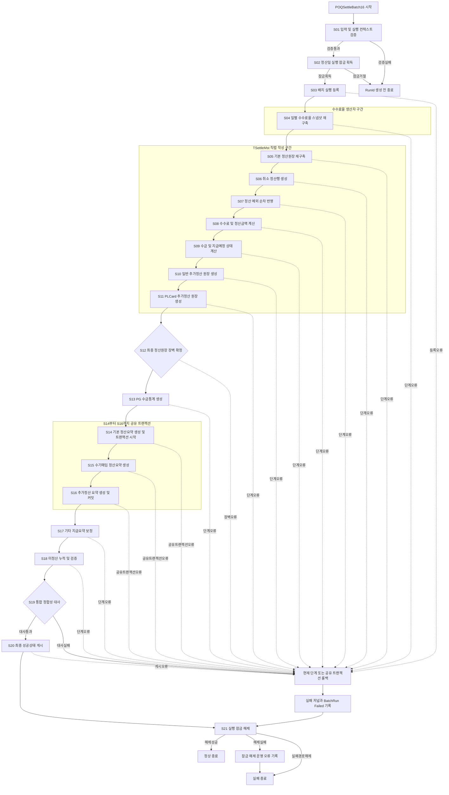

# POQSettleBatch16 통합 C# 배치 이행 계획 골격

## 통합 배치 아키텍처 개요

### 목적과 적용 범위

`POQSettleBatch16`은 14개 레거시 저장 프로시저의 업무 로직을 하나의 C# 배치 애플리케이션으로 통합한다. 애플리케이션이 매개변수화된 T-SQL 문장을 직접 전송하며, 신규 저장 프로시저·함수·트리거는 만들지 않는다.

핵심 이행 원칙은 다음과 같다.

- 정산기준일은 검증된 `YYYYMMDD` 8자리 문자열로 유지한다.
- `YMD`, `AYMD`, `CYMD`, `ProcYMD`, `INYMD`, `OUTYMD`, `EDIReqYmd`의 의미를 서로 대체하지 않는다.
- 모든 단계의 데이터베이스 작업은 `SNAPSHOT` 격리수준에서 실행한다.
- 기존 `NOLOCK` 및 `WITH (NOLOCK)` 힌트는 모든 이행 SQL에서 제거한다.
- 모든 업무 SQL은 애플리케이션이 전송하며, 분기·트랜잭션·오류 처리는 애플리케이션이 담당한다.
- 원본의 `UNION ALL`, 조인, 집계식, 반올림·절사 순서와 다중 컬럼 갱신 전 값 참조 의미를 보존한다.
- 업무 테이블명은 리터럴로 명시하며 동적으로 조합하지 않는다.
- 승인된 모든 단계는 `Chunkable: false`이므로 단계 내부 분할 커밋을 하지 않는다.
- 동일 대상 테이블을 수정하는 단계는 병렬 실행하지 않는다.
- 잡 전체를 하나의 트랜잭션으로 묶지 않고, 레거시 프로시저 상당 단위의 원자성을 보존한다.
- `S14`~`S16`은 레거시 부모 요약 프로시저의 호출 의미를 보존하기 위해 하나의 공유 트랜잭션으로 실행한다.

### 불변 실행 컨텍스트

C# 실행 컨텍스트는 다음 정보를 보유한다.

| 항목 | 계약 |
|---|---|
| `JobName` | 항상 `POQSettleBatch16` |
| `SettlementYmd` | 검증된 8자리 `YYYYMMDD` 문자열 |
| `SettlementDate` | 입력 검증을 위한 날짜 값이며 SQL 바인딩값을 대체하지 않음 |
| `RunId` | `S03`이 `batch.BatchRun`을 INSERT한 뒤 `SCOPE_IDENTITY()`로 취득 |
| 실행 시작 시각 | UTC |
| 배포 버전 및 SQL 해시 | 애플리케이션 배포 메타데이터로 관리 |
| 현재 단계 | `S01`~`S21` 중 하나 |
| 원장 장벽 상태 | `S12` 성공 후 변경 불가 |
| 취소 신호 | 아직 커밋하지 않은 트랜잭션을 롤백하고 파이프라인을 중단하는 용도 |

`RunId`는 애플리케이션이 계산하거나 임의 발급하지 않는다. `S01`과 `S02` 시점에는 `RunId`가 없으므로 `batch.BatchStepJournal`과 `batch.BatchCheckpoint`에 행을 쓰지 않는다.

고정 제어 테이블에는 배포 버전이나 SQL 해시 컬럼이 없으므로 이를 임의 컬럼으로 추가하지 않는다. 재시작 시에는 고정 계약이 제공하는 체크포인트와 통제합계를 사용하고, 정의 버전 비교는 애플리케이션 배포 메타데이터에서 수행한다.

### S02와 RunId 계약의 선결 정합성 문제

제공된 실행 순서는 `S02` 잠금 획득 후 `S03` 실행 등록이며, `RunId`는 `S03`의 `batch.BatchRun` INSERT에서만 발급된다. 그러나 `S02`의 대상인 `batch.BatchRunLock.OwnerRunId`는 `bigint NOT NULL`이고 첫 INSERT 시 반드시 값이 필요하다.

따라서 다음 세 조건은 신규 실행에서 동시에 충족될 수 없다.

1. `S02`가 `batch.BatchRunLock` 최초 행을 INSERT한다.
2. `S03`만 `batch.BatchRun`을 INSERT하고 `RunId`를 발급받는다.
3. `batch.BatchRunLock.OwnerRunId`에 임의값이나 계산값을 넣지 않는다.

구현 착수 전 다음 중 하나를 공식 승인해야 한다.

- `S02`는 세션 소유 실행 잠금만 획득하고, `S03`이 `RunId` 발급 직후 `batch.BatchRunLock` 행을 INSERT한다.
- 또는 `S03`의 실행 등록을 `S02`보다 먼저 수행하도록 단계 순서를 변경한다.

본 계획의 논리 흐름은 승인된 단계 순서를 유지하되, 임의 `RunId`를 발급하거나 `OwnerRunId`에 임시값을 저장하는 우회 구현은 금지한다.

### 논리 컴포넌트

#### 배치 코디네이터

배치 코디네이터는 다음을 보장한다.

- `S01`부터 `S21`까지 승인 순서대로 호출한다.
- `batch.BatchCheckpoint`가 `Succeeded`인 단계는 단계 호출 전에 건너뛴다.
- 단계 내부에는 재시작·건너뛰기·우회용 입력 파라미터를 추가하지 않는다.
- 레거시 사전 가드는 호출된 단계마다 무조건 실행한다.
- `S05`~`S11`의 `TSettleMst` 쓰기를 직렬화한다.
- `S12` 성공 전에는 후속 통계·요약 단계를 실행하지 않는다.
- `S12` 성공 후에는 `TSettleMst`를 변경하는 SQL을 허용하지 않는다.
- `S14`~`S16` 공유 트랜잭션이 완전히 커밋된 경우에만 세 단계의 체크포인트를 함께 `Succeeded`로 확정한다.
- 실패하면 현재 트랜잭션을 롤백하고 후속 업무 단계를 호출하지 않는다.
- 정상·실패·취소 경로 모두에서 `S21` 잠금 해제를 시도한다.

#### SQL 실행 계층

전체 문서와 구현은 다음의 단일 추상 표기만 사용한다.

- 연결 열기: `connectionFactory.open()`
- 트랜잭션 시작: `conn.beginTransaction()`
- 문장 실행: `conn.execute(...)`
- 단일값 조회: `conn.queryScalar(...)`
- 행 조회: `conn.queryRows(...)`
- 커밋: `conn.commit()`
- 롤백: `conn.rollback()`

이는 구현 형태를 설명하기 위한 추상 표기이며 특정 데이터 접근 프레임워크나 실제 API 형식을 계약하지 않는다.

SQL 실행 계층은 다음을 보장한다.

- 원본 입력 파라미터의 선언 타입과 동일한 데이터베이스 타입으로 값을 전달한다.
- 모든 값은 매개변수로 전달한다.
- SQL 문장 결과에 따른 제어 흐름은 애플리케이션에서 처리한다.
- SQL에 `IF @@ERROR`, `IF @@ROWCOUNT`, `GOTO`, `BEGIN TRY` 또는 `BEGIN CATCH`를 넣지 않는다.
- 원본이 초기값과 함께 선언한 지역 변수는 해당 SQL 문장 안에서 정확한 타입과 초기값으로 선언한다.
- 다중 컬럼 `UPDATE`는 하나의 SQL 문장으로 유지하여 모든 우변이 갱신 전 값을 참조하게 한다.
- 장시간 실행 취소가 요청되면 열린 트랜잭션을 롤백한 뒤 실패를 기록한다.

#### SQL 호환 숫자 의미

금액 계산은 원본 SQL Server 식을 그대로 SQL에 유지하는 것을 기본으로 한다. C#에서 계산해야 하는 경우 다음 의미를 골든 테스트로 고정한다.

- SQL Server `ROUND`의 반올림과 세 번째 인자에 의한 절사
- `CommRoundFlag`, `CommSumRoundFlag`, `VatRoundFlag`
- `dbo.UF_GET_PGCommOption`
- `dbo.UF_GET_ROUND4VAT`
- `dbo.UF_GET_INCVTAXRATE`
- `numeric` 또는 `decimal`에서 `INT`로 변환할 때 0 방향 절사
- 음수 금액의 절사
- 중간 정밀도와 스케일
- 행 단위 반올림 후 집계하는 순서
- 구성요소별로 `1.1`을 나누고 각각 절사한 뒤 합산하는 방식
- 다중 컬럼 `UPDATE`의 갱신 전 값 기준 동시 평가

### 실행 순서와 의존성

| 단계 | 역할 및 레거시 원천 | 주요 대상 | 트랜잭션 및 선행조건 |
|---|---|---|---|
| S01 | 입력 및 실행 컨텍스트 검증 | 없음 | 읽기 검증도 SNAPSHOT 의무, RunId 없음 |
| S02 | 정산일 실행 잠금 획득 | `batch.BatchRunLock` | S01 이후, RunId 계약 선결 필요 |
| S03 | 배치 실행 등록 | `batch.BatchRun`, `batch.BatchStepJournal` | `RunId` 발급, 이후 저널·체크포인트 활성화 |
| S04 | `dbo.UP_Util_PG_Client_CMRate_Ins` 대체 | 5개 일별 요율 스냅샷 | 단일 SNAPSHOT 트랜잭션 |
| S05 | `dbo.UP_UTIL_SETTLE_INS` 대체 | `SETTLE_POQ_DB.dbo.TSettleMst` | S04 커밋 후 단일 트랜잭션 |
| S06 | `dbo.UP_UTIL_SETTLE_CANCEL_INS` 대체 | `SETTLE_POQ_DB.dbo.TSettleMst` | S05 정상행 생성 후 실행 |
| S07 | `dbo.UP_UTIL_SETTLE_EXCEPTION_PROC` 대체 | `SETTLE_POQ_DB.dbo.TSettleMst` | 18개 UPDATE 원본 순서 보존 |
| S08 | `dbo.UP_UTIL_SETTLE_COMM_UPD` 대체 | `SETTLE_POQ_DB.dbo.TSettleMst` | 15개 UPDATE 원본 순서 보존 |
| S09 | `dbo.UP_UTIL_SETTLE_EXPECT_PROC` 대체 | `SETTLE_POQ_DB.dbo.TSettleMst` | 최종 금액 산출 후 상태·일자 계산 |
| S10 | `dbo.UP_UTIL_SETTLE_INS_EXTRA` 대체 | `SETTLE_POQ_DB.dbo.TSettleMst` | 일반 추가정산 단일 트랜잭션 |
| S11 | `dbo.UP_UTIL_SETTLE_INS_EXTRA4PLCARD` 대체 | `SETTLE_POQ_DB.dbo.TSettleMst` | S10 이후 PLCard 전용 처리 |
| S12 | 최종 정산원장 장벽 확정 | `batch.BatchCheckpoint`, `batch.BatchControlTotal`, `batch.BatchStepJournal` | S04~S11 성공 확인 |
| S13 | `dbo.UP_UTIL_STAT_PGCOLLECT_INS` 대체 | `SETTLE_POQ_DB.dbo.TStatPGCollect` | 최종 원장만 읽음 |
| S14 | `dbo.UP_Util_Settle_Summary` 기본 본문 대체 | 4개 요약 테이블 | 공유 트랜잭션 시작, 하위 SP 호출 제거 |
| S15 | `dbo.UP_Util_Settle_Summary_AcqManual` 대체 | `SETTLE_POQ_DB.dbo.TSettleByOUT` | S14와 같은 연결·트랜잭션 |
| S16 | `dbo.UP_UTIL_SETTLE_SUMMARY_EXTRA` 대체 | 4개 요약 테이블 | 공유 트랜잭션 완료 및 커밋 |
| S17 | `dbo.UP_UTIL_SETTLE_SUMMARY_ETC` 대체 | `SETTLE_POQ_DB.dbo.TSettleByOUT` | S14~S16 커밋 후 단일 트랜잭션 |
| S18 | `dbo.UP_UTIL_SETTLE_PROC_ETC` 대체 | `SETTLE_POQ_DB.dbo.TSettleMiss` | 최종 원장 상태를 입력으로 사용 |
| S19 | 통합 정합성 대사 | `batch.BatchControlTotal`, `batch.BatchStepJournal` | 모든 하드 검증 통과 필요 |
| S20 | 최종 성공상태 게시 | `batch.BatchRun`, `batch.BatchStepJournal`, `batch.BatchCheckpoint` | S03~S19 완료 게이트 |
| S21 | 실행 잠금 해제 | `batch.BatchRunLock` | 모든 종료 경로에서 실행 |

### 직렬화와 병렬 실행 정책

`S05`~`S11`은 모두 `SETTLE_POQ_DB.dbo.TSettleMst`를 변경하므로 절대 병렬 실행하지 않는다. 이 순서를 변경하면 취소행 삭제, 예외 적용 누락, 부호 및 총액 계산 순서 변경, 지급예정 상태 오산정이 발생할 수 있다.

`S14`~`S17`은 다음 요약 테이블을 중복 변경하므로 모두 직렬 실행한다.

- `SETTLE_POQ_DB.dbo.TSettleByTX`
- `SETTLE_POQ_DB.dbo.TPartialCancelByTX`
- `SETTLE_POQ_DB.dbo.TSettleByIN`
- `SETTLE_POQ_DB.dbo.TSettleByOUT`

`S12` 이후 대상 테이블만 보면 일부 병렬화 가능성이 있으나, 최초 이행 버전은 레거시 실행 순서를 엄격히 보존한다. 승인된 실행 경로에는 병렬 업무 단계가 없다.

### 트랜잭션 및 격리 정책

| 범위 | 정책 |
|---|---|
| S01~S03 | 제어 단계별 독립 처리, 모든 DB 읽기·쓰기는 SNAPSHOT |
| S04~S13 | 각 단계가 독립된 단일 SNAPSHOT 트랜잭션 |
| S14~S16 | 하나의 공유 SNAPSHOT 트랜잭션 |
| S17~S21 | 각 단계가 독립된 단일 SNAPSHOT 트랜잭션 |
| 잡 전체 | 하나의 외부 트랜잭션으로 묶지 않음 |
| 청크 커밋 | 승인된 단계에서는 사용하지 않음 |
| 데이터베이스 옵션 변경 | 수행하지 않음 |
| NOLOCK | 모든 이행 및 검증 SQL에서 제거 |

단일 트랜잭션 단계가 실패하면 해당 트랜잭션을 롤백하는 것으로 업무 데이터가 복원된다. 이 실패 경로에서 Shadow Table이나 보상 DELETE를 실행하지 않는다.

### 제어 테이블과 재시작 계약

모든 신규 배치 테이블은 `batch` 스키마, Shadow Table은 `batch_shadow` 스키마에 둔다. 고정 제어 객체는 다음과 같다.

- `batch.BatchRun`
- `batch.BatchStepJournal`
- `batch.BatchCheckpoint`
- `batch.BatchValidationIssue`
- `batch.BatchControlTotal`
- `batch.BatchRunLock`

재시작 코디네이터는 호출 전에 `batch.BatchCheckpoint`를 조회한다. 동일 `RunId`에서 `CheckpointStatus = N'Succeeded'`인 단계는 호출하지 않는다. 단계 메서드에는 재시작이나 우회를 위한 입력값을 추가하지 않는다.

`S01`과 `S02`는 `RunId` 발급 전 단계이므로 체크포인트 완료 게이트에 포함하지 않는다. `S20`의 필수 완료 확인 대상은 `S03`~`S19`이며, `S14`~`S16`은 세 단계가 모두 `Succeeded`인 경우에만 완료된 것으로 본다.

### 레거시 인터페이스와 출력 매핑

각 단계 본문은 아래 입력 타입 계약을 자체 절에도 다시 명시해야 한다. 출력 파라미터는 새 SQL에 바인딩하지 않고 애플리케이션의 결과 모델로 매핑한다.

| 단계 | 원본 인터페이스 | 통합 배치 매핑 |
|---|---|---|
| S04 | `@pi_strYMD CHAR(8)`, `@po_intRetVal INT OUTPUT` | 입력은 `p_ymd`; 출력 코드는 `LegacyReturnCode` |
| S05 | `@pi_strYMD CHAR(8)`, `@po_intRetVal INT OUTPUT` | 입력은 `p_ymd`; 출력 코드는 `LegacyReturnCode` |
| S06 | `@pi_strYMD CHAR(8)`, `@po_intRetVal INT OUTPUT` | 입력은 `p_ymd`; 출력 코드는 `LegacyReturnCode` |
| S07 | `@pi_strYMD CHAR(8)`, `@po_intRetVal INT OUTPUT` | 입력은 `p_ymd`; 출력 코드는 `LegacyReturnCode` |
| S08 | `@pi_strYMD CHAR(8)`, `@po_intRetVal INT OUTPUT` | 입력은 `p_ymd`; 출력 코드는 `LegacyReturnCode` |
| S09 | `@pi_strYMD CHAR(8)`, `@po_intRetVal INT OUTPUT` | 입력은 `p_ymd`; 출력 코드는 `LegacyReturnCode` |
| S10 | `@pi_strYMD CHAR(8)`, `@po_intRetVal INT OUTPUT` | 입력은 `p_ymd`; 출력 코드는 `LegacyReturnCode` |
| S11 | `@pi_strYMD CHAR(8)`, `@po_intRetVal INT OUTPUT` | 입력은 `p_ymd`; 출력 코드는 `LegacyReturnCode` |
| S13 | `@pi_strYMD CHAR(8)`, `@po_intRetVal INT OUTPUT` | 입력은 `p_ymd`; 출력 코드는 `LegacyReturnCode` |
| S14 | `@pi_strYMD CHAR(8)`, `@po_intRetVal INT OUTPUT` | 입력은 `p_ymd`; 기본 요약 본문 코드만 매핑 |
| S15 | `@pi_strYMD VARCHAR(8)`, `@po_intRetVal INT OUTPUT` | 입력은 `p_ymd`; 성공은 0, 실패 시 원본의 SQL 오류번호 의미 보존 |
| S16 | `@pi_strYMD CHAR(8)`, `@po_intRetVal INT OUTPUT` | 입력은 `p_ymd`; 4000~4008 및 0 보존 |
| S17 | `@pi_strYMD CHAR(8)`, `@po_strErrMsg VARCHAR(256) OUTPUT`, `@po_intRetVal INT OUTPUT` | 입력은 `p_ymd`; 메시지는 `ErrorMessage`, 코드는 `LegacyReturnCode` |
| S18 | `@pi_strYMD CHAR(8)`, `@po_intRetVal INT OUTPUT` | 입력은 `p_ymd`; -3, 0, 4000 보존 |

### 오류 코드 보존

레거시 단계는 원본 오류 코드를 변경하거나 새로운 코드를 추가하지 않는다.

| 단계 | 보존 코드 |
|---|---|
| S04 | -9, -1, -2, -3, -4, -5, -6, -7, -8, -10 |
| S05 | -9, -1, -2 |
| S06 | -1 |
| S07 | -101, -102, -1, -2, -3, -4, -5, -10, -11, -19, -20, -201, -21, -27, -28, -29 |
| S08 | -1, -2, -4, -5, -6, -7, -8, -9, -10, -11, -12, -20, -21, -22, -23 |
| S09 | -1, -2, -3, -4, -5, -10, -11, -12, -13, -15, -17 |
| S10 | -9, -1, -2, -3, -4, -21 |
| S11 | -9, -1, -2 |
| S13 | -1 |
| S14 | 0, -1, -2, -3, -4, -5, -6, -7, -8 |
| S15 | 0, 실패 시 원본 `ERROR_NUMBER()`에 해당하는 SQL 오류번호 |
| S16 | 4000, 4001, 4002, 4003, 4004, 4005, 4006, 4007, 4008, 0 |
| S17 | 1001, 1002, 0 |
| S18 | -3, 0, 4000 |

원본에서 오류 확인 자체가 없었던 S10 또는 S11의 일부 문장은 레거시 오류 코드를 새로 발급하지 않는다. 해당 문장의 실행 실패는 구조화된 오류 메시지와 SQL 오류정보로 식별하되 `LegacyReturnCode`에는 임의 코드를 기록하지 않는다.

레거시 원천이 없는 제어 단계는 다음 예약 블록을 사용한다.

| 단계 | 예약 블록 | 일반 실패 코드 |
|---|---|---|
| S01 | -9010..-9019 | -9010 |
| S02 | -9020..-9029 | -9020 |
| S03 | -9030..-9039 | -9030 |
| S12 | -9120..-9129 | -9120 |
| S19 | -9190..-9199 | -9190 |
| S20 | -9200..-9209 | -9200 |
| S21 | -9210..-9219 | -9210 |

제어 단계의 오류 추적 변수는 `INT`이고 초기값은 `0`이다. 단계 코드는 오류 코드가 아니므로 `N'S01'` 같은 문자열로 유지한다.

## Mermaid 기반 통합 흐름도



## 단계별 이행 상세 및 의사코드

### 공통 SQL 오류 추적 패턴

`S03` 이후 실행되는 각 단계는 호출 시점에 자신의 `batch.BatchStepJournal` 행과 `batch.BatchCheckpoint` 행을 INSERT한다. 이미 존재하는 다른 실행 또는 다른 단계의 행을 UPDATE하지 않는다.

레거시 단계의 실패 지점 변수는 nullable `INT`로 시작한다. 제어 단계의 실패 지점 변수는 `INT` 값 `0`으로 시작한다.

```csharp
var conn = connectionFactory.open();

// 레거시 단계
int? currentStepErrorCode = null;

// 레거시 원천이 없는 제어 단계
int currentControlErrorCode = 0;
```

단계 시작 제어 SQL은 업무 트랜잭션보다 먼저 커밋하여, 업무 트랜잭션 롤백 후에도 실패 상태를 기록할 행을 남긴다.

```sql
-- SQL_INSERT_STEP_START
INSERT INTO batch.BatchStepJournal
(
    RunId,
    StepCode,
    StepStatus,
    LegacyReturnCode,
    StartedAtUtc,
    CompletedAtUtc,
    ErrorMessage
)
VALUES
(
    @p_runId,
    @p_stepCode,
    N'Running',
    NULL,
    SYSUTCDATETIME(),
    NULL,
    NULL
);

INSERT INTO batch.BatchCheckpoint
(
    RunId,
    StepCode,
    CheckpointStatus,
    CompletedAtUtc
)
VALUES
(
    @p_runId,
    @p_stepCode,
    N'Pending',
    NULL
);
```

각 업무 DML 직전에 애플리케이션이 그 문장의 정확한 원본 오류 코드를 대입한다. SQL 문장 내부에서 실행 결과를 판정하거나 분기하지 않는다.

```csharp
var conn = connectionFactory.open();
conn.execute(SQL_INSERT_STEP_START, new
{
    p_runId = runId,
    p_stepCode = stepCode
});

conn.beginTransaction(); // 이 단계는 SNAPSHOT 격리 의무

try
{
    currentStepErrorCode = exactLegacyCodeForStatement1;
    conn.execute(SQL_STATEMENT_1, statement1Bindings);

    currentStepErrorCode = exactLegacyCodeForStatement2;
    conn.execute(SQL_STATEMENT_2, statement2Bindings);

    conn.execute(SQL_MARK_STEP_SUCCEEDED, new
    {
        p_runId = runId,
        p_stepCode = stepCode,
        p_legacyReturnCode = successLegacyCode
    });

    conn.commit();
}
catch (Exception failure)
{
    conn.rollback();

    conn.beginTransaction(); // 실패 저널 기록도 SNAPSHOT 격리 의무
    conn.execute(SQL_MARK_STEP_FAILED, new
    {
        p_runId = runId,
        p_stepCode = stepCode,
        p_legacyReturnCode = currentStepErrorCode,
        p_errorMessage = sanitize(failure)
    });
    conn.commit();

    throw;
}
```

제어 단계는 DML 직전에 해당 단계 예약 블록의 정수 코드를 설정한다.

```csharp
int currentControlErrorCode = 0;

currentControlErrorCode = controlGeneralFailureCode;
conn.execute(SQL_CONTROL_DML, controlBindings);
```

성공 SQL은 해당 단계가 시작할 때 INSERT한 행만 갱신한다.

```sql
-- SQL_MARK_STEP_SUCCEEDED
UPDATE batch.BatchStepJournal
   SET StepStatus = N'Succeeded',
       LegacyReturnCode = @p_legacyReturnCode,
       CompletedAtUtc = SYSUTCDATETIME(),
       ErrorMessage = NULL
 WHERE RunId = @p_runId
   AND StepCode = @p_stepCode;

UPDATE batch.BatchCheckpoint
   SET CheckpointStatus = N'Succeeded',
       CompletedAtUtc = SYSUTCDATETIME()
 WHERE RunId = @p_runId
   AND StepCode = @p_stepCode;
```

실패 SQL은 실패 코드와 실패 문장을 식별할 수 있는 오류 메시지를 기록한다. 원본 코드가 존재하지 않는 레거시 문장은 임의 코드를 만들지 않고 `NULL`을 기록한다.

```sql
-- SQL_MARK_STEP_FAILED
UPDATE batch.BatchStepJournal
   SET StepStatus = N'Failed',
       LegacyReturnCode = @p_legacyReturnCode,
       CompletedAtUtc = SYSUTCDATETIME(),
       ErrorMessage = @p_errorMessage
 WHERE RunId = @p_runId
   AND StepCode = @p_stepCode;
```

`S14`~`S16`은 공유 트랜잭션을 사용한다. 세 단계의 시작 행은 각 단계 진입 시 생성하되, 성공 저널과 체크포인트는 `S16`의 공유 커밋에서 함께 확정한다. 어느 단계에서든 실패하면 공유 트랜잭션 전체를 롤백하고, 롤백 이후 실제 호출된 단계의 저널을 `Failed`로 기록한다.

### Shadow Table 및 복구 정책

승인된 21개 단계는 모두 분할 커밋을 사용하지 않는다. 따라서 현재 기준 설계에서는 Shadow Table을 생성하지 않는다.

- `S04`~`S13`, `S17`, `S18`은 각 단계의 단일 트랜잭션 롤백으로 복구한다.
- `S14`~`S16`은 공유 트랜잭션 전체를 롤백한다.
- INSERT 전용 단일 트랜잭션 단계도 롤백만 사용한다.
- 롤백 후 보상 DELETE를 실행하지 않는다.
- 이미 롤백된 범위를 다시 삭제하면 정상적으로 복원된 데이터를 손상시키므로 금지한다.

향후 단계가 분할 커밋 재구축으로 별도 승인될 때만 Shadow Table을 최후 수단으로 사용한다. 이 경우 다음 규칙을 모두 적용한다.

1. Shadow Table은 롤백 가능한 업무 트랜잭션을 시작하기 전에 생성하고 백업 데이터를 적재한다.
2. 이름은 `N'batch_shadow.<Table>_' + <run id expression> + N'_<StepCode>'` 형식으로 조합한다.
3. 테이블명만 동적으로 조합하고, 업무 값은 모두 매개변수로 전달한다.
4. 원본 대상 테이블명은 리터럴로 명시한다.
5. 복구 DELETE는 원래 단계가 삭제한 업무 범위와 정확히 같은 조건을 사용한다.
6. 여러 대상 테이블을 수정했다면 모든 대상 테이블을 Shadow 전략에 포함한다.
7. 복구는 대상 범위 DELETE 후 Shadow 전체 INSERT 순서로 수행한다.
8. 성공한 Shadow Table은 즉시 제거하거나, 장애 분석용으로 보존한 경우 24시간 후 정리한다.

```sql
-- SQL_CREATE_AND_CAPTURE_SHADOW_TEMPLATE
DECLARE @v_shadow NVARCHAR(300) =
    N'batch_shadow.TargetTable_' + CAST(@p_runId AS NVARCHAR(20)) + N'_SXX';
DECLARE @v_sql NVARCHAR(MAX);

SET @v_sql =
    N'SELECT * INTO ' + @v_shadow +
    N' FROM SETTLE_POQ_DB.dbo.TargetTable WHERE 1 = 0;';
EXEC sp_executesql @v_sql;

SET @v_sql =
    N'INSERT INTO ' + @v_shadow +
    N' SELECT * FROM SETTLE_POQ_DB.dbo.TargetTable
        WHERE BusinessYmd = @p_businessYmd;';
EXEC sp_executesql
    @v_sql,
    N'@p_businessYmd CHAR(8)',
    @p_businessYmd = @p_businessYmd;
```

```sql
-- SQL_RESTORE_TARGET_RANGE_TEMPLATE
DELETE FROM SETTLE_POQ_DB.dbo.TargetTable
 WHERE BusinessYmd = @p_businessYmd;
```

```sql
-- SQL_RESTORE_FROM_SHADOW_TEMPLATE
DECLARE @v_shadow NVARCHAR(300) =
    N'batch_shadow.TargetTable_' + CAST(@p_runId AS NVARCHAR(20)) + N'_SXX';
DECLARE @v_sql NVARCHAR(MAX);

SET @v_sql =
    N'INSERT INTO SETTLE_POQ_DB.dbo.TargetTable
      SELECT * FROM ' + @v_shadow + N';';
EXEC sp_executesql @v_sql;
```

### 청크 페이징 정책

현재 승인된 단계는 모두 `Chunkable: false`이다. 복합 조인, 크로스 데이터베이스 조회, `GROUP BY`, 순서 의존 UPDATE 또는 일자 전체 DELETE-INSERT 재구축을 포함하므로 가짜 청크 키를 추가하지 않는다.

향후 별도 단계에서 청크 처리가 승인될 경우 다음 공통 규칙을 적용한다.

- DDL에서 실제 존재하는 숫자 PK 또는 안정된 문자열·복합 키만 사용한다.
- 원본 업무 필터를 삭제하지 않고 청크 조건과 `AND`로 결합한다.
- DELETE-INSERT 패턴의 DELETE에도 동일한 청크 범위를 넣는다.
- 각 반복은 자체 트랜잭션을 시작하고 커밋한다.
- 숫자 키만 덧셈으로 다음 경계를 계산한다.
- 문자열 또는 복합 키는 데이터에서 다음 경계를 조회한다.
- INSERT 전용 청크 실패 보상은 정확한 업무 범위와 청크 키를 사용한 DELETE만 허용한다.
- 분할 커밋 재구축으로 이전 청크가 이미 커밋된 경우에는 승인된 Shadow 복구 정책을 사용한다.

```csharp
var bounds = conn.queryRows(SQL_NUMERIC_KEY_BOUNDS, businessBindings);

if (bounds.Minimum != null)
{
    var from = bounds.Minimum;
    var maximum = bounds.Maximum;

    while (from <= maximum)
    {
        var to = from + chunkSize;

        conn.beginTransaction(); // 각 청크는 SNAPSHOT 격리 의무
        try
        {
            currentStepErrorCode = exactLegacyCode;
            conn.execute(SQL_NUMERIC_CHUNK, merge(
                businessBindings,
                new { p_from = from, p_to = to }
            ));
            conn.commit();
        }
        catch
        {
            conn.rollback();
            throw;
        }

        from = to;
    }
}
```

```sql
-- SQL_NUMERIC_KEY_BOUNDS
SELECT MIN(ID) AS Minimum,
       MAX(ID) AS Maximum
  FROM SETTLE_POQ_DB.dbo.SourceTable
 WHERE BusinessYmd = @p_businessYmd
   AND OriginalStatus = @p_originalStatus;
```

```sql
-- SQL_NUMERIC_CHUNK
INSERT INTO SETTLE_POQ_DB.dbo.TargetTable
(
    ID,
    BusinessYmd,
    Amount
)
SELECT ID,
       BusinessYmd,
       Amount
  FROM SETTLE_POQ_DB.dbo.SourceTable
 WHERE BusinessYmd = @p_businessYmd
   AND OriginalStatus = @p_originalStatus
   AND ID >= @p_from
   AND ID < @p_to;
```

문자열 또는 복합 키는 덧셈으로 진행하지 않는다.

```csharp
var bounds = conn.queryRows(SQL_STRING_KEY_BOUNDS, businessBindings);

if (bounds.Minimum != null)
{
    var from = bounds.Minimum;
    var maximum = bounds.Maximum;

    while (from <= maximum)
    {
        var to = conn.queryScalar(SQL_STRING_UPPER_BOUND, merge(
            businessBindings,
            new { p_from = from, p_size = chunkSize }
        ));

        if (to == null)
        {
            to = maximum;
        }

        conn.beginTransaction(); // 각 청크는 SNAPSHOT 격리 의무
        try
        {
            currentStepErrorCode = exactLegacyCode;
            conn.execute(SQL_STRING_CHUNK, merge(
                businessBindings,
                new { p_from = from, p_to = to }
            ));
            conn.commit();
        }
        catch
        {
            conn.rollback();
            throw;
        }

        if (to >= maximum)
        {
            break;
        }

        from = conn.queryScalar(SQL_NEXT_STRING_KEY, merge(
            businessBindings,
            new { p_to = to }
        ));
    }
}
```

```sql
-- SQL_STRING_UPPER_BOUND
SELECT MAX(ClientID)
  FROM
  (
      SELECT DISTINCT TOP (@p_size)
             ClientID
        FROM SETTLE_POQ_DB.dbo.SourceTable
       WHERE BusinessYmd = @p_businessYmd
         AND OriginalStatus = @p_originalStatus
         AND ClientID >= @p_from
       ORDER BY ClientID
  ) AS K;
```

```sql
-- SQL_NEXT_STRING_KEY
SELECT MIN(ClientID)
  FROM SETTLE_POQ_DB.dbo.SourceTable
 WHERE BusinessYmd = @p_businessYmd
   AND OriginalStatus = @p_originalStatus
   AND ClientID > @p_to;
```

<!-- STEP:S01 -->
<!-- STEP:S02 -->
<!-- STEP:S03 -->
<!-- STEP:S04 -->
<!-- STEP:S05 -->
<!-- STEP:S06 -->
<!-- STEP:S07 -->
<!-- STEP:S08 -->
<!-- STEP:S09 -->
<!-- STEP:S10 -->
<!-- STEP:S11 -->
<!-- STEP:S12 -->
<!-- STEP:S13 -->
<!-- STEP:S14 -->
<!-- STEP:S15 -->
<!-- STEP:S16 -->
<!-- STEP:S17 -->
<!-- STEP:S18 -->
<!-- STEP:S19 -->
<!-- STEP:S20 -->
<!-- STEP:S21 -->

## 통합 데이터 정합성 검증 SQL 세트

### 공통 검증 계약

모든 검증은 최종 원장 장벽 이후 안정된 `SNAPSHOT` 읽기로 실행한다. 검증 SQL에는 `NOLOCK`을 사용하지 않는다.

공통 바인딩은 다음과 같다.

- `@p_runId BIGINT`
- `@p_ymd VARCHAR(8)`
- 병행 대사용 `@p_referenceRunId BIGINT`
- 신규 실행 대사용 `@p_candidateRunId BIGINT`

표준 결과 컬럼은 다음과 같다.

| 컬럼 | 의미 |
|---|---|
| `CheckId` | 검증 항목 식별자 |
| `RunId` | 배치 실행 식별자 |
| `SettlementYmd` | 정산기준일 |
| `Severity` | `Info`, `Warning`, `Error`, `Critical` |
| `MismatchCount` | 불일치 건수 |
| `ExpectedAmount` | 예상 금액 |
| `ActualAmount` | 실제 금액 |
| `DifferenceAmount` | 차이 |
| `CheckedAtUtc` | 검증 UTC 시각 |

금액 집계 비교는 각 원천을 독립된 CTE 또는 스칼라 하위 질의로 계산한 뒤 비교한다. 두 집계의 행 집합을 카티전 곱으로 결합하지 않는다.

### V01 — 실행 컨텍스트 및 기준일 검증

```sql
-- SQL_VALIDATE_RUN_CONTEXT
WITH RunData AS
(
    SELECT RunId,
           BatchYmd,
           RunStatus
      FROM batch.BatchRun
     WHERE RunId = @p_runId
),
InvalidJournal AS
(
    SELECT COUNT_BIG(*) AS MismatchCount
      FROM batch.BatchStepJournal AS J
     WHERE J.RunId = @p_runId
       AND NOT EXISTS
           (
               SELECT 1
                 FROM RunData AS R
                WHERE R.RunId = J.RunId
                  AND R.BatchYmd = @p_ymd
           )
)
SELECT N'V01' AS CheckId,
       @p_runId AS RunId,
       @p_ymd AS SettlementYmd,
       N'Error' AS Severity,
       CASE
           WHEN TRY_CONVERT(date, @p_ymd, 112) IS NULL THEN 1
           WHEN CONVERT(varchar(8), TRY_CONVERT(date, @p_ymd, 112), 112) <> @p_ymd THEN 1
           WHEN NOT EXISTS
                (
                    SELECT 1
                      FROM RunData
                     WHERE BatchYmd = @p_ymd
                ) THEN 1
           ELSE (SELECT MismatchCount FROM InvalidJournal)
       END AS MismatchCount,
       CAST(NULL AS decimal(38,4)) AS ExpectedAmount,
       CAST(NULL AS decimal(38,4)) AS ActualAmount,
       CAST(NULL AS decimal(38,4)) AS DifferenceAmount,
       SYSUTCDATETIME() AS CheckedAtUtc;
```

### V02 — 수수료율 스냅샷 완전성 검증

```sql
-- SQL_VALIDATE_RATE_SNAPSHOT_COUNTS
SELECT N'TPGSettleRate' AS SnapshotName, COUNT_BIG(*) AS RowCount
  FROM SETTLE_POQ_DB.dbo.TPGSettleRate
 WHERE YMD = @p_ymd
UNION ALL
SELECT N'TClientSettleRate', COUNT_BIG(*)
  FROM SETTLE_POQ_DB.dbo.TClientSettleRate
 WHERE YMD = @p_ymd
UNION ALL
SELECT N'TPGSettleRate4Extra', COUNT_BIG(*)
  FROM SETTLE_POQ_DB.dbo.TPGSettleRate4Extra
 WHERE YMD = @p_ymd
UNION ALL
SELECT N'TClientSettleRate4Extra', COUNT_BIG(*)
  FROM SETTLE_POQ_DB.dbo.TClientSettleRate4Extra
 WHERE YMD = @p_ymd
UNION ALL
SELECT N'TClientSettleRate4MobileCo', COUNT_BIG(*)
  FROM SETTLE_POQ_DB.dbo.TClientSettleRate4MobileCo
 WHERE YMD = @p_ymd;
```

```sql
-- SQL_VALIDATE_PAID_SETTLEMENT_GUARD
SELECT N'V02_PAID_GUARD' AS CheckId,
       @p_runId AS RunId,
       @p_ymd AS SettlementYmd,
       N'Critical' AS Severity,
       COUNT_BIG(*) AS MismatchCount,
       CAST(0 AS decimal(38,4)) AS ExpectedAmount,
       CAST(COUNT_BIG(*) AS decimal(38,4)) AS ActualAmount,
       CAST(COUNT_BIG(*) AS decimal(38,4)) AS DifferenceAmount,
       SYSUTCDATETIME() AS CheckedAtUtc
  FROM SETTLE_POQ_DB.dbo.TSettleMst
 WHERE YMD = @p_ymd
   AND OutState IN (1,5)
   AND OutYMD IS NOT NULL;
```

```sql
-- SQL_VALIDATE_CLIENT_RATE_DUPLICATES
SELECT YMD,
       CLIENTID,
       PGNAME,
       MALLID,
       COUNT_BIG(*) AS DuplicateCount
  FROM SETTLE_POQ_DB.dbo.TClientSettleRate
 WHERE YMD = @p_ymd
 GROUP BY YMD, CLIENTID, PGNAME, MALLID
HAVING COUNT_BIG(*) > 1;
```

### V03 — 기본 거래 대비 정산원장 포괄성 검증

세 원천 분기는 동일한 컬럼 순서로 투영한다. 전체거래는 `USESTATE = 0`, 부분취소는 `USESTATE = 2`, 환불은 `USESTATE = 3`을 유지한다.

```sql
-- SQL_VALIDATE_LEDGER_BRANCH_COUNTS
WITH SourceBranches AS
(
    SELECT N'Full' AS BranchName,
           0 AS UseState,
           COUNT_BIG(*) AS RowCount,
           SUM(CAST(A.TXAMT AS decimal(38,4))) AS TxAmount
      FROM PaymentDB.dbo.TTxMst AS A
      JOIN SETTLE_POQ_DB.dbo.TPGSettleRate AS B
        ON A.YMD = B.YMD
       AND A.PGNAME = B.PGNAME
       AND A.MALLID = B.MALLID
      JOIN SETTLE_POQ_DB.dbo.TClientSettleRate AS C
        ON A.YMD = C.YMD
       AND A.CLIENTID = C.CLIENTID
       AND A.PGNAME = C.PGNAME
       AND A.MALLID = C.MALLID
      JOIN SETTLE_POQ_DB.dbo.TPGCMRate AS D
        ON A.PGNAME = D.PGNAME
       AND A.MALLID = D.MALLID
     WHERE A.YMD = @p_ymd
       AND D.TAXEXEMPTIONFLAG = 0

    UNION ALL

    SELECT N'PartialCancel',
           2,
           COUNT_BIG(*),
           SUM(CAST(E.TXAMT AS decimal(38,4)))
      FROM PaymentDB.dbo.TTxMst AS A
      JOIN SETTLE_POQ_DB.dbo.TPGSettleRate AS B
        ON A.YMD = B.YMD
       AND A.PGNAME = B.PGNAME
       AND A.MALLID = B.MALLID
      JOIN SETTLE_POQ_DB.dbo.TClientSettleRate AS C
        ON A.YMD = C.YMD
       AND A.CLIENTID = C.CLIENTID
       AND A.PGNAME = C.PGNAME
       AND A.MALLID = C.MALLID
      JOIN SETTLE_POQ_DB.dbo.TPGCMRate AS D
        ON A.PGNAME = D.PGNAME
       AND A.MALLID = D.MALLID
      JOIN PaymentDB.dbo.TPartialCancelTxMst AS E
        ON A.PLTID = E.PLTID
     WHERE E.YMD = @p_ymd
       AND E.SettleState = 1
       AND D.TAXEXEMPTIONFLAG = 0

    UNION ALL

    SELECT N'Refund',
           3,
           COUNT_BIG(*),
           SUM(CAST(E.REFUNDREQAMT AS decimal(38,4)))
      FROM PaymentDB.dbo.TTxMst AS A
      JOIN SETTLE_POQ_DB.dbo.TPGSettleRate AS B
        ON A.YMD = B.YMD
       AND A.PGNAME = B.PGNAME
       AND A.MALLID = B.MALLID
      JOIN SETTLE_POQ_DB.dbo.TClientSettleRate AS C
        ON A.YMD = C.YMD
       AND A.CLIENTID = C.CLIENTID
       AND A.PGNAME = C.PGNAME
       AND A.MALLID = C.MALLID
      JOIN SETTLE_POQ_DB.dbo.TPGCMRate AS D
        ON A.PGNAME = D.PGNAME
       AND A.MALLID = D.MALLID
      JOIN PaymentDB.dbo.TRefundMst AS E
        ON A.PLTID = E.PLTID
      JOIN PaymentDB.dbo.TRefundClient AS F
        ON A.CLIENTID = F.CLIENTID
       AND A.PGNAME = F.PGNAME
       AND A.MALLID = F.MALLID
     WHERE E.REQYMD = @p_ymd
       AND D.TAXEXEMPTIONFLAG = 0
),
ActualLedger AS
(
    SELECT USESTATE AS UseState,
           COUNT_BIG(*) AS RowCount,
           SUM(CAST(TXAMT AS decimal(38,4))) AS TxAmount
      FROM SETTLE_POQ_DB.dbo.TSettleMst
     WHERE YMD = @p_ymd
       AND ISNULL(ExtraSettleFlag, 0) = 0
     GROUP BY USESTATE
)
SELECT S.BranchName,
       S.UseState,
       S.RowCount AS ExpectedRowCount,
       ISNULL(A.RowCount, 0) AS ActualRowCount,
       S.TxAmount AS ExpectedAmount,
       ISNULL(A.TxAmount, 0) AS ActualAmount
  FROM SourceBranches AS S
  LEFT JOIN ActualLedger AS A
    ON A.UseState = S.UseState;
```

### V04 — 취소행과 정상 원행 연결 검증

```sql
-- SQL_VALIDATE_CANCEL_ORPHANS
SELECT C.PLTID,
       C.CLIENTID,
       C.PGNAME,
       C.MALLID,
       C.YMD,
       C.CYMD
  FROM SETTLE_POQ_DB.dbo.TSettleMst AS C
 WHERE C.YMD = @p_ymd
   AND C.USESTATE = 1
   AND NOT EXISTS
       (
           SELECT 1
             FROM SETTLE_POQ_DB.dbo.TSettleMst AS O
            WHERE O.PLTID = C.PLTID
              AND O.USESTATE = 0
       );
```

```sql
-- SQL_VALIDATE_CANCEL_SOURCE_MULTIPLICITY
SELECT A.PLTID,
       COUNT_BIG(*) AS MatchedLedgerRows
  FROM PaymentDB.dbo.TTxMst AS A
  JOIN SETTLE_POQ_DB.dbo.TSettleMst AS B
    ON A.PLTID = B.PLTID
 WHERE A.YMDCANCEL = @p_ymd
   AND B.USESTATE = 0
   AND ISNULL(B.CompanySalesType, 4) NOT IN (0,1,2,3)
 GROUP BY A.PLTID
HAVING COUNT_BIG(*) > 1;
```

### V05 — 예외 처리 순서 검증

S07의 18개 문장별 대상 건수와 금액 차이는 `batch.BatchControlTotal`에 각각 기록한다. 누락된 규칙 통제합계는 오류로 처리한다.

```sql
-- SQL_VALIDATE_EXCEPTION_RULE_CONTROLS
WITH RequiredRules AS
(
    SELECT V.RuleCode
      FROM
      (
          VALUES
              (N'UPDATE01'), (N'UPDATE02'), (N'UPDATE03'),
              (N'UPDATE04'), (N'UPDATE05'), (N'UPDATE06'),
              (N'UPDATE07'), (N'UPDATE08'), (N'UPDATE09'),
              (N'UPDATE10'), (N'UPDATE11'), (N'UPDATE12'),
              (N'UPDATE13'), (N'UPDATE14'), (N'UPDATE15'),
              (N'UPDATE16'), (N'UPDATE17'), (N'UPDATE18')
      ) AS V(RuleCode)
)
SELECT R.RuleCode
  FROM RequiredRules AS R
 WHERE NOT EXISTS
       (
           SELECT 1
             FROM batch.BatchControlTotal AS C
            WHERE C.RunId = @p_runId
              AND C.StepCode = N'S07'
              AND C.ControlName = N'Rule_' + R.RuleCode + N'_Rows'
       );
```

### V06 — 수수료, VAT 및 총액 산식 검증

```sql
-- SQL_VALIDATE_LEDGER_TOTAL_FORMULAS
SELECT ID,
       YMD,
       CLIENTID,
       PGNAME,
       MALLID,
       CLTOTAL,
       CLCOMM + CLVT + CLETC + CLINTCOMM AS ExpectedCLTotal,
       PGTOTAL,
       PGCOMM + PGVT + PGETC
           + CASE
                 WHEN PGINTREALCOMM = 0 THEN PGINTEXPCOMM
                 ELSE PGINTREALCOMM
             END AS ExpectedPGTotal,
       POQINCOME,
       CLCOMM + CLVT + CLETC + CLINTCOMM
           - (
                PGCOMM + PGVT + PGETC
                + CASE
                      WHEN PGINTREALCOMM = 0 THEN PGINTEXPCOMM
                      ELSE PGINTREALCOMM
                  END
             ) AS ExpectedPOQIncome
  FROM SETTLE_POQ_DB.dbo.TSettleMst
 WHERE YMD = @p_ymd
   AND
   (
       CLTOTAL <> CLCOMM + CLVT + CLETC + CLINTCOMM
       OR PGTOTAL <> PGCOMM + PGVT + PGETC
            + CASE
                  WHEN PGINTREALCOMM = 0 THEN PGINTEXPCOMM
                  ELSE PGINTREALCOMM
              END
       OR POQINCOME <> CLCOMM + CLVT + CLETC + CLINTCOMM
            - (
                 PGCOMM + PGVT + PGETC
                 + CASE
                       WHEN PGINTREALCOMM = 0 THEN PGINTEXPCOMM
                       ELSE PGINTREALCOMM
                   END
              )
   );
```

```sql
-- SQL_DIAGNOSE_COMPONENT_VAT_TRUNCATION
SELECT ID,
       CAST(CLComm / CAST(1.1 AS decimal(2,1)) AS int)
       + CAST(CLEtc / CAST(1.1 AS decimal(2,1)) AS int)
       + CAST(CLIntComm / CAST(1.1 AS decimal(2,1)) AS int)
           AS ComponentWiseSupplyAmount,
       CAST((CLComm + CLEtc + CLIntComm) / CAST(1.1 AS decimal(2,1)) AS int)
           AS AggregateSupplyAmount
  FROM SETTLE_POQ_DB.dbo.TSettleMst
 WHERE YMD = @p_ymd
   AND CLVTType = 1;
```

### V07 — 수금 및 지급예정 상태 검증

```sql
-- SQL_VALIDATE_STATE_DATE_PAIRS
SELECT ID,
       YMD,
       InState,
       INYMD,
       OutState,
       OUTYMD,
       EDIReqYmd
  FROM SETTLE_POQ_DB.dbo.TSettleMst
 WHERE YMD = @p_ymd
   AND
   (
       (InState = 1 AND ISNULL(INYMD, '') = '')
       OR (InState = 0 AND ISNULL(INYMD, '') <> '' AND USESTATE = 3)
       OR (OutState IN (1,2,5) AND ISNULL(OUTYMD, '') = '')
       OR (OutState = 0 AND OUTYMD IS NOT NULL)
   );
```

```sql
-- SQL_VALIDATE_MANUAL_ACQUISITION_EDI_DATE
SELECT A.ID,
       A.PLTID,
       A.CLIENTID,
       A.PGNAME,
       A.EDIReqYmd
  FROM SETTLE_POQ_DB.dbo.TSettleMst AS A
  JOIN SETTLE_CARD_DB.dbo.TClientCardContractMgmt AS C
    ON A.CLIENTID = C.CLIENTID
 WHERE A.YMD = @p_ymd
   AND C.AcqType = 1
   AND A.OutState IN (2,9)
   AND ISNULL(A.EDIReqYmd, '') = '';
```

### V08 — 추가정산 범위 및 중복 검증

```sql
-- SQL_RECALCULATE_GENERIC_EXTRA_MIN_REQUEST_DATE
SELECT MIN(ReqYMD) AS MinimumRequestYmd
  FROM PaymentDB.dbo.TExtraSettleIn
 WHERE ResYMD = @p_ymd
   AND ResultCode = '00'
   AND RefundTxType <> 1;
```

```sql
-- SQL_VALIDATE_EXTRA_LEDGER_DUPLICATES
SELECT ProcYMD,
       YMD,
       CLIENTID,
       PGNAME,
       MALLID,
       PLTID,
       USESTATE,
       ExtraSettleFlag,
       COUNT_BIG(*) AS DuplicateCount
  FROM SETTLE_POQ_DB.dbo.TSettleMst
 WHERE ProcYMD = @p_ymd
   AND ExtraSettleFlag = 1
 GROUP BY ProcYMD,
          YMD,
          CLIENTID,
          PGNAME,
          MALLID,
          PLTID,
          USESTATE,
          ExtraSettleFlag
HAVING COUNT_BIG(*) > 1;
```

### V09 — 최종 정산원장 장벽 통제합계

```sql
-- SQL_CAPTURE_FINAL_LEDGER_CONTROL_TOTALS
INSERT INTO batch.BatchControlTotal
(
    RunId,
    StepCode,
    ControlName,
    ControlValue,
    CapturedAtUtc
)
SELECT @p_runId,
       N'S12',
       N'LedgerRowCount',
       CAST(COUNT_BIG(*) AS decimal(38,4)),
       SYSUTCDATETIME()
  FROM SETTLE_POQ_DB.dbo.TSettleMst
 WHERE YMD = @p_ymd
UNION ALL
SELECT @p_runId,
       N'S12',
       N'LedgerTxAmount',
       ISNULL(SUM(CAST(TXAMT AS decimal(38,4))), 0),
       SYSUTCDATETIME()
  FROM SETTLE_POQ_DB.dbo.TSettleMst
 WHERE YMD = @p_ymd
UNION ALL
SELECT @p_runId,
       N'S12',
       N'LedgerCLTotal',
       ISNULL(SUM(CAST(CLTOTAL AS decimal(38,4))), 0),
       SYSUTCDATETIME()
  FROM SETTLE_POQ_DB.dbo.TSettleMst
 WHERE YMD = @p_ymd
UNION ALL
SELECT @p_runId,
       N'S12',
       N'LedgerPGTotal',
       ISNULL(SUM(CAST(PGTOTAL AS decimal(38,4))), 0),
       SYSUTCDATETIME()
  FROM SETTLE_POQ_DB.dbo.TSettleMst
 WHERE YMD = @p_ymd;
```

```sql
-- SQL_VALIDATE_LEDGER_BARRIER
WITH Captured AS
(
    SELECT ControlName,
           ControlValue
      FROM batch.BatchControlTotal
     WHERE RunId = @p_runId
       AND StepCode = N'S12'
       AND ControlName IN
           (
               N'LedgerRowCount',
               N'LedgerTxAmount',
               N'LedgerCLTotal',
               N'LedgerPGTotal'
           )
),
CurrentValue AS
(
    SELECT N'LedgerRowCount' AS ControlName,
           CAST(COUNT_BIG(*) AS decimal(38,4)) AS ControlValue
      FROM SETTLE_POQ_DB.dbo.TSettleMst
     WHERE YMD = @p_ymd
    UNION ALL
    SELECT N'LedgerTxAmount',
           ISNULL(SUM(CAST(TXAMT AS decimal(38,4))), 0)
      FROM SETTLE_POQ_DB.dbo.TSettleMst
     WHERE YMD = @p_ymd
    UNION ALL
    SELECT N'LedgerCLTotal',
           ISNULL(SUM(CAST(CLTOTAL AS decimal(38,4))), 0)
      FROM SETTLE_POQ_DB.dbo.TSettleMst
     WHERE YMD = @p_ymd
    UNION ALL
    SELECT N'LedgerPGTotal',
           ISNULL(SUM(CAST(PGTOTAL AS decimal(38,4))), 0)
      FROM SETTLE_POQ_DB.dbo.TSettleMst
     WHERE YMD = @p_ymd
)
SELECT C.ControlName,
       C.ControlValue AS CapturedValue,
       V.ControlValue AS CurrentValue
  FROM Captured AS C
  FULL OUTER JOIN CurrentValue AS V
    ON V.ControlName = C.ControlName
 WHERE ISNULL(C.ControlValue, 0) <> ISNULL(V.ControlValue, 0);
```

### V10 — PG 수금통계 재집계 비교

```sql
-- SQL_VALIDATE_PG_COLLECT_STATISTICS
WITH SourceStreams AS
(
    SELECT INYMD,
           LOWER(CLIENTID) AS CLIENTID,
           LOWER(PGNAME) AS PGNAME,
           LOWER(MALLID) AS MALLID,
           SUM(TXAMT - PGTOTAL) AS COLLECTAMT,
           SUM(PGCOMM + PGETC + ISNULL(PGINTREALCOMM, 0)) AS PGCOMM,
           SUM(PGVT) AS PGVT,
           SUM
           (
               CASE
                   WHEN PGNAME IN ('WOWCOIN','WOW_ARS','WOW_1588')
                       THEN CASE WHEN OUTYMD >= @p_ymd THEN TXAMT END
                   ELSE TXAMT
               END
           ) AS SETTLEWILLAMT,
           SUM
           (
               CASE
                   WHEN OUTYMD < @p_ymd AND OUTSTATE = 1
                       THEN CLCOMM + CLETC + ISNULL(CLINTCOMM, 0)
                   ELSE 0
               END
           ) AS AHEADSALESCOMM,
           SUM
           (
               CASE
                   WHEN OUTYMD < @p_ymd AND OUTSTATE = 1 THEN CLVT
                   ELSE 0
               END
           ) AS AHEADSALESVT,
           SUM
           (
               CASE
                   WHEN OUTYMD < @p_ymd AND OUTSTATE = 1
                       THEN TXAMT - CLTOTAL
                   ELSE 0
               END
           ) AS AHEADSETTLEAMT
      FROM SETTLE_POQ_DB.dbo.TSettleMst
     WHERE INYMD = @p_ymd
       AND INSTATE = 1
     GROUP BY INYMD, LOWER(CLIENTID), LOWER(PGNAME), LOWER(MALLID)

    UNION ALL

    SELECT COLLECTYMD,
           LOWER(CLIENTID),
           LOWER(PGNAME),
           LOWER(MALLID),
           SUM(CLCOLLECTAMT),
           SUM(CAST(PGCOMM / 1.1 AS INT)),
           SUM(PGCOMM - CAST(PGCOMM / 1.1 AS INT)),
           SUM(CLRATETOTXAMT),
           0,
           0,
           0
      FROM SETTLE_POQ_DB.dbo.TTArsPGCollect
     WHERE COLLECTYMD = @p_ymd
     GROUP BY COLLECTYMD, LOWER(CLIENTID), LOWER(PGNAME), LOWER(MALLID)

    UNION ALL

    SELECT COLLECTYMD,
           LOWER(CLIENTID),
           LOWER(PGNAME),
           LOWER(MALLID),
           SUM(CLCOLLECTAMT),
           SUM(CAST(PGCOMM / 1.1 AS INT)),
           SUM(PGCOMM - CAST(PGCOMM / 1.1 AS INT)),
           SUM(CLRATETOTXAMT),
           0,
           0,
           0
      FROM SETTLE_POQ_DB.dbo.TBArsPGCollect
     WHERE COLLECTYMD = @p_ymd
     GROUP BY COLLECTYMD, LOWER(CLIENTID), LOWER(PGNAME), LOWER(MALLID)
),
Expected AS
(
    SELECT INYMD,
           LOWER(CLIENTID) AS CLIENTID,
           LOWER(PGNAME) AS PGNAME,
           LOWER(MALLID) AS MALLID,
           ISNULL(SUM(COLLECTAMT), 0) AS COLLECTAMT,
           ISNULL(SUM(PGCOMM), 0) AS PGCOMM,
           ISNULL(SUM(PGVT), 0) AS PGVT,
           ISNULL(SUM(COLLECTAMT + PGCOMM + PGVT), 0) AS LEFTSUMAMT,
           ISNULL(SUM(SETTLEWILLAMT), 0) AS SETTLEWILLAMT,
           ISNULL(SUM(AHEADSALESCOMM), 0) AS AHEADSALESCOMM,
           ISNULL(SUM(AHEADSALESVT), 0) AS AHEADSALESVT,
           ISNULL(SUM(AHEADSETTLEAMT), 0) AS AHEADSETTLEAMT
      FROM SourceStreams
     GROUP BY INYMD, LOWER(CLIENTID), LOWER(PGNAME), LOWER(MALLID)
),
Actual AS
(
    SELECT INYMD,
           CLIENTID,
           PGNAME,
           MALLID,
           COLLECTAMT,
           PGCOMM,
           PGVT,
           LEFTSUMAMT,
           SETTLEWILLAMT,
           AHEADSALESCOMM,
           AHEADSALESVT,
           AHEADSETTLEAMT
      FROM SETTLE_POQ_DB.dbo.TStatPGCollect
     WHERE INYMD = @p_ymd
)
SELECT *
  FROM Expected
EXCEPT
SELECT *
  FROM Actual;
```

역방향 초과 데이터 검증은 동일 CTE에서 `Actual EXCEPT Expected`로 실행한다.

### V11 — 기본 및 추가 요약 양방향 비교

```sql
-- SQL_VALIDATE_SETTLE_BY_TX
WITH Expected AS
(
    SELECT YMD,
           AYMD,
           CLIENTID,
           PGNAME,
           MALLID,
           SERVICENAME,
           PRODUCTNAME,
           COUNT_BIG(*) AS TXCNT,
           SUM(ISNULL(TXAMT, 0)) AS TXAMT,
           SUM(ISNULL(CLCOMM, 0)) AS CLCOMM,
           SUM(ISNULL(CLINTCOMM, 0)) AS CLINTCOMM,
           SUM(ISNULL(CLETC, 0)) AS CLETC,
           SUM(ISNULL(CLVT, 0)) AS CLVT,
           SUM(ISNULL(CLTOTAL, 0)) AS CLTOTAL,
           SUM(ISNULL(PGCOMM, 0)) AS PGCOMM,
           SUM(ISNULL(PGINTEXPCOMM, 0)) AS PGINTEXPCOMM,
           SUM(ISNULL(PGINTREALCOMM, 0)) AS PGINTREALCOMM,
           SUM(ISNULL(PGETC, 0)) AS PGETC,
           SUM(ISNULL(PGVT, 0)) AS PGVT,
           SUM(ISNULL(PGTOTAL, 0)) AS PGTOTAL,
           SUM(ISNULL(POQINCOME, 0)) AS POQINCOME,
           USESTATE,
           CompanySalesType,
           SUM(ISNULL(ExtraTxAmt, 0)) AS ExtraTxAmt,
           ProcYMD,
           SUM(ISNULL(SeperateAmt, 0)) AS SeperateAmt,
           ExtraSettleFlag
      FROM SETTLE_POQ_DB.dbo.TSettleMst
     WHERE YMD = @p_ymd
     GROUP BY YMD,
              AYMD,
              CLIENTID,
              PGNAME,
              MALLID,
              SERVICENAME,
              PRODUCTNAME,
              USESTATE,
              CompanySalesType,
              ProcYMD,
              ExtraSettleFlag
),
Actual AS
(
    SELECT YMD,
           AYMD,
           CLIENTID,
           PGNAME,
           MALLID,
           SERVICENAME,
           PRODUCTNAME,
           TXCNT,
           TXAMT,
           CLCOMM,
           CLINTCOMM,
           CLETC,
           CLVT,
           CLTOTAL,
           PGCOMM,
           PGINTEXPCOMM,
           PGINTREALCOMM,
           PGETC,
           PGVT,
           PGTOTAL,
           POQINCOME,
           USESTATE,
           CompanySalesType,
           ExtraTxAmt,
           ProcYMD,
           SeperateAmt,
           ExtraSettleFlag
      FROM SETTLE_POQ_DB.dbo.TSettleByTX
     WHERE YMD = @p_ymd
)
SELECT *
  FROM Expected
EXCEPT
SELECT *
  FROM Actual;
```

동일한 양방향 패턴을 다음 원본 필터와 그룹 키로 적용한다.

| 대상 | 추가 필터 |
|---|---|
| `TPartialCancelByTX` | `YMD = @p_ymd AND USESTATE = 2`, 그룹 키에 `PLTID` 포함 |
| `TSettleByIN` | `YMD = @p_ymd AND INSTATE = 1`, 그룹 키에 `INYMD` 포함 |
| `TSettleByOUT` | `YMD = @p_ymd AND OUTSTATE IN (2,9)`, 그룹 키에 `INYMD`, `OUTYMD`, `OUTSTATE`, `SettleCurrency` 포함 |

### V12 — 수기매입 및 기타 지급요약 보정 검증

```sql
-- SQL_VALIDATE_MANUAL_ACQUISITION_SUMMARY
WITH ManualGroups AS
(
    SELECT A.OutYMD,
           A.ClientID,
           A.PGName
      FROM SETTLE_POQ_DB.dbo.TSettleMst AS A
      JOIN SETTLE_CARD_DB.dbo.TClientCardContractMgmt AS B
        ON A.ClientID = B.ClientID
     WHERE ISNULL(A.EDIReqYmd, '') = @p_ymd
       AND B.AcqType = 1
       AND A.OutState IN (2,9)
     GROUP BY A.OutYMD, A.ClientID, A.PGName
)
SELECT M.OutYMD,
       M.ClientID,
       M.PGName
  FROM ManualGroups AS M
 WHERE NOT EXISTS
       (
           SELECT 1
             FROM SETTLE_POQ_DB.dbo.TSettleByOUT AS O
            WHERE O.OutYMD = M.OutYMD
              AND O.ClientID = M.ClientID
              AND O.PGName = M.PGName
       );
```

```sql
-- SQL_VALIDATE_SUMMARY_ETC_TARGETS
SELECT DISTINCT
       A.OUTYMD,
       A.YMD,
       A.AYMD,
       A.INYMD,
       A.CLIENTID,
       A.PGNAME,
       A.MALLID,
       A.SERVICENAME,
       A.PRODUCTNAME,
       A.USESTATE,
       A.ProcYMD,
       A.CompanySalesType,
       A.ExtraSettleFlag
  FROM SETTLE_POQ_DB.dbo.TSettleMst AS A
  JOIN SETTLE_POQ_DB.dbo.TSettleMst AS B
    ON A.PLTID = B.PLTID
 WHERE B.YMD = @p_ymd
   AND B.OUTSTATE = 9
   AND B.USESTATE = 1
   AND A.OUTSTATE = 9
   AND A.USESTATE = 0
   AND A.OUTYMD IS NOT NULL;
```

### V13 — 미정산 누적 검증

```sql
-- SQL_VALIDATE_SETTLEMENT_MISS_AMOUNTS
WITH LedgerAmount AS
(
    SELECT A.ClientID,
           A.OutYMD,
           SUM(CAST(A.CLTotal AS money)) AS ExpectedAmount
      FROM SETTLE_POQ_DB.dbo.TSettleMst AS A
      JOIN SETTLE_POQ_DB.dbo.TClientSettleRate AS B
        ON A.YMD = B.YMD
       AND A.ClientID = B.ClientID
       AND A.PGName = B.PGName
       AND A.MallID = B.MallID
      JOIN SETTLE_POQ_DB.dbo.TClient AS C
        ON A.ClientID = C.ClientID
     WHERE ISNULL(B.TaxFGBill, 2) = 1
       AND A.OutState = 2
     GROUP BY A.ClientID, A.OutYMD
),
MissAmount AS
(
    SELECT ClientID,
           OutYMD,
           SUM(CAST(CLSettleAmt AS money)) AS ActualAmount
      FROM SETTLE_POQ_DB.dbo.TSettleMiss
     WHERE OutState = 2
       AND ISNULL(IssueType, 0) = 15
     GROUP BY ClientID, OutYMD
)
SELECT COALESCE(L.ClientID, M.ClientID) AS ClientID,
       COALESCE(L.OutYMD, M.OutYMD) AS OutYMD,
       ISNULL(L.ExpectedAmount, 0) AS ExpectedAmount,
       ISNULL(M.ActualAmount, 0) AS ActualAmount
  FROM LedgerAmount AS L
  FULL OUTER JOIN MissAmount AS M
    ON M.ClientID = L.ClientID
   AND M.OutYMD = L.OutYMD
 WHERE ISNULL(L.ExpectedAmount, 0) <> ISNULL(M.ActualAmount, 0);
```

```sql
-- SQL_VALIDATE_SETTLEMENT_MISS_ID_DUPLICATES
SELECT ID,
       COUNT_BIG(*) AS DuplicateCount
  FROM SETTLE_POQ_DB.dbo.TSettleMiss
 GROUP BY ID
HAVING COUNT_BIG(*) > 1;
```

### V14 — 트랜잭션 원자성과 잔여 데이터 검증

```sql
-- SQL_VALIDATE_JOURNAL_CHECKPOINT_ATOMICITY
SELECT J.RunId,
       J.StepCode,
       J.StepStatus,
       C.CheckpointStatus
  FROM batch.BatchStepJournal AS J
  LEFT JOIN batch.BatchCheckpoint AS C
    ON C.RunId = J.RunId
   AND C.StepCode = J.StepCode
 WHERE J.RunId = @p_runId
   AND
   (
       (J.StepStatus = N'Succeeded'
        AND ISNULL(C.CheckpointStatus, N'Pending') <> N'Succeeded')
       OR
       (J.StepStatus = N'Failed'
        AND C.CheckpointStatus = N'Succeeded')
   );
```

```sql
-- SQL_VALIDATE_SUMMARY_COMMIT_GROUP
WITH SummaryStatus AS
(
    SELECT StepCode,
           StepStatus
      FROM batch.BatchStepJournal
     WHERE RunId = @p_runId
       AND StepCode IN (N'S14', N'S15', N'S16')
)
SELECT COUNT_BIG(*) AS MismatchCount
  FROM SummaryStatus
 WHERE StepStatus <> N'Succeeded'
HAVING
    (
        SELECT COUNT_BIG(*)
          FROM SummaryStatus
         WHERE StepStatus = N'Succeeded'
    ) BETWEEN 1 AND 2;
```

### V15 — 저널, 체크포인트 및 잠금 일관성 검증

`S01`과 `S02`는 RunId 이전 단계이므로 완료 게이트에서 제외한다.

```sql
-- SQL_VALIDATE_REQUIRED_STEP_COMPLETION
WITH RequiredSteps AS
(
    SELECT V.StepCode
      FROM
      (
          VALUES
              (N'S03'), (N'S04'), (N'S05'), (N'S06'), (N'S07'),
              (N'S08'), (N'S09'), (N'S10'), (N'S11'), (N'S12'),
              (N'S13'), (N'S14'), (N'S15'), (N'S16'), (N'S17'),
              (N'S18'), (N'S19')
      ) AS V(StepCode)
)
SELECT R.StepCode
  FROM RequiredSteps AS R
 WHERE NOT EXISTS
       (
           SELECT 1
             FROM batch.BatchCheckpoint AS C
            WHERE C.RunId = @p_runId
              AND C.StepCode = R.StepCode
              AND C.CheckpointStatus = N'Succeeded'
       );
```

```sql
-- SQL_VALIDATE_NO_WORK_AFTER_FAILURE
SELECT LaterStep.RunId,
       FailedStep.StepCode AS FailedStepCode,
       LaterStep.StepCode AS UnexpectedLaterStepCode,
       LaterStep.StepStatus
  FROM batch.BatchStepJournal AS FailedStep
  JOIN batch.BatchStepJournal AS LaterStep
    ON LaterStep.RunId = FailedStep.RunId
   AND LaterStep.StepCode > FailedStep.StepCode
 WHERE FailedStep.RunId = @p_runId
   AND FailedStep.StepStatus = N'Failed'
   AND LaterStep.StepStatus IN (N'Running', N'Succeeded');
```

```sql
-- SQL_VALIDATE_RELEASED_LOCK
SELECT JobName,
       BatchYmd,
       OwnerRunId,
       LockStatus,
       AcquiredAtUtc,
       HeartbeatAtUtc,
       ReleasedAtUtc
  FROM batch.BatchRunLock
 WHERE JobName = N'POQSettleBatch16'
   AND BatchYmd = @p_ymd
   AND OwnerRunId = @p_runId
   AND LockStatus <> N'Released';
```

### V16 — 레거시와 신규 실행 병행 대사

병행 실행의 통제합계는 동일한 `ControlName`으로 저장한 뒤 두 실행을 키 기준으로 비교한다.

```sql
-- SQL_COMPARE_REFERENCE_AND_CANDIDATE_CONTROL_TOTALS
WITH ReferenceTotals AS
(
    SELECT StepCode,
           ControlName,
           ControlValue
      FROM batch.BatchControlTotal
     WHERE RunId = @p_referenceRunId
),
CandidateTotals AS
(
    SELECT StepCode,
           ControlName,
           ControlValue
      FROM batch.BatchControlTotal
     WHERE RunId = @p_candidateRunId
)
SELECT COALESCE(R.StepCode, C.StepCode) AS StepCode,
       COALESCE(R.ControlName, C.ControlName) AS ControlName,
       R.ControlValue AS ReferenceValue,
       C.ControlValue AS CandidateValue,
       ISNULL(C.ControlValue, 0) - ISNULL(R.ControlValue, 0) AS DifferenceValue
  FROM ReferenceTotals AS R
  FULL OUTER JOIN CandidateTotals AS C
    ON C.StepCode = R.StepCode
   AND C.ControlName = R.ControlName
 WHERE ISNULL(R.ControlValue, 0) <> ISNULL(C.ControlValue, 0);
```

대사 결과는 다음 범주로 분류한다.

1. 업무 로직 이행 결함
2. `NOLOCK` 제거와 `SNAPSHOT` 적용에 따른 관찰 시점 차이
3. 원천 데이터 동시 변경
4. 레거시의 비결정적 중복 조인
5. 의도된 오류 탐지 강화
6. SQL과 C# 숫자 의미 차이
7. 검증 SQL 집계 단위 오류

승인된 예외를 제외하고 `Error` 또는 `Critical` 검증의 `MismatchCount`가 하나라도 0보다 크면 `S20`을 실행하지 않는다.