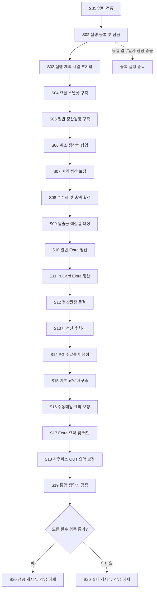
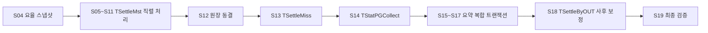
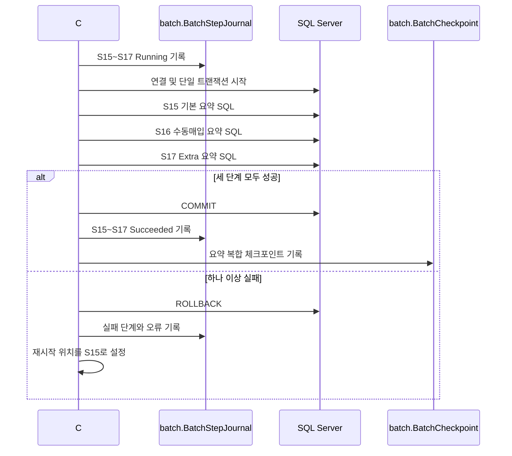

# POQSettleBatch21 C# 통합 배치 문서 구조 및 실행 계획

## 통합 배치 아키텍처 개요

### 문서 목차

1. 배치 목적, 적용 범위, 비기능 요구사항
2. 불변 실행 컨텍스트와 업무일자 의미 매핑
3. C# 애플리케이션 구성요소와 책임
4. 신규 배치 제어 객체와 스키마 규칙
5. 트랜잭션, 잠금, 재시작 및 오류 처리 원칙
6. SQL 산술·NULL·집계 호환성 원칙
7. Mermaid 기반 정상·실패·재시작 흐름
8. S01부터 S20까지의 단계별 구현 지침
9. 레거시 프로시저별 대상 테이블 및 반환 코드 매핑
10. 단계별 사전·사후 정합성 검증 SQL
11. 최종 게시 및 운영 인수 기준

### 설계 목표와 보존해야 할 동작

- C#은 실행 순서, 연결, 트랜잭션, 잠금, 저널 및 오류 처리를 조정한다.
- 집합 기반 SQL 연산은 가능한 한 SQL Server에 유지한다. SQL을 C# 객체의 순차 속성 변경으로 치환하지 않는다.
- 신규 저장 프로시저는 만들지 않는다. 각 레거시 프로시저의 SQL은 분석 가능한 버전 관리 SQL 텍스트와 C# `SqlCommand` 실행 단위로 이관한다.
- 기존 프로시저의 문장 순서, 반복 조회, `NOLOCK`, `UNION ALL`, NULL 전파, 중복 보존 조인, 동시 `SET` 평가 및 트랜잭션 경계를 명시적으로 보존한다.
- 하나의 잡 전체 트랜잭션을 사용하지 않는다. 단, S15~S17은 레거시 부모 요약 트랜잭션과 동일한 단일 트랜잭션으로 실행한다.
- 모든 단계는 직렬 실행한다. 특히 같은 업무일자의 `TSettleMst` 작성 단계와 요약 테이블 작성 단계는 병렬화하지 않는다.
- 14개 레거시 프로시저는 모두 커밋 단위 청킹 대상이 아니다.

### 불변 실행 컨텍스트

최종 문서는 다음 의미의 실행 컨텍스트를 정의한다.

- `JobName`: 항상 `POQSettleBatch21`
- `RunId`: S02에서 `batch.BatchRun` 삽입 후 취득한 양수 ID
- `BusinessYmd`: 정확히 8자리인 불변 문자열
- `StartedAtUtc`: 실행 등록 시각
- `StepExecutionDate`: 필요한 단계에서 별도로 취득하는 실행일자
- `CancellationToken`: 프로세스 종료 요청 전달
- `ConnectionProfile`: 동일 SQL Server 내 로컬 및 교차 데이터베이스 접근 정보

`BusinessYmd`는 단계마다 다음과 같이 다른 실제 열에 매핑한다.

| 의미 | 적용 예 |
|---|---|
| 요율 스냅샷 일자 | Rate YMD |
| 일반 거래일자 | Transaction YMD |
| 취소일자 | `YMDCANCEL` |
| Extra 정산일자 | `ResYMD` 또는 `ReqYMD` |
| 수납일자 | `INYMD` |
| EDI 요청일자 | EDI request date |
| 요약 처리일자 | `ProcYMD` |

최종 구현은 이 매핑을 하나의 일반화된 `BusinessDateColumn` 조건으로 합치지 않는다.

### C# 구성요소

#### 호스트와 조정자

- `Program` 또는 Worker Service: 구성 로드, 종료 신호 처리, 종료 코드 반환
- `RunContextFactory`: 업무일자 검증과 초기 컨텍스트 생성
- `BatchRunRepository`: 실행 등록, 동일 업무일자 잠금, 실행 상태 게시
- `BatchCoordinator`: S01~S20 실행 순서 강제
- `LegacyStepExecutor`: 프로시저별 이관 SQL을 정해진 연결과 트랜잭션으로 실행
- `SummaryCompositeExecutor`: S15~S17을 동일 연결·동일 `SqlTransaction`으로 실행
- `CheckpointRepository`: 완료 단계와 재시작 지점 기록
- `ReconciliationService`: 단계별 제어 합계와 최종 검증 수행
- `SqlSemanticPolicy`: decimal 정밀도와 SQL Server 반올림 규칙에 관한 공통 정책 제공

#### SQL 실행 정책

- 모든 비즈니스 테이블명은 SQL 텍스트에 리터럴로 기재한다.
- 업무일자와 실행 ID는 파라미터로 전달한다.
- SQL Server `decimal` 계산을 `double`로 변환하지 않는다.
- C#에서 반올림이 불가피하면 `MidpointRounding.AwayFromZero`만으로 충분하다고 가정하지 말고, 음수 자릿수 및 절삭 플래그까지 별도 구현한다.
- `CAST(decimal AS integer)`의 0 방향 절삭과 `ROUND(value, length, 1)`을 구분한다.
- VAT는 `UF_GET_INCVTAXRATE`, `UF_GET_ROUND4VAT` 및 PG 옵션 함수의 실제 호출 순서를 보존한다.
- 기존 SQL의 `SUM`, `COUNT`, `ISNULL`, `UNION ALL`, 부호 반전 순서를 변경하지 않는다.

### 신규 배치 제어 객체

모든 신규 배치 테이블은 `batch` 스키마에 둔다.

| 객체 | 역할 |
|---|---|
| `batch.BatchRun` | 실행 ID, 업무일자, 상태, 시작·종료 시각, 최종 결과 |
| `batch.BatchRunLock` | 업무일자별 단일 실행 보장, `OwnerRunId NOT NULL` |
| `batch.BatchStepJournal` | 단계·시도별 시작, 성공, 실패, 행 수, 오류 정보 |
| `batch.BatchCheckpoint` | 마지막 안전 재시작 위치 |
| `batch.BatchControlTotal` | 단계별 건수와 금액 제어 합계 |
| `batch.BatchReconciliation` | 검증 항목별 기대값, 실제값, 판정 |

권장 제약조건은 다음과 같다.

- `batch.BatchRun.RunId`: IDENTITY 기본 키
- `batch.BatchRunLock.BusinessYmd`: 고유 키
- `batch.BatchRunLock.OwnerRunId`: `batch.BatchRun.RunId` 외래 키 및 `NOT NULL`
- `batch.BatchStepJournal`: `(RunId, StepCode, AttemptNo)` 고유 키
- `batch.BatchCheckpoint`: `(RunId, CheckpointCode)` 고유 키
- 상태 열에는 허용된 상태만 저장하는 체크 제약조건 적용

### 섀도 테이블 명명 규칙

소스 상세 분석 결과 특정 단계에 섀도 캡처가 필요하면 다음 형식으로 런타임 이름을 만든다.

`N'batch_shadow.<Table>_' + CONVERT(nvarchar(20), @RunId) + N'_<StepCode>'`

- 섀도 객체는 반드시 `batch_shadow` 스키마에 생성한다.
- 식별자 조립 시 각 식별자 부분에 `QUOTENAME`을 적용한다.
- `dbo.TSettleMst` 같은 비즈니스 테이블명은 동적으로 조립하지 않는다.
- 섀도 사용 여부와 보존 기간은 단계별 소스 분석에서 확정하며, 운영 정리 정책도 최종 문서에 포함한다.

### 실행 등록과 잠금 규칙

S02는 다음 순서를 반드시 지킨다.

1. `batch.BatchRun`에 실행 행을 삽입한다.
2. `SCOPE_IDENTITY()` 또는 `OUTPUT INSERTED.RunId`로 `RunId`를 취득한다.
3. 같은 트랜잭션 안에서 해당 `RunId`를 `OwnerRunId`로 사용해 `batch.BatchRunLock`을 삽입한다.
4. 업무일자 고유 키 충돌 시 트랜잭션을 롤백하고 비즈니스 단계를 시작하지 않는다.
5. `0`, `-1` 또는 임시 실행 ID를 잠금 소유자로 사용하지 않는다.

### 트랜잭션과 재시작 정책

- S04~S14와 S18은 각각 레거시 소스의 실제 트랜잭션 범위를 보존한다.
- 트랜잭션이 없는 레거시 문장을 임의로 하나의 광범위한 트랜잭션에 묶지 않는다.
- S15~S17은 단일 연결 및 단일 트랜잭션을 사용한다.
- S15 또는 S16이 끝났더라도 S17 커밋 전에는 요약 복합 단계가 완료된 것으로 체크포인트를 전진시키지 않는다.
- 실패 후 재시작은 마지막 확정 체크포인트 다음 단계부터 수행한다.
- 커밋 성공 여부가 불명확한 장애에서는 비가역·누적 단계를 즉시 재실행하지 않고, 해당 단계의 정합성 SQL로 결과 존재 여부를 판정한다.
- 실패 경로는 별도 제어 트랜잭션으로 저널과 실행 상태를 기록하고 잠금을 해제한다.

## Mermaid 기반 통합 흐름도

### 전체 실행 흐름



### 쓰기 대상 의존성



### 요약 복합 트랜잭션



### 공통 실패 처리 흐름

1. 현재 SQL 명령 취소를 시도한다.
2. 활성 트랜잭션이 있으면 롤백한다.
3. SQL 오류 번호, 원본 반환 코드, 단계 코드, 명령 타임아웃 여부를 기록한다.
4. `batch.BatchStepJournal`에 실패를 기록한다.
5. `batch.BatchRun`을 `Failed` 또는 `ValidationFailed`로 갱신한다.
6. 소유한 `batch.BatchRunLock`만 삭제한다.
7. 성공 체크포인트 이후 단계는 완료 처리하지 않는다.
8. 프로세스는 운영 스케줄러가 판별할 수 있는 0이 아닌 종료 코드를 반환한다.

## 단계별 이행 상세 및 의사코드

### 공통 C# 실행 골격

```csharp
var context = ValidateArguments(args);                         // S01
context = await RegisterRunAndAcquireLockAsync(context);       // S02

try
{
    await InitializeJournalAsync(context);                     // S03

    await ExecuteCommittedStepAsync("S04", context);
    await ExecuteCommittedStepAsync("S05", context);
    await ExecuteCommittedStepAsync("S06", context);
    await ExecuteCommittedStepAsync("S07", context);
    await ExecuteCommittedStepAsync("S08", context);
    await ExecuteCommittedStepAsync("S09", context);
    await ExecuteCommittedStepAsync("S10", context);
    await ExecuteCommittedStepAsync("S11", context);

    await FreezeLedgerAsync(context);                          // S12
    await ExecuteCommittedStepAsync("S13", context);
    await ExecuteCommittedStepAsync("S14", context);

    await ExecuteSummaryCompositeAsync(context);               // S15~S17
    await ExecuteCommittedStepAsync("S18", context);

    await ReconcileAsync(context);                             // S19
    await PublishAndReleaseAsync(context, succeeded: true);    // S20
}
catch (Exception exception)
{
    await PublishAndReleaseAsync(
        context,
        succeeded: false,
        exception: exception);                                // S20

    throw;
}
```

`ExecuteCommittedStepAsync`라는 이름은 각 레거시 단위가 서로 별도로 확정된다는 뜻이며, 모든 소스 SQL을 무조건 새 트랜잭션으로 감싼다는 뜻은 아니다. 각 단계의 실제 트랜잭션 사용 여부는 원본 프로시저의 `BEGIN TRAN`, `COMMIT`, `ROLLBACK` 분석 결과를 따른다.

### 실행 전 제어 단계

#### S01 — 입력 검증

- 레거시 기원: 없음
- `BusinessYmd`가 정확히 8자리 숫자인지 검증한다.
- 실제 달력 날짜로 변환 가능한지 검증하되, SQL에 전달하는 원래 8자리 값은 변경하지 않는다.
- 연결 문자열, 명령 타임아웃, 필수 데이터베이스 접근권한을 검증한다.
- 아직 `RunId`가 없으므로 저널, 잠금, 체크포인트를 작성하지 않는다.
- 실패 시 데이터베이스 비즈니스 SQL을 실행하지 않고 입력 오류 종료 코드를 반환한다.

#### S02 — 실행 등록 및 잠금

- 레거시 기원: 없음
- `batch.BatchRun`을 먼저 삽입하고 생성된 `RunId`로 `batch.BatchRunLock.OwnerRunId`를 기록한다.
- 업무일자 잠금 고유 키를 통해 동일 날짜 중복 실행을 차단한다.
- 잡 이름과 업무일자를 함께 잠금 키로 사용할 경우에도 `OwnerRunId`는 실제 삽입된 실행 ID여야 한다.
- 성공 이후 모든 저널, 체크포인트, 제어 합계는 동일한 `RunId`를 사용한다.

#### S03 — 실행 계획 저널 초기화

- 레거시 기원: 없음
- S04~S20 실행 계획을 `batch.BatchStepJournal`에 `Pending`으로 등록한다.
- 현재 재시작 모드와 마지막 완료 체크포인트를 확인한다.
- 이미 성공한 단계가 있다면 원본 실행과 현재 실행의 업무일자 및 배포 버전 호환성을 확인한다.
- 요약 복합 단계는 S15~S17을 하나의 재시작 그룹으로 표시한다.

### 요율 및 정산원장 단계

#### S04 — 요율 스냅샷 구축

- 원본: `dbo.UP_Util_PG_Client_CMRate_Ins`
- 유료 정산 여부에 대한 원본 사전 조건을 먼저 실행한다.
- 다섯 개 일자별 요율 스냅샷을 원본 순서대로 재구축한다.
- 스냅샷 일부만 커밋되도록 청킹하지 않는다.
- 이후 단계는 S04 체크포인트가 확정된 경우에만 실행한다.
- 검증 항목은 대상별 건수, 자연 키 중복, 업무일자 불일치 및 계약 마스터 미매핑이다.

#### S05 — 일반 정산원장 구축

- 원본: `dbo.UP_UTIL_SETTLE_INS`
- 해당 업무일자의 `TSettleMst` 일반 정산 슬라이스를 원본 조건대로 삭제하고 다시 생성한다.
- `PaymentDB` 거래, 부분취소, 환불 자료와 일자별 요율 스냅샷을 반복 조회하는 순서를 보존한다.
- 조인의 중복을 C#에서 임의 제거하지 않는다.
- 삭제 후 재구축되는 완전한 날짜 슬라이스가 하나의 실행 단위이므로 청킹하지 않는다.
- 완료 후 거래 수, 거래 금액 및 주요 수수료 합계를 제어 합계로 저장한다.

#### S06 — 취소 정산행 삽입

- 원본: `dbo.UP_UTIL_SETTLE_CANCEL_INS`
- `PaymentDB.dbo.TTxMst`의 취소 사실과 이미 생성된 정상 `TSettleMst` 행을 결합한다.
- 취소행이 정상행의 값을 복사하는 시점의 양수 수수료 및 금액 상태를 보존한다.
- 부호 반전은 이 단계에서 임의로 선적용하지 않고 S08의 원본 순서를 따른다.
- 정상행이 없는 취소행, 취소행 중복 및 업무일자 조건 오류를 검증한다.

#### S07 — 예외 정산 보정

- 원본: `dbo.UP_UTIL_SETTLE_EXCEPTION_PROC`
- 18개 ordered update를 원본 문장 순서대로 실행한다.
- `PaymentDB`, `PLCardDB`, `SETTLE_CARD_DB`의 카드, 모바일, 프로모션 및 특수 PG 자료를 사용한다.
- 후속 업데이트가 앞선 업데이트 결과를 읽는 종속성을 유지한다.
- 단일 SQL `SET` 절의 오른쪽 식은 업데이트 전 값을 기준으로 동시에 평가되도록 유지한다.
- 업데이트 전후 대상 행 수와 핵심 금액 차이를 기록한다.

#### S08 — 수수료 및 총액 확정

- 원본: `dbo.UP_UTIL_SETTLE_COMM_UPD`
- 취소 부호 반전, 취소 수수료, 부분취소 정합, 총액, VAT 포함 금액 분해, 분할 정산 및 외화 정산을 원본 순서로 실행한다.
- `GROUP BY`와 `HAVING SUM(TxAmt)=0`으로 식별되는 부분취소 그룹을 분할하지 않는다.
- `1.1` 공급가액/VAT 분해는 나눗셈, 반올림, 정수 변환, 차감 순서를 그대로 보존한다.
- `TPGProperty`와 `UF_GET_PGCommOption`의 반올림 옵션을 일반화하지 않는다.
- 취소 금액과 부분취소 그룹, 수수료 합계 및 VAT 항등식을 검증한다.

#### S09 — 입출금 예정일 확정

- 원본: `dbo.UP_UTIL_SETTLE_EXPECT_PROC`
- 완성된 정산원장의 상태와 수수료 값을 사용해 입금·출금 예정일을 계산한다.
- `SETTLE_CARD_DB`의 매입 계약과 EDI 자료를 원본 조건으로 조회한다.
- 앞선 업데이트가 지정한 상태와 날짜를 후속 업데이트가 사용하는 순서를 유지한다.
- 예정일이 필요한 상태인데 날짜가 비어 있는 행과 업무일자보다 비정상적으로 앞선 날짜를 검출한다.

#### S10 — 일반 Extra 정산

- 원본: `dbo.UP_UTIL_SETTLE_INS_EXTRA`
- 단계 시작 시점에 실행일자를 별도로 취득한다. 잡 시작 때 캡처한 공통 현재 날짜를 재사용하지 않는다.
- `PaymentDB.dbo.TExtraSettleIn`의 `MIN(ReqYMD)`로 산출되는 처리 범위를 원본과 동일하게 계산한다.
- 일자별 요율과 Extra 입력을 결합해 전문화된 수수료, 부호, 총액 및 날짜를 가진 `TSettleMst` 행을 생성한다.
- 일반 예외·수수료 단계가 끝난 뒤에만 실행한다.
- ReqYMD 범위, 중복 Extra 행 및 입력 대비 누락을 검증한다.

#### S11 — PLCard Extra 정산

- 원본: `dbo.UP_UTIL_SETTLE_INS_EXTRA4PLCARD`
- `SETTLE_CARD_DB.dbo.TExtraTxMst`, `PLCardDB.dbo.TPLCardTxMst`, 계약 및 PG 속성을 결합한다.
- 일반 Extra 단계와 직렬화하고 기본 순서는 S10 다음으로 고정한다.
- 운영 스케줄러 증거 없이 S10과 S11의 순서를 바꾸지 않는다.
- 거래 키 중복, 소스 미매핑 및 금액·수수료 합계를 검증한다.

#### S12 — 정산원장 동결

- 레거시 기원: 없음
- S05~S11이 모두 커밋된 뒤 원장 완료 체크포인트를 기록한다.
- 업무일자별 행 수와 주요 금액 합계를 `batch.BatchControlTotal`에 저장한다.
- 이후 단계에서 원장이 예기치 않게 변경됐는지 확인할 수 있도록 안정적인 그룹별 제어 합계를 저장한다.
- 물리적인 테이블 읽기 전용 전환이 아니라 실행 흐름상의 논리적 동결이다.

### 원장 후속 투영 단계

#### S13 — 미정산 후처리

- 원본: `dbo.UP_UTIL_SETTLE_PROC_ETC`
- 최종 `OutState`, `OutYMD`, 수수료 및 요율을 기준으로 `TSettleMiss`를 생성하거나 누적한다.
- 커서 원천의 `GROUP BY`, `MAX(ID)+1` 및 기존 행 누적 순서를 보존한다.
- 청킹이나 자동 병렬화로 ID 할당 범위를 분리하지 않는다.
- 원장 대상 금액과 미정산 누적 금액의 전체 결과 정합성 검증을 수행한다.
- 재시작 시 누적 결과의 기존 반영 여부를 먼저 판정한다.

#### S14 — PG 수납통계 생성

- 원본: `dbo.UP_UTIL_STAT_PGCOLLECT_INS`
- 세 개 `UNION ALL` 원천을 원본 그대로 결합한 뒤 1차 및 2차 그룹 집계를 수행한다.
- `UNION`으로 바꾸거나 원천별 부분 집계를 별도 커밋하지 않는다.
- 업무일자별 대상 슬라이스의 삭제·재구축 또는 누적 방식을 원본과 동일하게 유지한다.
- 통계 총액을 해당 원장 집합과 비교한다.

### 요약 복합 트랜잭션 단계

#### S15 — 기본 요약 재구축

- 원본: `dbo.UP_Util_Settle_Summary`
- 전용 연결에서 부모 요약 트랜잭션을 시작한다.
- `TSettleByTX`, `TPartialCancelByTX`, `TSettleByIN`, `TSettleByOUT` 기본 집계를 원본 순서로 재구축한다.
- S15 종료 시 트랜잭션을 커밋하거나 체크포인트를 전진시키지 않는다.
- 같은 연결과 트랜잭션을 S16에 전달한다.

#### S16 — 수동매입 요약 보정

- 원본: `dbo.UP_Util_Settle_Summary_AcqManual`
- S15가 시작한 연결과 트랜잭션을 그대로 사용한다.
- 그룹 집계와 `SETTLE_CARD_DB` 매입 자료를 사용해 수동매입 대상 `TSettleByOUT`을 재구축한다.
- 독립적인 최상위 작업으로 다시 호출하지 않는다.
- 성공하더라도 S17 완료 전에는 독립 성공 체크포인트를 만들지 않는다.

#### S17 — Extra 요약 및 커밋

- 원본: `dbo.UP_UTIL_SETTLE_SUMMARY_EXTRA`
- `PaymentDB`의 `MIN(ReqYMD)` 처리 범위를 계산하고 네 개 요약 테이블의 Extra 집계를 수행한다.
- S15와 S16이 사용한 동일 트랜잭션에서 실행한다.
- 세 단계가 모두 성공한 경우에만 부모 트랜잭션을 커밋한다.
- 커밋 후 S15~S17 저널을 함께 성공 처리하고 요약 복합 체크포인트를 기록한다.
- 어느 단계에서든 실패하면 전체를 롤백하고 재시작 지점을 S15로 설정한다.

#### S18 — 사후취소 OUT 요약 보정

- 원본: `dbo.UP_UTIL_SETTLE_SUMMARY_ETC`
- 요약 복합 트랜잭션이 커밋된 뒤 실행한다.
- 사후 수납 취소의 영향 그룹을 self-join 및 그룹 집계로 식별한다.
- 해당 그룹의 `TSettleByOUT`을 다시 계산한다.
- S15~S17보다 먼저 실행하거나 이들과 병렬 실행하지 않는다.
- 최종 OUT 요약과 원장의 사후취소 집합을 비교한다.

### 검증과 종료 단계

#### S19 — 통합 정합성 검증

- 레거시 기원: 없음
- 원장, 미정산, 수납통계 및 네 개 요약 테이블을 업무일자 기준으로 교차 검증한다.
- 모든 검증 결과를 `batch.BatchReconciliation`에 기록한다.
- 건수, 거래 금액, PG 수수료, 고객 수수료, VAT, 입출금 금액 및 취소 부호를 별도 항목으로 저장한다.
- 필수 검증 하나라도 실패하면 성공 게시를 금지한다.
- 검증 완료 체크포인트와 최종 제어 합계를 기록한다.

#### S20 — 실행 결과 게시

- 레거시 기원: 없음
- 성공 시 `batch.BatchRun`을 `Succeeded`로 갱신하고 종료 시각과 최종 체크포인트를 기록한다.
- 실패 시 `Failed`, 검증 실패면 `ValidationFailed`로 구분한다.
- `OwnerRunId = @RunId` 조건으로 자신이 소유한 `batch.BatchRunLock`만 삭제한다.
- 잠금 삭제와 상태 게시의 실패를 숨기지 않고 운영 경보 대상으로 남긴다.
- 성공 종료 코드는 모든 필수 검증과 잠금 해제가 완료된 경우에만 반환한다.

### 기계 판독용 순서 목록

제공된 분석에는 원본 숫자 반환 코드가 명시되지 않았으므로 `ErrorCodes`는 추측하지 않고 비워 둔다. 후속 사양 추출 단계에서 실제 코드와 합집합된다.

```json
{
  "Steps": [
    {
      "Code": "S01",
      "Name": "입력 검증",
      "LegacyProcedures": [],
      "TargetTables": [],
      "ErrorCodes": [
        "-9010"
      ],
      "Chunkable": false
    },
    {
      "Code": "S02",
      "Name": "실행 등록 및 잠금",
      "LegacyProcedures": [],
      "TargetTables": [
        "batch.BatchRun",
        "batch.BatchRunLock"
      ],
      "ErrorCodes": [
        "-9020"
      ],
      "Chunkable": false
    },
    {
      "Code": "S03",
      "Name": "실행 계획 저널 초기화",
      "LegacyProcedures": [],
      "TargetTables": [
        "batch.BatchStepJournal",
        "batch.BatchCheckpoint"
      ],
      "ErrorCodes": [
        "-9030"
      ],
      "Chunkable": false
    },
    {
      "Code": "S04",
      "Name": "요율 스냅샷 구축",
      "LegacyProcedures": [
        "dbo.UP_Util_PG_Client_CMRate_Ins"
      ],
      "TargetTables": [
        "SETTLE_POQ_DB.dbo.TPGSettleRate",
        "SETTLE_POQ_DB.dbo.TClientSettleRate",
        "SETTLE_POQ_DB.dbo.TPGSettleRate4Extra",
        "SETTLE_POQ_DB.dbo.TClientSettleRate4Extra",
        "SETTLE_POQ_DB.dbo.TClientSettleRate4MobileCo"
      ],
      "ErrorCodes": [
        "-9",
        "-1",
        "-2",
        "-3",
        "-4",
        "-5",
        "-6",
        "-7",
        "-8",
        "-10"
      ],
      "Chunkable": false,
      "SchemaTables": [
        "SETTLE_POQ_DB.dbo.TPGSettleRate",
        "SETTLE_POQ_DB.dbo.TClientSettleRate",
        "SETTLE_POQ_DB.dbo.TPGSettleRate4Extra",
        "SETTLE_POQ_DB.dbo.TClientSettleRate4Extra",
        "SETTLE_POQ_DB.dbo.TClientSettleRate4MobileCo",
        "SETTLE_POQ_DB.dbo.TSettleMst",
        "SETTLE_POQ_DB.dbo.TPGCMRate",
        "SETTLE_POQ_DB.dbo.TClientContract",
        "SETTLE_POQ_DB.dbo.TClientCMRate",
        "SETTLE_POQ_DB.dbo.TClient",
        "SETTLE_POQ_DB.dbo.TClientCMRate4Extra",
        "SETTLE_POQ_DB.dbo.TClientCMRate4MobileCo"
      ]
    },
    {
      "Code": "S05",
      "Name": "일반 정산원장 구축",
      "LegacyProcedures": [
        "dbo.UP_UTIL_SETTLE_INS"
      ],
      "TargetTables": [
        "SETTLE_POQ_DB.dbo.TSettleMst"
      ],
      "ErrorCodes": [
        "-9",
        "-1",
        "-2"
      ],
      "Chunkable": false,
      "SchemaTables": [
        "SETTLE_POQ_DB.dbo.TSettleMst",
        "PaymentDB.dbo.TTxMst",
        "SETTLE_POQ_DB.dbo.TPGSettleRate",
        "SETTLE_POQ_DB.dbo.TClientSettleRate",
        "SETTLE_POQ_DB.dbo.TPGCMRate",
        "PaymentDB.dbo.TPartialCancelTxMst",
        "PaymentDB.dbo.TRefundMst",
        "PaymentDB.dbo.TRefundClient",
        "SETTLE_POQ_DB.dbo.TPGProperty"
      ]
    },
    {
      "Code": "S06",
      "Name": "취소 정산행 삽입",
      "LegacyProcedures": [
        "dbo.UP_UTIL_SETTLE_CANCEL_INS"
      ],
      "TargetTables": [
        "SETTLE_POQ_DB.dbo.TSettleMst"
      ],
      "ErrorCodes": [
        "-1"
      ],
      "Chunkable": false,
      "SchemaTables": [
        "SETTLE_POQ_DB.dbo.TSettleMst",
        "PaymentDB.dbo.TTxMst"
      ]
    },
    {
      "Code": "S07",
      "Name": "예외 정산 보정",
      "LegacyProcedures": [
        "dbo.UP_UTIL_SETTLE_EXCEPTION_PROC"
      ],
      "TargetTables": [
        "SETTLE_POQ_DB.dbo.TSettleMst"
      ],
      "ErrorCodes": [
        "-101",
        "-102",
        "-1",
        "-2",
        "-3",
        "-4",
        "-5",
        "-10",
        "-11",
        "-19",
        "-20",
        "-201",
        "-21",
        "-27",
        "-28",
        "-29"
      ],
      "Chunkable": false,
      "SchemaTables": [
        "SETTLE_POQ_DB.dbo.TSettleMst",
        "PaymentDB.dbo.TPromotionTxMst",
        "SETTLE_POQ_DB.dbo.TPGSettleRate",
        "SETTLE_POQ_DB.dbo.TPGProperty",
        "SETTLE_POQ_DB.dbo.TClientSettleRate",
        "SETTLE_POQ_DB.dbo.TPGCMRate",
        "SETTLE_POQ_DB.dbo.TClientCMRate",
        "PaymentDB.dbo.TVAccountTxMst",
        "PLCardDB.dbo.TPLCardTxMst",
        "SETTLE_CARD_DB.dbo.TCardContractMgmt",
        "SETTLE_CARD_DB.dbo.TClientCardContractMgmt",
        "SETTLE_POQ_DB.dbo.TClientSettleRate4MobileCo"
      ]
    },
    {
      "Code": "S08",
      "Name": "수수료 및 총액 확정",
      "LegacyProcedures": [
        "dbo.UP_UTIL_SETTLE_COMM_UPD"
      ],
      "TargetTables": [
        "SETTLE_POQ_DB.dbo.TSettleMst"
      ],
      "ErrorCodes": [
        "-1",
        "-2",
        "-4",
        "-5",
        "-6",
        "-7",
        "-8",
        "-9",
        "-10",
        "-11",
        "-12",
        "-20",
        "-21",
        "-22",
        "-23"
      ],
      "Chunkable": false,
      "SchemaTables": [
        "SETTLE_POQ_DB.dbo.TSettleMst",
        "PaymentDB.dbo.TTxMst",
        "SETTLE_POQ_DB.dbo.TCardAllotInterest",
        "SETTLE_POQ_DB.dbo.TClientSettleRate",
        "SETTLE_POQ_DB.dbo.TPGSettleRate",
        "PaymentDB.dbo.TCCanceledMst",
        "SETTLE_POQ_DB.dbo.TClientCMRate",
        "SETTLE_POQ_DB.dbo.TPGCMRate",
        "SETTLE_POQ_DB.dbo.TClientContract"
      ]
    },
    {
      "Code": "S09",
      "Name": "입출금 예정일 확정",
      "LegacyProcedures": [
        "dbo.UP_UTIL_SETTLE_EXPECT_PROC"
      ],
      "TargetTables": [
        "SETTLE_POQ_DB.dbo.TSettleMst"
      ],
      "ErrorCodes": [
        "-1",
        "-2",
        "-3",
        "-4",
        "-5",
        "-10",
        "-11",
        "-12",
        "-13",
        "-15",
        "-17"
      ],
      "Chunkable": false,
      "SchemaTables": [
        "SETTLE_POQ_DB.dbo.TSettleMst",
        "SETTLE_POQ_DB.dbo.TPGCMRate",
        "SETTLE_POQ_DB.dbo.TPGCollectPeriodMst",
        "SETTLE_POQ_DB.dbo.TClientCMRate",
        "SETTLE_POQ_DB.dbo.TClientContract",
        "SETTLE_CARD_DB.dbo.TClientCardContractMgmt",
        "SETTLE_CARD_DB.dbo.TPLCardEDIMst"
      ]
    },
    {
      "Code": "S10",
      "Name": "일반 Extra 정산",
      "LegacyProcedures": [
        "dbo.UP_UTIL_SETTLE_INS_EXTRA"
      ],
      "TargetTables": [
        "SETTLE_POQ_DB.dbo.TSettleMst"
      ],
      "ErrorCodes": [
        "-9",
        "-1",
        "-2",
        "-3",
        "-4",
        "-21"
      ],
      "Chunkable": false,
      "SchemaTables": [
        "SETTLE_POQ_DB.dbo.TSettleMst",
        "PaymentDB.dbo.TExtraSettleIn",
        "SETTLE_POQ_DB.dbo.TPGSettleRate4Extra",
        "SETTLE_POQ_DB.dbo.TClientSettleRate4Extra",
        "SETTLE_POQ_DB.dbo.TClientContract",
        "SETTLE_POQ_DB.dbo.TPGProperty",
        "SETTLE_POQ_DB.dbo.TClientCMRate"
      ]
    },
    {
      "Code": "S11",
      "Name": "PLCard Extra 정산",
      "LegacyProcedures": [
        "dbo.UP_UTIL_SETTLE_INS_EXTRA4PLCARD"
      ],
      "TargetTables": [
        "SETTLE_POQ_DB.dbo.TSettleMst"
      ],
      "ErrorCodes": [
        "-9",
        "-1",
        "-2"
      ],
      "Chunkable": false,
      "SchemaTables": [
        "SETTLE_POQ_DB.dbo.TSettleMst",
        "SETTLE_POQ_DB.dbo.TPGProperty",
        "SETTLE_CARD_DB.dbo.TExtraTxMst",
        "PLCardDB.dbo.TPLCardTxMst",
        "SETTLE_POQ_DB.dbo.TClientCMRate"
      ]
    },
    {
      "Code": "S12",
      "Name": "정산원장 동결",
      "LegacyProcedures": [],
      "TargetTables": [
        "batch.BatchStepJournal",
        "batch.BatchCheckpoint",
        "batch.BatchControlTotal"
      ],
      "ErrorCodes": [
        "-9120"
      ],
      "Chunkable": false
    },
    {
      "Code": "S13",
      "Name": "미정산 후처리",
      "LegacyProcedures": [
        "dbo.UP_UTIL_SETTLE_PROC_ETC"
      ],
      "TargetTables": [
        "SETTLE_POQ_DB.dbo.TSettleMiss"
      ],
      "ErrorCodes": [
        "-3",
        "0",
        "4000"
      ],
      "Chunkable": false,
      "SchemaTables": [
        "SETTLE_POQ_DB.dbo.TSettleMiss",
        "SETTLE_POQ_DB.dbo.TSettleMst",
        "SETTLE_POQ_DB.dbo.TClientSettleRate",
        "SETTLE_POQ_DB.dbo.TClient"
      ]
    },
    {
      "Code": "S14",
      "Name": "PG 수납통계 생성",
      "LegacyProcedures": [
        "dbo.UP_UTIL_STAT_PGCOLLECT_INS"
      ],
      "TargetTables": [
        "SETTLE_POQ_DB.dbo.TStatPGCollect"
      ],
      "ErrorCodes": [
        "-1"
      ],
      "Chunkable": false,
      "SchemaTables": [
        "SETTLE_POQ_DB.dbo.TStatPGCollect",
        "SETTLE_POQ_DB.dbo.TSettleMst",
        "SETTLE_POQ_DB.dbo.TTArsPGCollect",
        "SETTLE_POQ_DB.dbo.TBArsPGCollect"
      ]
    },
    {
      "Code": "S15",
      "Name": "기본 요약 재구축",
      "LegacyProcedures": [
        "dbo.UP_Util_Settle_Summary"
      ],
      "TargetTables": [
        "SETTLE_POQ_DB.dbo.TSettleByTX",
        "SETTLE_POQ_DB.dbo.TPartialCancelByTX",
        "SETTLE_POQ_DB.dbo.TSettleByIN",
        "SETTLE_POQ_DB.dbo.TSettleByOUT"
      ],
      "ErrorCodes": [
        "0",
        "-1",
        "-2",
        "-3",
        "-4",
        "-5",
        "-6",
        "-7",
        "-8"
      ],
      "Chunkable": false,
      "SchemaTables": [
        "SETTLE_POQ_DB.dbo.TSettleByTX",
        "SETTLE_POQ_DB.dbo.TPartialCancelByTX",
        "SETTLE_POQ_DB.dbo.TSettleByIN",
        "SETTLE_POQ_DB.dbo.TSettleByOUT",
        "SETTLE_POQ_DB.dbo.TSettleMst"
      ]
    },
    {
      "Code": "S16",
      "Name": "수동매입 요약 보정",
      "LegacyProcedures": [
        "dbo.UP_Util_Settle_Summary_AcqManual"
      ],
      "TargetTables": [
        "SETTLE_POQ_DB.dbo.TSettleByOUT"
      ],
      "ErrorCodes": [
        "0"
      ],
      "Chunkable": false,
      "SchemaTables": [
        "SETTLE_POQ_DB.dbo.TSettleByOUT",
        "SETTLE_POQ_DB.dbo.TSettleMst",
        "SETTLE_CARD_DB.dbo.TClientCardContractMgmt"
      ]
    },
    {
      "Code": "S17",
      "Name": "Extra 요약 및 커밋",
      "LegacyProcedures": [
        "dbo.UP_UTIL_SETTLE_SUMMARY_EXTRA"
      ],
      "TargetTables": [
        "SETTLE_POQ_DB.dbo.TSettleByTX",
        "SETTLE_POQ_DB.dbo.TPartialCancelByTX",
        "SETTLE_POQ_DB.dbo.TSettleByIN",
        "SETTLE_POQ_DB.dbo.TSettleByOUT"
      ],
      "ErrorCodes": [
        "4001",
        "4002",
        "4003",
        "4004",
        "4005",
        "4006",
        "4007",
        "4008",
        "0",
        "4000"
      ],
      "Chunkable": false,
      "SchemaTables": [
        "SETTLE_POQ_DB.dbo.TSettleByTX",
        "SETTLE_POQ_DB.dbo.TPartialCancelByTX",
        "SETTLE_POQ_DB.dbo.TSettleByIN",
        "SETTLE_POQ_DB.dbo.TSettleByOUT",
        "PaymentDB.dbo.TExtraSettleIn",
        "SETTLE_POQ_DB.dbo.TSettleMst"
      ]
    },
    {
      "Code": "S18",
      "Name": "사후취소 OUT 요약 보정",
      "LegacyProcedures": [
        "dbo.UP_UTIL_SETTLE_SUMMARY_ETC"
      ],
      "TargetTables": [
        "SETTLE_POQ_DB.dbo.TSettleByOUT"
      ],
      "ErrorCodes": [
        "1001",
        "1002",
        "0"
      ],
      "Chunkable": false,
      "SchemaTables": [
        "SETTLE_POQ_DB.dbo.TSettleByOUT",
        "SETTLE_POQ_DB.dbo.TSettleMst"
      ]
    },
    {
      "Code": "S19",
      "Name": "통합 정합성 검증",
      "LegacyProcedures": [],
      "TargetTables": [
        "batch.BatchStepJournal",
        "batch.BatchCheckpoint",
        "batch.BatchControlTotal",
        "batch.BatchReconciliation"
      ],
      "ErrorCodes": [
        "-9190"
      ],
      "Chunkable": false
    },
    {
      "Code": "S20",
      "Name": "실행 결과 게시",
      "LegacyProcedures": [],
      "TargetTables": [
        "batch.BatchRun",
        "batch.BatchRunLock",
        "batch.BatchStepJournal"
      ],
      "ErrorCodes": [
        "-9200"
      ],
      "Chunkable": false
    }
  ]
}
```

## 통합 데이터 정합성 검증 SQL 세트

### 공통 SQL 작성 규칙

최종 문서의 모든 검증 SQL은 다음 파라미터를 공통으로 사용한다.

- `@RunId bigint`
- `@BusinessYmd char(8)`
- 필요 시 단계별 `@StepCode varchar(3)`

검증 SQL은 다음 원칙을 따른다.

- 금액 비교는 원본 열과 호환되는 `decimal` 또는 `decimal(38, scale)`을 사용한다.
- NULL과 0을 임의로 동일시하지 않는다. 원본이 `ISNULL`을 적용한 위치에서만 동일하게 적용한다.
- 다중 집합 비교에서는 키별 `COUNT_BIG(*)`를 포함해 중복 차이를 검출한다.
- `EXCEPT`만으로 중복 차이가 사라지지 않도록 그룹별 건수와 금액을 함께 비교한다.
- 각 검증은 기대값, 실제값, 차이, 허용오차, 통과 여부를 `batch.BatchReconciliation`에 기록한다.
- 최종 SQL에는 `<KeyColumn>` 같은 플레이스홀더를 남기지 않고 소스 정적 분석으로 확인된 실제 키를 사용한다.

### V01 — 실행 및 잠금 불변식

검증 내용:

- 하나의 업무일자에 활성 잠금이 최대 한 건인지 확인
- `OwnerRunId`가 실제 `batch.BatchRun` 행을 참조하는지 확인
- 현재 실행이 자신의 잠금을 소유하는지 확인
- 종료된 실행의 고아 잠금이 존재하는지 확인
- S03 이후 모든 저널 행의 `RunId`가 유효한지 확인

실패 시 비즈니스 단계를 시작하거나 성공 게시하지 않는다.

### V02 — 요율 스냅샷 완전성

대상:

- `TPGSettleRate`
- `TClientSettleRate`
- 정적 분석에서 확인된 Extra 및 MobileCo 요율 스냅샷

검증 내용:

- 업무일자별 대상 건수
- 자연 키별 중복
- 필수 계약의 스냅샷 누락
- 해당 날짜 외 데이터의 잘못된 삭제 또는 갱신
- 유료 정산 사전 조건과 스냅샷 재구축 수행 여부의 일치

### V03 — 일반 정산원장 소스 대사

검증 내용:

- `PaymentDB`의 대상 거래 집합과 `TSettleMst` 일반행의 키별 대사
- 소스만 존재하는 누락행
- 원장에만 존재하는 고아행
- 중복 조인으로 인한 원장 행 증가
- 거래 건수와 `SUM(TxAmt)` 비교
- 환불 및 부분취소 소스 포함 여부

중복 보존이 레거시 동작인 조인은 단순 키 유일성 오류로 판정하지 않고, 원본 기대 다중도와 비교한다.

### V04 — 취소행 및 부분취소 정합성

검증 내용:

- 취소행마다 대응 정상행이 존재하는지 확인
- 원본 취소일자와 원장 취소일자의 일치
- S06 이후 복사 금액과 S08 이후 부호 반전 결과 검증
- 부분취소 그룹별 `SUM(TxAmt)=0` 대상 식별 결과 대사
- 취소 수수료, 원거래 수수료 및 그룹 잔액 검증
- 완전취소와 부분취소가 잘못 혼합되지 않았는지 확인

### V05 — 수수료·총액·VAT 산술 검증

검증 내용:

- PG 수수료, 고객 수수료, 부가세 및 총 정산금액 항등식
- 공급가액과 VAT 합이 원래 VAT 포함 금액과 일치하는지 확인
- PG별 `CommMethod`, `CommRoundFlag`, `CommSumRoundFlag`, `VatRoundFlag` 적용 결과
- 반올림과 절삭의 차이가 발생하는 경계값
- 음수 금액의 정수 변환 및 음수 자릿수 반올림
- 외화 정산 및 분할 정산의 구성 금액 합계

허용오차는 임의로 두지 않으며, 레거시가 정수 금액을 생성한다면 정확히 일치해야 한다.

### V06 — 예정일 및 상태 정합성

검증 내용:

- 예정일이 필요한 `OutState`인데 `OutYMD`가 NULL인 행
- 수납·지급 상태와 예정일 조합의 유효성
- 매입 계약 또는 EDI 정보가 필요한 행의 미매핑
- 앞선 업데이트 상태를 후속 업데이트가 올바르게 반영했는지 확인
- 업무일자, EDI 요청일자 및 예정일의 의미가 혼용되지 않았는지 확인

### V07 — Extra 정산 검증

검증 내용:

- `MIN(ReqYMD)`로 계산한 처리 시작 범위
- 일반 Extra 입력과 원장 결과의 키별 대사
- PLCard Extra 입력과 원장 결과의 키별 대사
- S10과 S11 사이의 중복 생성 여부
- 전문화된 수수료와 날짜가 일반 정산 로직으로 다시 덮이지 않았는지 확인
- 단계 실행일자와 불변 업무일자가 구분되어 적용됐는지 확인

### V08 — 미정산 대사

검증 내용:

- 원장의 미정산 대상 집합과 `TSettleMiss`의 그룹별 대사
- 기존 `TSettleMiss` 누적 전후 차이
- `MAX(ID)+1` 할당 결과의 중복 여부
- 원장 대상 총액과 미정산 총액의 전체 일치
- 재시작으로 인한 이중 누적 여부

불일치가 있으면 S13을 자동 재실행하지 않고 누적 상태를 먼저 복구 대상으로 분류한다.

### V09 — PG 수납통계 대사

검증 내용:

- 세 `UNION ALL` 원천별 건수와 금액
- 1차 그룹 집계와 2차 통합 집계의 합계 보존
- 원장 또는 원천 자료 대비 `TStatPGCollect` 차이
- 중복 제거로 인한 금액 감소 여부
- 부분 실행으로 인한 중복 통계 여부

### V10 — 네 개 기본 요약 테이블 대사

대상:

- `TSettleByTX`
- `TPartialCancelByTX`
- `TSettleByIN`
- `TSettleByOUT`

각 테이블에 대해 다음 양방향 검증을 작성한다.

1. 원장에서 재계산한 기대 집합에는 있으나 요약에 없는 그룹
2. 요약에는 있으나 원장 기대 집합에 없는 그룹
3. 양쪽에 있으나 건수 또는 금액이 다른 그룹
4. 동일 그룹이 요약 테이블에 중복 저장된 경우
5. 일반, 수동매입, Extra 구성 요소의 합계가 최종 요약과 다른 경우

### V11 — 사후취소 OUT 요약 검증

검증 내용:

- S18이 식별한 영향 그룹 목록
- 영향 그룹별 S17 직후 값과 S18 보정 후 값
- 사후 수납 취소가 반영되지 않은 그룹
- 영향 대상이 아닌 그룹이 변경됐는지 확인
- 최종 `TSettleByOUT`과 원장 `OutState`·`OutYMD` 집계의 일치

### V12 — 원장 동결 이후 변경 검출

S12에서 저장한 제어 합계와 S19 시점의 원장 합계를 비교한다.

비교 차원:

- 업무일자
- 거래 또는 정산 구분
- 정상·취소 구분
- PG 또는 고객 식별 차원
- 행 수
- 거래 금액
- PG 수수료
- 고객 수수료
- VAT
- 입출금 금액

S13~S18이 `TSettleMst`를 변경하지 않아야 한다는 전제와 차이가 발견되면 성공 게시를 차단한다.

### V13 — 재실행 및 체크포인트 정합성

검증 내용:

- 성공 체크포인트보다 앞선 단계가 다시 실행됐는지 확인
- S15 또는 S16만 완료된 것으로 잘못 기록된 상태 검출
- `Succeeded` 저널 없이 체크포인트가 전진한 경우 검출
- 하나의 단계·시도에 성공과 실패가 동시에 종결 상태로 남은 경우 검출
- 실행 실패 후 잠금은 해제됐지만 재시작 근거가 없는 경우 검출
- 동일 업무일자의 완료 실행 재수행 정책 위반 여부

### 검증 결과 판정과 운영 인수 기준

최종 성공 조건은 다음과 같다.

1. S04~S18의 필수 단계가 모두 성공 상태다.
2. S15~S17은 동일 요약 복합 실행으로 커밋됐다.
3. 모든 필수 정합성 검증의 불일치 건수가 0이다.
4. 허용오차가 필요한 항목은 운영 승인된 명시적 기준을 사용한다.
5. `batch.BatchControlTotal`과 `batch.BatchReconciliation`이 현재 `RunId`로 저장됐다.
6. `batch.BatchRun` 성공 게시와 잠금 해제가 완료됐다.
7. 레거시 대비 비교 실행에서 건수, 금액, 부호, VAT, 예정일 및 요약 결과가 합의된 기준을 충족한다.
8. 결과 차이를 유발하는 격리 수준 강화, 오류 처리 강화 또는 반올림 변경은 결과 중립 이행과 분리된 승인 항목으로 문서화한다.