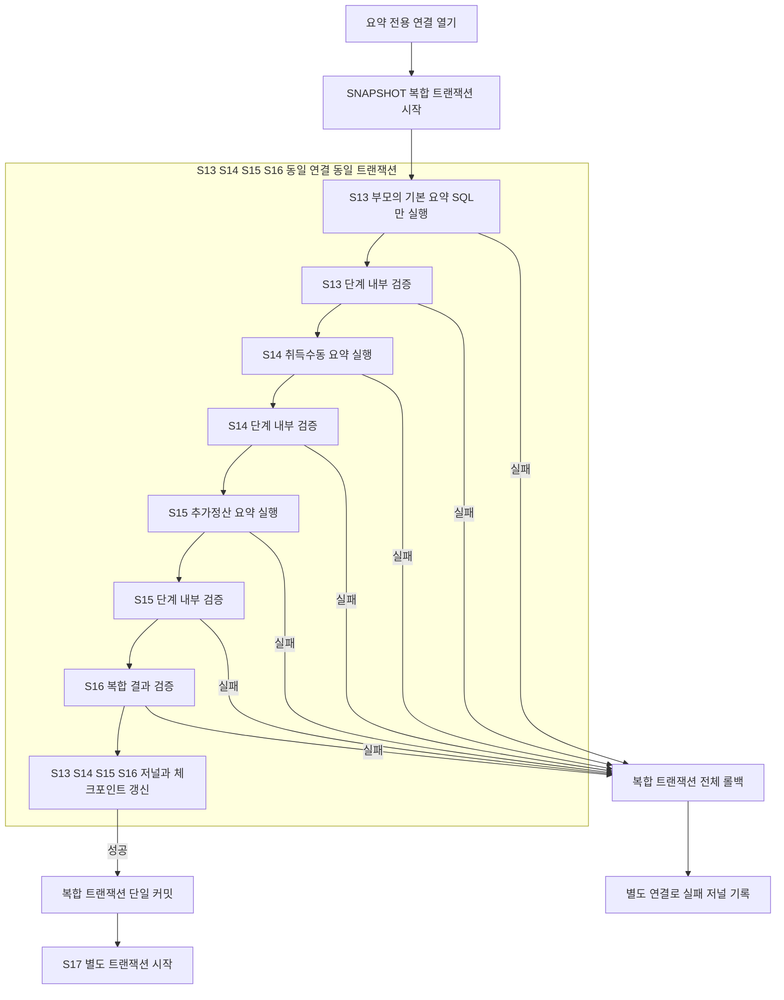

### S13～S16 요약 복합 트랜잭션

```mermaid
flowchart TD
Open["요약 전용 연결 열기"]
Begin["SNAPSHOT 복합 트랜잭션 시작"]

subgraph SummaryComposite["S13 S14 S15 S16 동일 연결 동일 트랜잭션"]
C13["S13 부모의 기본 요약 SQL만 실행"]
V13["S13 단계 내부 검증"]
C14["S14 취득수동 요약 실행"]
V14["S14 단계 내부 검증"]
C15["S15 추가정산 요약 실행"]
V15["S15 단계 내부 검증"]
C16["S16 복합 결과 검증"]
Mark["S13 S14 S15 S16 저널과 체크포인트 갱신"]
        C13 --> V13 --> C14 --> V14 --> C15 --> V15 --> C16 --> Mark
    end

Commit["복합 트랜잭션 단일 커밋"]
Rollback["복합 트랜잭션 전체 롤백"]
Journal["별도 연결로 실패 저널 기록"]
Next["S17 별도 트랜잭션 시작"]

    Open --> Begin --> C13
    Mark -->|성공| Commit
    C13 -->|실패| Rollback
    V13 -->|실패| Rollback
    C14 -->|실패| Rollback
    V14 -->|실패| Rollback
    C15 -->|실패| Rollback
    V15 -->|실패| Rollback
    C16 -->|실패| Rollback
    Rollback --> Journal
    Commit --> Next
```
